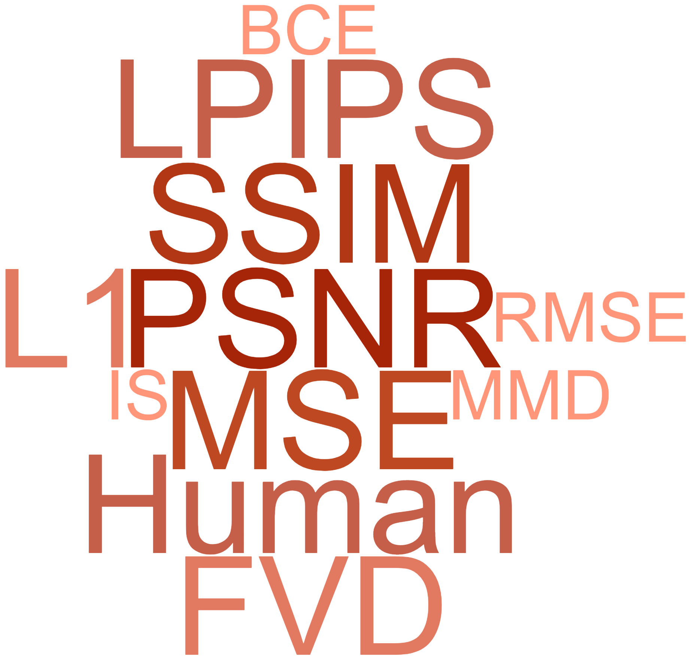
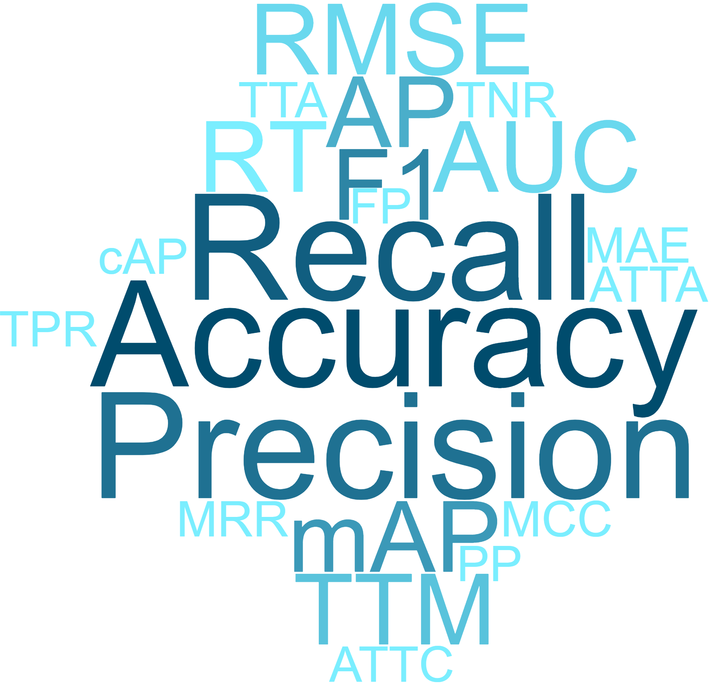
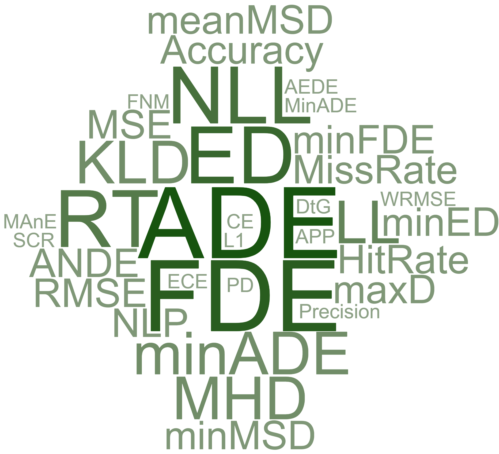
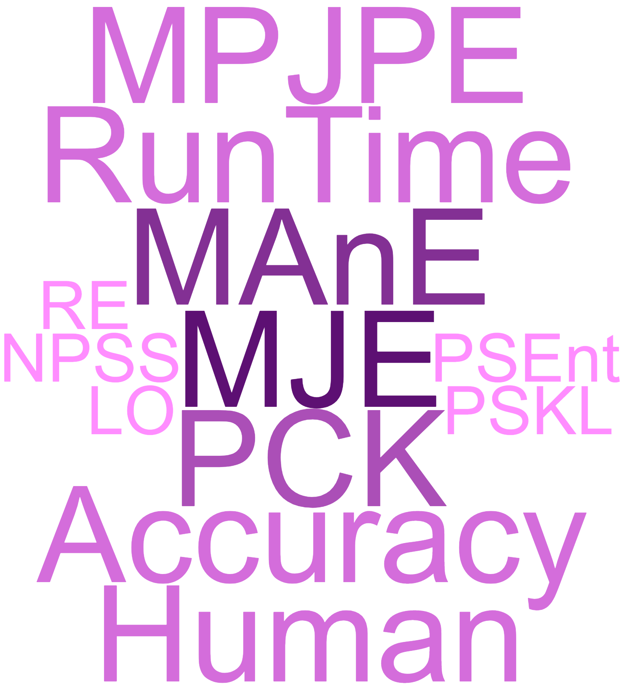

---
<a href=README.md#top><l style="font-size:30px">Home</l></a>&nbsp; &nbsp; &nbsp; &nbsp; &nbsp; &nbsp;<a href=papers/papers.md#top><l style="font-size:30px">Papers</l></a>&nbsp; &nbsp; &nbsp; &nbsp; &nbsp; &nbsp;<a href=datasets/datasets.md#top><l style="font-size:30px">Datasets</l></a>&nbsp; &nbsp; &nbsp; &nbsp; &nbsp; &nbsp;<l style="font-size:35px">Metrics</l>&nbsp; &nbsp; &nbsp; &nbsp; &nbsp; &nbsp;
---

# Metrics for vision-based prediction
  
In this page you can find the *metrics* used in vision-based prediction applications.The metrics are **sorted** based on **popularity**, (i.e how often used in prediction papers) and categorized into 5 groups:
* [Video](#metrics_video)
* [Action](#metrics_action)
* [Trajectory](#metrics_trajectory)
* [Motion](#metrics_motion)
* [Other](#metrics_other) 

By clicking on each metric you can see the list of papers that used that metric. Each paper also can be expanded to display its information.

<h2 style="color:#d52b0f">  Video Prediction </h2><a href=#top>&uarr; top</a>
<ul>

<em><l style="font-size:20px"><strong>Peak Signal-to-Noise Ratio (PSNR)</strong></l>
</em>

<ul>

<strong><em>Jin et al., "Exploring Spatial-Temporal Multi-Frequency Analysis for High-Fidelity and Temporal-Consistency Video Prediction", CVPR, 2020.</em></strong> <a href=https://openaccess.thecvf.com/content_CVPR_2020/papers/Jin_Exploring_Spatial-Temporal_Multi-Frequency_Analysis_for_High-Fidelity_and_Temporal-Consistency_Video_Prediction_CVPR_2020_paper.pdf>paper</a> <a href=https://arxiv.org/pdf/2002.09905.pdf>arxiv</a> <a href=https://github.com/Bei-Jin/STMFANet>code</a>

<ul>
<em>Datasets</em>
<ul>
<li><a href="datasets/year_datasets.md#kitti">KITTI</a></li>
<li><a href="datasets/year_datasets.md#caltech_pedestrian">Caltech Pedestrian</a></li>
<li><a href="datasets/year_datasets.md#kth">KTH</a></li>
<li><a href="datasets/year_datasets.md#bair">BAIR</a></li>
</ul>
<em>Metrics</em>
<ul>
<li><a href="metrics.md#psnr">PSNR</a></li>
<li><a href="metrics.md#ssim">SSIM</a></li>
<li><a href="metrics.md#lpips">LPIPS</a></li>
<li><a href="metrics.md#fvd">FVD</a></li>
</ul>

<em>Bibtex</em>

<pre>
@InProceedings{Jin_2020_CVPR,
    author = "Jin, Beibei and Hu, Yu and Tang, Qiankun and Niu, Jingyu and Shi, Zhiping and Han, Yinhe and Li, Xiaowei",
    title = "Exploring Spatial-Temporal Multi-Frequency Analysis for High-Fidelity and Temporal-Consistency Video Prediction",
    booktitle = "CVPR",
    year = "2020"
}
</pre>

</ul>

<strong><em>Schmeckpeper et al., "Learning Predictive Models From Observation and Interaction", ECCV, 2020.</em></strong> <a href=https://www.ecva.net/papers/eccv_2020/papers_ECCV/papers/123650698.pdf>paper</a> <a href=https://arxiv.org/pdf/1912.12773.pdf>arxiv</a>

<ul>
<em>Datasets</em>
<ul>
<li><a href="datasets/year_datasets.md#nuscenes">nuScenes</a></li>
<li><a href="datasets/year_datasets.md#htud">HTUD</a></li>
<li><a href="datasets/year_datasets.md#bdd100k">BDD100K</a></li>
</ul>
<em>Metrics</em>
<ul>
<li><a href="metrics.md#ssim">SSIM</a></li>
<li><a href="metrics.md#psnr">PSNR</a></li>
<li><a href="metrics.md#lpips">LPIPS</a></li>
</ul>

<em>Bibtex</em>

<pre>
@InProceedings{Schmeckpeper_2020_ECCV,
    author = "Schmeckpeper, Karl and Xie, Annie and Rybkin, Oleh and Tian, Stephen and Daniilidis, Kostas and Levine, Sergey and Finn, Chelsea",
    title = "Learning Predictive Models From Observation and Interaction",
    booktitle = "ECCV",
    year = "2020"
}
</pre>

</ul>

<strong><em>Kwon et al., "Predicting Future Frames Using Retrospective Cycle Gan", CVPR, 2019.</em></strong> <a href=https://openaccess.thecvf.com/content_CVPR_2019/papers/Kwon_Predicting_Future_Frames_Using_Retrospective_Cycle_GAN_CVPR_2019_paper.pdf>paper</a>

<ul>
<em>Datasets</em>
<ul>
<li><a href="datasets/year_datasets.md#ucf-101">UCF-101</a></li>
<li><a href="datasets/year_datasets.md#kitti">KITTI</a></li>
<li><a href="datasets/year_datasets.md#caltech_pedestrian">Caltech Pedestrian</a></li>
<li><a href="datasets/year_datasets.md#chuk_avenue">CHUK Avenue</a></li>
<li><a href="datasets/year_datasets.md#shanghaitech_campus">ShanghaiTech Campus</a></li>
</ul>
<em>Metrics</em>
<ul>
<li><a href="metrics.md#ssim">SSIM</a></li>
<li><a href="metrics.md#psnr">PSNR</a></li>
<li><a href="metrics.md#mse">MSE</a></li>
</ul>

<em>Bibtex</em>

<pre>
@InProceedings{Kwon_2019_CVPR,
    author = "Kwon, Yong-Hoon and Park, Min-Gyu",
    title = "Predicting Future Frames Using Retrospective Cycle Gan",
    booktitle = "CVPR",
    year = "2019"
}
</pre>

</ul>

<strong><em>Gao et al., "Disentangling Propagation And Generation For Video Prediction", ICCV, 2019.</em></strong> <a href=https://openaccess.thecvf.com/content_ICCV_2019/papers/Gao_Disentangling_Propagation_and_Generation_for_Video_Prediction_ICCV_2019_paper.pdf>paper</a>

<ul>
<em>Datasets</em>
<ul>
<li><a href="datasets/year_datasets.md#kitti">KITTI</a></li>
<li><a href="datasets/year_datasets.md#caltech_pedestrian">Caltech Pedestrian</a></li>
</ul>
<em>Metrics</em>
<ul>
<li><a href="metrics.md#psnr">PSNR</a></li>
<li><a href="metrics.md#ssim">SSIM</a></li>
</ul>

<em>Bibtex</em>

<pre>
@InProceedings{Gao_2019_ICCV,
    author = "Gao, Hang and Xu, Huazhe and Cai, Qi-Zhi and Wang, Ruth and Yu, Fisher and Darrell, Trevor",
    title = "Disentangling Propagation And Generation For Video Prediction",
    booktitle = "ICCV",
    year = "2019"
}
</pre>

</ul>

<strong><em>Ho et al., "Sme-Net: Sparse Motion Estimation For Parametric Video Prediction Through Reinforcement Learning", ICCV, 2019.</em></strong> <a href=https://openaccess.thecvf.com/content_ICCV_2019/papers/Ho_SME-Net_Sparse_Motion_Estimation_for_Parametric_Video_Prediction_Through_Reinforcement_ICCV_2019_paper.pdf>paper</a>

<ul>
<em>Datasets</em>
<ul>
<li><a href="datasets/year_datasets.md#ucf-101">UCF-101</a></li>
<li><a href="datasets/year_datasets.md#caltech_pedestrian">Caltech Pedestrian</a></li>
<li><a href="datasets/year_datasets.md#yuv">YUV</a></li>
</ul>
<em>Metrics</em>
<ul>
<li><a href="metrics.md#ssim">SSIM</a></li>
<li><a href="metrics.md#psnr">PSNR</a></li>
<li><a href="metrics.md#mse">MSE</a></li>
</ul>

<em>Bibtex</em>

<pre>
@InProceedings{Ho_2019_ICCV,
    author = "Ho, Yung-Han and Cho, Chuan-Yuan and Peng, Wen-Hsiao and Jin, Guo-Lun",
    title = "Sme-Net: Sparse Motion Estimation For Parametric Video Prediction Through Reinforcement Learning",
    booktitle = "ICCV",
    year = "2019"
}
</pre>

</ul>

<strong><em>Lee et al., "Mutual Suppression Network For Video Prediction Using Disentangled Features", BMVC, 2019.</em></strong> <a href=https://bmvc2019.org/wp-content/uploads/papers/0336-paper.pdf>paper</a> <a href=https://arxiv.org/pdf/1804.04810.pdf>arxiv</a>

<ul>
<em>Datasets</em>
<ul>
<li><a href="datasets/year_datasets.md#mmnist">MMNIST</a></li>
<li><a href="datasets/year_datasets.md#kth">KTH</a></li>
</ul>
<em>Metrics</em>
<ul>
<li><a href="metrics.md#psnr">PSNR</a></li>
<li><a href="metrics.md#ssim">SSIM</a></li>
</ul>

<em>Bibtex</em>

<pre>
@InProceedings{Lee_2019_BMVC,
    author = "Lee, Jungbeom and Lee, Jangho and Lee, Sungmin and Yoon, Sungroh",
    title = "Mutual Suppression Network For Video Prediction Using Disentangled Features",
    year = "2019",
    booktitle = "BMVC"
}
</pre>

</ul>

<strong><em>Wang et al., "Order Matters: Shuffling Sequence Generation For Video Prediction", BMVC, 2019.</em></strong> <a href=https://bmvc2019.org/wp-content/uploads/papers/1023-paper.pdf>paper</a> <a href=https://arxiv.org/pdf/1907.08845.pdf>arxiv</a> <a href=https://github.com/andrewjywang/SEENet>code</a>

<ul>
<em>Datasets</em>
<ul>
<li><a href="datasets/year_datasets.md#mmnist">MMNIST</a></li>
<li><a href="datasets/year_datasets.md#kth">KTH</a></li>
<li><a href="datasets/year_datasets.md#msr">MSR</a></li>
</ul>
<em>Metrics</em>
<ul>
<li><a href="metrics.md#psnr">PSNR</a></li>
<li><a href="metrics.md#ssim">SSIM</a></li>
</ul>

<em>Bibtex</em>

<pre>
@InProceedings{Wang_2019_BMVC,
    author = "Wang, Junyan and Hu, Bingzhang and Long, Yang and Guan, Yu",
    title = "Order Matters: Shuffling Sequence Generation For Video Prediction",
    year = "2019",
    booktitle = "BMVC"
}
</pre>

</ul>

<strong><em>Ho et al., "Deep Reinforcement Learning For Video Prediction", ICIP, 2019.</em></strong> <a href=https://ieeexplore.ieee.org/document/8803825>paper</a>

<ul>
<em>Datasets</em>
<ul>
<li><a href="datasets/year_datasets.md#kitti">KITTI</a></li>
<li><a href="datasets/year_datasets.md#caltech_pedestrian">Caltech Pedestrian</a></li>
<li><a href="datasets/year_datasets.md#yuv">YUV</a></li>
</ul>
<em>Metrics</em>
<ul>
<li><a href="metrics.md#psnr">PSNR</a></li>
<li><a href="metrics.md#ssim">SSIM</a></li>
<li><a href="metrics.md#mse">MSE</a></li>
</ul>

<em>Bibtex</em>

<pre>
@InProceedings{Ho_2019_ICIP,
    author = "Ho, Y. and Cho, C. and Peng, W.",
    booktitle = "ICIP",
    title = "Deep Reinforcement Learning For Video Prediction",
    year = "2019"
}
</pre>

</ul>

<strong><em>Tang et al., "Pose Guided Global And Local Gan For Appearance Preserving Human Video Prediction", ICIP, 2019.</em></strong> <a href=https://ieeexplore.ieee.org/document/8803792>paper</a>

<ul>
<em>Datasets</em>
<ul>
<li><a href="datasets/year_datasets.md#penn_action">Penn Action</a></li>
<li><a href="datasets/year_datasets.md#jhmdb">JHMDB</a></li>
</ul>
<em>Metrics</em>
<ul>
<li><a href="metrics.md#psnr">PSNR</a></li>
<li><a href="metrics.md#ssim">SSIM</a></li>
</ul>

<em>Bibtex</em>

<pre>
@InProceedings{Tang_2019_ICIP,
    author = "Tang, J. and Hu, H. and Zhou, Q. and Shan, H. and Tian, C. and Quek, T. Q. S.",
    booktitle = "ICIP",
    title = "Pose Guided Global And Local Gan For Appearance Preserving Human Video Prediction",
    year = "2019"
}
</pre>

</ul>

<strong><em>Zhang et al., "Looking-Ahead: Neural Future Video Frame Prediction", ICIP, 2019.</em></strong> <a href=https://ieeexplore.ieee.org/document/8803151>paper</a>

<ul>
<em>Datasets</em>
<ul>
<li><a href="datasets/year_datasets.md#ucf-101">UCF-101</a></li>
</ul>
<em>Metrics</em>
<ul>
<li><a href="metrics.md#psnr">PSNR</a></li>
<li><a href="metrics.md#ssim">SSIM</a></li>
</ul>

<em>Bibtex</em>

<pre>
@InProceedings{Zhang_2019_ICIP,
    author = "Zhang, C. and Chen, T. and Liu, H. and Shen, Q. and Ma, Z.",
    booktitle = "ICIP",
    title = "Looking-Ahead: Neural Future Video Frame Prediction",
    year = "2019"
}
</pre>

</ul>

<strong><em>Xu et al., "Structure Preserving Video Prediction", CVPR, 2018.</em></strong> <a href=https://openaccess.thecvf.com/content_cvpr_2018/papers_backup/Xu_Structure_Preserving_Video_CVPR_2018_paper.pdf>paper</a>

<ul>
<em>Datasets</em>
<ul>
<li><a href="datasets/year_datasets.md#human3.6m">Human3.6M</a></li>
<li><a href="datasets/year_datasets.md#ucf-101">UCF-101</a></li>
<li><a href="datasets/year_datasets.md#cityscapes">Cityscapes</a></li>
</ul>
<em>Metrics</em>
<ul>
<li><a href="metrics.md#psnr">PSNR</a></li>
<li><a href="metrics.md#ssim">SSIM</a></li>
</ul>

<em>Bibtex</em>

<pre>
@InProceedings{Xu_2018_CVPR,
    author = "Xu, Jingwei and Ni, Bingbing and Li, Zefan and Cheng, Shuo and Yang, Xiaokang",
    title = "Structure Preserving Video Prediction",
    booktitle = "CVPR",
    year = "2018"
}
</pre>

</ul>

<strong><em>Byeon et al., "Contextvp: Fully Context-Aware Video Prediction", ECCV, 2018.</em></strong> <a href=https://openaccess.thecvf.com/content_ECCV_2018/papers/Wonmin_Byeon_ContextVP_Fully_Context-Aware_ECCV_2018_paper.pdf>paper</a>

<ul>
<em>Datasets</em>
<ul>
<li><a href="datasets/year_datasets.md#human3.6m">Human3.6M</a></li>
<li><a href="datasets/year_datasets.md#ucf-101">UCF-101</a></li>
<li><a href="datasets/year_datasets.md#kitti">KITTI</a></li>
<li><a href="datasets/year_datasets.md#caltech_pedestrian">Caltech Pedestrian</a></li>
</ul>
<em>Metrics</em>
<ul>
<li><a href="metrics.md#psnr">PSNR</a></li>
<li><a href="metrics.md#ssim">SSIM</a></li>
</ul>

<em>Bibtex</em>

<pre>
@InProceedings{Byeon_2018_ECCV,
    author = "Byeon, Wonmin and Wang, Qin and Kumar Srivastava, Rupesh and Koumoutsakos, Petros",
    title = "Contextvp: Fully Context-Aware Video Prediction",
    booktitle = "ECCV",
    year = "2018"
}
</pre>

</ul>

<strong><em>Cai et al., "Deep Video Generation, Prediction And Completion Of Human Action Sequences", ECCV, 2018.</em></strong> <a href=https://openaccess.thecvf.com/content_ECCV_2018/papers/Chunyan_Bai_Deep_Video_Generation_ECCV_2018_paper.pdf>paper</a> <a href=https://arxiv.org/pdf/1711.08682.pdf>arxiv</a>

<ul>
<em>Datasets</em>
<ul>
<li><a href="datasets/year_datasets.md#human3.6m">Human3.6M</a></li>
<li><a href="datasets/year_datasets.md#ucf-101">UCF-101</a></li>
</ul>
<em>Metrics</em>
<ul>
<li><a href="metrics.md#psnr">PSNR</a></li>
<li><a href="metrics.md#ssim">SSIM</a></li>
</ul>

<em>Bibtex</em>

<pre>
@InProceedings{Cai_2018_ECCV,
    author = "Cai, Haoye and Bai, Chunyan and Tai, Yu-Wing and Tang, Chi-Keung",
    title = "Deep Video Generation, Prediction And Completion Of Human Action Sequences",
    booktitle = "ECCV",
    year = "2018"
}
</pre>

</ul>

<strong><em>Liu et al., "Dyan: A Dynamical Atoms-Based Network For Video Prediction", ECCV, 2018.</em></strong> <a href=https://openaccess.thecvf.com/content_ECCV_2018/papers/Wenqian_Liu_DYAN_A_Dynamical_ECCV_2018_paper.pdf>paper</a> <a href=https://github.com/liuem607/DYAN>code</a>

<ul>
<em>Datasets</em>
<ul>
<li><a href="datasets/year_datasets.md#ucf-101">UCF-101</a></li>
<li><a href="datasets/year_datasets.md#kitti">KITTI</a></li>
<li><a href="datasets/year_datasets.md#caltech_pedestrian">Caltech Pedestrian</a></li>
</ul>
<em>Metrics</em>
<ul>
<li><a href="metrics.md#ssim">SSIM</a></li>
<li><a href="metrics.md#psnr">PSNR</a></li>
<li><a href="metrics.md#mse">MSE</a></li>
</ul>

<em>Bibtex</em>

<pre>
@InProceedings{Liu_2018_ECCV,
    author = "Liu, Wenqian and Sharma, Abhishek and Camps, Octavia and Sznaier, Mario",
    title = "Dyan: A Dynamical Atoms-Based Network For Video Prediction",
    booktitle = "ECCV",
    year = "2018"
}
</pre>

</ul>

<strong><em>Oliu et al., "Folded Recurrent Neural Networks For Future Video Prediction", ECCV, 2018.</em></strong> <a href=https://openaccess.thecvf.com/content_ECCV_2018/papers/Marc_Oliu_Folded_Recurrent_Neural_ECCV_2018_paper.pdf>paper</a> <a href=https://arxiv.org/pdf/1712.00311.pdf>arxiv</a>

<ul>
<em>Datasets</em>
<ul>
<li><a href="datasets/year_datasets.md#ucf-101">UCF-101</a></li>
<li><a href="datasets/year_datasets.md#mmnist">MMNIST</a></li>
<li><a href="datasets/year_datasets.md#kth">KTH</a></li>
</ul>
<em>Metrics</em>
<ul>
<li><a href="metrics.md#ssim">SSIM</a></li>
<li><a href="metrics.md#psnr">PSNR</a></li>
<li><a href="metrics.md#mse">MSE</a></li>
</ul>

<em>Bibtex</em>

<pre>
@InProceedings{Oliu_2018_ECCV,
    author = "Oliu, Marc and Selva, Javier and Escalera, Sergio",
    title = "Folded Recurrent Neural Networks For Future Video Prediction",
    booktitle = "ECCV",
    year = "2018"
}
</pre>

</ul>

<strong><em>Reda et al., "Sdc-Net: Video Prediction Using Spatially-Displaced Convolution", ECCV, 2018.</em></strong> <a href=https://openaccess.thecvf.com/content_ECCV_2018/papers/Fitsum_Reda_SDC-Net_Video_prediction_ECCV_2018_paper.pdf>paper</a> <a href=https://arxiv.org/pdf/1811.00684.pdf>arxiv</a>

<ul>
<em>Datasets</em>
<ul>
<li><a href="datasets/year_datasets.md#caltech_pedestrian">Caltech Pedestrian</a></li>
<li><a href="datasets/year_datasets.md#youtube-8m">Youtube-8M</a></li>
</ul>
<em>Metrics</em>
<ul>
<li><a href="metrics.md#ssim">SSIM</a></li>
<li><a href="metrics.md#psnr">PSNR</a></li>
<li><a href="metrics.md#mse">MSE</a></li>
<li><a href="metrics.md#l1">L1</a></li>
</ul>

<em>Bibtex</em>

<pre>
@InProceedings{Reda_2018_ECCV,
    author = "Reda, Fitsum A. and Liu, Guilin and Shih, Kevin J. and Kirby, Robert and Barker, Jon and Tarjan, David and Tao, Andrew and Catanzaro, Bryan",
    title = "Sdc-Net: Video Prediction Using Spatially-Displaced Convolution",
    booktitle = "ECCV",
    year = "2018"
}
</pre>

</ul>

<strong><em>Zhao et al., "Learning To Forecast And Refine Residual Motion For Image-To-Video Generation", ECCV, 2018.</em></strong> <a href=https://openaccess.thecvf.com/content_ECCV_2018/papers/Long_Zhao_Learning_to_Forecast_ECCV_2018_paper.pdf>paper</a> <a href=https://arxiv.org/pdf/1807.09951.pdf>arxiv</a> <a href=https://github.com/garyzhao/FRGAN>code</a>

<ul>
<em>Datasets</em>
<ul>
<li><a href="datasets/year_datasets.md#penn_action">Penn Action</a></li>
<li><a href="datasets/year_datasets.md#mug">MUG</a></li>
</ul>
<em>Metrics</em>
<ul>
<li><a href="metrics.md#psnr">PSNR</a></li>
<li><a href="metrics.md#mse">MSE</a></li>
</ul>

<em>Bibtex</em>

<pre>
@InProceedings{Zhao_2018_ECCV,
    author = "Zhao, Long and Peng, Xi and Tian, Yu and Kapadia, Mubbasir and Metaxas, Dimitris",
    title = "Learning To Forecast And Refine Residual Motion For Image-To-Video Generation",
    booktitle = "ECCV",
    year = "2018"
}
</pre>

</ul>

<strong><em>Xu et al., "Video Prediction Via Selective Sampling", NeurIPS, 2018.</em></strong> <a href=https://papers.nips.cc/paper/7442-video-prediction-via-selective-sampling.pdf>paper</a> <a href=https://github.com/xjwxjw/VPSS>code</a>

<ul>
<em>Datasets</em>
<ul>
<li><a href="datasets/year_datasets.md#human3.6m">Human3.6M</a></li>
<li><a href="datasets/year_datasets.md#mmnist">MMNIST</a></li>
<li><a href="datasets/year_datasets.md#bair_push">BAIR Push</a></li>
</ul>
<em>Metrics</em>
<ul>
<li><a href="metrics.md#ssim">SSIM</a></li>
<li><a href="metrics.md#psnr">PSNR</a></li>
</ul>

<em>Bibtex</em>

<pre>
@InProceedings{Xu_2018_NeurIPS,
    author = "Xu, Jingwei and Ni, Bingbing and Yang, Xiaokang",
    title = "Video Prediction Via Selective Sampling",
    booktitle = "NeurIPS",
    year = "2018"
}
</pre>

</ul>

<strong><em>Bhattacharjee et al., "Predicting Video Frames Using Feature Based Locally Guided Objectives", ACCV, 2019.</em></strong> <a href=https://link.springer.com/chapter/10.1007/978-3-030-20870-7_42>paper</a>

<ul>
<em>Datasets</em>
<ul>
<li><a href="datasets/year_datasets.md#ucf-101">UCF-101</a></li>
<li><a href="datasets/year_datasets.md#kitti">KITTI</a></li>
<li><a href="datasets/year_datasets.md#kth">KTH</a></li>
</ul>
<em>Metrics</em>
<ul>
<li><a href="metrics.md#ssim">SSIM</a></li>
<li><a href="metrics.md#psnr">PSNR</a></li>
</ul>

<em>Bibtex</em>

<pre>
@InProceedings{Bhattacharjee_2018_ACCV,
    author = "Bhattacharjee, Prateep and Das, Sukhendu",
    editor = "Jawahar, C.V. and Li, Hongdong and Mori, Greg and Schindler, Konrad",
    title = "Predicting Video Frames Using Feature Based Locally Guided Objectives",
    booktitle = "ACCV",
    year = "2019"
}
</pre>

</ul>

<strong><em>Ying et al., "Better Guider Predicts Future Better: Difference Guided Generative Adversarial Networks", ACCV, 2018.</em></strong> <a href=https://link.springer.com/chapter/10.1007/978-3-030-20876-9_18>paper</a> <a href=https://arxiv.org/pdf/1901.01649.pdf>arxiv</a>

<ul>
<em>Datasets</em>
<ul>
<li><a href="datasets/year_datasets.md#human3.6m">Human3.6M</a></li>
<li><a href="datasets/year_datasets.md#ucf-101">UCF-101</a></li>
<li><a href="datasets/year_datasets.md#kitti">KITTI</a></li>
</ul>
<em>Metrics</em>
<ul>
<li><a href="metrics.md#ssim">SSIM</a></li>
<li><a href="metrics.md#psnr">PSNR</a></li>
<li><a href="metrics.md#mse">MSE</a></li>
</ul>

<em>Bibtex</em>

<pre>
@InProceedings{Ying_2018_ACCV,
    author = "Ying, Guohao and Zou, Yingtian and Wan, Lin and Hu, Yiming and Feng, Jiashi",
    editor = "Jawahar, C.V. and Li, Hongdong and Mori, Greg and Schindler, Konrad",
    title = "Better Guider Predicts Future Better: Difference Guided Generative Adversarial Networks",
    booktitle = "ACCV",
    year = "2018"
}
</pre>

</ul>

<strong><em>Jin et al., "Varnet: Exploring Variations For Unsupervised Video Prediction", IROS, 2018.</em></strong> <a href=https://ieeexplore.ieee.org/document/8594264>paper</a> <a href=https://github.com/jinbeibei/VarNet>code</a>

<ul>
<em>Datasets</em>
<ul>
<li><a href="datasets/year_datasets.md#kitti">KITTI</a></li>
<li><a href="datasets/year_datasets.md#kth">KTH</a></li>
</ul>
<em>Metrics</em>
<ul>
<li><a href="metrics.md#ssim">SSIM</a></li>
<li><a href="metrics.md#psnr">PSNR</a></li>
</ul>

<em>Bibtex</em>

<pre>
@InProceedings{Jin_2018_IROS,
    author = "Jin, B. and Hu, Y. and Zeng, Y. and Tang, Q. and Liu, S. and Ye, J.",
    booktitle = "IROS",
    title = "Varnet: Exploring Variations For Unsupervised Video Prediction",
    year = "2018"
}
</pre>

</ul>

<strong><em>Rothfuss et al., "Deep Episodic Memory: Encoding, Recalling, and Predicting Episodic Experiences for Robot Action Execution", RAL, 2018.</em></strong> <a href=https://ieeexplore.ieee.org/document/8421022>paper</a> <a href=https://arxiv.org/pdf/1801.04134.pdf>arxiv</a>

<ul>
<em>Datasets</em>
<ul>
<li><a href="datasets/year_datasets.md#activitynet">ActivityNet</a></li>
<li><a href="datasets/year_datasets.md#20bn">20BN</a></li>
</ul>
<em>Metrics</em>
<ul>
<li><a href="metrics.md#psnr">PSNR</a></li>
</ul>

<em>Bibtex</em>

<pre>
@Article{Rothfuss_2018_RAL,
    author = "Rothfuss, J. and Ferreira, F. and Aksoy, E. E. and Zhou, Y. and Asfour, T.",
    journal = "RAL",
    title = "Deep Episodic Memory: Encoding, Recalling, and Predicting Episodic Experiences for Robot Action Execution",
    year = "2018",
    volume = "3",
    number = "4",
    pages = "4007-4014"
}
</pre>

</ul>

<strong><em>Lu et al., "Flexible Spatio-Temporal Networks For Video Prediction", CVPR, 2017.</em></strong> <a href=https://openaccess.thecvf.com/content_cvpr_2017/papers/Lu_Flexible_Spatio-Temporal_Networks_CVPR_2017_paper.pdf>paper</a>

<ul>
<em>Datasets</em>
<ul>
<li><a href="datasets/year_datasets.md#ucf-101">UCF-101</a></li>
<li><a href="datasets/year_datasets.md#mmnist">MMNIST</a></li>
<li><a href="datasets/year_datasets.md#sports-1m">Sports-1M</a></li>
<li><a href="datasets/year_datasets.md#visor">ViSOR</a></li>
<li><a href="datasets/year_datasets.md#prost">PROST</a></li>
</ul>
<em>Metrics</em>
<ul>
<li><a href="metrics.md#psnr">PSNR</a></li>
</ul>

<em>Bibtex</em>

<pre>
@InProceedings{Lu_2017_CVPR,
    author = "Lu, Chaochao and Hirsch, Michael and Scholkopf, Bernhard",
    title = "Flexible Spatio-Temporal Networks For Video Prediction",
    booktitle = "CVPR",
    year = "2017"
}
</pre>

</ul>

<strong><em>Liang et al., "Dual Motion Gan For Future-Flow Embedded Video Prediction", ICCV, 2017.</em></strong> <a href=https://openaccess.thecvf.com/content_ICCV_2017/papers/Liang_Dual_Motion_GAN_ICCV_2017_paper.pdf>paper</a> <a href=https://arxiv.org/pdf/1708.00284.pdf>arxiv</a>

<ul>
<em>Datasets</em>
<ul>
<li><a href="datasets/year_datasets.md#ucf-101">UCF-101</a></li>
<li><a href="datasets/year_datasets.md#kitti">KITTI</a></li>
<li><a href="datasets/year_datasets.md#caltech_pedestrian">Caltech Pedestrian</a></li>
<li><a href="datasets/year_datasets.md#thumos">THUMOS</a></li>
</ul>
<em>Metrics</em>
<ul>
<li><a href="metrics.md#ssim">SSIM</a></li>
<li><a href="metrics.md#psnr">PSNR</a></li>
<li><a href="metrics.md#mse">MSE</a></li>
</ul>

<em>Bibtex</em>

<pre>
@InProceedings{Liang_2017_ICCV,
    author = "Liang, Xiaodan and Lee, Lisa and Dai, Wei and Xing, Eric P.",
    title = "Dual Motion Gan For Future-Flow Embedded Video Prediction",
    booktitle = "ICCV",
    year = "2017"
}
</pre>

</ul>

<strong><em>Bhattacharjee et al., "Temporal Coherency Based Criteria For Predicting Video Frames Using Deep Multi-Stage Generative Adversarial Networks", NeurIPS, 2017.</em></strong> <a href=https://papers.nips.cc/paper/7014-temporal-coherency-based-criteria-for-predicting-video-frames-using-deep-multi-stage-generative-adversarial-networks.pdf>paper</a>

<ul>
<em>Datasets</em>
<ul>
<li><a href="datasets/year_datasets.md#ucf-101">UCF-101</a></li>
<li><a href="datasets/year_datasets.md#kitti">KITTI</a></li>
<li><a href="datasets/year_datasets.md#sports-1m">Sports-1M</a></li>
</ul>
<em>Metrics</em>
<ul>
<li><a href="metrics.md#ssim">SSIM</a></li>
<li><a href="metrics.md#psnr">PSNR</a></li>
</ul>

<em>Bibtex</em>

<pre>
@InProceedings{Bhattacharjee_2017_NeurIPS,
    author = "Bhattacharjee, Prateep and Das, Sukhendu",
    title = "Temporal Coherency Based Criteria For Predicting Video Frames Using Deep Multi-Stage Generative Adversarial Networks",
    booktitle = "NeurIPS",
    year = "2017"
}
</pre>

</ul>

<strong><em>Wang et al., "Predrnn: Recurrent Neural Networks For Predictive Learning Using Spatiotemporal Lstms", NeurIPS, 2017.</em></strong> <a href=https://papers.nips.cc/paper/6689-predrnn-recurrent-neural-networks-for-predictive-learning-using-spatiotemporal-lstms.pdf>paper</a> <a href=https://github.com/ujjax/pred-rnn>code</a>

<ul>
<em>Datasets</em>
<ul>
<li><a href="datasets/year_datasets.md#mmnist">MMNIST</a></li>
<li><a href="datasets/year_datasets.md#kth">KTH</a></li>
</ul>
<em>Metrics</em>
<ul>
<li><a href="metrics.md#ssim">SSIM</a></li>
<li><a href="metrics.md#psnr">PSNR</a></li>
<li><a href="metrics.md#mse">MSE</a></li>
</ul>

<em>Bibtex</em>

<pre>
@InProceedings{Wang_2017_NeurIPS,
    author = "Wang, Yunbo and Long, Mingsheng and Wang, Jianmin and Gao, Zhifeng and Yu, Philip S",
    title = "Predrnn: Recurrent Neural Networks For Predictive Learning Using Spatiotemporal Lstms",
    booktitle = "NeurIPS",
    year = "2017"
}
</pre>

</ul>

<strong><em>Villegas et al., "Learning To Generate Long-Term Future Via Hierarchical Prediction", ICML, 2017.</em></strong> <a href=http://proceedings.mlr.press/v70/villegas17a.html>paper</a> <a href=https://arxiv.org/pdf/1704.05831.pdf>arxiv</a> <a href=https://github.com/rubenvillegas/icml2017hierchvid>code</a>

<ul>
<em>Datasets</em>
<ul>
<li><a href="datasets/year_datasets.md#human3.6m">Human3.6M</a></li>
<li><a href="datasets/year_datasets.md#penn_action">Penn Action</a></li>
</ul>
<em>Metrics</em>
<ul>
<li><a href="metrics.md#psnr">PSNR</a></li>
<li><a href="metrics.md#human">Human</a></li>
</ul>

<em>Bibtex</em>

<pre>
@InProceedings{Villegas_2017_ICML,
    author = "Villegas, Ruben and Yang, Jimei and Zou, Yuliang and Sohn, Sungryull and Lin, Xunyu and Lee, Honglak",
    title = "Learning To Generate Long-Term Future Via Hierarchical Prediction",
    booktitle = "ICML",
    year = "2017"
}
</pre>

</ul>

<strong><em>Finn et al., "Unsupervised Learning For Physical Interaction Through Video Prediction", NeurIPS, 2016.</em></strong> <a href=https://papers.nips.cc/paper/6161-unsupervised-learning-for-physical-interaction-through-video-prediction.pdf>paper</a> <a href=https://arxiv.org/pdf/1605.07157.pdf>arxiv</a> <a href=https://github.com/tensorflow/models/tree/master/research/video_prediction>code</a>

<ul>
<em>Datasets</em>
<ul>
<li><a href="datasets/year_datasets.md#human3.6m">Human3.6M</a></li>
<li><a href="datasets/year_datasets.md#bair_push">BAIR Push</a></li>
</ul>
<em>Metrics</em>
<ul>
<li><a href="metrics.md#ssim">SSIM</a></li>
<li><a href="metrics.md#psnr">PSNR</a></li>
</ul>

<em>Bibtex</em>

<pre>
@InProceedings{Finn_2016_NeurIPS,
    author = "Finn, Chelsea and Goodfellow, Ian and Levine, Sergey",
    title = "Unsupervised Learning For Physical Interaction Through Video Prediction",
    booktitle = "NeurIPS",
    year = "2016"
}
</pre>

</ul>

</ul>

<em><l style="font-size:20px"><strong>Structural SIMilarity (SSIM)</strong></l>
</em>

<ul>

<strong><em>Le et al., "Disentangling Physical Dynamics From Unknown Factors for Unsupervised Video Prediction", CVPR, 2020.</em></strong> <a href=https://openaccess.thecvf.com/content_CVPR_2020/papers/Le_Guen_Disentangling_Physical_Dynamics_From_Unknown_Factors_for_Unsupervised_Video_Prediction_CVPR_2020_paper.pdf>paper</a> <a href=https://arxiv.org/pdf/2003.01460.pdf>arxiv</a> <a href=https://github.com/vincent-leguen/PhyDNet>code</a>

<ul>
<em>Datasets</em>
<ul>
<li><a href="datasets/year_datasets.md#human3.6m">Human3.6M</a></li>
<li><a href="datasets/year_datasets.md#mmnist">MMNIST</a></li>
<li><a href="datasets/year_datasets.md#sst">SST</a></li>
<li><a href="datasets/year_datasets.md#taxi_bj">Taxi BJ</a></li>
</ul>
<em>Metrics</em>
<ul>
<li><a href="metrics.md#ssim">SSIM</a></li>
<li><a href="metrics.md#mse">MSE</a></li>
<li><a href="metrics.md#mae">MAE</a></li>
</ul>

<em>Bibtex</em>

<pre>
@InProceedings{Guen_2020_CVPR,
    author = "Le Guen, Vincent and Thome, Nicolas",
    title = "Disentangling Physical Dynamics From Unknown Factors for Unsupervised Video Prediction",
    booktitle = "CVPR",
    year = "2020"
}
</pre>

</ul>

<strong><em>Jin et al., "Exploring Spatial-Temporal Multi-Frequency Analysis for High-Fidelity and Temporal-Consistency Video Prediction", CVPR, 2020.</em></strong> <a href=https://openaccess.thecvf.com/content_CVPR_2020/papers/Jin_Exploring_Spatial-Temporal_Multi-Frequency_Analysis_for_High-Fidelity_and_Temporal-Consistency_Video_Prediction_CVPR_2020_paper.pdf>paper</a> <a href=https://arxiv.org/pdf/2002.09905.pdf>arxiv</a> <a href=https://github.com/Bei-Jin/STMFANet>code</a>

<ul>
<em>Datasets</em>
<ul>
<li><a href="datasets/year_datasets.md#kitti">KITTI</a></li>
<li><a href="datasets/year_datasets.md#caltech_pedestrian">Caltech Pedestrian</a></li>
<li><a href="datasets/year_datasets.md#kth">KTH</a></li>
<li><a href="datasets/year_datasets.md#bair">BAIR</a></li>
</ul>
<em>Metrics</em>
<ul>
<li><a href="metrics.md#psnr">PSNR</a></li>
<li><a href="metrics.md#ssim">SSIM</a></li>
<li><a href="metrics.md#lpips">LPIPS</a></li>
<li><a href="metrics.md#fvd">FVD</a></li>
</ul>

<em>Bibtex</em>

<pre>
@InProceedings{Jin_2020_CVPR,
    author = "Jin, Beibei and Hu, Yu and Tang, Qiankun and Niu, Jingyu and Shi, Zhiping and Han, Yinhe and Li, Xiaowei",
    title = "Exploring Spatial-Temporal Multi-Frequency Analysis for High-Fidelity and Temporal-Consistency Video Prediction",
    booktitle = "CVPR",
    year = "2020"
}
</pre>

</ul>

<strong><em>Wang et al., "Probabilistic Video Prediction From Noisy Data With a Posterior Confidence", CVPR, 2020.</em></strong> <a href=https://openaccess.thecvf.com/content_CVPR_2020/papers/Wang_Probabilistic_Video_Prediction_From_Noisy_Data_With_a_Posterior_Confidence_CVPR_2020_paper.pdf>paper</a>

<ul>
<em>Datasets</em>
<ul>
<li><a href="datasets/year_datasets.md#mmnist">MMNIST</a></li>
<li><a href="datasets/year_datasets.md#kth">KTH</a></li>
</ul>
<em>Metrics</em>
<ul>
<li><a href="metrics.md#ssim">SSIM</a></li>
<li><a href="metrics.md#mse">MSE</a></li>
</ul>

<em>Bibtex</em>

<pre>
@InProceedings{Wang_2020_CVPR,
    author = "Wang, Yunbo and Wu, Jiajun and Long, Mingsheng and Tenenbaum, Joshua B.",
    title = "Probabilistic Video Prediction From Noisy Data With a Posterior Confidence",
    booktitle = "CVPR",
    year = "2020"
}
</pre>

</ul>

<strong><em>Schmeckpeper et al., "Learning Predictive Models From Observation and Interaction", ECCV, 2020.</em></strong> <a href=https://www.ecva.net/papers/eccv_2020/papers_ECCV/papers/123650698.pdf>paper</a> <a href=https://arxiv.org/pdf/1912.12773.pdf>arxiv</a>

<ul>
<em>Datasets</em>
<ul>
<li><a href="datasets/year_datasets.md#nuscenes">nuScenes</a></li>
<li><a href="datasets/year_datasets.md#htud">HTUD</a></li>
<li><a href="datasets/year_datasets.md#bdd100k">BDD100K</a></li>
</ul>
<em>Metrics</em>
<ul>
<li><a href="metrics.md#ssim">SSIM</a></li>
<li><a href="metrics.md#psnr">PSNR</a></li>
<li><a href="metrics.md#lpips">LPIPS</a></li>
</ul>

<em>Bibtex</em>

<pre>
@InProceedings{Schmeckpeper_2020_ECCV,
    author = "Schmeckpeper, Karl and Xie, Annie and Rybkin, Oleh and Tian, Stephen and Daniilidis, Kostas and Levine, Sergey and Finn, Chelsea",
    title = "Learning Predictive Models From Observation and Interaction",
    booktitle = "ECCV",
    year = "2020"
}
</pre>

</ul>

<strong><em>Chaabane et al., "Looking Ahead: Anticipating Pedestrians Crossing with Future Frames Prediction", WACV, 2020.</em></strong> <a href=https://openaccess.thecvf.com/content_WACV_2020/papers/Chaabane_Looking_Ahead_Anticipating_Pedestrians_Crossing_with_Future_Frames_Prediction_WACV_2020_paper.pdf>paper</a> <a href=https://arxiv.org/pdf/1910.09077.pdf>arxiv</a>

<ul>
<em>Datasets</em>
<ul>
<li><a href="datasets/year_datasets.md#jaad">JAAD</a></li>
</ul>
<em>Metrics</em>
<ul>
<li><a href="metrics.md#ssim">SSIM</a></li>
<li><a href="metrics.md#l1">L1</a></li>
</ul>

<em>Bibtex</em>

<pre>
@InProceedings{Chaabane_2020_WACV,
    author = "Chaabane, Mohamed and Trabelsi, Ameni and Blanchard, Nathaniel and Beveridge, Ross",
    title = "Looking Ahead: Anticipating Pedestrians Crossing with Future Frames Prediction",
    booktitle = "WACV",
    year = "2020"
}
</pre>

</ul>

<strong><em>Kwon et al., "Predicting Future Frames Using Retrospective Cycle Gan", CVPR, 2019.</em></strong> <a href=https://openaccess.thecvf.com/content_CVPR_2019/papers/Kwon_Predicting_Future_Frames_Using_Retrospective_Cycle_GAN_CVPR_2019_paper.pdf>paper</a>

<ul>
<em>Datasets</em>
<ul>
<li><a href="datasets/year_datasets.md#ucf-101">UCF-101</a></li>
<li><a href="datasets/year_datasets.md#kitti">KITTI</a></li>
<li><a href="datasets/year_datasets.md#caltech_pedestrian">Caltech Pedestrian</a></li>
<li><a href="datasets/year_datasets.md#chuk_avenue">CHUK Avenue</a></li>
<li><a href="datasets/year_datasets.md#shanghaitech_campus">ShanghaiTech Campus</a></li>
</ul>
<em>Metrics</em>
<ul>
<li><a href="metrics.md#ssim">SSIM</a></li>
<li><a href="metrics.md#psnr">PSNR</a></li>
<li><a href="metrics.md#mse">MSE</a></li>
</ul>

<em>Bibtex</em>

<pre>
@InProceedings{Kwon_2019_CVPR,
    author = "Kwon, Yong-Hoon and Park, Min-Gyu",
    title = "Predicting Future Frames Using Retrospective Cycle Gan",
    booktitle = "CVPR",
    year = "2019"
}
</pre>

</ul>

<strong><em>Castrejon et al., "Improved Conditional Vrnns For Video Prediction", ICCV, 2019.</em></strong> <a href=https://openaccess.thecvf.com/content_ICCV_2019/papers/Castrejon_Improved_Conditional_VRNNs_for_Video_Prediction_ICCV_2019_paper.pdf>paper</a> <a href=https://arxiv.org/pdf/1904.12165.pdf>arxiv</a>

<ul>
<em>Datasets</em>
<ul>
<li><a href="datasets/year_datasets.md#mmnist">MMNIST</a></li>
<li><a href="datasets/year_datasets.md#cityscapes">Cityscapes</a></li>
<li><a href="datasets/year_datasets.md#bair_push">BAIR Push</a></li>
</ul>
<em>Metrics</em>
<ul>
<li><a href="metrics.md#ssim">SSIM</a></li>
<li><a href="metrics.md#lpips">LPIPS</a></li>
<li><a href="metrics.md#fvd">FVD</a></li>
</ul>

<em>Bibtex</em>

<pre>
@InProceedings{Castrejon_2019_ICCV,
    author = "Castrejon, Lluis and Ballas, Nicolas and Courville, Aaron",
    title = "Improved Conditional Vrnns For Video Prediction",
    booktitle = "ICCV",
    year = "2019"
}
</pre>

</ul>

<strong><em>Gao et al., "Disentangling Propagation And Generation For Video Prediction", ICCV, 2019.</em></strong> <a href=https://openaccess.thecvf.com/content_ICCV_2019/papers/Gao_Disentangling_Propagation_and_Generation_for_Video_Prediction_ICCV_2019_paper.pdf>paper</a>

<ul>
<em>Datasets</em>
<ul>
<li><a href="datasets/year_datasets.md#kitti">KITTI</a></li>
<li><a href="datasets/year_datasets.md#caltech_pedestrian">Caltech Pedestrian</a></li>
</ul>
<em>Metrics</em>
<ul>
<li><a href="metrics.md#psnr">PSNR</a></li>
<li><a href="metrics.md#ssim">SSIM</a></li>
</ul>

<em>Bibtex</em>

<pre>
@InProceedings{Gao_2019_ICCV,
    author = "Gao, Hang and Xu, Huazhe and Cai, Qi-Zhi and Wang, Ruth and Yu, Fisher and Darrell, Trevor",
    title = "Disentangling Propagation And Generation For Video Prediction",
    booktitle = "ICCV",
    year = "2019"
}
</pre>

</ul>

<strong><em>Ho et al., "Sme-Net: Sparse Motion Estimation For Parametric Video Prediction Through Reinforcement Learning", ICCV, 2019.</em></strong> <a href=https://openaccess.thecvf.com/content_ICCV_2019/papers/Ho_SME-Net_Sparse_Motion_Estimation_for_Parametric_Video_Prediction_Through_Reinforcement_ICCV_2019_paper.pdf>paper</a>

<ul>
<em>Datasets</em>
<ul>
<li><a href="datasets/year_datasets.md#ucf-101">UCF-101</a></li>
<li><a href="datasets/year_datasets.md#caltech_pedestrian">Caltech Pedestrian</a></li>
<li><a href="datasets/year_datasets.md#yuv">YUV</a></li>
</ul>
<em>Metrics</em>
<ul>
<li><a href="metrics.md#ssim">SSIM</a></li>
<li><a href="metrics.md#psnr">PSNR</a></li>
<li><a href="metrics.md#mse">MSE</a></li>
</ul>

<em>Bibtex</em>

<pre>
@InProceedings{Ho_2019_ICCV,
    author = "Ho, Yung-Han and Cho, Chuan-Yuan and Peng, Wen-Hsiao and Jin, Guo-Lun",
    title = "Sme-Net: Sparse Motion Estimation For Parametric Video Prediction Through Reinforcement Learning",
    booktitle = "ICCV",
    year = "2019"
}
</pre>

</ul>

<strong><em>Lee et al., "Mutual Suppression Network For Video Prediction Using Disentangled Features", BMVC, 2019.</em></strong> <a href=https://bmvc2019.org/wp-content/uploads/papers/0336-paper.pdf>paper</a> <a href=https://arxiv.org/pdf/1804.04810.pdf>arxiv</a>

<ul>
<em>Datasets</em>
<ul>
<li><a href="datasets/year_datasets.md#mmnist">MMNIST</a></li>
<li><a href="datasets/year_datasets.md#kth">KTH</a></li>
</ul>
<em>Metrics</em>
<ul>
<li><a href="metrics.md#psnr">PSNR</a></li>
<li><a href="metrics.md#ssim">SSIM</a></li>
</ul>

<em>Bibtex</em>

<pre>
@InProceedings{Lee_2019_BMVC,
    author = "Lee, Jungbeom and Lee, Jangho and Lee, Sungmin and Yoon, Sungroh",
    title = "Mutual Suppression Network For Video Prediction Using Disentangled Features",
    year = "2019",
    booktitle = "BMVC"
}
</pre>

</ul>

<strong><em>Wang et al., "Order Matters: Shuffling Sequence Generation For Video Prediction", BMVC, 2019.</em></strong> <a href=https://bmvc2019.org/wp-content/uploads/papers/1023-paper.pdf>paper</a> <a href=https://arxiv.org/pdf/1907.08845.pdf>arxiv</a> <a href=https://github.com/andrewjywang/SEENet>code</a>

<ul>
<em>Datasets</em>
<ul>
<li><a href="datasets/year_datasets.md#mmnist">MMNIST</a></li>
<li><a href="datasets/year_datasets.md#kth">KTH</a></li>
<li><a href="datasets/year_datasets.md#msr">MSR</a></li>
</ul>
<em>Metrics</em>
<ul>
<li><a href="metrics.md#psnr">PSNR</a></li>
<li><a href="metrics.md#ssim">SSIM</a></li>
</ul>

<em>Bibtex</em>

<pre>
@InProceedings{Wang_2019_BMVC,
    author = "Wang, Junyan and Hu, Bingzhang and Long, Yang and Guan, Yu",
    title = "Order Matters: Shuffling Sequence Generation For Video Prediction",
    year = "2019",
    booktitle = "BMVC"
}
</pre>

</ul>

<strong><em>Ho et al., "Deep Reinforcement Learning For Video Prediction", ICIP, 2019.</em></strong> <a href=https://ieeexplore.ieee.org/document/8803825>paper</a>

<ul>
<em>Datasets</em>
<ul>
<li><a href="datasets/year_datasets.md#kitti">KITTI</a></li>
<li><a href="datasets/year_datasets.md#caltech_pedestrian">Caltech Pedestrian</a></li>
<li><a href="datasets/year_datasets.md#yuv">YUV</a></li>
</ul>
<em>Metrics</em>
<ul>
<li><a href="metrics.md#psnr">PSNR</a></li>
<li><a href="metrics.md#ssim">SSIM</a></li>
<li><a href="metrics.md#mse">MSE</a></li>
</ul>

<em>Bibtex</em>

<pre>
@InProceedings{Ho_2019_ICIP,
    author = "Ho, Y. and Cho, C. and Peng, W.",
    booktitle = "ICIP",
    title = "Deep Reinforcement Learning For Video Prediction",
    year = "2019"
}
</pre>

</ul>

<strong><em>Tang et al., "Pose Guided Global And Local Gan For Appearance Preserving Human Video Prediction", ICIP, 2019.</em></strong> <a href=https://ieeexplore.ieee.org/document/8803792>paper</a>

<ul>
<em>Datasets</em>
<ul>
<li><a href="datasets/year_datasets.md#penn_action">Penn Action</a></li>
<li><a href="datasets/year_datasets.md#jhmdb">JHMDB</a></li>
</ul>
<em>Metrics</em>
<ul>
<li><a href="metrics.md#psnr">PSNR</a></li>
<li><a href="metrics.md#ssim">SSIM</a></li>
</ul>

<em>Bibtex</em>

<pre>
@InProceedings{Tang_2019_ICIP,
    author = "Tang, J. and Hu, H. and Zhou, Q. and Shan, H. and Tian, C. and Quek, T. Q. S.",
    booktitle = "ICIP",
    title = "Pose Guided Global And Local Gan For Appearance Preserving Human Video Prediction",
    year = "2019"
}
</pre>

</ul>

<strong><em>Zhang et al., "Looking-Ahead: Neural Future Video Frame Prediction", ICIP, 2019.</em></strong> <a href=https://ieeexplore.ieee.org/document/8803151>paper</a>

<ul>
<em>Datasets</em>
<ul>
<li><a href="datasets/year_datasets.md#ucf-101">UCF-101</a></li>
</ul>
<em>Metrics</em>
<ul>
<li><a href="metrics.md#psnr">PSNR</a></li>
<li><a href="metrics.md#ssim">SSIM</a></li>
</ul>

<em>Bibtex</em>

<pre>
@InProceedings{Zhang_2019_ICIP,
    author = "Zhang, C. and Chen, T. and Liu, H. and Shen, Q. and Ma, Z.",
    booktitle = "ICIP",
    title = "Looking-Ahead: Neural Future Video Frame Prediction",
    year = "2019"
}
</pre>

</ul>

<strong><em>Xu et al., "Structure Preserving Video Prediction", CVPR, 2018.</em></strong> <a href=https://openaccess.thecvf.com/content_cvpr_2018/papers_backup/Xu_Structure_Preserving_Video_CVPR_2018_paper.pdf>paper</a>

<ul>
<em>Datasets</em>
<ul>
<li><a href="datasets/year_datasets.md#human3.6m">Human3.6M</a></li>
<li><a href="datasets/year_datasets.md#ucf-101">UCF-101</a></li>
<li><a href="datasets/year_datasets.md#cityscapes">Cityscapes</a></li>
</ul>
<em>Metrics</em>
<ul>
<li><a href="metrics.md#psnr">PSNR</a></li>
<li><a href="metrics.md#ssim">SSIM</a></li>
</ul>

<em>Bibtex</em>

<pre>
@InProceedings{Xu_2018_CVPR,
    author = "Xu, Jingwei and Ni, Bingbing and Li, Zefan and Cheng, Shuo and Yang, Xiaokang",
    title = "Structure Preserving Video Prediction",
    booktitle = "CVPR",
    year = "2018"
}
</pre>

</ul>

<strong><em>Byeon et al., "Contextvp: Fully Context-Aware Video Prediction", ECCV, 2018.</em></strong> <a href=https://openaccess.thecvf.com/content_ECCV_2018/papers/Wonmin_Byeon_ContextVP_Fully_Context-Aware_ECCV_2018_paper.pdf>paper</a>

<ul>
<em>Datasets</em>
<ul>
<li><a href="datasets/year_datasets.md#human3.6m">Human3.6M</a></li>
<li><a href="datasets/year_datasets.md#ucf-101">UCF-101</a></li>
<li><a href="datasets/year_datasets.md#kitti">KITTI</a></li>
<li><a href="datasets/year_datasets.md#caltech_pedestrian">Caltech Pedestrian</a></li>
</ul>
<em>Metrics</em>
<ul>
<li><a href="metrics.md#psnr">PSNR</a></li>
<li><a href="metrics.md#ssim">SSIM</a></li>
</ul>

<em>Bibtex</em>

<pre>
@InProceedings{Byeon_2018_ECCV,
    author = "Byeon, Wonmin and Wang, Qin and Kumar Srivastava, Rupesh and Koumoutsakos, Petros",
    title = "Contextvp: Fully Context-Aware Video Prediction",
    booktitle = "ECCV",
    year = "2018"
}
</pre>

</ul>

<strong><em>Cai et al., "Deep Video Generation, Prediction And Completion Of Human Action Sequences", ECCV, 2018.</em></strong> <a href=https://openaccess.thecvf.com/content_ECCV_2018/papers/Chunyan_Bai_Deep_Video_Generation_ECCV_2018_paper.pdf>paper</a> <a href=https://arxiv.org/pdf/1711.08682.pdf>arxiv</a>

<ul>
<em>Datasets</em>
<ul>
<li><a href="datasets/year_datasets.md#human3.6m">Human3.6M</a></li>
<li><a href="datasets/year_datasets.md#ucf-101">UCF-101</a></li>
</ul>
<em>Metrics</em>
<ul>
<li><a href="metrics.md#psnr">PSNR</a></li>
<li><a href="metrics.md#ssim">SSIM</a></li>
</ul>

<em>Bibtex</em>

<pre>
@InProceedings{Cai_2018_ECCV,
    author = "Cai, Haoye and Bai, Chunyan and Tai, Yu-Wing and Tang, Chi-Keung",
    title = "Deep Video Generation, Prediction And Completion Of Human Action Sequences",
    booktitle = "ECCV",
    year = "2018"
}
</pre>

</ul>

<strong><em>Liu et al., "Dyan: A Dynamical Atoms-Based Network For Video Prediction", ECCV, 2018.</em></strong> <a href=https://openaccess.thecvf.com/content_ECCV_2018/papers/Wenqian_Liu_DYAN_A_Dynamical_ECCV_2018_paper.pdf>paper</a> <a href=https://github.com/liuem607/DYAN>code</a>

<ul>
<em>Datasets</em>
<ul>
<li><a href="datasets/year_datasets.md#ucf-101">UCF-101</a></li>
<li><a href="datasets/year_datasets.md#kitti">KITTI</a></li>
<li><a href="datasets/year_datasets.md#caltech_pedestrian">Caltech Pedestrian</a></li>
</ul>
<em>Metrics</em>
<ul>
<li><a href="metrics.md#ssim">SSIM</a></li>
<li><a href="metrics.md#psnr">PSNR</a></li>
<li><a href="metrics.md#mse">MSE</a></li>
</ul>

<em>Bibtex</em>

<pre>
@InProceedings{Liu_2018_ECCV,
    author = "Liu, Wenqian and Sharma, Abhishek and Camps, Octavia and Sznaier, Mario",
    title = "Dyan: A Dynamical Atoms-Based Network For Video Prediction",
    booktitle = "ECCV",
    year = "2018"
}
</pre>

</ul>

<strong><em>Oliu et al., "Folded Recurrent Neural Networks For Future Video Prediction", ECCV, 2018.</em></strong> <a href=https://openaccess.thecvf.com/content_ECCV_2018/papers/Marc_Oliu_Folded_Recurrent_Neural_ECCV_2018_paper.pdf>paper</a> <a href=https://arxiv.org/pdf/1712.00311.pdf>arxiv</a>

<ul>
<em>Datasets</em>
<ul>
<li><a href="datasets/year_datasets.md#ucf-101">UCF-101</a></li>
<li><a href="datasets/year_datasets.md#mmnist">MMNIST</a></li>
<li><a href="datasets/year_datasets.md#kth">KTH</a></li>
</ul>
<em>Metrics</em>
<ul>
<li><a href="metrics.md#ssim">SSIM</a></li>
<li><a href="metrics.md#psnr">PSNR</a></li>
<li><a href="metrics.md#mse">MSE</a></li>
</ul>

<em>Bibtex</em>

<pre>
@InProceedings{Oliu_2018_ECCV,
    author = "Oliu, Marc and Selva, Javier and Escalera, Sergio",
    title = "Folded Recurrent Neural Networks For Future Video Prediction",
    booktitle = "ECCV",
    year = "2018"
}
</pre>

</ul>

<strong><em>Reda et al., "Sdc-Net: Video Prediction Using Spatially-Displaced Convolution", ECCV, 2018.</em></strong> <a href=https://openaccess.thecvf.com/content_ECCV_2018/papers/Fitsum_Reda_SDC-Net_Video_prediction_ECCV_2018_paper.pdf>paper</a> <a href=https://arxiv.org/pdf/1811.00684.pdf>arxiv</a>

<ul>
<em>Datasets</em>
<ul>
<li><a href="datasets/year_datasets.md#caltech_pedestrian">Caltech Pedestrian</a></li>
<li><a href="datasets/year_datasets.md#youtube-8m">Youtube-8M</a></li>
</ul>
<em>Metrics</em>
<ul>
<li><a href="metrics.md#ssim">SSIM</a></li>
<li><a href="metrics.md#psnr">PSNR</a></li>
<li><a href="metrics.md#mse">MSE</a></li>
<li><a href="metrics.md#l1">L1</a></li>
</ul>

<em>Bibtex</em>

<pre>
@InProceedings{Reda_2018_ECCV,
    author = "Reda, Fitsum A. and Liu, Guilin and Shih, Kevin J. and Kirby, Robert and Barker, Jon and Tarjan, David and Tao, Andrew and Catanzaro, Bryan",
    title = "Sdc-Net: Video Prediction Using Spatially-Displaced Convolution",
    booktitle = "ECCV",
    year = "2018"
}
</pre>

</ul>

<strong><em>Xu et al., "Video Prediction Via Selective Sampling", NeurIPS, 2018.</em></strong> <a href=https://papers.nips.cc/paper/7442-video-prediction-via-selective-sampling.pdf>paper</a> <a href=https://github.com/xjwxjw/VPSS>code</a>

<ul>
<em>Datasets</em>
<ul>
<li><a href="datasets/year_datasets.md#human3.6m">Human3.6M</a></li>
<li><a href="datasets/year_datasets.md#mmnist">MMNIST</a></li>
<li><a href="datasets/year_datasets.md#bair_push">BAIR Push</a></li>
</ul>
<em>Metrics</em>
<ul>
<li><a href="metrics.md#ssim">SSIM</a></li>
<li><a href="metrics.md#psnr">PSNR</a></li>
</ul>

<em>Bibtex</em>

<pre>
@InProceedings{Xu_2018_NeurIPS,
    author = "Xu, Jingwei and Ni, Bingbing and Yang, Xiaokang",
    title = "Video Prediction Via Selective Sampling",
    booktitle = "NeurIPS",
    year = "2018"
}
</pre>

</ul>

<strong><em>Bhattacharjee et al., "Predicting Video Frames Using Feature Based Locally Guided Objectives", ACCV, 2019.</em></strong> <a href=https://link.springer.com/chapter/10.1007/978-3-030-20870-7_42>paper</a>

<ul>
<em>Datasets</em>
<ul>
<li><a href="datasets/year_datasets.md#ucf-101">UCF-101</a></li>
<li><a href="datasets/year_datasets.md#kitti">KITTI</a></li>
<li><a href="datasets/year_datasets.md#kth">KTH</a></li>
</ul>
<em>Metrics</em>
<ul>
<li><a href="metrics.md#ssim">SSIM</a></li>
<li><a href="metrics.md#psnr">PSNR</a></li>
</ul>

<em>Bibtex</em>

<pre>
@InProceedings{Bhattacharjee_2018_ACCV,
    author = "Bhattacharjee, Prateep and Das, Sukhendu",
    editor = "Jawahar, C.V. and Li, Hongdong and Mori, Greg and Schindler, Konrad",
    title = "Predicting Video Frames Using Feature Based Locally Guided Objectives",
    booktitle = "ACCV",
    year = "2019"
}
</pre>

</ul>

<strong><em>Ying et al., "Better Guider Predicts Future Better: Difference Guided Generative Adversarial Networks", ACCV, 2018.</em></strong> <a href=https://link.springer.com/chapter/10.1007/978-3-030-20876-9_18>paper</a> <a href=https://arxiv.org/pdf/1901.01649.pdf>arxiv</a>

<ul>
<em>Datasets</em>
<ul>
<li><a href="datasets/year_datasets.md#human3.6m">Human3.6M</a></li>
<li><a href="datasets/year_datasets.md#ucf-101">UCF-101</a></li>
<li><a href="datasets/year_datasets.md#kitti">KITTI</a></li>
</ul>
<em>Metrics</em>
<ul>
<li><a href="metrics.md#ssim">SSIM</a></li>
<li><a href="metrics.md#psnr">PSNR</a></li>
<li><a href="metrics.md#mse">MSE</a></li>
</ul>

<em>Bibtex</em>

<pre>
@InProceedings{Ying_2018_ACCV,
    author = "Ying, Guohao and Zou, Yingtian and Wan, Lin and Hu, Yiming and Feng, Jiashi",
    editor = "Jawahar, C.V. and Li, Hongdong and Mori, Greg and Schindler, Konrad",
    title = "Better Guider Predicts Future Better: Difference Guided Generative Adversarial Networks",
    booktitle = "ACCV",
    year = "2018"
}
</pre>

</ul>

<strong><em>Jin et al., "Varnet: Exploring Variations For Unsupervised Video Prediction", IROS, 2018.</em></strong> <a href=https://ieeexplore.ieee.org/document/8594264>paper</a> <a href=https://github.com/jinbeibei/VarNet>code</a>

<ul>
<em>Datasets</em>
<ul>
<li><a href="datasets/year_datasets.md#kitti">KITTI</a></li>
<li><a href="datasets/year_datasets.md#kth">KTH</a></li>
</ul>
<em>Metrics</em>
<ul>
<li><a href="metrics.md#ssim">SSIM</a></li>
<li><a href="metrics.md#psnr">PSNR</a></li>
</ul>

<em>Bibtex</em>

<pre>
@InProceedings{Jin_2018_IROS,
    author = "Jin, B. and Hu, Y. and Zeng, Y. and Tang, Q. and Liu, S. and Ye, J.",
    booktitle = "IROS",
    title = "Varnet: Exploring Variations For Unsupervised Video Prediction",
    year = "2018"
}
</pre>

</ul>

<strong><em>Liang et al., "Dual Motion Gan For Future-Flow Embedded Video Prediction", ICCV, 2017.</em></strong> <a href=https://openaccess.thecvf.com/content_ICCV_2017/papers/Liang_Dual_Motion_GAN_ICCV_2017_paper.pdf>paper</a> <a href=https://arxiv.org/pdf/1708.00284.pdf>arxiv</a>

<ul>
<em>Datasets</em>
<ul>
<li><a href="datasets/year_datasets.md#ucf-101">UCF-101</a></li>
<li><a href="datasets/year_datasets.md#kitti">KITTI</a></li>
<li><a href="datasets/year_datasets.md#caltech_pedestrian">Caltech Pedestrian</a></li>
<li><a href="datasets/year_datasets.md#thumos">THUMOS</a></li>
</ul>
<em>Metrics</em>
<ul>
<li><a href="metrics.md#ssim">SSIM</a></li>
<li><a href="metrics.md#psnr">PSNR</a></li>
<li><a href="metrics.md#mse">MSE</a></li>
</ul>

<em>Bibtex</em>

<pre>
@InProceedings{Liang_2017_ICCV,
    author = "Liang, Xiaodan and Lee, Lisa and Dai, Wei and Xing, Eric P.",
    title = "Dual Motion Gan For Future-Flow Embedded Video Prediction",
    booktitle = "ICCV",
    year = "2017"
}
</pre>

</ul>

<strong><em>Bhattacharjee et al., "Temporal Coherency Based Criteria For Predicting Video Frames Using Deep Multi-Stage Generative Adversarial Networks", NeurIPS, 2017.</em></strong> <a href=https://papers.nips.cc/paper/7014-temporal-coherency-based-criteria-for-predicting-video-frames-using-deep-multi-stage-generative-adversarial-networks.pdf>paper</a>

<ul>
<em>Datasets</em>
<ul>
<li><a href="datasets/year_datasets.md#ucf-101">UCF-101</a></li>
<li><a href="datasets/year_datasets.md#kitti">KITTI</a></li>
<li><a href="datasets/year_datasets.md#sports-1m">Sports-1M</a></li>
</ul>
<em>Metrics</em>
<ul>
<li><a href="metrics.md#ssim">SSIM</a></li>
<li><a href="metrics.md#psnr">PSNR</a></li>
</ul>

<em>Bibtex</em>

<pre>
@InProceedings{Bhattacharjee_2017_NeurIPS,
    author = "Bhattacharjee, Prateep and Das, Sukhendu",
    title = "Temporal Coherency Based Criteria For Predicting Video Frames Using Deep Multi-Stage Generative Adversarial Networks",
    booktitle = "NeurIPS",
    year = "2017"
}
</pre>

</ul>

<strong><em>Wang et al., "Predrnn: Recurrent Neural Networks For Predictive Learning Using Spatiotemporal Lstms", NeurIPS, 2017.</em></strong> <a href=https://papers.nips.cc/paper/6689-predrnn-recurrent-neural-networks-for-predictive-learning-using-spatiotemporal-lstms.pdf>paper</a> <a href=https://github.com/ujjax/pred-rnn>code</a>

<ul>
<em>Datasets</em>
<ul>
<li><a href="datasets/year_datasets.md#mmnist">MMNIST</a></li>
<li><a href="datasets/year_datasets.md#kth">KTH</a></li>
</ul>
<em>Metrics</em>
<ul>
<li><a href="metrics.md#ssim">SSIM</a></li>
<li><a href="metrics.md#psnr">PSNR</a></li>
<li><a href="metrics.md#mse">MSE</a></li>
</ul>

<em>Bibtex</em>

<pre>
@InProceedings{Wang_2017_NeurIPS,
    author = "Wang, Yunbo and Long, Mingsheng and Wang, Jianmin and Gao, Zhifeng and Yu, Philip S",
    title = "Predrnn: Recurrent Neural Networks For Predictive Learning Using Spatiotemporal Lstms",
    booktitle = "NeurIPS",
    year = "2017"
}
</pre>

</ul>

<strong><em>Finn et al., "Unsupervised Learning For Physical Interaction Through Video Prediction", NeurIPS, 2016.</em></strong> <a href=https://papers.nips.cc/paper/6161-unsupervised-learning-for-physical-interaction-through-video-prediction.pdf>paper</a> <a href=https://arxiv.org/pdf/1605.07157.pdf>arxiv</a> <a href=https://github.com/tensorflow/models/tree/master/research/video_prediction>code</a>

<ul>
<em>Datasets</em>
<ul>
<li><a href="datasets/year_datasets.md#human3.6m">Human3.6M</a></li>
<li><a href="datasets/year_datasets.md#bair_push">BAIR Push</a></li>
</ul>
<em>Metrics</em>
<ul>
<li><a href="metrics.md#ssim">SSIM</a></li>
<li><a href="metrics.md#psnr">PSNR</a></li>
</ul>

<em>Bibtex</em>

<pre>
@InProceedings{Finn_2016_NeurIPS,
    author = "Finn, Chelsea and Goodfellow, Ian and Levine, Sergey",
    title = "Unsupervised Learning For Physical Interaction Through Video Prediction",
    booktitle = "NeurIPS",
    year = "2016"
}
</pre>

</ul>

</ul>

<em><l style="font-size:20px"><strong>Mean Square Error (MSE)</strong></l>
</em>

<ul>

<strong><em>Le et al., "Disentangling Physical Dynamics From Unknown Factors for Unsupervised Video Prediction", CVPR, 2020.</em></strong> <a href=https://openaccess.thecvf.com/content_CVPR_2020/papers/Le_Guen_Disentangling_Physical_Dynamics_From_Unknown_Factors_for_Unsupervised_Video_Prediction_CVPR_2020_paper.pdf>paper</a> <a href=https://arxiv.org/pdf/2003.01460.pdf>arxiv</a> <a href=https://github.com/vincent-leguen/PhyDNet>code</a>

<ul>
<em>Datasets</em>
<ul>
<li><a href="datasets/year_datasets.md#human3.6m">Human3.6M</a></li>
<li><a href="datasets/year_datasets.md#mmnist">MMNIST</a></li>
<li><a href="datasets/year_datasets.md#sst">SST</a></li>
<li><a href="datasets/year_datasets.md#taxi_bj">Taxi BJ</a></li>
</ul>
<em>Metrics</em>
<ul>
<li><a href="metrics.md#ssim">SSIM</a></li>
<li><a href="metrics.md#mse">MSE</a></li>
<li><a href="metrics.md#mae">MAE</a></li>
</ul>

<em>Bibtex</em>

<pre>
@InProceedings{Guen_2020_CVPR,
    author = "Le Guen, Vincent and Thome, Nicolas",
    title = "Disentangling Physical Dynamics From Unknown Factors for Unsupervised Video Prediction",
    booktitle = "CVPR",
    year = "2020"
}
</pre>

</ul>

<strong><em>Wang et al., "Probabilistic Video Prediction From Noisy Data With a Posterior Confidence", CVPR, 2020.</em></strong> <a href=https://openaccess.thecvf.com/content_CVPR_2020/papers/Wang_Probabilistic_Video_Prediction_From_Noisy_Data_With_a_Posterior_Confidence_CVPR_2020_paper.pdf>paper</a>

<ul>
<em>Datasets</em>
<ul>
<li><a href="datasets/year_datasets.md#mmnist">MMNIST</a></li>
<li><a href="datasets/year_datasets.md#kth">KTH</a></li>
</ul>
<em>Metrics</em>
<ul>
<li><a href="metrics.md#ssim">SSIM</a></li>
<li><a href="metrics.md#mse">MSE</a></li>
</ul>

<em>Bibtex</em>

<pre>
@InProceedings{Wang_2020_CVPR,
    author = "Wang, Yunbo and Wu, Jiajun and Long, Mingsheng and Tenenbaum, Joshua B.",
    title = "Probabilistic Video Prediction From Noisy Data With a Posterior Confidence",
    booktitle = "CVPR",
    year = "2020"
}
</pre>

</ul>

<strong><em>Kwon et al., "Predicting Future Frames Using Retrospective Cycle Gan", CVPR, 2019.</em></strong> <a href=https://openaccess.thecvf.com/content_CVPR_2019/papers/Kwon_Predicting_Future_Frames_Using_Retrospective_Cycle_GAN_CVPR_2019_paper.pdf>paper</a>

<ul>
<em>Datasets</em>
<ul>
<li><a href="datasets/year_datasets.md#ucf-101">UCF-101</a></li>
<li><a href="datasets/year_datasets.md#kitti">KITTI</a></li>
<li><a href="datasets/year_datasets.md#caltech_pedestrian">Caltech Pedestrian</a></li>
<li><a href="datasets/year_datasets.md#chuk_avenue">CHUK Avenue</a></li>
<li><a href="datasets/year_datasets.md#shanghaitech_campus">ShanghaiTech Campus</a></li>
</ul>
<em>Metrics</em>
<ul>
<li><a href="metrics.md#ssim">SSIM</a></li>
<li><a href="metrics.md#psnr">PSNR</a></li>
<li><a href="metrics.md#mse">MSE</a></li>
</ul>

<em>Bibtex</em>

<pre>
@InProceedings{Kwon_2019_CVPR,
    author = "Kwon, Yong-Hoon and Park, Min-Gyu",
    title = "Predicting Future Frames Using Retrospective Cycle Gan",
    booktitle = "CVPR",
    year = "2019"
}
</pre>

</ul>

<strong><em>Ho et al., "Sme-Net: Sparse Motion Estimation For Parametric Video Prediction Through Reinforcement Learning", ICCV, 2019.</em></strong> <a href=https://openaccess.thecvf.com/content_ICCV_2019/papers/Ho_SME-Net_Sparse_Motion_Estimation_for_Parametric_Video_Prediction_Through_Reinforcement_ICCV_2019_paper.pdf>paper</a>

<ul>
<em>Datasets</em>
<ul>
<li><a href="datasets/year_datasets.md#ucf-101">UCF-101</a></li>
<li><a href="datasets/year_datasets.md#caltech_pedestrian">Caltech Pedestrian</a></li>
<li><a href="datasets/year_datasets.md#yuv">YUV</a></li>
</ul>
<em>Metrics</em>
<ul>
<li><a href="metrics.md#ssim">SSIM</a></li>
<li><a href="metrics.md#psnr">PSNR</a></li>
<li><a href="metrics.md#mse">MSE</a></li>
</ul>

<em>Bibtex</em>

<pre>
@InProceedings{Ho_2019_ICCV,
    author = "Ho, Yung-Han and Cho, Chuan-Yuan and Peng, Wen-Hsiao and Jin, Guo-Lun",
    title = "Sme-Net: Sparse Motion Estimation For Parametric Video Prediction Through Reinforcement Learning",
    booktitle = "ICCV",
    year = "2019"
}
</pre>

</ul>

<strong><em>Ho et al., "Deep Reinforcement Learning For Video Prediction", ICIP, 2019.</em></strong> <a href=https://ieeexplore.ieee.org/document/8803825>paper</a>

<ul>
<em>Datasets</em>
<ul>
<li><a href="datasets/year_datasets.md#kitti">KITTI</a></li>
<li><a href="datasets/year_datasets.md#caltech_pedestrian">Caltech Pedestrian</a></li>
<li><a href="datasets/year_datasets.md#yuv">YUV</a></li>
</ul>
<em>Metrics</em>
<ul>
<li><a href="metrics.md#psnr">PSNR</a></li>
<li><a href="metrics.md#ssim">SSIM</a></li>
<li><a href="metrics.md#mse">MSE</a></li>
</ul>

<em>Bibtex</em>

<pre>
@InProceedings{Ho_2019_ICIP,
    author = "Ho, Y. and Cho, C. and Peng, W.",
    booktitle = "ICIP",
    title = "Deep Reinforcement Learning For Video Prediction",
    year = "2019"
}
</pre>

</ul>

<strong><em>Liu et al., "Dyan: A Dynamical Atoms-Based Network For Video Prediction", ECCV, 2018.</em></strong> <a href=https://openaccess.thecvf.com/content_ECCV_2018/papers/Wenqian_Liu_DYAN_A_Dynamical_ECCV_2018_paper.pdf>paper</a> <a href=https://github.com/liuem607/DYAN>code</a>

<ul>
<em>Datasets</em>
<ul>
<li><a href="datasets/year_datasets.md#ucf-101">UCF-101</a></li>
<li><a href="datasets/year_datasets.md#kitti">KITTI</a></li>
<li><a href="datasets/year_datasets.md#caltech_pedestrian">Caltech Pedestrian</a></li>
</ul>
<em>Metrics</em>
<ul>
<li><a href="metrics.md#ssim">SSIM</a></li>
<li><a href="metrics.md#psnr">PSNR</a></li>
<li><a href="metrics.md#mse">MSE</a></li>
</ul>

<em>Bibtex</em>

<pre>
@InProceedings{Liu_2018_ECCV,
    author = "Liu, Wenqian and Sharma, Abhishek and Camps, Octavia and Sznaier, Mario",
    title = "Dyan: A Dynamical Atoms-Based Network For Video Prediction",
    booktitle = "ECCV",
    year = "2018"
}
</pre>

</ul>

<strong><em>Oliu et al., "Folded Recurrent Neural Networks For Future Video Prediction", ECCV, 2018.</em></strong> <a href=https://openaccess.thecvf.com/content_ECCV_2018/papers/Marc_Oliu_Folded_Recurrent_Neural_ECCV_2018_paper.pdf>paper</a> <a href=https://arxiv.org/pdf/1712.00311.pdf>arxiv</a>

<ul>
<em>Datasets</em>
<ul>
<li><a href="datasets/year_datasets.md#ucf-101">UCF-101</a></li>
<li><a href="datasets/year_datasets.md#mmnist">MMNIST</a></li>
<li><a href="datasets/year_datasets.md#kth">KTH</a></li>
</ul>
<em>Metrics</em>
<ul>
<li><a href="metrics.md#ssim">SSIM</a></li>
<li><a href="metrics.md#psnr">PSNR</a></li>
<li><a href="metrics.md#mse">MSE</a></li>
</ul>

<em>Bibtex</em>

<pre>
@InProceedings{Oliu_2018_ECCV,
    author = "Oliu, Marc and Selva, Javier and Escalera, Sergio",
    title = "Folded Recurrent Neural Networks For Future Video Prediction",
    booktitle = "ECCV",
    year = "2018"
}
</pre>

</ul>

<strong><em>Reda et al., "Sdc-Net: Video Prediction Using Spatially-Displaced Convolution", ECCV, 2018.</em></strong> <a href=https://openaccess.thecvf.com/content_ECCV_2018/papers/Fitsum_Reda_SDC-Net_Video_prediction_ECCV_2018_paper.pdf>paper</a> <a href=https://arxiv.org/pdf/1811.00684.pdf>arxiv</a>

<ul>
<em>Datasets</em>
<ul>
<li><a href="datasets/year_datasets.md#caltech_pedestrian">Caltech Pedestrian</a></li>
<li><a href="datasets/year_datasets.md#youtube-8m">Youtube-8M</a></li>
</ul>
<em>Metrics</em>
<ul>
<li><a href="metrics.md#ssim">SSIM</a></li>
<li><a href="metrics.md#psnr">PSNR</a></li>
<li><a href="metrics.md#mse">MSE</a></li>
<li><a href="metrics.md#l1">L1</a></li>
</ul>

<em>Bibtex</em>

<pre>
@InProceedings{Reda_2018_ECCV,
    author = "Reda, Fitsum A. and Liu, Guilin and Shih, Kevin J. and Kirby, Robert and Barker, Jon and Tarjan, David and Tao, Andrew and Catanzaro, Bryan",
    title = "Sdc-Net: Video Prediction Using Spatially-Displaced Convolution",
    booktitle = "ECCV",
    year = "2018"
}
</pre>

</ul>

<strong><em>Zhao et al., "Learning To Forecast And Refine Residual Motion For Image-To-Video Generation", ECCV, 2018.</em></strong> <a href=https://openaccess.thecvf.com/content_ECCV_2018/papers/Long_Zhao_Learning_to_Forecast_ECCV_2018_paper.pdf>paper</a> <a href=https://arxiv.org/pdf/1807.09951.pdf>arxiv</a> <a href=https://github.com/garyzhao/FRGAN>code</a>

<ul>
<em>Datasets</em>
<ul>
<li><a href="datasets/year_datasets.md#penn_action">Penn Action</a></li>
<li><a href="datasets/year_datasets.md#mug">MUG</a></li>
</ul>
<em>Metrics</em>
<ul>
<li><a href="metrics.md#psnr">PSNR</a></li>
<li><a href="metrics.md#mse">MSE</a></li>
</ul>

<em>Bibtex</em>

<pre>
@InProceedings{Zhao_2018_ECCV,
    author = "Zhao, Long and Peng, Xi and Tian, Yu and Kapadia, Mubbasir and Metaxas, Dimitris",
    title = "Learning To Forecast And Refine Residual Motion For Image-To-Video Generation",
    booktitle = "ECCV",
    year = "2018"
}
</pre>

</ul>

<strong><em>Hsieh et al., "Learning To Decompose And Disentangle Representations For Video Prediction", NeurIPS, 2018.</em></strong> <a href=https://papers.nips.cc/paper/7333-learning-to-decompose-and-disentangle-representations-for-video-prediction.pdf>paper</a> <a href=https://arxiv.org/pdf/1806.04166.pdf>arxiv</a> <a href=https://github.com/jthsieh/DDPAE-video-prediction>code</a>

<ul>
<em>Datasets</em>
<ul>
<li><a href="datasets/year_datasets.md#mmnist">MMNIST</a></li>
<li><a href="datasets/year_datasets.md#bouncing_ball">Bouncing Ball</a></li>
</ul>
<em>Metrics</em>
<ul>
<li><a href="metrics.md#mse">MSE</a></li>
<li><a href="metrics.md#bce">BCE</a></li>
</ul>

<em>Bibtex</em>

<pre>
@InProceedings{Hsieh_2018_NeurIPS,
    author = "Hsieh, Jun-Ting and Liu, Bingbin and Huang, De-An and Fei-Fei, Li F and Niebles, Juan Carlos",
    title = "Learning To Decompose And Disentangle Representations For Video Prediction",
    booktitle = "NeurIPS",
    year = "2018"
}
</pre>

</ul>

<strong><em>Ying et al., "Better Guider Predicts Future Better: Difference Guided Generative Adversarial Networks", ACCV, 2018.</em></strong> <a href=https://link.springer.com/chapter/10.1007/978-3-030-20876-9_18>paper</a> <a href=https://arxiv.org/pdf/1901.01649.pdf>arxiv</a>

<ul>
<em>Datasets</em>
<ul>
<li><a href="datasets/year_datasets.md#human3.6m">Human3.6M</a></li>
<li><a href="datasets/year_datasets.md#ucf-101">UCF-101</a></li>
<li><a href="datasets/year_datasets.md#kitti">KITTI</a></li>
</ul>
<em>Metrics</em>
<ul>
<li><a href="metrics.md#ssim">SSIM</a></li>
<li><a href="metrics.md#psnr">PSNR</a></li>
<li><a href="metrics.md#mse">MSE</a></li>
</ul>

<em>Bibtex</em>

<pre>
@InProceedings{Ying_2018_ACCV,
    author = "Ying, Guohao and Zou, Yingtian and Wan, Lin and Hu, Yiming and Feng, Jiashi",
    editor = "Jawahar, C.V. and Li, Hongdong and Mori, Greg and Schindler, Konrad",
    title = "Better Guider Predicts Future Better: Difference Guided Generative Adversarial Networks",
    booktitle = "ACCV",
    year = "2018"
}
</pre>

</ul>

<strong><em>Ji et al., "Dynamic Visual Sequence Prediction With Motion Flow Networks", WACV, 2018.</em></strong> <a href=https://ieeexplore.ieee.org/document/8354223>paper</a>

<ul>
<em>Datasets</em>
<ul>
<li><a href="datasets/year_datasets.md#human3.6m">Human3.6M</a></li>
</ul>
<em>Metrics</em>
<ul>
<li><a href="metrics.md#mse">MSE</a></li>
</ul>

<em>Bibtex</em>

<pre>
@InProceedings{Ji_2018_WACV,
    author = "Ji, D. and Wei, Z. and Dunn, E. and Frahm, J. M.",
    booktitle = "WACV",
    title = "Dynamic Visual Sequence Prediction With Motion Flow Networks",
    year = "2018"
}
</pre>

</ul>

<strong><em>Liang et al., "Dual Motion Gan For Future-Flow Embedded Video Prediction", ICCV, 2017.</em></strong> <a href=https://openaccess.thecvf.com/content_ICCV_2017/papers/Liang_Dual_Motion_GAN_ICCV_2017_paper.pdf>paper</a> <a href=https://arxiv.org/pdf/1708.00284.pdf>arxiv</a>

<ul>
<em>Datasets</em>
<ul>
<li><a href="datasets/year_datasets.md#ucf-101">UCF-101</a></li>
<li><a href="datasets/year_datasets.md#kitti">KITTI</a></li>
<li><a href="datasets/year_datasets.md#caltech_pedestrian">Caltech Pedestrian</a></li>
<li><a href="datasets/year_datasets.md#thumos">THUMOS</a></li>
</ul>
<em>Metrics</em>
<ul>
<li><a href="metrics.md#ssim">SSIM</a></li>
<li><a href="metrics.md#psnr">PSNR</a></li>
<li><a href="metrics.md#mse">MSE</a></li>
</ul>

<em>Bibtex</em>

<pre>
@InProceedings{Liang_2017_ICCV,
    author = "Liang, Xiaodan and Lee, Lisa and Dai, Wei and Xing, Eric P.",
    title = "Dual Motion Gan For Future-Flow Embedded Video Prediction",
    booktitle = "ICCV",
    year = "2017"
}
</pre>

</ul>

<strong><em>Wang et al., "Predrnn: Recurrent Neural Networks For Predictive Learning Using Spatiotemporal Lstms", NeurIPS, 2017.</em></strong> <a href=https://papers.nips.cc/paper/6689-predrnn-recurrent-neural-networks-for-predictive-learning-using-spatiotemporal-lstms.pdf>paper</a> <a href=https://github.com/ujjax/pred-rnn>code</a>

<ul>
<em>Datasets</em>
<ul>
<li><a href="datasets/year_datasets.md#mmnist">MMNIST</a></li>
<li><a href="datasets/year_datasets.md#kth">KTH</a></li>
</ul>
<em>Metrics</em>
<ul>
<li><a href="metrics.md#ssim">SSIM</a></li>
<li><a href="metrics.md#psnr">PSNR</a></li>
<li><a href="metrics.md#mse">MSE</a></li>
</ul>

<em>Bibtex</em>

<pre>
@InProceedings{Wang_2017_NeurIPS,
    author = "Wang, Yunbo and Long, Mingsheng and Wang, Jianmin and Gao, Zhifeng and Yu, Philip S",
    title = "Predrnn: Recurrent Neural Networks For Predictive Learning Using Spatiotemporal Lstms",
    booktitle = "NeurIPS",
    year = "2017"
}
</pre>

</ul>

<strong><em>Oh et al., "Action-Conditional Video Prediction Using Deep Networks In Atari Games", NeurIPS, 2015.</em></strong> <a href=https://papers.nips.cc/paper/5859-action-conditional-video-prediction-using-deep-networks-in-atari-games.pdf>paper</a> <a href=https://arxiv.org/pdf/1507.08750.pdf>arxiv</a> <a href=https://github.com/junhyukoh/nips2015-action-conditional-video-prediction>code</a>

<ul>
<em>Datasets</em>
<ul>
<li>Custom</li>

</ul>
<em>Metrics</em>
<ul>
<li><a href="metrics.md#mse">MSE</a></li>
</ul>

<em>Bibtex</em>

<pre>
@InProceedings{Oh_2015_NeurIPS,
    author = "Oh, Junhyuk and Guo, Xiaoxiao and Lee, Honglak and Lewis, Richard L and Singh, Satinder",
    title = "Action-Conditional Video Prediction Using Deep Networks In Atari Games",
    booktitle = "NeurIPS",
    year = "2015"
}
</pre>

</ul>

</ul>

<em><l style="font-size:20px"><strong>Learned Perceptual Image Patch Similarity (LPIPS)</strong></l>
</em>

<ul>

<strong><em>Jin et al., "Exploring Spatial-Temporal Multi-Frequency Analysis for High-Fidelity and Temporal-Consistency Video Prediction", CVPR, 2020.</em></strong> <a href=https://openaccess.thecvf.com/content_CVPR_2020/papers/Jin_Exploring_Spatial-Temporal_Multi-Frequency_Analysis_for_High-Fidelity_and_Temporal-Consistency_Video_Prediction_CVPR_2020_paper.pdf>paper</a> <a href=https://arxiv.org/pdf/2002.09905.pdf>arxiv</a> <a href=https://github.com/Bei-Jin/STMFANet>code</a>

<ul>
<em>Datasets</em>
<ul>
<li><a href="datasets/year_datasets.md#kitti">KITTI</a></li>
<li><a href="datasets/year_datasets.md#caltech_pedestrian">Caltech Pedestrian</a></li>
<li><a href="datasets/year_datasets.md#kth">KTH</a></li>
<li><a href="datasets/year_datasets.md#bair">BAIR</a></li>
</ul>
<em>Metrics</em>
<ul>
<li><a href="metrics.md#psnr">PSNR</a></li>
<li><a href="metrics.md#ssim">SSIM</a></li>
<li><a href="metrics.md#lpips">LPIPS</a></li>
<li><a href="metrics.md#fvd">FVD</a></li>
</ul>

<em>Bibtex</em>

<pre>
@InProceedings{Jin_2020_CVPR,
    author = "Jin, Beibei and Hu, Yu and Tang, Qiankun and Niu, Jingyu and Shi, Zhiping and Han, Yinhe and Li, Xiaowei",
    title = "Exploring Spatial-Temporal Multi-Frequency Analysis for High-Fidelity and Temporal-Consistency Video Prediction",
    booktitle = "CVPR",
    year = "2020"
}
</pre>

</ul>

<strong><em>Wu et al., "Future Video Synthesis With Object Motion Prediction", CVPR, 2020.</em></strong> <a href=https://openaccess.thecvf.com/content_CVPR_2020/papers/Wu_Future_Video_Synthesis_With_Object_Motion_Prediction_CVPR_2020_paper.pdf>paper</a> <a href=https://arxiv.org/pdf/2004.00542.pdf>arxiv</a>

<ul>
<em>Datasets</em>
<ul>
<li><a href="datasets/year_datasets.md#kitti">KITTI</a></li>
<li><a href="datasets/year_datasets.md#cityscapes">Cityscapes</a></li>
</ul>
<em>Metrics</em>
<ul>
<li><a href="metrics.md#lpips">LPIPS</a></li>
<li><a href="metrics.md#ms-ssim">MS-SSIM</a></li>
</ul>

<em>Bibtex</em>

<pre>
@InProceedings{Wu_2020_CVPR,
    author = "Wu, Yue and Gao, Rongrong and Park, Jaesik and Chen, Qifeng",
    title = "Future Video Synthesis With Object Motion Prediction",
    booktitle = "CVPR",
    year = "2020"
}
</pre>

</ul>

<strong><em>Schmeckpeper et al., "Learning Predictive Models From Observation and Interaction", ECCV, 2020.</em></strong> <a href=https://www.ecva.net/papers/eccv_2020/papers_ECCV/papers/123650698.pdf>paper</a> <a href=https://arxiv.org/pdf/1912.12773.pdf>arxiv</a>

<ul>
<em>Datasets</em>
<ul>
<li><a href="datasets/year_datasets.md#nuscenes">nuScenes</a></li>
<li><a href="datasets/year_datasets.md#htud">HTUD</a></li>
<li><a href="datasets/year_datasets.md#bdd100k">BDD100K</a></li>
</ul>
<em>Metrics</em>
<ul>
<li><a href="metrics.md#ssim">SSIM</a></li>
<li><a href="metrics.md#psnr">PSNR</a></li>
<li><a href="metrics.md#lpips">LPIPS</a></li>
</ul>

<em>Bibtex</em>

<pre>
@InProceedings{Schmeckpeper_2020_ECCV,
    author = "Schmeckpeper, Karl and Xie, Annie and Rybkin, Oleh and Tian, Stephen and Daniilidis, Kostas and Levine, Sergey and Finn, Chelsea",
    title = "Learning Predictive Models From Observation and Interaction",
    booktitle = "ECCV",
    year = "2020"
}
</pre>

</ul>

<strong><em>Castrejon et al., "Improved Conditional Vrnns For Video Prediction", ICCV, 2019.</em></strong> <a href=https://openaccess.thecvf.com/content_ICCV_2019/papers/Castrejon_Improved_Conditional_VRNNs_for_Video_Prediction_ICCV_2019_paper.pdf>paper</a> <a href=https://arxiv.org/pdf/1904.12165.pdf>arxiv</a>

<ul>
<em>Datasets</em>
<ul>
<li><a href="datasets/year_datasets.md#mmnist">MMNIST</a></li>
<li><a href="datasets/year_datasets.md#cityscapes">Cityscapes</a></li>
<li><a href="datasets/year_datasets.md#bair_push">BAIR Push</a></li>
</ul>
<em>Metrics</em>
<ul>
<li><a href="metrics.md#ssim">SSIM</a></li>
<li><a href="metrics.md#lpips">LPIPS</a></li>
<li><a href="metrics.md#fvd">FVD</a></li>
</ul>

<em>Bibtex</em>

<pre>
@InProceedings{Castrejon_2019_ICCV,
    author = "Castrejon, Lluis and Ballas, Nicolas and Courville, Aaron",
    title = "Improved Conditional Vrnns For Video Prediction",
    booktitle = "ICCV",
    year = "2019"
}
</pre>

</ul>

<strong><em>Ye et al., "Compositional Video Prediction", ICCV, 2019.</em></strong> <a href=https://openaccess.thecvf.com/content_ICCV_2019/papers/Ye_Compositional_Video_Prediction_ICCV_2019_paper.pdf>paper</a> <a href=https://arxiv.org/pdf/1908.08522.pdf>arxiv</a>

<ul>
<em>Datasets</em>
<ul>
<li><a href="datasets/year_datasets.md#penn_action">Penn Action</a></li>
<li><a href="datasets/year_datasets.md#shapestack">ShapeStack</a></li>
</ul>
<em>Metrics</em>
<ul>
<li><a href="metrics.md#lpips">LPIPS</a></li>
</ul>

<em>Bibtex</em>

<pre>
@InProceedings{Ye_2019_ICCV,
    author = "Ye, Yufei and Singh, Maneesh and Gupta, Abhinav and Tulsiani, Shubham",
    title = "Compositional Video Prediction",
    booktitle = "ICCV",
    year = "2019"
}
</pre>

</ul>

<strong><em>Jung et al., "Goal-Directed Behavior Under Variational Predictive Coding: Dynamic Organization Of Visual Attention And Working Memory", IROS, 2019.</em></strong> <a href=https://ieeexplore.ieee.org/document/8968597>paper</a> <a href=https://arxiv.org/pdf/1903.04932.pdf>arxiv</a>

<ul>
<em>Datasets</em>
<ul>
<li>Custom</li>

</ul>
<em>Metrics</em>
<ul>
<li><a href="metrics.md#lpips">LPIPS</a></li>
</ul>

<em>Bibtex</em>

<pre>
@InProceedings{Jung_2019_IROS,
    author = "Jung, Minju and Matsumoto, Takazumi and Tani, Jun",
    booktitle = "IROS",
    title = "Goal-Directed Behavior Under Variational Predictive Coding: Dynamic Organization Of Visual Attention And Working Memory",
    year = "2019"
}
</pre>

</ul>

<strong><em>Li et al., "Flow-Grounded Spatial-Temporal Video Prediction From Still Images", ECCV, 2018.</em></strong> <a href=https://openaccess.thecvf.com/content_ECCV_2018/papers/Yijun_Li_Flow-Grounded_Spatial-Temporal_Video_ECCV_2018_paper.pdf>paper</a> <a href=https://arxiv.org/pdf/1807.09755.pdf>arxiv</a> <a href=https://github.com/Yijunmaverick/FlowGrounded-VideoPrediction>code</a>

<ul>
<em>Datasets</em>
<ul>
<li><a href="datasets/year_datasets.md#kth">KTH</a></li>
</ul>
<em>Metrics</em>
<ul>
<li><a href="metrics.md#lpips">LPIPS</a></li>
<li><a href="metrics.md#human">Human</a></li>
<li><a href="metrics.md#rmse">RMSE</a></li>
</ul>

<em>Bibtex</em>

<pre>
@InProceedings{Li_2018_ECCV,
    author = "Li, Yijun and Fang, Chen and Yang, Jimei and Wang, Zhaowen and Lu, Xin and Yang, Ming-Hsuan",
    title = "Flow-Grounded Spatial-Temporal Video Prediction From Still Images",
    booktitle = "ECCV",
    year = "2018"
}
</pre>

</ul>

</ul>

<em><l style="font-size:20px"><strong>Human Judgement (Human)</strong></l>
</em>

<ul>

<strong><em>Li et al., "Flow-Grounded Spatial-Temporal Video Prediction From Still Images", ECCV, 2018.</em></strong> <a href=https://openaccess.thecvf.com/content_ECCV_2018/papers/Yijun_Li_Flow-Grounded_Spatial-Temporal_Video_ECCV_2018_paper.pdf>paper</a> <a href=https://arxiv.org/pdf/1807.09755.pdf>arxiv</a> <a href=https://github.com/Yijunmaverick/FlowGrounded-VideoPrediction>code</a>

<ul>
<em>Datasets</em>
<ul>
<li><a href="datasets/year_datasets.md#kth">KTH</a></li>
</ul>
<em>Metrics</em>
<ul>
<li><a href="metrics.md#lpips">LPIPS</a></li>
<li><a href="metrics.md#human">Human</a></li>
<li><a href="metrics.md#rmse">RMSE</a></li>
</ul>

<em>Bibtex</em>

<pre>
@InProceedings{Li_2018_ECCV,
    author = "Li, Yijun and Fang, Chen and Yang, Jimei and Wang, Zhaowen and Lu, Xin and Yang, Ming-Hsuan",
    title = "Flow-Grounded Spatial-Temporal Video Prediction From Still Images",
    booktitle = "ECCV",
    year = "2018"
}
</pre>

</ul>

<strong><em>Wichers et al., "Hierarchical Long-Term Video Prediction Without Supervision", ICML, 2018.</em></strong> <a href=http://proceedings.mlr.press/v80/wichers18a.html>paper</a> <a href=https://arxiv.org/pdf/1806.04768.pdf>arxiv</a> <a href=https://bit.ly/2HqiHqx>code</a>

<ul>
<em>Datasets</em>
<ul>
<li><a href="datasets/year_datasets.md#human3.6m">Human3.6M</a></li>
</ul>
<em>Metrics</em>
<ul>
<li><a href="metrics.md#human">Human</a></li>
</ul>

<em>Bibtex</em>

<pre>
@InProceedings{Wichers_2018_ICML,
    author = "Wichers, Nevan and Villegas, Ruben and Erhan, Dumitru and Lee, Honglak",
    title = "Hierarchical Long-Term Video Prediction Without Supervision",
    booktitle = "ICML",
    year = "2018"
}
</pre>

</ul>

<strong><em>Zeng et al., "Visual Forecasting By Imitating Dynamics In Natural Sequences", ICCV, 2017.</em></strong> <a href=https://openaccess.thecvf.com/content_ICCV_2017/papers/Zeng_Visual_Forecasting_by_ICCV_2017_paper.pdf>paper</a> <a href=https://arxiv.org/pdf/1708.05827.pdf>arxiv</a>

<ul>
<em>Datasets</em>
<ul>
<li><a href="datasets/year_datasets.md#mmnist">MMNIST</a></li>
</ul>
<em>Metrics</em>
<ul>
<li><a href="metrics.md#human">Human</a></li>
</ul>

<em>Bibtex</em>

<pre>
@InProceedings{Zeng_2017_ICCV,
    author = "Zeng, Kuo-Hao and Shen, William B. and Huang, De-An and Sun, Min and Carlos Niebles, Juan",
    title = "Visual Forecasting By Imitating Dynamics In Natural Sequences",
    booktitle = "ICCV",
    year = "2017"
}
</pre>

</ul>

<strong><em>Villegas et al., "Learning To Generate Long-Term Future Via Hierarchical Prediction", ICML, 2017.</em></strong> <a href=http://proceedings.mlr.press/v70/villegas17a.html>paper</a> <a href=https://arxiv.org/pdf/1704.05831.pdf>arxiv</a> <a href=https://github.com/rubenvillegas/icml2017hierchvid>code</a>

<ul>
<em>Datasets</em>
<ul>
<li><a href="datasets/year_datasets.md#human3.6m">Human3.6M</a></li>
<li><a href="datasets/year_datasets.md#penn_action">Penn Action</a></li>
</ul>
<em>Metrics</em>
<ul>
<li><a href="metrics.md#psnr">PSNR</a></li>
<li><a href="metrics.md#human">Human</a></li>
</ul>

<em>Bibtex</em>

<pre>
@InProceedings{Villegas_2017_ICML,
    author = "Villegas, Ruben and Yang, Jimei and Zou, Yuliang and Sohn, Sungryull and Lin, Xunyu and Lee, Honglak",
    title = "Learning To Generate Long-Term Future Via Hierarchical Prediction",
    booktitle = "ICML",
    year = "2017"
}
</pre>

</ul>

</ul>

<em><l style="font-size:20px"><strong>L1</strong></l>
</em>

<ul>

<strong><em>Chaabane et al., "Looking Ahead: Anticipating Pedestrians Crossing with Future Frames Prediction", WACV, 2020.</em></strong> <a href=https://openaccess.thecvf.com/content_WACV_2020/papers/Chaabane_Looking_Ahead_Anticipating_Pedestrians_Crossing_with_Future_Frames_Prediction_WACV_2020_paper.pdf>paper</a> <a href=https://arxiv.org/pdf/1910.09077.pdf>arxiv</a>

<ul>
<em>Datasets</em>
<ul>
<li><a href="datasets/year_datasets.md#jaad">JAAD</a></li>
</ul>
<em>Metrics</em>
<ul>
<li><a href="metrics.md#ssim">SSIM</a></li>
<li><a href="metrics.md#l1">L1</a></li>
</ul>

<em>Bibtex</em>

<pre>
@InProceedings{Chaabane_2020_WACV,
    author = "Chaabane, Mohamed and Trabelsi, Ameni and Blanchard, Nathaniel and Beveridge, Ross",
    title = "Looking Ahead: Anticipating Pedestrians Crossing with Future Frames Prediction",
    booktitle = "WACV",
    year = "2020"
}
</pre>

</ul>

<strong><em>Gujjar et al., "Classifying Pedestrian Actions In Advance Using Predicted Video Of Urban Driving Scenes", ICRA, 2019.</em></strong> <a href=https://ieeexplore.ieee.org/abstract/document/8794278>paper</a>

<ul>
<em>Datasets</em>
<ul>
<li><a href="datasets/year_datasets.md#jaad">JAAD</a></li>
</ul>
<em>Metrics</em>
<ul>
<li><a href="metrics.md#l1">L1</a></li>
</ul>

<em>Bibtex</em>

<pre>
@InProceedings{Gujjar_2019_ICRA,
    author = "Gujjar, P. and Vaughan, R.",
    booktitle = "ICRA",
    title = "Classifying Pedestrian Actions In Advance Using Predicted Video Of Urban Driving Scenes",
    year = "2019"
}
</pre>

</ul>

<strong><em>Reda et al., "Sdc-Net: Video Prediction Using Spatially-Displaced Convolution", ECCV, 2018.</em></strong> <a href=https://openaccess.thecvf.com/content_ECCV_2018/papers/Fitsum_Reda_SDC-Net_Video_prediction_ECCV_2018_paper.pdf>paper</a> <a href=https://arxiv.org/pdf/1811.00684.pdf>arxiv</a>

<ul>
<em>Datasets</em>
<ul>
<li><a href="datasets/year_datasets.md#caltech_pedestrian">Caltech Pedestrian</a></li>
<li><a href="datasets/year_datasets.md#youtube-8m">Youtube-8M</a></li>
</ul>
<em>Metrics</em>
<ul>
<li><a href="metrics.md#ssim">SSIM</a></li>
<li><a href="metrics.md#psnr">PSNR</a></li>
<li><a href="metrics.md#mse">MSE</a></li>
<li><a href="metrics.md#l1">L1</a></li>
</ul>

<em>Bibtex</em>

<pre>
@InProceedings{Reda_2018_ECCV,
    author = "Reda, Fitsum A. and Liu, Guilin and Shih, Kevin J. and Kirby, Robert and Barker, Jon and Tarjan, David and Tao, Andrew and Catanzaro, Bryan",
    title = "Sdc-Net: Video Prediction Using Spatially-Displaced Convolution",
    booktitle = "ECCV",
    year = "2018"
}
</pre>

</ul>

</ul>

<em><l style="font-size:20px"><strong>Frechet Video Distanc (FVD)</strong></l>
</em>

<ul>

<strong><em>Jin et al., "Exploring Spatial-Temporal Multi-Frequency Analysis for High-Fidelity and Temporal-Consistency Video Prediction", CVPR, 2020.</em></strong> <a href=https://openaccess.thecvf.com/content_CVPR_2020/papers/Jin_Exploring_Spatial-Temporal_Multi-Frequency_Analysis_for_High-Fidelity_and_Temporal-Consistency_Video_Prediction_CVPR_2020_paper.pdf>paper</a> <a href=https://arxiv.org/pdf/2002.09905.pdf>arxiv</a> <a href=https://github.com/Bei-Jin/STMFANet>code</a>

<ul>
<em>Datasets</em>
<ul>
<li><a href="datasets/year_datasets.md#kitti">KITTI</a></li>
<li><a href="datasets/year_datasets.md#caltech_pedestrian">Caltech Pedestrian</a></li>
<li><a href="datasets/year_datasets.md#kth">KTH</a></li>
<li><a href="datasets/year_datasets.md#bair">BAIR</a></li>
</ul>
<em>Metrics</em>
<ul>
<li><a href="metrics.md#psnr">PSNR</a></li>
<li><a href="metrics.md#ssim">SSIM</a></li>
<li><a href="metrics.md#lpips">LPIPS</a></li>
<li><a href="metrics.md#fvd">FVD</a></li>
</ul>

<em>Bibtex</em>

<pre>
@InProceedings{Jin_2020_CVPR,
    author = "Jin, Beibei and Hu, Yu and Tang, Qiankun and Niu, Jingyu and Shi, Zhiping and Han, Yinhe and Li, Xiaowei",
    title = "Exploring Spatial-Temporal Multi-Frequency Analysis for High-Fidelity and Temporal-Consistency Video Prediction",
    booktitle = "CVPR",
    year = "2020"
}
</pre>

</ul>

<strong><em>Castrejon et al., "Improved Conditional Vrnns For Video Prediction", ICCV, 2019.</em></strong> <a href=https://openaccess.thecvf.com/content_ICCV_2019/papers/Castrejon_Improved_Conditional_VRNNs_for_Video_Prediction_ICCV_2019_paper.pdf>paper</a> <a href=https://arxiv.org/pdf/1904.12165.pdf>arxiv</a>

<ul>
<em>Datasets</em>
<ul>
<li><a href="datasets/year_datasets.md#mmnist">MMNIST</a></li>
<li><a href="datasets/year_datasets.md#cityscapes">Cityscapes</a></li>
<li><a href="datasets/year_datasets.md#bair_push">BAIR Push</a></li>
</ul>
<em>Metrics</em>
<ul>
<li><a href="metrics.md#ssim">SSIM</a></li>
<li><a href="metrics.md#lpips">LPIPS</a></li>
<li><a href="metrics.md#fvd">FVD</a></li>
</ul>

<em>Bibtex</em>

<pre>
@InProceedings{Castrejon_2019_ICCV,
    author = "Castrejon, Lluis and Ballas, Nicolas and Courville, Aaron",
    title = "Improved Conditional Vrnns For Video Prediction",
    booktitle = "ICCV",
    year = "2019"
}
</pre>

</ul>

<strong><em>Kim et al., "Unsupervised Keypoint Learning For Guiding Class-Conditional Video Prediction", NeurIPS, 2019.</em></strong> <a href=https://papers.nips.cc/paper/8637-unsupervised-keypoint-learning-for-guiding-class-conditional-video-prediction.pdf>paper</a> <a href=https://arxiv.org/pdf/1910.02027.pdf>arxiv</a>

<ul>
<em>Datasets</em>
<ul>
<li><a href="datasets/year_datasets.md#penn_action">Penn Action</a></li>
<li><a href="datasets/year_datasets.md#uva-nemo">UvA-NEMO</a></li>
<li><a href="datasets/year_datasets.md#mgif">MGIF</a></li>
</ul>
<em>Metrics</em>
<ul>
<li><a href="metrics.md#fvd">FVD</a></li>
</ul>

<em>Bibtex</em>

<pre>
@InProceedings{Kim_2019_NeurIPS,
    author = "Kim, Yunji and Nam, Seonghyeon and Cho, In and Kim, Seon Joo",
    title = "Unsupervised Keypoint Learning For Guiding Class-Conditional Video Prediction",
    booktitle = "NeurIPS",
    year = "2019"
}
</pre>

</ul>

</ul>

<em><l style="font-size:20px"><strong>Inception Scores (IS)</strong></l>
</em>

<ul>

<strong><em>Walker et al., "The Pose Knows: Video Forecasting By Generating Pose Futures", ICCV, 2017.</em></strong> <a href=https://openaccess.thecvf.com/content_ICCV_2017/papers/Walker_The_Pose_Knows_ICCV_2017_paper.pdf>paper</a> <a href=https://arxiv.org/pdf/1705.00053.pdf>arxiv</a>

<ul>
<em>Datasets</em>
<ul>
<li><a href="datasets/year_datasets.md#ucf-101">UCF-101</a></li>
<li><a href="datasets/year_datasets.md#penn_action">Penn Action</a></li>
</ul>
<em>Metrics</em>
<ul>
<li><a href="metrics.md#is">IS</a></li>
<li><a href="metrics.md#mmd">MMD</a></li>
</ul>

<em>Bibtex</em>

<pre>
@InProceedings{Walker_2017_ICCV,
    author = "Walker, Jacob and Marino, Kenneth and Gupta, Abhinav and Hebert, Martial",
    title = "The Pose Knows: Video Forecasting By Generating Pose Futures",
    booktitle = "ICCV",
    year = "2017"
}
</pre>

</ul>

</ul>

<em><l style="font-size:20px"><strong>Maximum Mean Discrepancy (MMD)</strong></l>
</em>

<ul>

<strong><em>Walker et al., "The Pose Knows: Video Forecasting By Generating Pose Futures", ICCV, 2017.</em></strong> <a href=https://openaccess.thecvf.com/content_ICCV_2017/papers/Walker_The_Pose_Knows_ICCV_2017_paper.pdf>paper</a> <a href=https://arxiv.org/pdf/1705.00053.pdf>arxiv</a>

<ul>
<em>Datasets</em>
<ul>
<li><a href="datasets/year_datasets.md#ucf-101">UCF-101</a></li>
<li><a href="datasets/year_datasets.md#penn_action">Penn Action</a></li>
</ul>
<em>Metrics</em>
<ul>
<li><a href="metrics.md#is">IS</a></li>
<li><a href="metrics.md#mmd">MMD</a></li>
</ul>

<em>Bibtex</em>

<pre>
@InProceedings{Walker_2017_ICCV,
    author = "Walker, Jacob and Marino, Kenneth and Gupta, Abhinav and Hebert, Martial",
    title = "The Pose Knows: Video Forecasting By Generating Pose Futures",
    booktitle = "ICCV",
    year = "2017"
}
</pre>

</ul>

</ul>

<em><l style="font-size:20px"><strong>Binary Cross Entropy (BCE)</strong></l>
</em>

<ul>

<strong><em>Hsieh et al., "Learning To Decompose And Disentangle Representations For Video Prediction", NeurIPS, 2018.</em></strong> <a href=https://papers.nips.cc/paper/7333-learning-to-decompose-and-disentangle-representations-for-video-prediction.pdf>paper</a> <a href=https://arxiv.org/pdf/1806.04166.pdf>arxiv</a> <a href=https://github.com/jthsieh/DDPAE-video-prediction>code</a>

<ul>
<em>Datasets</em>
<ul>
<li><a href="datasets/year_datasets.md#mmnist">MMNIST</a></li>
<li><a href="datasets/year_datasets.md#bouncing_ball">Bouncing Ball</a></li>
</ul>
<em>Metrics</em>
<ul>
<li><a href="metrics.md#mse">MSE</a></li>
<li><a href="metrics.md#bce">BCE</a></li>
</ul>

<em>Bibtex</em>

<pre>
@InProceedings{Hsieh_2018_NeurIPS,
    author = "Hsieh, Jun-Ting and Liu, Bingbin and Huang, De-An and Fei-Fei, Li F and Niebles, Juan Carlos",
    title = "Learning To Decompose And Disentangle Representations For Video Prediction",
    booktitle = "NeurIPS",
    year = "2018"
}
</pre>

</ul>

</ul>

<em><l style="font-size:20px"><strong>Root Mean Square Error (RMSE)</strong></l>
</em>

<ul>

<strong><em>Li et al., "Flow-Grounded Spatial-Temporal Video Prediction From Still Images", ECCV, 2018.</em></strong> <a href=https://openaccess.thecvf.com/content_ECCV_2018/papers/Yijun_Li_Flow-Grounded_Spatial-Temporal_Video_ECCV_2018_paper.pdf>paper</a> <a href=https://arxiv.org/pdf/1807.09755.pdf>arxiv</a> <a href=https://github.com/Yijunmaverick/FlowGrounded-VideoPrediction>code</a>

<ul>
<em>Datasets</em>
<ul>
<li><a href="datasets/year_datasets.md#kth">KTH</a></li>
</ul>
<em>Metrics</em>
<ul>
<li><a href="metrics.md#lpips">LPIPS</a></li>
<li><a href="metrics.md#human">Human</a></li>
<li><a href="metrics.md#rmse">RMSE</a></li>
</ul>

<em>Bibtex</em>

<pre>
@InProceedings{Li_2018_ECCV,
    author = "Li, Yijun and Fang, Chen and Yang, Jimei and Wang, Zhaowen and Lu, Xin and Yang, Ming-Hsuan",
    title = "Flow-Grounded Spatial-Temporal Video Prediction From Still Images",
    booktitle = "ECCV",
    year = "2018"
}
</pre>

</ul>

</ul>

<em><l style="font-size:20px"><strong>Multi-Scale SSIM (MS-SSIM)</strong></l>
</em>

<ul>

<strong><em>Wu et al., "Future Video Synthesis With Object Motion Prediction", CVPR, 2020.</em></strong> <a href=https://openaccess.thecvf.com/content_CVPR_2020/papers/Wu_Future_Video_Synthesis_With_Object_Motion_Prediction_CVPR_2020_paper.pdf>paper</a> <a href=https://arxiv.org/pdf/2004.00542.pdf>arxiv</a>

<ul>
<em>Datasets</em>
<ul>
<li><a href="datasets/year_datasets.md#kitti">KITTI</a></li>
<li><a href="datasets/year_datasets.md#cityscapes">Cityscapes</a></li>
</ul>
<em>Metrics</em>
<ul>
<li><a href="metrics.md#lpips">LPIPS</a></li>
<li><a href="metrics.md#ms-ssim">MS-SSIM</a></li>
</ul>

<em>Bibtex</em>

<pre>
@InProceedings{Wu_2020_CVPR,
    author = "Wu, Yue and Gao, Rongrong and Park, Jaesik and Chen, Qifeng",
    title = "Future Video Synthesis With Object Motion Prediction",
    booktitle = "CVPR",
    year = "2020"
}
</pre>

</ul>

</ul>

<em><l style="font-size:20px"><strong>Mean Absolute Error (MAE)</strong></l>
</em>

<ul>

<strong><em>Le et al., "Disentangling Physical Dynamics From Unknown Factors for Unsupervised Video Prediction", CVPR, 2020.</em></strong> <a href=https://openaccess.thecvf.com/content_CVPR_2020/papers/Le_Guen_Disentangling_Physical_Dynamics_From_Unknown_Factors_for_Unsupervised_Video_Prediction_CVPR_2020_paper.pdf>paper</a> <a href=https://arxiv.org/pdf/2003.01460.pdf>arxiv</a> <a href=https://github.com/vincent-leguen/PhyDNet>code</a>

<ul>
<em>Datasets</em>
<ul>
<li><a href="datasets/year_datasets.md#human3.6m">Human3.6M</a></li>
<li><a href="datasets/year_datasets.md#mmnist">MMNIST</a></li>
<li><a href="datasets/year_datasets.md#sst">SST</a></li>
<li><a href="datasets/year_datasets.md#taxi_bj">Taxi BJ</a></li>
</ul>
<em>Metrics</em>
<ul>
<li><a href="metrics.md#ssim">SSIM</a></li>
<li><a href="metrics.md#mse">MSE</a></li>
<li><a href="metrics.md#mae">MAE</a></li>
</ul>

<em>Bibtex</em>

<pre>
@InProceedings{Guen_2020_CVPR,
    author = "Le Guen, Vincent and Thome, Nicolas",
    title = "Disentangling Physical Dynamics From Unknown Factors for Unsupervised Video Prediction",
    booktitle = "CVPR",
    year = "2020"
}
</pre>

</ul>

</ul>

</ul>
<h2 style="color:#2f38e8">  Action Prediction </h2><a href=#top>&uarr; top</a>
<ul>

<em><l style="font-size:20px"><strong>Accuracy</strong></l>
</em>

<ul>

<strong><em>Ke et al., "Future Moment Assessment for Action Query", WACV, 2021.</em></strong> <a href=https://openaccess.thecvf.com/content/WACV2021/papers/Ke_Future_Moment_Assessment_for_Action_Query_WACV_2021_paper.pdf>paper</a>

<ul>
<em>Datasets</em>
<ul>
<li><a href="datasets/year_datasets.md#50salads">50Salads</a></li>
<li><a href="datasets/year_datasets.md#epic-kitchens">Epic-Kitchens</a></li>
</ul>
<em>Metrics</em>
<ul>
<li><a href="metrics.md#accuracy">Accuracy</a></li>
<li><a href="metrics.md#auc">AUC</a></li>
<li><a href="metrics.md#rmse">RMSE</a></li>
<li><a href="metrics.md#nll">NLL</a></li>
</ul>

<em>Bibtex</em>

<pre>
@InProceedings{Ke_2021_WACV,
    author = "Ke, Qiuhong and Fritz, Mario and Schiele, Bernt",
    title = "Future Moment Assessment for Action Query",
    booktitle = "WACV",
    year = "2021"
}
</pre>

</ul>

<strong><em>Kotseruba et al., "Benchmark for Evaluating Pedestrian Action Prediction", WACV, 2021.</em></strong> <a href=https://openaccess.thecvf.com/content/WACV2021/papers/Kotseruba_Benchmark_for_Evaluating_Pedestrian_Action_Prediction_WACV_2021_paper.pdf>paper</a> <a href=https://github.com/ykotseruba/PedestrianActionBenchmark>code</a>

<ul>
<em>Datasets</em>
<ul>
<li><a href="datasets/year_datasets.md#jaad">JAAD</a></li>
<li><a href="datasets/year_datasets.md#pie">PIE</a></li>
</ul>
<em>Metrics</em>
<ul>
<li><a href="metrics.md#accuracy">Accuracy</a></li>
<li><a href="metrics.md#f1">F1</a></li>
<li><a href="metrics.md#auc">AUC</a></li>
</ul>

<em>Bibtex</em>

<pre>
@InProceedings{Kotseruba_2021_WACV,
    author = "Kotseruba, Iuliia and Rasouli, Amir and Tsotsos, John K.",
    title = "Benchmark for Evaluating Pedestrian Action Prediction",
    booktitle = "WACV",
    year = "2021"
}
</pre>

</ul>

<strong><em>Epstein et al., "Oops! Predicting Unintentional Action in Video", CVPR, 2020.</em></strong> <a href=https://openaccess.thecvf.com/content_CVPR_2020/papers/Epstein_Oops_Predicting_Unintentional_Action_in_Video_CVPR_2020_paper.pdf>paper</a> <a href=https://arxiv.org/pdf/1911.11206.pdf>arxiv</a> <a href=https://github.com/cvlab-columbia/oops>code</a>

<ul>
<em>Datasets</em>
<ul>
<li><a href="datasets/year_datasets.md#oops!">Oops!</a></li>
</ul>
<em>Metrics</em>
<ul>
<li><a href="metrics.md#accuracy">Accuracy</a></li>
</ul>

<em>Bibtex</em>

<pre>
@InProceedings{Epstein_2020_CVPR,
    author = "Epstein, Dave and Chen, Boyuan and Vondrick, Carl",
    title = "Oops! Predicting Unintentional Action in Video",
    booktitle = "CVPR",
    year = "2020"
}
</pre>

</ul>

<strong><em>Chen et al., "Group Activity Prediction with Sequential Relational Anticipation Model", ECCV, 2020.</em></strong> <a href=https://www.ecva.net/papers/eccv_2020/papers_ECCV/papers/123660579.pdf>paper</a> <a href=https://arxiv.org/pdf/2008.02441.pdf>arxiv</a>

<ul>
<em>Datasets</em>
<ul>
<li><a href="datasets/year_datasets.md#ca">CA</a></li>
<li><a href="datasets/year_datasets.md#volleyball">Volleyball</a></li>
</ul>
<em>Metrics</em>
<ul>
<li><a href="metrics.md#accuracy">Accuracy</a></li>
</ul>

<em>Bibtex</em>

<pre>
@InProceedings{Chen_2020_ECCV,
    author = "Chen, Junwen and Bao, Wentao and Kong, Yu",
    title = "Group Activity Prediction with Sequential Relational Anticipation Model",
    booktitle = "ECCV",
    year = "2020"
}
</pre>

</ul>

<strong><em>Li et al., "HARD-Net: Hardness-AwaRe Discrimination Network for 3D Early Activity Prediction", ECCV, 2020.</em></strong> <a href=https://www.ecva.net/papers/eccv_2020/papers_ECCV/papers/123560409.pdf>paper</a>

<ul>
<em>Datasets</em>
<ul>
<li><a href="datasets/year_datasets.md#ntu_rgb-d">NTU RGB-D</a></li>
<li><a href="datasets/year_datasets.md#fpha">FPHA</a></li>
</ul>
<em>Metrics</em>
<ul>
<li><a href="metrics.md#accuracy">Accuracy</a></li>
<li><a href="metrics.md#auc">AUC</a></li>
</ul>

<em>Bibtex</em>

<pre>
@InProceedings{Li_2020_ECCV,
    author = "Li, Tianjiao and Liu, Jun and Zhang, Wei and Duan, Lingyu",
    title = "HARD-Net: Hardness-AwaRe Discrimination Network for 3D Early Activity Prediction",
    booktitle = "ECCV",
    year = "2020"
}
</pre>

</ul>

<strong><em>Liu et al., "Forecasting human object interaction: Joint prediction of motor attention and actions in First Person Video", ECCV, 2020.</em></strong> <a href=https://www.ecva.net/papers/eccv_2020/papers_ECCV/papers/123460681.pdf>paper</a> <a href=https://arxiv.org/pdf/1911.10967.pdf>arxiv</a> <a href=https://github.com/2020aptx4869lm/Forecasting-Human-Object-Interaction-in-FPV>code</a>

<ul>
<em>Datasets</em>
<ul>
<li><a href="datasets/year_datasets.md#epic-kitchens">Epic-Kitchens</a></li>
<li><a href="datasets/year_datasets.md#egtea_gaze+">EGTEA Gaze+</a></li>
</ul>
<em>Metrics</em>
<ul>
<li><a href="metrics.md#accuracy">Accuracy</a></li>
<li><a href="metrics.md#recall">Recall</a></li>
<li><a href="metrics.md#precision">Precision</a></li>
<li><a href="metrics.md#f1">F1</a></li>
<li><a href="metrics.md#fde">FDE</a></li>
<li><a href="metrics.md#ade">ADE</a></li>
<li><a href="metrics.md#kld">KLD</a></li>
</ul>

<em>Bibtex</em>

<pre>
@InProceedings{Liu_2020_ECCV,
    author = "Liu, Miao and Tang, Siyu and Li, Yin and Rehg, James",
    title = "Forecasting human object interaction: Joint prediction of motor attention and actions in First Person Video",
    booktitle = "ECCV",
    year = "2020"
}
</pre>

</ul>

<strong><em>Piergiovanni et al., "Adversarial Generative Grammars for Human Activity Prediction", ECCV, 2020.</em></strong> <a href=https://www.ecva.net/papers/eccv_2020/papers_ECCV/papers/123470494.pdf>paper</a> <a href=https://arxiv.org/pdf/2008.04888.pdf>arxiv</a>

<ul>
<em>Datasets</em>
<ul>
<li><a href="datasets/year_datasets.md#50salads">50Salads</a></li>
<li><a href="datasets/year_datasets.md#thumos">THUMOS</a></li>
<li><a href="datasets/year_datasets.md#charades">Charades</a></li>
</ul>
<em>Metrics</em>
<ul>
<li><a href="metrics.md#accuracy">Accuracy</a></li>
<li><a href="metrics.md#map">mAP</a></li>
</ul>

<em>Bibtex</em>

<pre>
@InProceedings{Piergiovanni_2020_ECCV,
    author = "Piergiovanni, AJ and Angelova, Anelia and Toshev, Alexander and Ryoo, Michael S",
    title = "Adversarial Generative Grammars for Human Activity Prediction",
    booktitle = "ECCV",
    year = "2020"
}
</pre>

</ul>

<strong><em>Zhao et al., "On Diverse Asynchronous Activity Anticipation", ECCV, 2020.</em></strong> <a href=https://www.ecva.net/papers/eccv_2020/papers_ECCV/papers/123740766.pdf>paper</a>

<ul>
<em>Datasets</em>
<ul>
<li><a href="datasets/year_datasets.md#epic-kitchens">Epic-Kitchens</a></li>
<li><a href="datasets/year_datasets.md#50salads">50Salads</a></li>
<li><a href="datasets/year_datasets.md#breakfast">Breakfast</a></li>
</ul>
<em>Metrics</em>
<ul>
<li><a href="metrics.md#accuracy">Accuracy</a></li>
</ul>

<em>Bibtex</em>

<pre>
@InProceedings{Zhao_2020_ECCV,
    author = "Zhao, He and Wildes, Richard P.",
    title = "On Diverse Asynchronous Activity Anticipation",
    booktitle = "ECCV",
    year = "2020"
}
</pre>

</ul>

<strong><em>Jayaraman et al., "Analysis and Prediction of Pedestrian Crosswalk Behavior during Automated Vehicle Interactions", ICRA, 2020.</em></strong> <a href=https://ieeexplore.ieee.org/document/9197347>paper</a> <a href=https://arxiv.org/pdf/2003.09996.pdf>arxiv</a>

<ul>
<em>Datasets</em>
<ul>
<li>Custom</li>

</ul>
<em>Metrics</em>
<ul>
<li><a href="metrics.md#accuracy">Accuracy</a></li>
<li><a href="metrics.md#f1">F1</a></li>
<li><a href="metrics.md#recall">recall</a></li>
<li><a href="metrics.md#precision">precision</a></li>
</ul>

<em>Bibtex</em>

<pre>
@InProceedings{Jayaraman_2020_ICRA,
    author = "Jayaraman, S. K. and Tilbury, D. M. and Jessie Yang, X. and Pradhan, A. K. and Robert, L. P.",
    booktitle = "ICRA",
    title = "Analysis and Prediction of Pedestrian Crosswalk Behavior during Automated Vehicle Interactions",
    year = "2020"
}
</pre>

</ul>

<strong><em>Qiao et al., "Human Driver Behavior Prediction based on UrbanFlow*", ICRA, 2020.</em></strong> <a href=https://ieeexplore.ieee.org/document/9196918>paper</a> <a href=https://arxiv.org/pdf/1911.03801.pdf>arxiv</a>

<ul>
<em>Datasets</em>
<ul>
<li>Custom</li>

</ul>
<em>Metrics</em>
<ul>
<li><a href="metrics.md#accuracy">Accuracy</a></li>
</ul>

<em>Bibtex</em>

<pre>
@InProceedings{Qiao_2020_ICRA,
    author = "Qiao, Z. and Zhao, J. and Zhu, J. and Tyree, Z. and Mudalige, P. and Schneider, J. and Dolan, J. M.",
    booktitle = "ICRA",
    title = "Human Driver Behavior Prediction based on UrbanFlow*",
    year = "2020"
}
</pre>

</ul>

<strong><em>Liu et al., "Spatiotemporal Relationship Reasoning for Pedestrian Intent Prediction", RAL, 2020.</em></strong> <a href=https://ieeexplore.ieee.org/document/9013045>paper</a> <a href=https://arxiv.org/pdf/2002.08945.pdf>arxiv</a>

<ul>
<em>Datasets</em>
<ul>
<li><a href="datasets/year_datasets.md#jaad">JAAD</a></li>
<li><a href="datasets/year_datasets.md#stip">STIP</a></li>
</ul>
<em>Metrics</em>
<ul>
<li><a href="metrics.md#accuracy">Accuracy</a></li>
</ul>

<em>Bibtex</em>

<pre>
@Article{Liu_2020_RAL,
    author = "Liu, B. and Adeli, E. and Cao, Z. and Lee, K. and Shenoi, A. and Gaidon, A. and Niebles, J. C.",
    journal = "RAL",
    title = "Spatiotemporal Relationship Reasoning for Pedestrian Intent Prediction",
    year = "2020",
    volume = "5",
    number = "2",
    pages = "3485-3492"
}
</pre>

</ul>

<strong><em>Joo et al., "Towards Social Artificial Intelligence: Nonverbal Social Signal Prediction In A Triadic Interaction", CVPR, 2019.</em></strong> <a href=https://openaccess.thecvf.com/content_CVPR_2019/papers/Joo_Towards_Social_Artificial_Intelligence_Nonverbal_Social_Signal_Prediction_in_a_CVPR_2019_paper.pdf>paper</a> <a href=https://arxiv.org/pdf/1906.04158.pdf>arxiv</a>

<ul>
<em>Datasets</em>
<ul>
<li><a href="datasets/year_datasets.md#cmu_panoptic">CMU Panoptic</a></li>
</ul>
<em>Metrics</em>
<ul>
<li><a href="metrics.md#accuracy">Accuracy</a></li>
</ul>

<em>Bibtex</em>

<pre>
@InProceedings{Joo_2019_CVPR,
    author = "Joo, Hanbyul and Simon, Tomas and Cikara, Mina and Sheikh, Yaser",
    title = "Towards Social Artificial Intelligence: Nonverbal Social Signal Prediction In A Triadic Interaction",
    booktitle = "CVPR",
    year = "2019"
}
</pre>

</ul>

<strong><em>Ke et al., "Time-Conditioned Action Anticipation In One Shot", CVPR, 2019.</em></strong> <a href=https://openaccess.thecvf.com/content_CVPR_2019/papers/Ke_Time-Conditioned_Action_Anticipation_in_One_Shot_CVPR_2019_paper.pdf>paper</a>

<ul>
<em>Datasets</em>
<ul>
<li><a href="datasets/year_datasets.md#epic-kitchens">Epic-Kitchens</a></li>
<li><a href="datasets/year_datasets.md#50salads">50Salads</a></li>
</ul>
<em>Metrics</em>
<ul>
<li><a href="metrics.md#accuracy">Accuracy</a></li>
<li><a href="metrics.md#recall">Recall</a></li>
<li><a href="metrics.md#precision">Precision</a></li>
</ul>

<em>Bibtex</em>

<pre>
@InProceedings{Ke_2019_CVPR,
    author = "Ke, Qiuhong and Fritz, Mario and Schiele, Bernt",
    title = "Time-Conditioned Action Anticipation In One Shot",
    booktitle = "CVPR",
    year = "2019"
}
</pre>

</ul>

<strong><em>Wang et al., "Progressive Teacher-Student Learning For Early Action Prediction", CVPR, 2019.</em></strong> <a href=https://openaccess.thecvf.com/content_CVPR_2019/papers/Wang_Progressive_Teacher-Student_Learning_for_Early_Action_Prediction_CVPR_2019_paper.pdf>paper</a>

<ul>
<em>Datasets</em>
<ul>
<li><a href="datasets/year_datasets.md#ucf-101">UCF-101</a></li>
<li><a href="datasets/year_datasets.md#sysu_3dhoi">SYSU 3DHOI</a></li>
<li><a href="datasets/year_datasets.md#ntu_rgb-d">NTU RGB-D</a></li>
</ul>
<em>Metrics</em>
<ul>
<li><a href="metrics.md#accuracy">Accuracy</a></li>
</ul>

<em>Bibtex</em>

<pre>
@InProceedings{Wang_2019_CVPR,
    author = "Wang, Xionghui and Hu, Jian-Fang and Lai, Jian-Huang and Zhang, Jianguo and Zheng, Wei-Shi",
    title = "Progressive Teacher-Student Learning For Early Action Prediction",
    booktitle = "CVPR",
    year = "2019"
}
</pre>

</ul>

<strong><em>Furnari et al., "What Would You Expect? Anticipating Egocentric Actions With Rolling-Unrolling Lstms And Modality Attention", ICCV, 2019.</em></strong> <a href=https://openaccess.thecvf.com/content_ICCV_2019/papers/Furnari_What_Would_You_Expect_Anticipating_Egocentric_Actions_With_Rolling-Unrolling_LSTMs_ICCV_2019_paper.pdf>paper</a> <a href=https://arxiv.org/pdf/1905.09035.pdf>arxiv</a> <a href=https://github.com/fpv-iplab/rulstm>code</a>

<ul>
<em>Datasets</em>
<ul>
<li><a href="datasets/year_datasets.md#epic-kitchens">Epic-Kitchens</a></li>
<li><a href="datasets/year_datasets.md#egtea_gaze+">EGTEA Gaze+</a></li>
</ul>
<em>Metrics</em>
<ul>
<li><a href="metrics.md#accuracy">Accuracy</a></li>
<li><a href="metrics.md#recall">Recall</a></li>
</ul>

<em>Bibtex</em>

<pre>
@InProceedings{Furnari_2019_ICCV,
    author = "Furnari, Antonino and Farinella, Giovanni Maria",
    title = "What Would You Expect? Anticipating Egocentric Actions With Rolling-Unrolling Lstms And Modality Attention",
    booktitle = "ICCV",
    year = "2019"
}
</pre>

</ul>

<strong><em>Gammulle et al., "Predicting The Future: A Jointly Learnt Model For Action Anticipation", ICCV, 2019.</em></strong> <a href=https://openaccess.thecvf.com/content_ICCV_2019/papers/Gammulle_Predicting_the_Future_A_Jointly_Learnt_Model_for_Action_Anticipation_ICCV_2019_paper.pdf>paper</a> <a href=https://arxiv.org/pdf/1912.07148.pdf>arxiv</a>

<ul>
<em>Datasets</em>
<ul>
<li><a href="datasets/year_datasets.md#ucf-101">UCF-101</a></li>
<li><a href="datasets/year_datasets.md#uti">UTI</a></li>
<li><a href="datasets/year_datasets.md#tv_human_interaction">TV Human Interaction</a></li>
</ul>
<em>Metrics</em>
<ul>
<li><a href="metrics.md#accuracy">Accuracy</a></li>
</ul>

<em>Bibtex</em>

<pre>
@InProceedings{Gammulle_2019_ICCV,
    author = "Gammulle, Harshala and Denman, Simon and Sridharan, Sridha and Fookes, Clinton",
    title = "Predicting The Future: A Jointly Learnt Model For Action Anticipation",
    booktitle = "ICCV",
    year = "2019"
}
</pre>

</ul>

<strong><em>Zhao et al., "Spatiotemporal Feature Residual Propagation For Action Prediction", ICCV, 2019.</em></strong> <a href=https://openaccess.thecvf.com/content_ICCV_2019/papers/Zhao_Spatiotemporal_Feature_Residual_Propagation_for_Action_Prediction_ICCV_2019_paper.pdf>paper</a> <a href=https://github.com/JoeHEZHAO/Spatiotemporal-Residual-Propagation>code</a>

<ul>
<em>Datasets</em>
<ul>
<li><a href="datasets/year_datasets.md#ucf-101">UCF-101</a></li>
<li><a href="datasets/year_datasets.md#jhmdb">JHMDB</a></li>
<li><a href="datasets/year_datasets.md#bit">BIT</a></li>
</ul>
<em>Metrics</em>
<ul>
<li><a href="metrics.md#accuracy">Accuracy</a></li>
</ul>

<em>Bibtex</em>

<pre>
@InProceedings{Zhao_2019_ICCV,
    author = "Zhao, He and Wildes, Richard P.",
    title = "Spatiotemporal Feature Residual Propagation For Action Prediction",
    booktitle = "ICCV",
    year = "2019"
}
</pre>

</ul>

<strong><em>Gammulle et al., "Forecasting Future Action Sequences With Neural Memory Networks", BMVC, 2019.</em></strong> <a href=https://bmvc2019.org/wp-content/uploads/papers/0585-paper.pdf>paper</a> <a href=https://arxiv.org/pdf/1909.09278.pdf>arxiv</a>

<ul>
<em>Datasets</em>
<ul>
<li><a href="datasets/year_datasets.md#50salads">50Salads</a></li>
<li><a href="datasets/year_datasets.md#breakfast">Breakfast</a></li>
</ul>
<em>Metrics</em>
<ul>
<li><a href="metrics.md#accuracy">Accuracy</a></li>
</ul>

<em>Bibtex</em>

<pre>
@InProceedings{Gammulle_2019_BMVC,
    author = "Gammulle, Harshala and Denman, Simon and Sridharan, Sridha and Fookes, Clinton",
    title = "Forecasting Future Action Sequences With Neural Memory Networks",
    year = "2019",
    booktitle = "BMVC"
}
</pre>

</ul>

<strong><em>Rasouli et al., "Pedestrian Action Anticipation Using Contextual Feature Fusion In Stacked Rnns", BMVC, 2019.</em></strong> <a href=https://bmvc2019.org/wp-content/uploads/papers/0283-paper.pdf>paper</a> <a href=https://arxiv.org/pdf/2005.06582.pdf>arxiv</a> <a href=https://github.com/aras62/SF-GRU>code</a>

<ul>
<em>Datasets</em>
<ul>
<li><a href="datasets/year_datasets.md#pie">PIE</a></li>
</ul>
<em>Metrics</em>
<ul>
<li><a href="metrics.md#accuracy">Accuracy</a></li>
<li><a href="metrics.md#recall">Recall</a></li>
<li><a href="metrics.md#precision">Precision</a></li>
<li><a href="metrics.md#f1">F1</a></li>
<li><a href="metrics.md#auc">AUC</a></li>
</ul>

<em>Bibtex</em>

<pre>
@InProceedings{Rasouli_2019_BMVC,
    author = "Rasouli, Amir and Kotseruba, Iuliia and Tsotsos, John K",
    title = "Pedestrian Action Anticipation Using Contextual Feature Fusion In Stacked Rnns",
    year = "2019",
    booktitle = "BMVC"
}
</pre>

</ul>

<strong><em>Gujjar et al., "Classifying Pedestrian Actions In Advance Using Predicted Video Of Urban Driving Scenes", ICRA, 2019.</em></strong> <a href=https://ieeexplore.ieee.org/abstract/document/8794278>paper</a>

<ul>
<em>Datasets</em>
<ul>
<li><a href="datasets/year_datasets.md#jaad">JAAD</a></li>
</ul>
<em>Metrics</em>
<ul>
<li><a href="metrics.md#accuracy">Accuracy</a></li>
<li><a href="metrics.md#recall">Recall</a></li>
<li><a href="metrics.md#precision">Precision</a></li>
<li><a href="metrics.md#f1">F1</a></li>
<li><a href="metrics.md#ap">AP</a></li>
<li><a href="metrics.md#run_time">Run Time</a></li>
</ul>

<em>Bibtex</em>

<pre>
@InProceedings{Gujjar_2019_ICRA,
    author = "Gujjar, P. and Vaughan, R.",
    booktitle = "ICRA",
    title = "Classifying Pedestrian Actions In Advance Using Predicted Video Of Urban Driving Scenes",
    year = "2019"
}
</pre>

</ul>

<strong><em>Scheel et al., "Attention-Based Lane Change Prediction", ICRA, 2019.</em></strong> <a href=https://ieeexplore.ieee.org/document/8793648>paper</a> <a href=https://arxiv.org/pdf/1903.01246.pdf>arxiv</a>

<ul>
<em>Datasets</em>
<ul>
<li><a href="datasets/year_datasets.md#ngsim">NGSIM</a></li>
</ul>
<em>Metrics</em>
<ul>
<li><a href="metrics.md#accuracy">Accuracy</a></li>
<li><a href="metrics.md#recall">Recall</a></li>
<li><a href="metrics.md#precision">Precision</a></li>
<li><a href="metrics.md#ttm">TTM</a></li>
</ul>

<em>Bibtex</em>

<pre>
@InProceedings{Scheel_2019_ICRA,
    author = "Scheel, O. and Nagaraja, N. S. and Schwarz, L. and Navab, N. and Tombari, F.",
    booktitle = "ICRA",
    title = "Attention-Based Lane Change Prediction",
    year = "2019"
}
</pre>

</ul>

<strong><em>Luo et al., "Human Intention Inference And On-Line Human Hand Motion Prediction For Human-Robot Collaboration", IROS, 2019.</em></strong> <a href=https://ieeexplore.ieee.org/document/8968192>paper</a>

<ul>
<em>Datasets</em>
<ul>
<li>Custom</li>

</ul>
<em>Metrics</em>
<ul>
<li><a href="metrics.md#accuracy">Accuracy</a></li>
</ul>

<em>Bibtex</em>

<pre>
@InProceedings{Luo_2019_IROS,
    author = "Luo, Ren C. and Mai, Lincong",
    booktitle = "IROS",
    title = "Human Intention Inference And On-Line Human Hand Motion Prediction For Human-Robot Collaboration",
    year = "2019"
}
</pre>

</ul>

<strong><em>Wu et al., "Gaze-Based Intention Anticipation Over Driving Manoeuvres In Semi-Autonomous Vehicles", IROS, 2019.</em></strong> <a href=https://ieeexplore.ieee.org/document/8967779>paper</a>

<ul>
<em>Datasets</em>
<ul>
<li>Custom</li>

</ul>
<em>Metrics</em>
<ul>
<li><a href="metrics.md#accuracy">Accuracy</a></li>
<li><a href="metrics.md#ttm">TTM</a></li>
</ul>

<em>Bibtex</em>

<pre>
@InProceedings{Wu_2019_IROS,
    author = "Wu, Min and Louw, Tyron and Lahijanian, Morteza and Ruan, Wenjie and Huang, Xiaowei and Merat, Natasha and Kwiatkowska, Marta",
    booktitle = "IROS",
    title = "Gaze-Based Intention Anticipation Over Driving Manoeuvres In Semi-Autonomous Vehicles",
    year = "2019"
}
</pre>

</ul>

<strong><em>Safaei et al., "Still Image Action Recognition By Predicting Spatial-Temporal Pixel Evolution", WACV, 2019.</em></strong> <a href=https://ieeexplore.ieee.org/document/8658386>paper</a>

<ul>
<em>Datasets</em>
<ul>
<li><a href="datasets/year_datasets.md#ucf-101">UCF-101</a></li>
<li><a href="datasets/year_datasets.md#willow_action">Willow Action</a></li>
<li><a href="datasets/year_datasets.md#wider">WIDER</a></li>
<li><a href="datasets/year_datasets.md#stanford-40">Stanford-40</a></li>
<li><a href="datasets/year_datasets.md#bu_action">BU Action</a></li>
</ul>
<em>Metrics</em>
<ul>
<li><a href="metrics.md#accuracy">Accuracy</a></li>
<li><a href="metrics.md#map">mAP</a></li>
</ul>

<em>Bibtex</em>

<pre>
@InProceedings{Safaei_2019_WACV,
    author = "Safaei, M. and Foroosh, H.",
    booktitle = "WACV",
    title = "Still Image Action Recognition By Predicting Spatial-Temporal Pixel Evolution",
    year = "2019"
}
</pre>

</ul>

<strong><em>Alati et al., "Help By Predicting What To Do", ICIP, 2019.</em></strong> <a href=https://ieeexplore.ieee.org/document/8803155>paper</a>

<ul>
<em>Datasets</em>
<ul>
<li><a href="datasets/year_datasets.md#cad-120">CAD-120</a></li>
<li><a href="datasets/year_datasets.md#breakfast">Breakfast</a></li>
<li><a href="datasets/year_datasets.md#mpii_cooking">MPII Cooking</a></li>
</ul>
<em>Metrics</em>
<ul>
<li><a href="metrics.md#accuracy">Accuracy</a></li>
<li><a href="metrics.md#recall">Recall</a></li>
<li><a href="metrics.md#precision">Precision</a></li>
</ul>

<em>Bibtex</em>

<pre>
@InProceedings{Alati_2019_ICIP,
    author = "Alati, E. and Mauro, L. and Ntouskos, V. and Pirri, F.",
    booktitle = "ICIP",
    title = "Help By Predicting What To Do",
    year = "2019"
}
</pre>

</ul>

<strong><em>Furnari et al., "Egocentric Action Anticipation By Disentangling Encoding And Inference", ICIP, 2019.</em></strong> <a href=https://ieeexplore.ieee.org/document/8803534>paper</a>

<ul>
<em>Datasets</em>
<ul>
<li><a href="datasets/year_datasets.md#epic-kitchens">Epic-Kitchens</a></li>
</ul>
<em>Metrics</em>
<ul>
<li><a href="metrics.md#accuracy">Accuracy</a></li>
<li><a href="metrics.md#recall">Recall</a></li>
</ul>

<em>Bibtex</em>

<pre>
@InProceedings{Furnari_2019_ICIP,
    author = "Furnari, A. and Farinella, G. M.",
    booktitle = "ICIP",
    title = "Egocentric Action Anticipation By Disentangling Encoding And Inference",
    year = "2019"
}
</pre>

</ul>

<strong><em>Abu et al., "When Will You Do What? - Anticipating Temporal Occurrences Of Activities", CVPR, 2018.</em></strong> <a href=https://openaccess.thecvf.com/content_cvpr_2018/papers/Abu_Farha_When_Will_You_CVPR_2018_paper.pdf>paper</a> <a href=https://arxiv.org/pdf/1804.00892.pdf>arxiv</a> <a href=https://github.com/yabufarha/anticipating-activities>code</a>

<ul>
<em>Datasets</em>
<ul>
<li><a href="datasets/year_datasets.md#50salads">50Salads</a></li>
<li><a href="datasets/year_datasets.md#breakfast">Breakfast</a></li>
</ul>
<em>Metrics</em>
<ul>
<li><a href="metrics.md#accuracy">Accuracy</a></li>
</ul>

<em>Bibtex</em>

<pre>
@InProceedings{Farha_2018_CVPR,
    author = "Abu Farha, Yazan and Richard, Alexander and Gall, Juergen",
    title = "When Will You Do What? - Anticipating Temporal Occurrences Of Activities",
    booktitle = "CVPR",
    year = "2018"
}
</pre>

</ul>

<strong><em>Suzuki et al., "Anticipating Traffic Accidents With Adaptive Loss And Large-Scale Incident Db", The CVPR, 2018.</em></strong> <a href=https://openaccess.thecvf.com/content_cvpr_2018/CameraReady/0494.pdf>paper</a> <a href=https://arxiv.org/pdf/1804.02675.pdf>arxiv</a>

<ul>
<em>Datasets</em>
<ul>
<li><a href="datasets/year_datasets.md#dad">DAD</a></li>
</ul>
<em>Metrics</em>
<ul>
<li><a href="metrics.md#accuracy">Accuracy</a></li>
<li><a href="metrics.md#recall">Recall</a></li>
<li><a href="metrics.md#precision">Precision</a></li>
<li><a href="metrics.md#f1">F1</a></li>
<li><a href="metrics.md#map">mAP</a></li>
<li><a href="metrics.md#attc">ATTC</a></li>
</ul>

<em>Bibtex</em>

<pre>
@InProceedings{Suzuki_2018_CVPR,
    author = "Suzuki, Tomoyuki and Kataoka, Hirokatsu and Aoki, Yoshimitsu and Satoh, Yutaka",
    title = "Anticipating Traffic Accidents With Adaptive Loss And Large-Scale Incident Db",
    booktitle = "The CVPR",
    year = "2018"
}
</pre>

</ul>

<strong><em>Yao et al., "Multiple Granularity Group Interaction Prediction", CVPR, 2018.</em></strong> <a href=https://openaccess.thecvf.com/content_cvpr_2018/CameraReady/0721.pdf>paper</a>

<ul>
<em>Datasets</em>
<ul>
<li><a href="datasets/year_datasets.md#ca">CA</a></li>
<li><a href="datasets/year_datasets.md#sbuki">SBUKI</a></li>
</ul>
<em>Metrics</em>
<ul>
<li><a href="metrics.md#accuracy">Accuracy</a></li>
</ul>

<em>Bibtex</em>

<pre>
@InProceedings{Yao_2018_CVPR,
    author = "Yao, Taiping and Wang, Minsi and Ni, Bingbing and Wei, Huawei and Yang, Xiaokang",
    title = "Multiple Granularity Group Interaction Prediction",
    booktitle = "CVPR",
    year = "2018"
}
</pre>

</ul>

<strong><em>Liu et al., "Ssnet: Scale Selection Network For Online 3D Action Prediction", CVPR, 2018.</em></strong> <a href=https://openaccess.thecvf.com/content_cvpr_2018/papers/Liu_SSNet_Scale_Selection_CVPR_2018_paper.pdf>paper</a>

<ul>
<em>Datasets</em>
<ul>
<li><a href="datasets/year_datasets.md#pku-mmd">PKU-MMD</a></li>
<li><a href="datasets/year_datasets.md#oad">OAD</a></li>
</ul>
<em>Metrics</em>
<ul>
<li><a href="metrics.md#accuracy">Accuracy</a></li>
</ul>

<em>Bibtex</em>

<pre>
@InProceedings{Liu_2018_CVPR_ssnet,
    author = "Liu, Jun and Shahroudy, Amir and Wang, Gang and Duan, Ling-Yu and Kot, Alex C.",
    title = "Ssnet: Scale Selection Network For Online 3D Action Prediction",
    booktitle = "CVPR",
    year = "2018"
}
</pre>

</ul>

<strong><em>Chen et al., "Part-Activated Deep Reinforcement Learning For Action Prediction", ECCV, 2018.</em></strong> <a href=https://openaccess.thecvf.com/content_ECCV_2018/papers/Lei_Chen_Part-Activated_Deep_Reinforcement_ECCV_2018_paper.pdf>paper</a>

<ul>
<em>Datasets</em>
<ul>
<li><a href="datasets/year_datasets.md#ucf-101">UCF-101</a></li>
<li><a href="datasets/year_datasets.md#uti">UTI</a></li>
<li><a href="datasets/year_datasets.md#bit">BIT</a></li>
</ul>
<em>Metrics</em>
<ul>
<li><a href="metrics.md#accuracy">Accuracy</a></li>
</ul>

<em>Bibtex</em>

<pre>
@InProceedings{Chen_2018_ECCV,
    author = "Chen, Lei and Lu, Jiwen and Song, Zhanjie and Zhou, Jie",
    title = "Part-Activated Deep Reinforcement Learning For Action Prediction",
    booktitle = "ECCV",
    year = "2018"
}
</pre>

</ul>

<strong><em>Shen et al., "Egocentric Activity Prediction Via Event Modulated Attention", ECCV, 2018.</em></strong> <a href=https://openaccess.thecvf.com/content_ECCV_2018/papers/Yang_Shen_Egocentric_Activity_Prediction_ECCV_2018_paper.pdf>paper</a>

<ul>
<em>Datasets</em>
<ul>
<li><a href="datasets/year_datasets.md#gtea_gaze+">GTEA Gaze+</a></li>
<li><a href="datasets/year_datasets.md#gtea_gaze">GTEA Gaze</a></li>
</ul>
<em>Metrics</em>
<ul>
<li><a href="metrics.md#accuracy">Accuracy</a></li>
</ul>

<em>Bibtex</em>

<pre>
@InProceedings{Shen_2018_ECCV,
    author = "Shen, Yang and Ni, Bingbing and Li, Zefan and Zhuang, Ning",
    title = "Egocentric Activity Prediction Via Event Modulated Attention",
    booktitle = "ECCV",
    year = "2018"
}
</pre>

</ul>

<strong><em>Shi et al., "Action Anticipation With Rbf Kernelized Feature Mapping Rnn", ECCV, 2018.</em></strong> <a href=https://openaccess.thecvf.com/content_ECCV_2018/papers/Yuge_Shi_Action_Anticipation_with_ECCV_2018_paper.pdf>paper</a> <a href=https://arxiv.org/pdf/1911.07806.pdf>arxiv</a>

<ul>
<em>Datasets</em>
<ul>
<li><a href="datasets/year_datasets.md#ucf-101">UCF-101</a></li>
<li><a href="datasets/year_datasets.md#uti">UTI</a></li>
<li><a href="datasets/year_datasets.md#jhmdb">JHMDB</a></li>
</ul>
<em>Metrics</em>
<ul>
<li><a href="metrics.md#accuracy">Accuracy</a></li>
</ul>

<em>Bibtex</em>

<pre>
@InProceedings{Shi_2018_ECCV,
    author = "Shi, Yuge and Fernando, Basura and Hartley, Richard",
    title = "Action Anticipation With Rbf Kernelized Feature Mapping Rnn",
    booktitle = "ECCV",
    year = "2018"
}
</pre>

</ul>

<strong><em>Aliakbarian et al., "Viena: A Driving Anticipation Dataset", ACCV, 2019.</em></strong> <a href=https://link.springer.com/chapter/10.1007/978-3-030-20887-5_28>paper</a> <a href=https://arxiv.org/pdf/1810.09044.pdf>arxiv</a>

<ul>
<em>Datasets</em>
<ul>
<li><a href="datasets/year_datasets.md#jaad">JAAD</a></li>
<li><a href="datasets/year_datasets.md#viena">VIENA</a></li>
</ul>
<em>Metrics</em>
<ul>
<li><a href="metrics.md#accuracy">Accuracy</a></li>
</ul>

<em>Bibtex</em>

<pre>
@InProceedings{Aliakbarian_2018_ACCV,
    author = "Aliakbarian, Mohammad Sadegh and Saleh, Fatemeh Sadat and Salzmann, Mathieu and Fernando, Basura and Petersson, Lars and Andersson, Lars",
    editor = "Jawahar, C. V. and Li, Hongdong and Mori, Greg and Schindler, Konrad",
    title = "Viena: A Driving Anticipation Dataset",
    booktitle = "ACCV",
    year = "2019"
}
</pre>

</ul>

<strong><em>Bütepage et al., "Anticipating Many Futures: Online Human Motion Prediction And Generation For Human-Robot Interaction", ICRA, 2018.</em></strong> <a href=https://ieeexplore.ieee.org/document/8460651>paper</a> <a href=https://arxiv.org/pdf/1702.08212.pdf>arxiv</a>

<ul>
<em>Datasets</em>
<ul>
<li>Custom</li>

</ul>
<em>Metrics</em>
<ul>
<li><a href="metrics.md#accuracy">Accuracy</a></li>
</ul>

<em>Bibtex</em>

<pre>
@InProceedings{Butepage_2018_ICRA,
    author = "Bütepage, J. and Kjellström, H. and Kragic, D.",
    booktitle = "ICRA",
    title = "Anticipating Many Futures: Online Human Motion Prediction And Generation For Human-Robot Interaction",
    year = "2018"
}
</pre>

</ul>

<strong><em>Scheel et al., "Situation Assessment For Planning Lane Changes: Combining Recurrent Models And Prediction", ICRA, 2018.</em></strong> <a href=https://ieeexplore.ieee.org/document/8462838/>paper</a> <a href=https://arxiv.org/pdf/1805.06776.pdf>arxiv</a>

<ul>
<em>Datasets</em>
<ul>
<li><a href="datasets/year_datasets.md#ngsim">NGSIM</a></li>
</ul>
<em>Metrics</em>
<ul>
<li><a href="metrics.md#accuracy">Accuracy</a></li>
</ul>

<em>Bibtex</em>

<pre>
@InProceedings{Scheel_2018_ICRA,
    author = "Scheel, O. and Schwarz, L. and Navab, N. and Tombari, F.",
    booktitle = "ICRA",
    title = "Situation Assessment For Planning Lane Changes: Combining Recurrent Models And Prediction",
    year = "2018"
}
</pre>

</ul>

<strong><em>Strickland et al., "Deep Predictive Models For Collision Risk Assessment In Autonomous Driving", ICRA, 2018.</em></strong> <a href=https://ieeexplore.ieee.org/abstract/document/8461160>paper</a> <a href=https://arxiv.org/pdf/1711.10453.pdf>arxiv</a>

<ul>
<em>Datasets</em>
<ul>
<li>Custom</li>

</ul>
<em>Metrics</em>
<ul>
<li><a href="metrics.md#accuracy">Accuracy</a></li>
<li><a href="metrics.md#mcc">MCC</a></li>
</ul>

<em>Bibtex</em>

<pre>
@InProceedings{Strickland_2018_ICRA,
    author = "Strickland, M. and Fainekos, G. and Amor, H. B.",
    booktitle = "ICRA",
    title = "Deep Predictive Models For Collision Risk Assessment In Autonomous Driving",
    year = "2018"
}
</pre>

</ul>

<strong><em>Schydlo et al., "Anticipation In Human-Robot Cooperation: A Recurrent Neural Network Approach For Multiple Action Sequences Prediction", ICRA, 2018.</em></strong> <a href=https://ieeexplore.ieee.org/abstract/document/8460924>paper</a> <a href=https://arxiv.org/pdf/1802.10503.pdf>arxiv</a>

<ul>
<em>Datasets</em>
<ul>
<li><a href="datasets/year_datasets.md#cad-120">CAD-120</a></li>
<li><a href="datasets/year_datasets.md#acticipate">ACTICIPATE</a></li>
</ul>
<em>Metrics</em>
<ul>
<li><a href="metrics.md#accuracy">Accuracy</a></li>
<li><a href="metrics.md#f1">F1</a></li>
</ul>

<em>Bibtex</em>

<pre>
@InProceedings{Schydlo_2018_ICRA_2,
    author = "Schydlo, P. and Rakovic, M. and Jamone, L. and Santos-Victor, J.",
    booktitle = "ICRA",
    title = "Anticipation In Human-Robot Cooperation: A Recurrent Neural Network Approach For Multiple Action Sequences Prediction",
    year = "2018"
}
</pre>

</ul>

<strong><em>Cho et al., "A Temporal Sequence Learning For Action Recognition And Prediction", WACV, 2018.</em></strong> <a href=https://ieeexplore.ieee.org/document/8354149>paper</a> <a href=https://arxiv.org/pdf/1906.06813.pdf>arxiv</a>

<ul>
<em>Datasets</em>
<ul>
<li><a href="datasets/year_datasets.md#ucf-101">UCF-101</a></li>
<li><a href="datasets/year_datasets.md#hmdb">HMDB</a></li>
</ul>
<em>Metrics</em>
<ul>
<li><a href="metrics.md#accuracy">Accuracy</a></li>
</ul>

<em>Bibtex</em>

<pre>
@InProceedings{Cho_2018_WACV,
    author = "Cho, S. and Foroosh, H.",
    booktitle = "WACV",
    title = "A Temporal Sequence Learning For Action Recognition And Prediction",
    year = "2018"
}
</pre>

</ul>

<strong><em>Zyner et al., "A Recurrent Neural Network Solution for Predicting Driver Intention at Unsignalized Intersections", RAL, 2018.</em></strong> <a href=https://ieeexplore.ieee.org/document/8290702>paper</a>

<ul>
<em>Datasets</em>
<ul>
<li>Custom</li>

</ul>
<em>Metrics</em>
<ul>
<li><a href="metrics.md#accuracy">Accuracy</a></li>
</ul>

<em>Bibtex</em>

<pre>
@Article{Zyner_2018_RAL,
    author = "Zyner, A. and Worrall, S. and Nebot, E.",
    journal = "RAL",
    title = "A Recurrent Neural Network Solution for Predicting Driver Intention at Unsignalized Intersections",
    year = "2018",
    volume = "3",
    number = "3",
    pages = "1759-1764"
}
</pre>

</ul>

<strong><em>Zhong et al., "Unsupervised Learning For Forecasting Action Representations", ICIP, 2018.</em></strong> <a href=https://ieeexplore.ieee.org/document/8451428>paper</a>

<ul>
<em>Datasets</em>
<ul>
<li><a href="datasets/year_datasets.md#tv_human_interaction">TV Human Interaction</a></li>
<li><a href="datasets/year_datasets.md#thumos">THUMOS</a></li>
</ul>
<em>Metrics</em>
<ul>
<li><a href="metrics.md#accuracy">Accuracy</a></li>
</ul>

<em>Bibtex</em>

<pre>
@InProceedings{Zhong_2018_ICIP,
    author = "Zhong, Y. and Zheng, W.",
    booktitle = "ICIP",
    title = "Unsupervised Learning For Forecasting Action Representations",
    year = "2018"
}
</pre>

</ul>

<strong><em>Butepage et al., "Deep Representation Learning For Human Motion Prediction And Classification", CVPR, 2017.</em></strong> <a href=https://openaccess.thecvf.com/content_cvpr_2017/papers/Butepage_Deep_Representation_Learning_CVPR_2017_paper.pdf>paper</a> <a href=https://arxiv.org/pdf/1702.07486.pdf>arxiv</a>

<ul>
<em>Datasets</em>
<ul>
<li><a href="datasets/year_datasets.md#human3.6m">Human3.6M</a></li>
<li><a href="datasets/year_datasets.md#cmu_mocap">CMU Mocap</a></li>
</ul>
<em>Metrics</em>
<ul>
<li><a href="metrics.md#accuracy">Accuracy</a></li>
</ul>

<em>Bibtex</em>

<pre>
@InProceedings{Butepage_2017_CVPR,
    author = "Butepage, Judith and Black, Michael J. and Kragic, Danica and Kjellstrom, Hedvig",
    title = "Deep Representation Learning For Human Motion Prediction And Classification",
    booktitle = "CVPR",
    year = "2017"
}
</pre>

</ul>

<strong><em>Kong et al., "Deep Sequential Context Networks For Action Prediction", CVPR, 2017.</em></strong> <a href=https://openaccess.thecvf.com/content_cvpr_2017/papers/Kong_Deep_Sequential_Context_CVPR_2017_paper.pdf>paper</a>

<ul>
<em>Datasets</em>
<ul>
<li><a href="datasets/year_datasets.md#ucf-101">UCF-101</a></li>
<li><a href="datasets/year_datasets.md#bit">BIT</a></li>
<li><a href="datasets/year_datasets.md#sports-1m">Sports-1M</a></li>
</ul>
<em>Metrics</em>
<ul>
<li><a href="metrics.md#accuracy">Accuracy</a></li>
</ul>

<em>Bibtex</em>

<pre>
@InProceedings{Kong_2017_CVPR,
    author = "Kong, Yu and Tao, Zhiqiang and Fu, Yun",
    title = "Deep Sequential Context Networks For Action Prediction",
    booktitle = "CVPR",
    year = "2017"
}
</pre>

</ul>

<strong><em>Su et al., "Predicting Behaviors Of Basketball Players From First Person Videos", CVPR, 2017.</em></strong> <a href=https://openaccess.thecvf.com/content_cvpr_2017/papers/Su_Predicting_Behaviors_of_CVPR_2017_paper.pdf>paper</a>

<ul>
<em>Datasets</em>
<ul>
<li>Custom</li>

</ul>
<em>Metrics</em>
<ul>
<li><a href="metrics.md#accuracy">Accuracy</a></li>
</ul>

<em>Bibtex</em>

<pre>
@InProceedings{Su_2017_CVPR,
    author = "Su, Shan and Pyo Hong, Jung and Shi, Jianbo and Soo Park, Hyun",
    title = "Predicting Behaviors Of Basketball Players From First Person Videos",
    booktitle = "CVPR",
    year = "2017"
}
</pre>

</ul>

<strong><em>Sadegh et al., "Encouraging Lstms To Anticipate Actions Very Early", ICCV, 2017.</em></strong> <a href=https://openaccess.thecvf.com/content_ICCV_2017/papers/Aliakbarian_Encouraging_LSTMs_to_ICCV_2017_paper.pdf>paper</a>

<ul>
<em>Datasets</em>
<ul>
<li><a href="datasets/year_datasets.md#ucf-101">UCF-101</a></li>
<li><a href="datasets/year_datasets.md#uti">UTI</a></li>
<li><a href="datasets/year_datasets.md#jhmdb">JHMDB</a></li>
</ul>
<em>Metrics</em>
<ul>
<li><a href="metrics.md#accuracy">Accuracy</a></li>
</ul>

<em>Bibtex</em>

<pre>
@InProceedings{Aliakbarian_2017_ICCV,
    author = "Sadegh Aliakbarian, Mohammad and Sadat Saleh, Fatemeh and Salzmann, Mathieu and Fernando, Basura and Petersson, Lars and Andersson, Lars",
    title = "Encouraging Lstms To Anticipate Actions Very Early",
    booktitle = "ICCV",
    year = "2017"
}
</pre>

</ul>

<strong><em>Felsen et al., "What Will Happen Next? Forecasting Player Moves In Sports Videos", ICCV, 2017.</em></strong> <a href=https://openaccess.thecvf.com/content_ICCV_2017/papers/Felsen_What_Will_Happen_ICCV_2017_paper.pdf>paper</a>

<ul>
<em>Datasets</em>
<ul>
<li>Custom</li>

</ul>
<em>Metrics</em>
<ul>
<li><a href="metrics.md#accuracy">Accuracy</a></li>
</ul>

<em>Bibtex</em>

<pre>
@InProceedings{Felsen_2017_ICCV,
    author = "Felsen, Panna and Agrawal, Pulkit and Malik, Jitendra",
    title = "What Will Happen Next? Forecasting Player Moves In Sports Videos",
    booktitle = "ICCV",
    year = "2017"
}
</pre>

</ul>

<strong><em>Mahmud et al., "Joint Prediction Of Activity Labels And Starting Times In Untrimmed Videos", ICCV, 2017.</em></strong> <a href=https://openaccess.thecvf.com/content_ICCV_2017/papers/Mahmud_Joint_Prediction_of_ICCV_2017_paper.pdf>paper</a>

<ul>
<em>Datasets</em>
<ul>
<li><a href="datasets/year_datasets.md#mpii_cooking">MPII Cooking</a></li>
<li><a href="datasets/year_datasets.md#virat">VIRAT</a></li>
</ul>
<em>Metrics</em>
<ul>
<li><a href="metrics.md#accuracy">Accuracy</a></li>
<li><a href="metrics.md#recall">Recall</a></li>
<li><a href="metrics.md#precision">Precision</a></li>
<li><a href="metrics.md#rmse">RMSE</a></li>
</ul>

<em>Bibtex</em>

<pre>
@InProceedings{Mahmud_2017_ICCV,
    author = "Mahmud, Tahmida and Hasan, Mahmudul and Roy-Chowdhury, Amit K.",
    title = "Joint Prediction Of Activity Labels And Starting Times In Untrimmed Videos",
    booktitle = "ICCV",
    year = "2017"
}
</pre>

</ul>

<strong><em>Rhinehart et al., "First-Person Activity Forecasting With Online Inverse Reinforcement Learning", ICCV, 2017.</em></strong> <a href=https://openaccess.thecvf.com/content_ICCV_2017/papers/Rhinehart_First-Person_Activity_Forecasting_ICCV_2017_paper.pdf>paper</a> <a href=https://arxiv.org/pdf/1612.07796.pdf>arxiv</a>

<ul>
<em>Datasets</em>
<ul>
<li>Custom</li>

</ul>
<em>Metrics</em>
<ul>
<li><a href="metrics.md#accuracy">Accuracy</a></li>
</ul>

<em>Bibtex</em>

<pre>
@InProceedings{Rhinehart_2017_ICCV,
    author = "Rhinehart, Nicholas and Kitani, Kris M.",
    title = "First-Person Activity Forecasting With Online Inverse Reinforcement Learning",
    booktitle = "ICCV",
    year = "2017"
}
</pre>

</ul>

<strong><em>Singh et al., "Online Real-Time Multiple Spatiotemporal Action Localisation And Prediction", ICCV, 2017.</em></strong> <a href=https://openaccess.thecvf.com/content_ICCV_2017/papers/Singh_Online_Real-Time_Multiple_ICCV_2017_paper.pdf>paper</a> <a href=https://arxiv.org/pdf/1611.08563.pdf>arxiv</a> <a href=https://github.com/gurkirt/realtime-action-detection>code</a>

<ul>
<em>Datasets</em>
<ul>
<li><a href="datasets/year_datasets.md#ucf-101">UCF-101</a></li>
<li><a href="datasets/year_datasets.md#jhmdb">JHMDB</a></li>
</ul>
<em>Metrics</em>
<ul>
<li><a href="metrics.md#accuracy">Accuracy</a></li>
<li><a href="metrics.md#map">mAP</a></li>
<li><a href="metrics.md#auc">AUC</a></li>
</ul>

<em>Bibtex</em>

<pre>
@InProceedings{Singh_2017_ICCV,
    author = "Singh, Gurkirt and Saha, Suman and Sapienza, Michael and Torr, Philip H. S. and Cuzzolin, Fabio",
    title = "Online Real-Time Multiple Spatiotemporal Action Localisation And Prediction",
    booktitle = "ICCV",
    year = "2017"
}
</pre>

</ul>

<strong><em>Zeng et al., "Visual Forecasting By Imitating Dynamics In Natural Sequences", ICCV, 2017.</em></strong> <a href=https://openaccess.thecvf.com/content_ICCV_2017/papers/Zeng_Visual_Forecasting_by_ICCV_2017_paper.pdf>paper</a> <a href=https://arxiv.org/pdf/1708.05827.pdf>arxiv</a>

<ul>
<em>Datasets</em>
<ul>
<li><a href="datasets/year_datasets.md#tv_human_interaction">TV Human Interaction</a></li>
</ul>
<em>Metrics</em>
<ul>
<li><a href="metrics.md#accuracy">Accuracy</a></li>
</ul>

<em>Bibtex</em>

<pre>
@InProceedings{Zeng_2017_ICCV,
    author = "Zeng, Kuo-Hao and Shen, William B. and Huang, De-An and Sun, Min and Carlos Niebles, Juan",
    title = "Visual Forecasting By Imitating Dynamics In Natural Sequences",
    booktitle = "ICCV",
    year = "2017"
}
</pre>

</ul>

<strong><em>Vondrick et al., "Anticipating Visual Representations From Unlabeled Video", CVPR, 2016.</em></strong> <a href=https://www.cv-foundation.org/openaccess/content_cvpr_2016/papers/Vondrick_Anticipating_Visual_Representations_CVPR_2016_paper.pdf>paper</a> <a href=https://arxiv.org/pdf/1504.08023.pdf>arxiv</a>

<ul>
<em>Datasets</em>
<ul>
<li><a href="datasets/year_datasets.md#tv_human_interaction">TV Human Interaction</a></li>
<li><a href="datasets/year_datasets.md#thumos">THUMOS</a></li>
</ul>
<em>Metrics</em>
<ul>
<li><a href="metrics.md#accuracy">Accuracy</a></li>
</ul>

<em>Bibtex</em>

<pre>
@InProceedings{Vondrick_2016_CVPR_2,
    author = "Vondrick, Carl and Pirsiavash, Hamed and Torralba, Antonio",
    title = "Anticipating Visual Representations From Unlabeled Video",
    booktitle = "CVPR",
    year = "2016"
}
</pre>

</ul>

<strong><em>Hu et al., "Real-Time Rgb-D Activity Prediction By Soft Regression", ECCV, 2016.</em></strong> <a href=https://link.springer.com/chapter/10.1007/978-3-319-46448-0_17>paper</a>

<ul>
<em>Datasets</em>
<ul>
<li><a href="datasets/year_datasets.md#sysu_3dhoi">SYSU 3DHOI</a></li>
<li><a href="datasets/year_datasets.md#orgbd">ORGBD</a></li>
</ul>
<em>Metrics</em>
<ul>
<li><a href="metrics.md#accuracy">Accuracy</a></li>
</ul>

<em>Bibtex</em>

<pre>
@InProceedings{Hu_2016_ECCV,
    author = "Hu, Jian-Fang and Zheng, Wei-Shi and Ma, Lianyang and Wang, Gang and Lai, Jianhuang",
    editor = "Leibe, Bastian and Matas, Jiri and Sebe, Nicu and Welling, Max",
    title = "Real-Time Rgb-D Activity Prediction By Soft Regression",
    booktitle = "ECCV",
    year = "2016"
}
</pre>

</ul>

<strong><em>Kataoka et al., "Recognition Of Transitional Action For Short-Term Action Prediction Using Discriminative Temporal Cnn Feature", BMVC, 2016.</em></strong> <a href=http://www.bmva.org/bmvc/2016/papers/paper012/paper012.pdf>paper</a>

<ul>
<em>Datasets</em>
<ul>
<li><a href="datasets/year_datasets.md#wnp">WnP</a></li>
<li><a href="datasets/year_datasets.md#utka">UTKA</a></li>
</ul>
<em>Metrics</em>
<ul>
<li><a href="metrics.md#accuracy">Accuracy</a></li>
</ul>

<em>Bibtex</em>

<pre>
@InProceedings{Kataoka_2016_BMVC,
    author = "Kataoka, Hirokatsu and Miyashita, Yudai and Hayashi, Masaki and Iwata, Kenji and Satoh, Yutaka",
    title = "Recognition Of Transitional Action For Short-Term Action Prediction Using Discriminative Temporal Cnn Feature",
    year = "2016",
    booktitle = "BMVC"
}
</pre>

</ul>

<strong><em>Hu et al., "Human Intent Forecasting Using Intrinsic Kinematic Constraints", IROS, 2016.</em></strong> <a href=https://ieeexplore.ieee.org/document/7759141>paper</a>

<ul>
<em>Datasets</em>
<ul>
<li><a href="datasets/year_datasets.md#cad-120">CAD-120</a></li>
</ul>
<em>Metrics</em>
<ul>
<li><a href="metrics.md#accuracy">Accuracy</a></li>
<li><a href="metrics.md#recall">Recall</a></li>
<li><a href="metrics.md#precision">Precision</a></li>
<li><a href="metrics.md#f1">F1</a></li>
</ul>

<em>Bibtex</em>

<pre>
@InProceedings{Hu_2016_IROS,
    author = "Hu, N. and Bestick, A. and Englebienne, G. and Bajscy, R. and Kröse, B.",
    booktitle = "IROS",
    title = "Human Intent Forecasting Using Intrinsic Kinematic Constraints",
    year = "2016"
}
</pre>

</ul>

<strong><em>Park et al., "Hi Robot: Human Intention-Aware Robot Planning For Safe And Efficient Navigation In Crowds", IROS, 2016.</em></strong> <a href=https://ieeexplore.ieee.org/document/7759511>paper</a>

<ul>
<em>Datasets</em>
<ul>
<li>Custom</li>

</ul>
<em>Metrics</em>
<ul>
<li><a href="metrics.md#accuracy">Accuracy</a></li>
</ul>

<em>Bibtex</em>

<pre>
@InProceedings{Park_2016_IROS,
    author = "Park, C. and Ondřej, J. and Gilbert, M. and Freeman, K. and O'Sullivan, C.",
    booktitle = "IROS",
    title = "Hi Robot: Human Intention-Aware Robot Planning For Safe And Efficient Navigation In Crowds",
    year = "2016"
}
</pre>

</ul>

<strong><em>Schneemann et al., "Context-Based Detection Of Pedestrian Crossing Intention For Autonomous Driving In Urban Environments", IROS, 2016.</em></strong> <a href=https://ieeexplore.ieee.org/document/7759351>paper</a>

<ul>
<em>Datasets</em>
<ul>
<li>Custom</li>

</ul>
<em>Metrics</em>
<ul>
<li><a href="metrics.md#accuracy">Accuracy</a></li>
<li><a href="metrics.md#recall">Recall</a></li>
<li><a href="metrics.md#precision">Precision</a></li>
<li><a href="metrics.md#f1">F1</a></li>
</ul>

<em>Bibtex</em>

<pre>
@InProceedings{Schneemann_2016_IROS,
    author = "Schneemann, F. and Heinemann, P.",
    booktitle = "IROS",
    title = "Context-Based Detection Of Pedestrian Crossing Intention For Autonomous Driving In Urban Environments",
    year = "2016"
}
</pre>

</ul>

<strong><em>Li et al., "Recognition Of Ongoing Complex Activities By Sequence Prediction Over A Hierarchical Label Space", WACV, 2016.</em></strong> <a href=https://ieeexplore.ieee.org/document/7477586>paper</a>

<ul>
<em>Datasets</em>
<ul>
<li><a href="datasets/year_datasets.md#oa">OA</a></li>
</ul>
<em>Metrics</em>
<ul>
<li><a href="metrics.md#accuracy">Accuracy</a></li>
</ul>

<em>Bibtex</em>

<pre>
@InProceedings{Li_2016_WACV,
    author = "Li, W. and Fritz, M.",
    booktitle = "WACV",
    title = "Recognition Of Ongoing Complex Activities By Sequence Prediction Over A Hierarchical Label Space",
    year = "2016"
}
</pre>

</ul>

<strong><em>Xu et al., "Human Activities Prediction By Learning Combinatorial Sparse Representations", ICIP, 2016.</em></strong> <a href=https://ieeexplore.ieee.org/document/7532452>paper</a>

<ul>
<em>Datasets</em>
<ul>
<li><a href="datasets/year_datasets.md#ucf-101">UCF-101</a></li>
<li><a href="datasets/year_datasets.md#uti">UTI</a></li>
</ul>
<em>Metrics</em>
<ul>
<li><a href="metrics.md#accuracy">Accuracy</a></li>
</ul>

<em>Bibtex</em>

<pre>
@InProceedings{Xu_2016_ICIP,
    author = "Xu, K. and Qin, Z. and Wang, G.",
    booktitle = "ICIP",
    title = "Human Activities Prediction By Learning Combinatorial Sparse Representations",
    year = "2016"
}
</pre>

</ul>

<strong><em>Lee et al., "Human Activity Prediction Based On Sub-Volume Relationship Descriptor", ICPR, 2016.</em></strong> <a href=https://ieeexplore.ieee.org/document/7899939>paper</a>

<ul>
<em>Datasets</em>
<ul>
<li><a href="datasets/year_datasets.md#uti">UTI</a></li>
<li><a href="datasets/year_datasets.md#bit">BIT</a></li>
</ul>
<em>Metrics</em>
<ul>
<li><a href="metrics.md#accuracy">Accuracy</a></li>
</ul>

<em>Bibtex</em>

<pre>
@InProceedings{Lee_2016_ICPR,
    author = "Lee, Dong-Gyu and Lee, Seong-Whan",
    booktitle = "ICPR",
    title = "Human Activity Prediction Based On Sub-Volume Relationship Descriptor",
    year = "2016"
}
</pre>

</ul>

<strong><em>Hariyono et al., "Estimation Of Collision Risk For Improving Driver'S Safety", IECON, 2016.</em></strong> <a href=https://ieeexplore.ieee.org/document/7793743>paper</a>

<ul>
<em>Datasets</em>
<ul>
<li><a href="datasets/year_datasets.md#caltech_pedestrian">Caltech Pedestrian</a></li>
<li><a href="datasets/year_datasets.md#eth_pedestrian">ETH Pedestrian</a></li>
<li><a href="datasets/year_datasets.md#daimler">Daimler</a></li>
</ul>
<em>Metrics</em>
<ul>
<li><a href="metrics.md#accuracy">Accuracy</a></li>
<li><a href="metrics.md#auc">AUC</a></li>
</ul>

<em>Bibtex</em>

<pre>
@InProceedings{Hariyono_2016_IES,
    author = "Hariyono, Joko and Shahbaz, Ajmal and Kurnianggoro, Laksono and Jo, Kang-Hyun",
    title = "Estimation Of Collision Risk For Improving Driver'S Safety",
    booktitle = "IECON",
    year = "2016"
}
</pre>

</ul>

<strong><em>Volz et al., "A Data-Driven Approach For Pedestrian Intention Estimation", ITSC, 2016.</em></strong> <a href=https://ieeexplore.ieee.org/document/7795975>paper</a>

<ul>
<em>Datasets</em>
<ul>
<li>Custom</li>

</ul>
<em>Metrics</em>
<ul>
<li><a href="metrics.md#accuracy">Accuracy</a></li>
<li><a href="metrics.md#rmse">RMSE</a></li>
</ul>

<em>Bibtex</em>

<pre>
@InProceedings{Volz_2016_ITSC,
    author = "Volz, Benjamin and Behrendt, Karsten and Mielenz, Holger and Gilitschenski, Igor and Siegwart, Roland and Nieto, Juan",
    title = "A Data-Driven Approach For Pedestrian Intention Estimation",
    booktitle = "ITSC",
    year = "2016"
}
</pre>

</ul>

<strong><em>Xu et al., "Activity Auto-Completion: Predicting Human Activities From Partial Videos", ICCV, 2015.</em></strong> <a href=https://openaccess.thecvf.com/content_iccv_2015/papers/Xu_Activity_Auto-Completion_Predicting_ICCV_2015_paper.pdf>paper</a>

<ul>
<em>Datasets</em>
<ul>
<li><a href="datasets/year_datasets.md#uti">UTI</a></li>
</ul>
<em>Metrics</em>
<ul>
<li><a href="metrics.md#accuracy">Accuracy</a></li>
<li><a href="metrics.md#mrr">MRR</a></li>
</ul>

<em>Bibtex</em>

<pre>
@InProceedings{Xu_2015_ICCV,
    author = "Xu, Zhen and Qing, Laiyun and Miao, Jun",
    title = "Activity Auto-Completion: Predicting Human Activities From Partial Videos",
    booktitle = "ICCV",
    year = "2015"
}
</pre>

</ul>

<strong><em>Zhou et al., "Temporal Perception And Prediction In Ego-Centric Video", ICCV, 2015.</em></strong> <a href=https://openaccess.thecvf.com/content_iccv_2015/papers/Zhou_Temporal_Perception_and_ICCV_2015_paper.pdf>paper</a> <a href=https://github.com/aditya7874/Activity-Prediction-in-EgoCentric-Videos>code</a>

<ul>
<em>Datasets</em>
<ul>
<li><a href="datasets/year_datasets.md#fppa">FPPA</a></li>
</ul>
<em>Metrics</em>
<ul>
<li><a href="metrics.md#accuracy">Accuracy</a></li>
</ul>

<em>Bibtex</em>

<pre>
@InProceedings{Zhou_2015_ICCV,
    author = "Zhou, Yipin and Berg, Tamara L.",
    title = "Temporal Perception And Prediction In Ego-Centric Video",
    booktitle = "ICCV",
    year = "2015"
}
</pre>

</ul>

<strong><em>Pérez-D'Arpino et al., "Fast Target Prediction Of Human Reaching Motion For Cooperative Human-Robot Manipulation Tasks Using Time Series Classification", ICRA, 2015.</em></strong> <a href=https://ieeexplore.ieee.org/document/7140066>paper</a>

<ul>
<em>Datasets</em>
<ul>
<li>Custom</li>

</ul>
<em>Metrics</em>
<ul>
<li><a href="metrics.md#accuracy">Accuracy</a></li>
</ul>

<em>Bibtex</em>

<pre>
@InProceedings{Arpino_2015_ICRA,
    author = "Pérez-D'Arpino, C. and Shah, J. A.",
    booktitle = "ICRA",
    title = "Fast Target Prediction Of Human Reaching Motion For Cooperative Human-Robot Manipulation Tasks Using Time Series Classification",
    year = "2015"
}
</pre>

</ul>

<strong><em>Zhang et al., "Bio-Inspired Predictive Orientation Decomposition Of Skeleton Trajectories For Real-Time Human Activity Prediction", ICRA, 2015.</em></strong> <a href=https://ieeexplore.ieee.org/document/7139618>paper</a>

<ul>
<em>Datasets</em>
<ul>
<li><a href="datasets/year_datasets.md#msrda">MSRDA</a></li>
</ul>
<em>Metrics</em>
<ul>
<li><a href="metrics.md#accuracy">Accuracy</a></li>
</ul>

<em>Bibtex</em>

<pre>
@InProceedings{Zhang_2015_ICRA,
    author = "Zhang, H. and Parker, L. E.",
    booktitle = "ICRA",
    title = "Bio-Inspired Predictive Orientation Decomposition Of Skeleton Trajectories For Real-Time Human Activity Prediction",
    year = "2015"
}
</pre>

</ul>

<strong><em>Galceran et al., "Multipolicy Decision-Making for Autonomous Driving via Changepoint-based Behavior Prediction", RSS, 2015.</em></strong> <a href=http://www.roboticsproceedings.org/rss11/p43.pdf>paper</a>

<ul>
<em>Datasets</em>
<ul>
<li>Custom</li>

</ul>
<em>Metrics</em>
<ul>
<li><a href="metrics.md#accuracy">Accuracy</a></li>
<li><a href="metrics.md#precision">Precision</a></li>
</ul>

<em>Bibtex</em>

<pre>
@InProceedings{Galceran_2015_RSS,
    author = "Galceran, Enric and Cunningham, Alexander G and Eustice, Ryan M and Olson, Edwin",
    title = "Multipolicy Decision-Making for Autonomous Driving via Changepoint-based Behavior Prediction",
    booktitle = "RSS",
    year = "2015"
}
</pre>

</ul>

<strong><em>Hashimoto et al., "Probability Estimation For Pedestrian Crossing Intention At Signalized Crosswalks", ICVES, 2015.</em></strong> <a href=https://ieeexplore.ieee.org/document/7396904>paper</a>

<ul>
<em>Datasets</em>
<ul>
<li>Custom</li>

</ul>
<em>Metrics</em>
<ul>
<li><a href="metrics.md#accuracy">Accuracy</a></li>
</ul>

<em>Bibtex</em>

<pre>
@InProceedings{Hashimoto_2015_ICVES,
    author = "Hashimoto, Yoriyoshi and Gu, Yanlei and Hsu, Li-Ta and Kamijo, Shunsuke",
    title = "Probability Estimation For Pedestrian Crossing Intention At Signalized Crosswalks",
    booktitle = "ICVES",
    year = "2015"
}
</pre>

</ul>

<strong><em>Kohler et al., "Stereo-Vision-Based Pedestrian'S Intention Detection In A Moving Vehicle", ITSC, 2015.</em></strong> <a href=https://ieeexplore.ieee.org/abstract/document/7313466>paper</a>

<ul>
<em>Datasets</em>
<ul>
<li>Custom</li>

</ul>
<em>Metrics</em>
<ul>
<li><a href="metrics.md#accuracy">Accuracy</a></li>
</ul>

<em>Bibtex</em>

<pre>
@InProceedings{Kohler_2015_ITSC,
    author = "Kohler, Sebastian and Goldhammer, Michael and Zindler, Klaus and Doll, Konrad and Dietmeyer, Klaus",
    title = "Stereo-Vision-Based Pedestrian'S Intention Detection In A Moving Vehicle",
    booktitle = "ITSC",
    year = "2015"
}
</pre>

</ul>

<strong><em>Volz et al., "Feature Relevance Estimation For Learning Pedestrian Behavior At Crosswalks", ITSC, 2015.</em></strong> <a href=https://ieeexplore.ieee.org/document/7313236>paper</a>

<ul>
<em>Datasets</em>
<ul>
<li>Custom</li>

</ul>
<em>Metrics</em>
<ul>
<li><a href="metrics.md#accuracy">Accuracy</a></li>
<li><a href="metrics.md#tnr">TNR</a></li>
<li><a href="metrics.md#tpr">TPR</a></li>
</ul>

<em>Bibtex</em>

<pre>
@InProceedings{Volz_2015_ITSC,
    author = "Volz, Benjamin and Mielenz, Holger and Agamennoni, Gabriel and Siegwart, Roland",
    title = "Feature Relevance Estimation For Learning Pedestrian Behavior At Crosswalks",
    booktitle = "ITSC",
    year = "2015"
}
</pre>

</ul>

<strong><em>Schulz et al., "Pedestrian Intention Recognition Using Latent-Dynamic Conditional Random Fields", IV, 2015.</em></strong> <a href=https://ieeexplore.ieee.org/document/7225754>paper</a>

<ul>
<em>Datasets</em>
<ul>
<li><a href="datasets/year_datasets.md#daimler_path">Daimler Path</a></li>
</ul>
<em>Metrics</em>
<ul>
<li><a href="metrics.md#accuracy">Accuracy</a></li>
</ul>

<em>Bibtex</em>

<pre>
@InProceedings{Schulz_2015_IV,
    author = "Schulz, Andreas Th and Stiefelhagen, Rainer",
    title = "Pedestrian Intention Recognition Using Latent-Dynamic Conditional Random Fields",
    booktitle = "IV",
    year = "2015"
}
</pre>

</ul>

</ul>

<em><l style="font-size:20px"><strong>Recall</strong></l>
</em>

<ul>

<strong><em>Liu et al., "Forecasting human object interaction: Joint prediction of motor attention and actions in First Person Video", ECCV, 2020.</em></strong> <a href=https://www.ecva.net/papers/eccv_2020/papers_ECCV/papers/123460681.pdf>paper</a> <a href=https://arxiv.org/pdf/1911.10967.pdf>arxiv</a> <a href=https://github.com/2020aptx4869lm/Forecasting-Human-Object-Interaction-in-FPV>code</a>

<ul>
<em>Datasets</em>
<ul>
<li><a href="datasets/year_datasets.md#epic-kitchens">Epic-Kitchens</a></li>
<li><a href="datasets/year_datasets.md#egtea_gaze+">EGTEA Gaze+</a></li>
</ul>
<em>Metrics</em>
<ul>
<li><a href="metrics.md#accuracy">Accuracy</a></li>
<li><a href="metrics.md#recall">Recall</a></li>
<li><a href="metrics.md#precision">Precision</a></li>
<li><a href="metrics.md#f1">F1</a></li>
<li><a href="metrics.md#fde">FDE</a></li>
<li><a href="metrics.md#ade">ADE</a></li>
<li><a href="metrics.md#kld">KLD</a></li>
</ul>

<em>Bibtex</em>

<pre>
@InProceedings{Liu_2020_ECCV,
    author = "Liu, Miao and Tang, Siyu and Li, Yin and Rehg, James",
    title = "Forecasting human object interaction: Joint prediction of motor attention and actions in First Person Video",
    booktitle = "ECCV",
    year = "2020"
}
</pre>

</ul>

<strong><em>Berlati et al., "Ambiguity in Sequential Data: Predicting Uncertain Futures With Recurrent Models", RAL, 2020.</em></strong> <a href=https://ieeexplore.ieee.org/document/9001185>paper</a> <a href=https://arxiv.org/pdf/2003.10381.pdf>arxiv</a>

<ul>
<em>Datasets</em>
<ul>
<li><a href="datasets/year_datasets.md#ngsim">NGSIM</a></li>
</ul>
<em>Metrics</em>
<ul>
<li><a href="metrics.md#recall">Recall</a></li>
<li><a href="metrics.md#precision">Precision</a></li>
<li><a href="metrics.md#f1">F1</a></li>
</ul>

<em>Bibtex</em>

<pre>
@Article{Berlati_2020_RAL,
    author = "Berlati, A. and Scheel, O. and Stefano, L. D. and Tombari, F.",
    journal = "RAL",
    title = "Ambiguity in Sequential Data: Predicting Uncertain Futures With Recurrent Models",
    year = "2020",
    volume = "5",
    number = "2",
    pages = "2935-2942"
}
</pre>

</ul>

<strong><em>Ke et al., "Time-Conditioned Action Anticipation In One Shot", CVPR, 2019.</em></strong> <a href=https://openaccess.thecvf.com/content_CVPR_2019/papers/Ke_Time-Conditioned_Action_Anticipation_in_One_Shot_CVPR_2019_paper.pdf>paper</a>

<ul>
<em>Datasets</em>
<ul>
<li><a href="datasets/year_datasets.md#epic-kitchens">Epic-Kitchens</a></li>
<li><a href="datasets/year_datasets.md#50salads">50Salads</a></li>
</ul>
<em>Metrics</em>
<ul>
<li><a href="metrics.md#accuracy">Accuracy</a></li>
<li><a href="metrics.md#recall">Recall</a></li>
<li><a href="metrics.md#precision">Precision</a></li>
</ul>

<em>Bibtex</em>

<pre>
@InProceedings{Ke_2019_CVPR,
    author = "Ke, Qiuhong and Fritz, Mario and Schiele, Bernt",
    title = "Time-Conditioned Action Anticipation In One Shot",
    booktitle = "CVPR",
    year = "2019"
}
</pre>

</ul>

<strong><em>Furnari et al., "What Would You Expect? Anticipating Egocentric Actions With Rolling-Unrolling Lstms And Modality Attention", ICCV, 2019.</em></strong> <a href=https://openaccess.thecvf.com/content_ICCV_2019/papers/Furnari_What_Would_You_Expect_Anticipating_Egocentric_Actions_With_Rolling-Unrolling_LSTMs_ICCV_2019_paper.pdf>paper</a> <a href=https://arxiv.org/pdf/1905.09035.pdf>arxiv</a> <a href=https://github.com/fpv-iplab/rulstm>code</a>

<ul>
<em>Datasets</em>
<ul>
<li><a href="datasets/year_datasets.md#epic-kitchens">Epic-Kitchens</a></li>
<li><a href="datasets/year_datasets.md#egtea_gaze+">EGTEA Gaze+</a></li>
</ul>
<em>Metrics</em>
<ul>
<li><a href="metrics.md#accuracy">Accuracy</a></li>
<li><a href="metrics.md#recall">Recall</a></li>
</ul>

<em>Bibtex</em>

<pre>
@InProceedings{Furnari_2019_ICCV,
    author = "Furnari, Antonino and Farinella, Giovanni Maria",
    title = "What Would You Expect? Anticipating Egocentric Actions With Rolling-Unrolling Lstms And Modality Attention",
    booktitle = "ICCV",
    year = "2019"
}
</pre>

</ul>

<strong><em>Sener et al., "Zero-Shot Anticipation For Instructional Activities", ICCV, 2019.</em></strong> <a href=https://openaccess.thecvf.com/content_ICCV_2019/papers/Sener_Zero-Shot_Anticipation_for_Instructional_Activities_ICCV_2019_paper.pdf>paper</a> <a href=https://arxiv.org/pdf/1812.02501.pdf>arxiv</a>

<ul>
<em>Datasets</em>
<ul>
<li><a href="datasets/year_datasets.md#youcook2">YouCook2</a></li>
<li><a href="datasets/year_datasets.md#recipe1m">Recipe1M</a></li>
</ul>
<em>Metrics</em>
<ul>
<li><a href="metrics.md#recall">Recall</a></li>
</ul>

<em>Bibtex</em>

<pre>
@InProceedings{Sener_2019_ICCV,
    author = "Sener, Fadime and Yao, Angela",
    title = "Zero-Shot Anticipation For Instructional Activities",
    booktitle = "ICCV",
    year = "2019"
}
</pre>

</ul>

<strong><em>Rasouli et al., "Pedestrian Action Anticipation Using Contextual Feature Fusion In Stacked Rnns", BMVC, 2019.</em></strong> <a href=https://bmvc2019.org/wp-content/uploads/papers/0283-paper.pdf>paper</a> <a href=https://arxiv.org/pdf/2005.06582.pdf>arxiv</a> <a href=https://github.com/aras62/SF-GRU>code</a>

<ul>
<em>Datasets</em>
<ul>
<li><a href="datasets/year_datasets.md#pie">PIE</a></li>
</ul>
<em>Metrics</em>
<ul>
<li><a href="metrics.md#accuracy">Accuracy</a></li>
<li><a href="metrics.md#recall">Recall</a></li>
<li><a href="metrics.md#precision">Precision</a></li>
<li><a href="metrics.md#f1">F1</a></li>
<li><a href="metrics.md#auc">AUC</a></li>
</ul>

<em>Bibtex</em>

<pre>
@InProceedings{Rasouli_2019_BMVC,
    author = "Rasouli, Amir and Kotseruba, Iuliia and Tsotsos, John K",
    title = "Pedestrian Action Anticipation Using Contextual Feature Fusion In Stacked Rnns",
    year = "2019",
    booktitle = "BMVC"
}
</pre>

</ul>

<strong><em>Ding et al., "Predicting Vehicle Behaviors Over An Extended Horizon Using Behavior Interaction Network", ICRA, 2019.</em></strong> <a href=https://ieeexplore.ieee.org/document/8794146>paper</a> <a href=https://arxiv.org/pdf/1903.00848.pdf>arxiv</a>

<ul>
<em>Datasets</em>
<ul>
<li><a href="datasets/year_datasets.md#ngsim">NGSIM</a></li>
</ul>
<em>Metrics</em>
<ul>
<li><a href="metrics.md#recall">Recall</a></li>
<li><a href="metrics.md#precision">Precision</a></li>
<li><a href="metrics.md#f1">F1</a></li>
</ul>

<em>Bibtex</em>

<pre>
@InProceedings{Ding_2019_ICRA,
    author = "Ding, W. and Chen, J. and Shen, S.",
    booktitle = "ICRA",
    title = "Predicting Vehicle Behaviors Over An Extended Horizon Using Behavior Interaction Network",
    year = "2019"
}
</pre>

</ul>

<strong><em>Gujjar et al., "Classifying Pedestrian Actions In Advance Using Predicted Video Of Urban Driving Scenes", ICRA, 2019.</em></strong> <a href=https://ieeexplore.ieee.org/abstract/document/8794278>paper</a>

<ul>
<em>Datasets</em>
<ul>
<li><a href="datasets/year_datasets.md#jaad">JAAD</a></li>
</ul>
<em>Metrics</em>
<ul>
<li><a href="metrics.md#accuracy">Accuracy</a></li>
<li><a href="metrics.md#recall">Recall</a></li>
<li><a href="metrics.md#precision">Precision</a></li>
<li><a href="metrics.md#f1">F1</a></li>
<li><a href="metrics.md#ap">AP</a></li>
<li><a href="metrics.md#run_time">Run Time</a></li>
</ul>

<em>Bibtex</em>

<pre>
@InProceedings{Gujjar_2019_ICRA,
    author = "Gujjar, P. and Vaughan, R.",
    booktitle = "ICRA",
    title = "Classifying Pedestrian Actions In Advance Using Predicted Video Of Urban Driving Scenes",
    year = "2019"
}
</pre>

</ul>

<strong><em>Scheel et al., "Attention-Based Lane Change Prediction", ICRA, 2019.</em></strong> <a href=https://ieeexplore.ieee.org/document/8793648>paper</a> <a href=https://arxiv.org/pdf/1903.01246.pdf>arxiv</a>

<ul>
<em>Datasets</em>
<ul>
<li><a href="datasets/year_datasets.md#ngsim">NGSIM</a></li>
</ul>
<em>Metrics</em>
<ul>
<li><a href="metrics.md#accuracy">Accuracy</a></li>
<li><a href="metrics.md#recall">Recall</a></li>
<li><a href="metrics.md#precision">Precision</a></li>
<li><a href="metrics.md#ttm">TTM</a></li>
</ul>

<em>Bibtex</em>

<pre>
@InProceedings{Scheel_2019_ICRA,
    author = "Scheel, O. and Nagaraja, N. S. and Schwarz, L. and Navab, N. and Tombari, F.",
    booktitle = "ICRA",
    title = "Attention-Based Lane Change Prediction",
    year = "2019"
}
</pre>

</ul>

<strong><em>Alati et al., "Help By Predicting What To Do", ICIP, 2019.</em></strong> <a href=https://ieeexplore.ieee.org/document/8803155>paper</a>

<ul>
<em>Datasets</em>
<ul>
<li><a href="datasets/year_datasets.md#cad-120">CAD-120</a></li>
<li><a href="datasets/year_datasets.md#breakfast">Breakfast</a></li>
<li><a href="datasets/year_datasets.md#mpii_cooking">MPII Cooking</a></li>
</ul>
<em>Metrics</em>
<ul>
<li><a href="metrics.md#accuracy">Accuracy</a></li>
<li><a href="metrics.md#recall">Recall</a></li>
<li><a href="metrics.md#precision">Precision</a></li>
</ul>

<em>Bibtex</em>

<pre>
@InProceedings{Alati_2019_ICIP,
    author = "Alati, E. and Mauro, L. and Ntouskos, V. and Pirri, F.",
    booktitle = "ICIP",
    title = "Help By Predicting What To Do",
    year = "2019"
}
</pre>

</ul>

<strong><em>Furnari et al., "Egocentric Action Anticipation By Disentangling Encoding And Inference", ICIP, 2019.</em></strong> <a href=https://ieeexplore.ieee.org/document/8803534>paper</a>

<ul>
<em>Datasets</em>
<ul>
<li><a href="datasets/year_datasets.md#epic-kitchens">Epic-Kitchens</a></li>
</ul>
<em>Metrics</em>
<ul>
<li><a href="metrics.md#accuracy">Accuracy</a></li>
<li><a href="metrics.md#recall">Recall</a></li>
</ul>

<em>Bibtex</em>

<pre>
@InProceedings{Furnari_2019_ICIP,
    author = "Furnari, A. and Farinella, G. M.",
    booktitle = "ICIP",
    title = "Egocentric Action Anticipation By Disentangling Encoding And Inference",
    year = "2019"
}
</pre>

</ul>

<strong><em>Wang et al., "A Learning-Based Prediction Model For Baby Accidents", ICIP, 2019.</em></strong> <a href=https://ieeexplore.ieee.org/abstract/document/8803820>paper</a>

<ul>
<em>Datasets</em>
<ul>
<li>Custom</li>

</ul>
<em>Metrics</em>
<ul>
<li><a href="metrics.md#recall">Recall</a></li>
<li><a href="metrics.md#precision">Precision</a></li>
<li><a href="metrics.md#ap">AP</a></li>
<li><a href="metrics.md#tta">TTA</a></li>
</ul>

<em>Bibtex</em>

<pre>
@InProceedings{Wang_2019_ICIP,
    author = "Wang, P. and Lien, S. and Lee, M.",
    booktitle = "ICIP",
    title = "A Learning-Based Prediction Model For Baby Accidents",
    year = "2019"
}
</pre>

</ul>

<strong><em>Suzuki et al., "Anticipating Traffic Accidents With Adaptive Loss And Large-Scale Incident Db", The CVPR, 2018.</em></strong> <a href=https://openaccess.thecvf.com/content_cvpr_2018/CameraReady/0494.pdf>paper</a> <a href=https://arxiv.org/pdf/1804.02675.pdf>arxiv</a>

<ul>
<em>Datasets</em>
<ul>
<li><a href="datasets/year_datasets.md#dad">DAD</a></li>
</ul>
<em>Metrics</em>
<ul>
<li><a href="metrics.md#accuracy">Accuracy</a></li>
<li><a href="metrics.md#recall">Recall</a></li>
<li><a href="metrics.md#precision">Precision</a></li>
<li><a href="metrics.md#f1">F1</a></li>
<li><a href="metrics.md#map">mAP</a></li>
<li><a href="metrics.md#attc">ATTC</a></li>
</ul>

<em>Bibtex</em>

<pre>
@InProceedings{Suzuki_2018_CVPR,
    author = "Suzuki, Tomoyuki and Kataoka, Hirokatsu and Aoki, Yoshimitsu and Satoh, Yutaka",
    title = "Anticipating Traffic Accidents With Adaptive Loss And Large-Scale Incident Db",
    booktitle = "The CVPR",
    year = "2018"
}
</pre>

</ul>

<strong><em>Casas et al., "Intentnet: Learning To Predict Intention From Raw Sensor Data", CORL, 2018.</em></strong> <a href=http://proceedings.mlr.press/v87/casas18a/casas18a.pdf>paper</a>

<ul>
<em>Datasets</em>
<ul>
<li>Custom</li>

</ul>
<em>Metrics</em>
<ul>
<li><a href="metrics.md#recall">Recall</a></li>
<li><a href="metrics.md#map">mAP</a></li>
</ul>

<em>Bibtex</em>

<pre>
@InProceedings{Casas_2018_CORL,
    author = "Casas, Sergio and Luo, Wenjie and Urtasun, Raquel",
    title = "Intentnet: Learning To Predict Intention From Raw Sensor Data",
    booktitle = "CORL",
    year = "2018"
}
</pre>

</ul>

<strong><em>Mahmud et al., "Joint Prediction Of Activity Labels And Starting Times In Untrimmed Videos", ICCV, 2017.</em></strong> <a href=https://openaccess.thecvf.com/content_ICCV_2017/papers/Mahmud_Joint_Prediction_of_ICCV_2017_paper.pdf>paper</a>

<ul>
<em>Datasets</em>
<ul>
<li><a href="datasets/year_datasets.md#mpii_cooking">MPII Cooking</a></li>
<li><a href="datasets/year_datasets.md#virat">VIRAT</a></li>
</ul>
<em>Metrics</em>
<ul>
<li><a href="metrics.md#accuracy">Accuracy</a></li>
<li><a href="metrics.md#recall">Recall</a></li>
<li><a href="metrics.md#precision">Precision</a></li>
<li><a href="metrics.md#rmse">RMSE</a></li>
</ul>

<em>Bibtex</em>

<pre>
@InProceedings{Mahmud_2017_ICCV,
    author = "Mahmud, Tahmida and Hasan, Mahmudul and Roy-Chowdhury, Amit K.",
    title = "Joint Prediction Of Activity Labels And Starting Times In Untrimmed Videos",
    booktitle = "ICCV",
    year = "2017"
}
</pre>

</ul>

<strong><em>Qi et al., "Predicting Human Activities Using Stochastic Grammar", ICCV, 2017.</em></strong> <a href=https://openaccess.thecvf.com/content_ICCV_2017/papers/Qi_Predicting_Human_Activities_ICCV_2017_paper.pdf>paper</a> <a href=https://arxiv.org/pdf/1708.00945.pdf>arxiv</a>

<ul>
<em>Datasets</em>
<ul>
<li><a href="datasets/year_datasets.md#cad-120">CAD-120</a></li>
</ul>
<em>Metrics</em>
<ul>
<li><a href="metrics.md#recall">Recall</a></li>
<li><a href="metrics.md#precision">Precision</a></li>
<li><a href="metrics.md#f1">F1</a></li>
</ul>

<em>Bibtex</em>

<pre>
@InProceedings{Qi_2017_ICCV,
    author = "Qi, Siyuan and Huang, Siyuan and Wei, Ping and Zhu, Song-Chun",
    title = "Predicting Human Activities Using Stochastic Grammar",
    booktitle = "ICCV",
    year = "2017"
}
</pre>

</ul>

<strong><em>Kwak et al., "Pedestrian Intention Prediction Based On Dynamic Fuzzy Automata For Vehicle Driving At Nighttime", Infrared Physics & Technology, 2017.</em></strong> <a href=https://www.sciencedirect.com/science/article/abs/pii/S1350449516304935>paper</a>

<ul>
<em>Datasets</em>
<ul>
<li>Custom</li>

</ul>
<em>Metrics</em>
<ul>
<li><a href="metrics.md#recall">Recall</a></li>
<li><a href="metrics.md#precision">Precision</a></li>
</ul>

<em>Bibtex</em>

<pre>
@Article{Kwak_2017_IPT,
    author = "Kwak, Joon-Young and Ko, Byoung Chul and Nam, Jae-Yeal",
    title = "Pedestrian Intention Prediction Based On Dynamic Fuzzy Automata For Vehicle Driving At Nighttime",
    journal = "Infrared Physics \& Technology",
    volume = "81",
    pages = "41--51",
    year = "2017"
}
</pre>

</ul>

<strong><em>Jain et al., "Structural-Rnn: Deep Learning On Spatio-Temporal Graphs", CVPR, 2016.</em></strong> <a href=https://openaccess.thecvf.com/content_cvpr_2016/papers/Jain_Structural-RNN_Deep_Learning_CVPR_2016_paper.pdf>paper</a> <a href=https://arxiv.org/pdf/1511.05298.pdf>arxiv</a>

<ul>
<em>Datasets</em>
<ul>
<li><a href="datasets/year_datasets.md#cad-120">CAD-120</a></li>
<li><a href="datasets/year_datasets.md#brain4cars">Brain4Cars</a></li>
</ul>
<em>Metrics</em>
<ul>
<li><a href="metrics.md#recall">Recall</a></li>
<li><a href="metrics.md#precision">Precision</a></li>
<li><a href="metrics.md#f1">F1</a></li>
<li><a href="metrics.md#ttm">TTM</a></li>
</ul>

<em>Bibtex</em>

<pre>
@InProceedings{Jain_2016_CVPR,
    author = "Jain, Ashesh and Zamir, Amir R. and Savarese, Silvio and Saxena, Ashutosh",
    title = "Structural-Rnn: Deep Learning On Spatio-Temporal Graphs",
    booktitle = "CVPR",
    year = "2016"
}
</pre>

</ul>

<strong><em>Jain et al., "Recurrent Neural Networks For Driver Activity Anticipation Via Sensory-Fusion Architecture", ICRA, 2016.</em></strong> <a href=https://ieeexplore.ieee.org/document/7487478>paper</a> <a href=https://arxiv.org/pdf/1509.05016.pdf>arxiv</a> <a href=https://github.com/asheshjain399/RNNexp>code</a>

<ul>
<em>Datasets</em>
<ul>
<li><a href="datasets/year_datasets.md#brain4cars">Brain4Cars</a></li>
</ul>
<em>Metrics</em>
<ul>
<li><a href="metrics.md#recall">Recall</a></li>
<li><a href="metrics.md#precision">Precision</a></li>
<li><a href="metrics.md#ttm">TTM</a></li>
</ul>

<em>Bibtex</em>

<pre>
@InProceedings{Jain_2016_ICRA,
    author = "Jain, A. and Singh, A. and Koppula, H. S. and Soh, S. and Saxena, A.",
    booktitle = "ICRA",
    title = "Recurrent Neural Networks For Driver Activity Anticipation Via Sensory-Fusion Architecture",
    year = "2016"
}
</pre>

</ul>

<strong><em>Hu et al., "Human Intent Forecasting Using Intrinsic Kinematic Constraints", IROS, 2016.</em></strong> <a href=https://ieeexplore.ieee.org/document/7759141>paper</a>

<ul>
<em>Datasets</em>
<ul>
<li><a href="datasets/year_datasets.md#cad-120">CAD-120</a></li>
</ul>
<em>Metrics</em>
<ul>
<li><a href="metrics.md#accuracy">Accuracy</a></li>
<li><a href="metrics.md#recall">Recall</a></li>
<li><a href="metrics.md#precision">Precision</a></li>
<li><a href="metrics.md#f1">F1</a></li>
</ul>

<em>Bibtex</em>

<pre>
@InProceedings{Hu_2016_IROS,
    author = "Hu, N. and Bestick, A. and Englebienne, G. and Bajscy, R. and Kröse, B.",
    booktitle = "IROS",
    title = "Human Intent Forecasting Using Intrinsic Kinematic Constraints",
    year = "2016"
}
</pre>

</ul>

<strong><em>Schneemann et al., "Context-Based Detection Of Pedestrian Crossing Intention For Autonomous Driving In Urban Environments", IROS, 2016.</em></strong> <a href=https://ieeexplore.ieee.org/document/7759351>paper</a>

<ul>
<em>Datasets</em>
<ul>
<li>Custom</li>

</ul>
<em>Metrics</em>
<ul>
<li><a href="metrics.md#accuracy">Accuracy</a></li>
<li><a href="metrics.md#recall">Recall</a></li>
<li><a href="metrics.md#precision">Precision</a></li>
<li><a href="metrics.md#f1">F1</a></li>
</ul>

<em>Bibtex</em>

<pre>
@InProceedings{Schneemann_2016_IROS,
    author = "Schneemann, F. and Heinemann, P.",
    booktitle = "IROS",
    title = "Context-Based Detection Of Pedestrian Crossing Intention For Autonomous Driving In Urban Environments",
    year = "2016"
}
</pre>

</ul>

<strong><em>Jain et al., "Car That Knows Before You Do: Anticipating Maneuvers Via Learning Temporal Driving Models", ICCV, 2015.</em></strong> <a href=https://www.cv-foundation.org/openaccess/content_iccv_2015/papers/Jain_Car_That_Knows_ICCV_2015_paper.pdf>paper</a> <a href=https://arxiv.org/pdf/1504.02789.pdf>arxiv</a>

<ul>
<em>Datasets</em>
<ul>
<li><a href="datasets/year_datasets.md#brain4cars">Brain4Cars</a></li>
</ul>
<em>Metrics</em>
<ul>
<li><a href="metrics.md#recall">Recall</a></li>
<li><a href="metrics.md#precision">Precision</a></li>
<li><a href="metrics.md#ttm">TTM</a></li>
<li><a href="metrics.md#fp">FP</a></li>
</ul>

<em>Bibtex</em>

<pre>
@InProceedings{Jain_2015_ICCV,
    author = "Jain, Ashesh and Koppula, Hema S. and Raghavan, Bharad and Soh, Shane and Saxena, Ashutosh",
    title = "Car That Knows Before You Do: Anticipating Maneuvers Via Learning Temporal Driving Models",
    booktitle = "ICCV",
    year = "2015"
}
</pre>

</ul>

</ul>

<em><l style="font-size:20px"><strong>Precision</strong></l>
</em>

<ul>

<strong><em>Liu et al., "Forecasting human object interaction: Joint prediction of motor attention and actions in First Person Video", ECCV, 2020.</em></strong> <a href=https://www.ecva.net/papers/eccv_2020/papers_ECCV/papers/123460681.pdf>paper</a> <a href=https://arxiv.org/pdf/1911.10967.pdf>arxiv</a> <a href=https://github.com/2020aptx4869lm/Forecasting-Human-Object-Interaction-in-FPV>code</a>

<ul>
<em>Datasets</em>
<ul>
<li><a href="datasets/year_datasets.md#epic-kitchens">Epic-Kitchens</a></li>
<li><a href="datasets/year_datasets.md#egtea_gaze+">EGTEA Gaze+</a></li>
</ul>
<em>Metrics</em>
<ul>
<li><a href="metrics.md#accuracy">Accuracy</a></li>
<li><a href="metrics.md#recall">Recall</a></li>
<li><a href="metrics.md#precision">Precision</a></li>
<li><a href="metrics.md#f1">F1</a></li>
<li><a href="metrics.md#fde">FDE</a></li>
<li><a href="metrics.md#ade">ADE</a></li>
<li><a href="metrics.md#kld">KLD</a></li>
</ul>

<em>Bibtex</em>

<pre>
@InProceedings{Liu_2020_ECCV,
    author = "Liu, Miao and Tang, Siyu and Li, Yin and Rehg, James",
    title = "Forecasting human object interaction: Joint prediction of motor attention and actions in First Person Video",
    booktitle = "ECCV",
    year = "2020"
}
</pre>

</ul>

<strong><em>Berlati et al., "Ambiguity in Sequential Data: Predicting Uncertain Futures With Recurrent Models", RAL, 2020.</em></strong> <a href=https://ieeexplore.ieee.org/document/9001185>paper</a> <a href=https://arxiv.org/pdf/2003.10381.pdf>arxiv</a>

<ul>
<em>Datasets</em>
<ul>
<li><a href="datasets/year_datasets.md#ngsim">NGSIM</a></li>
</ul>
<em>Metrics</em>
<ul>
<li><a href="metrics.md#recall">Recall</a></li>
<li><a href="metrics.md#precision">Precision</a></li>
<li><a href="metrics.md#f1">F1</a></li>
</ul>

<em>Bibtex</em>

<pre>
@Article{Berlati_2020_RAL,
    author = "Berlati, A. and Scheel, O. and Stefano, L. D. and Tombari, F.",
    journal = "RAL",
    title = "Ambiguity in Sequential Data: Predicting Uncertain Futures With Recurrent Models",
    year = "2020",
    volume = "5",
    number = "2",
    pages = "2935-2942"
}
</pre>

</ul>

<strong><em>Ke et al., "Time-Conditioned Action Anticipation In One Shot", CVPR, 2019.</em></strong> <a href=https://openaccess.thecvf.com/content_CVPR_2019/papers/Ke_Time-Conditioned_Action_Anticipation_in_One_Shot_CVPR_2019_paper.pdf>paper</a>

<ul>
<em>Datasets</em>
<ul>
<li><a href="datasets/year_datasets.md#epic-kitchens">Epic-Kitchens</a></li>
<li><a href="datasets/year_datasets.md#50salads">50Salads</a></li>
</ul>
<em>Metrics</em>
<ul>
<li><a href="metrics.md#accuracy">Accuracy</a></li>
<li><a href="metrics.md#recall">Recall</a></li>
<li><a href="metrics.md#precision">Precision</a></li>
</ul>

<em>Bibtex</em>

<pre>
@InProceedings{Ke_2019_CVPR,
    author = "Ke, Qiuhong and Fritz, Mario and Schiele, Bernt",
    title = "Time-Conditioned Action Anticipation In One Shot",
    booktitle = "CVPR",
    year = "2019"
}
</pre>

</ul>

<strong><em>Rasouli et al., "Pedestrian Action Anticipation Using Contextual Feature Fusion In Stacked Rnns", BMVC, 2019.</em></strong> <a href=https://bmvc2019.org/wp-content/uploads/papers/0283-paper.pdf>paper</a> <a href=https://arxiv.org/pdf/2005.06582.pdf>arxiv</a> <a href=https://github.com/aras62/SF-GRU>code</a>

<ul>
<em>Datasets</em>
<ul>
<li><a href="datasets/year_datasets.md#pie">PIE</a></li>
</ul>
<em>Metrics</em>
<ul>
<li><a href="metrics.md#accuracy">Accuracy</a></li>
<li><a href="metrics.md#recall">Recall</a></li>
<li><a href="metrics.md#precision">Precision</a></li>
<li><a href="metrics.md#f1">F1</a></li>
<li><a href="metrics.md#auc">AUC</a></li>
</ul>

<em>Bibtex</em>

<pre>
@InProceedings{Rasouli_2019_BMVC,
    author = "Rasouli, Amir and Kotseruba, Iuliia and Tsotsos, John K",
    title = "Pedestrian Action Anticipation Using Contextual Feature Fusion In Stacked Rnns",
    year = "2019",
    booktitle = "BMVC"
}
</pre>

</ul>

<strong><em>Ding et al., "Predicting Vehicle Behaviors Over An Extended Horizon Using Behavior Interaction Network", ICRA, 2019.</em></strong> <a href=https://ieeexplore.ieee.org/document/8794146>paper</a> <a href=https://arxiv.org/pdf/1903.00848.pdf>arxiv</a>

<ul>
<em>Datasets</em>
<ul>
<li><a href="datasets/year_datasets.md#ngsim">NGSIM</a></li>
</ul>
<em>Metrics</em>
<ul>
<li><a href="metrics.md#recall">Recall</a></li>
<li><a href="metrics.md#precision">Precision</a></li>
<li><a href="metrics.md#f1">F1</a></li>
</ul>

<em>Bibtex</em>

<pre>
@InProceedings{Ding_2019_ICRA,
    author = "Ding, W. and Chen, J. and Shen, S.",
    booktitle = "ICRA",
    title = "Predicting Vehicle Behaviors Over An Extended Horizon Using Behavior Interaction Network",
    year = "2019"
}
</pre>

</ul>

<strong><em>Gujjar et al., "Classifying Pedestrian Actions In Advance Using Predicted Video Of Urban Driving Scenes", ICRA, 2019.</em></strong> <a href=https://ieeexplore.ieee.org/abstract/document/8794278>paper</a>

<ul>
<em>Datasets</em>
<ul>
<li><a href="datasets/year_datasets.md#jaad">JAAD</a></li>
</ul>
<em>Metrics</em>
<ul>
<li><a href="metrics.md#accuracy">Accuracy</a></li>
<li><a href="metrics.md#recall">Recall</a></li>
<li><a href="metrics.md#precision">Precision</a></li>
<li><a href="metrics.md#f1">F1</a></li>
<li><a href="metrics.md#ap">AP</a></li>
<li><a href="metrics.md#run_time">Run Time</a></li>
</ul>

<em>Bibtex</em>

<pre>
@InProceedings{Gujjar_2019_ICRA,
    author = "Gujjar, P. and Vaughan, R.",
    booktitle = "ICRA",
    title = "Classifying Pedestrian Actions In Advance Using Predicted Video Of Urban Driving Scenes",
    year = "2019"
}
</pre>

</ul>

<strong><em>Scheel et al., "Attention-Based Lane Change Prediction", ICRA, 2019.</em></strong> <a href=https://ieeexplore.ieee.org/document/8793648>paper</a> <a href=https://arxiv.org/pdf/1903.01246.pdf>arxiv</a>

<ul>
<em>Datasets</em>
<ul>
<li><a href="datasets/year_datasets.md#ngsim">NGSIM</a></li>
</ul>
<em>Metrics</em>
<ul>
<li><a href="metrics.md#accuracy">Accuracy</a></li>
<li><a href="metrics.md#recall">Recall</a></li>
<li><a href="metrics.md#precision">Precision</a></li>
<li><a href="metrics.md#ttm">TTM</a></li>
</ul>

<em>Bibtex</em>

<pre>
@InProceedings{Scheel_2019_ICRA,
    author = "Scheel, O. and Nagaraja, N. S. and Schwarz, L. and Navab, N. and Tombari, F.",
    booktitle = "ICRA",
    title = "Attention-Based Lane Change Prediction",
    year = "2019"
}
</pre>

</ul>

<strong><em>Alati et al., "Help By Predicting What To Do", ICIP, 2019.</em></strong> <a href=https://ieeexplore.ieee.org/document/8803155>paper</a>

<ul>
<em>Datasets</em>
<ul>
<li><a href="datasets/year_datasets.md#cad-120">CAD-120</a></li>
<li><a href="datasets/year_datasets.md#breakfast">Breakfast</a></li>
<li><a href="datasets/year_datasets.md#mpii_cooking">MPII Cooking</a></li>
</ul>
<em>Metrics</em>
<ul>
<li><a href="metrics.md#accuracy">Accuracy</a></li>
<li><a href="metrics.md#recall">Recall</a></li>
<li><a href="metrics.md#precision">Precision</a></li>
</ul>

<em>Bibtex</em>

<pre>
@InProceedings{Alati_2019_ICIP,
    author = "Alati, E. and Mauro, L. and Ntouskos, V. and Pirri, F.",
    booktitle = "ICIP",
    title = "Help By Predicting What To Do",
    year = "2019"
}
</pre>

</ul>

<strong><em>Wang et al., "A Learning-Based Prediction Model For Baby Accidents", ICIP, 2019.</em></strong> <a href=https://ieeexplore.ieee.org/abstract/document/8803820>paper</a>

<ul>
<em>Datasets</em>
<ul>
<li>Custom</li>

</ul>
<em>Metrics</em>
<ul>
<li><a href="metrics.md#recall">Recall</a></li>
<li><a href="metrics.md#precision">Precision</a></li>
<li><a href="metrics.md#ap">AP</a></li>
<li><a href="metrics.md#tta">TTA</a></li>
</ul>

<em>Bibtex</em>

<pre>
@InProceedings{Wang_2019_ICIP,
    author = "Wang, P. and Lien, S. and Lee, M.",
    booktitle = "ICIP",
    title = "A Learning-Based Prediction Model For Baby Accidents",
    year = "2019"
}
</pre>

</ul>

<strong><em>Suzuki et al., "Anticipating Traffic Accidents With Adaptive Loss And Large-Scale Incident Db", The CVPR, 2018.</em></strong> <a href=https://openaccess.thecvf.com/content_cvpr_2018/CameraReady/0494.pdf>paper</a> <a href=https://arxiv.org/pdf/1804.02675.pdf>arxiv</a>

<ul>
<em>Datasets</em>
<ul>
<li><a href="datasets/year_datasets.md#dad">DAD</a></li>
</ul>
<em>Metrics</em>
<ul>
<li><a href="metrics.md#accuracy">Accuracy</a></li>
<li><a href="metrics.md#recall">Recall</a></li>
<li><a href="metrics.md#precision">Precision</a></li>
<li><a href="metrics.md#f1">F1</a></li>
<li><a href="metrics.md#map">mAP</a></li>
<li><a href="metrics.md#attc">ATTC</a></li>
</ul>

<em>Bibtex</em>

<pre>
@InProceedings{Suzuki_2018_CVPR,
    author = "Suzuki, Tomoyuki and Kataoka, Hirokatsu and Aoki, Yoshimitsu and Satoh, Yutaka",
    title = "Anticipating Traffic Accidents With Adaptive Loss And Large-Scale Incident Db",
    booktitle = "The CVPR",
    year = "2018"
}
</pre>

</ul>

<strong><em>Mahmud et al., "Joint Prediction Of Activity Labels And Starting Times In Untrimmed Videos", ICCV, 2017.</em></strong> <a href=https://openaccess.thecvf.com/content_ICCV_2017/papers/Mahmud_Joint_Prediction_of_ICCV_2017_paper.pdf>paper</a>

<ul>
<em>Datasets</em>
<ul>
<li><a href="datasets/year_datasets.md#mpii_cooking">MPII Cooking</a></li>
<li><a href="datasets/year_datasets.md#virat">VIRAT</a></li>
</ul>
<em>Metrics</em>
<ul>
<li><a href="metrics.md#accuracy">Accuracy</a></li>
<li><a href="metrics.md#recall">Recall</a></li>
<li><a href="metrics.md#precision">Precision</a></li>
<li><a href="metrics.md#rmse">RMSE</a></li>
</ul>

<em>Bibtex</em>

<pre>
@InProceedings{Mahmud_2017_ICCV,
    author = "Mahmud, Tahmida and Hasan, Mahmudul and Roy-Chowdhury, Amit K.",
    title = "Joint Prediction Of Activity Labels And Starting Times In Untrimmed Videos",
    booktitle = "ICCV",
    year = "2017"
}
</pre>

</ul>

<strong><em>Qi et al., "Predicting Human Activities Using Stochastic Grammar", ICCV, 2017.</em></strong> <a href=https://openaccess.thecvf.com/content_ICCV_2017/papers/Qi_Predicting_Human_Activities_ICCV_2017_paper.pdf>paper</a> <a href=https://arxiv.org/pdf/1708.00945.pdf>arxiv</a>

<ul>
<em>Datasets</em>
<ul>
<li><a href="datasets/year_datasets.md#cad-120">CAD-120</a></li>
</ul>
<em>Metrics</em>
<ul>
<li><a href="metrics.md#recall">Recall</a></li>
<li><a href="metrics.md#precision">Precision</a></li>
<li><a href="metrics.md#f1">F1</a></li>
</ul>

<em>Bibtex</em>

<pre>
@InProceedings{Qi_2017_ICCV,
    author = "Qi, Siyuan and Huang, Siyuan and Wei, Ping and Zhu, Song-Chun",
    title = "Predicting Human Activities Using Stochastic Grammar",
    booktitle = "ICCV",
    year = "2017"
}
</pre>

</ul>

<strong><em>Kwak et al., "Pedestrian Intention Prediction Based On Dynamic Fuzzy Automata For Vehicle Driving At Nighttime", Infrared Physics & Technology, 2017.</em></strong> <a href=https://www.sciencedirect.com/science/article/abs/pii/S1350449516304935>paper</a>

<ul>
<em>Datasets</em>
<ul>
<li>Custom</li>

</ul>
<em>Metrics</em>
<ul>
<li><a href="metrics.md#recall">Recall</a></li>
<li><a href="metrics.md#precision">Precision</a></li>
</ul>

<em>Bibtex</em>

<pre>
@Article{Kwak_2017_IPT,
    author = "Kwak, Joon-Young and Ko, Byoung Chul and Nam, Jae-Yeal",
    title = "Pedestrian Intention Prediction Based On Dynamic Fuzzy Automata For Vehicle Driving At Nighttime",
    journal = "Infrared Physics \& Technology",
    volume = "81",
    pages = "41--51",
    year = "2017"
}
</pre>

</ul>

<strong><em>Jain et al., "Structural-Rnn: Deep Learning On Spatio-Temporal Graphs", CVPR, 2016.</em></strong> <a href=https://openaccess.thecvf.com/content_cvpr_2016/papers/Jain_Structural-RNN_Deep_Learning_CVPR_2016_paper.pdf>paper</a> <a href=https://arxiv.org/pdf/1511.05298.pdf>arxiv</a>

<ul>
<em>Datasets</em>
<ul>
<li><a href="datasets/year_datasets.md#cad-120">CAD-120</a></li>
<li><a href="datasets/year_datasets.md#brain4cars">Brain4Cars</a></li>
</ul>
<em>Metrics</em>
<ul>
<li><a href="metrics.md#recall">Recall</a></li>
<li><a href="metrics.md#precision">Precision</a></li>
<li><a href="metrics.md#f1">F1</a></li>
<li><a href="metrics.md#ttm">TTM</a></li>
</ul>

<em>Bibtex</em>

<pre>
@InProceedings{Jain_2016_CVPR,
    author = "Jain, Ashesh and Zamir, Amir R. and Savarese, Silvio and Saxena, Ashutosh",
    title = "Structural-Rnn: Deep Learning On Spatio-Temporal Graphs",
    booktitle = "CVPR",
    year = "2016"
}
</pre>

</ul>

<strong><em>Jain et al., "Recurrent Neural Networks For Driver Activity Anticipation Via Sensory-Fusion Architecture", ICRA, 2016.</em></strong> <a href=https://ieeexplore.ieee.org/document/7487478>paper</a> <a href=https://arxiv.org/pdf/1509.05016.pdf>arxiv</a> <a href=https://github.com/asheshjain399/RNNexp>code</a>

<ul>
<em>Datasets</em>
<ul>
<li><a href="datasets/year_datasets.md#brain4cars">Brain4Cars</a></li>
</ul>
<em>Metrics</em>
<ul>
<li><a href="metrics.md#recall">Recall</a></li>
<li><a href="metrics.md#precision">Precision</a></li>
<li><a href="metrics.md#ttm">TTM</a></li>
</ul>

<em>Bibtex</em>

<pre>
@InProceedings{Jain_2016_ICRA,
    author = "Jain, A. and Singh, A. and Koppula, H. S. and Soh, S. and Saxena, A.",
    booktitle = "ICRA",
    title = "Recurrent Neural Networks For Driver Activity Anticipation Via Sensory-Fusion Architecture",
    year = "2016"
}
</pre>

</ul>

<strong><em>Hu et al., "Human Intent Forecasting Using Intrinsic Kinematic Constraints", IROS, 2016.</em></strong> <a href=https://ieeexplore.ieee.org/document/7759141>paper</a>

<ul>
<em>Datasets</em>
<ul>
<li><a href="datasets/year_datasets.md#cad-120">CAD-120</a></li>
</ul>
<em>Metrics</em>
<ul>
<li><a href="metrics.md#accuracy">Accuracy</a></li>
<li><a href="metrics.md#recall">Recall</a></li>
<li><a href="metrics.md#precision">Precision</a></li>
<li><a href="metrics.md#f1">F1</a></li>
</ul>

<em>Bibtex</em>

<pre>
@InProceedings{Hu_2016_IROS,
    author = "Hu, N. and Bestick, A. and Englebienne, G. and Bajscy, R. and Kröse, B.",
    booktitle = "IROS",
    title = "Human Intent Forecasting Using Intrinsic Kinematic Constraints",
    year = "2016"
}
</pre>

</ul>

<strong><em>Schneemann et al., "Context-Based Detection Of Pedestrian Crossing Intention For Autonomous Driving In Urban Environments", IROS, 2016.</em></strong> <a href=https://ieeexplore.ieee.org/document/7759351>paper</a>

<ul>
<em>Datasets</em>
<ul>
<li>Custom</li>

</ul>
<em>Metrics</em>
<ul>
<li><a href="metrics.md#accuracy">Accuracy</a></li>
<li><a href="metrics.md#recall">Recall</a></li>
<li><a href="metrics.md#precision">Precision</a></li>
<li><a href="metrics.md#f1">F1</a></li>
</ul>

<em>Bibtex</em>

<pre>
@InProceedings{Schneemann_2016_IROS,
    author = "Schneemann, F. and Heinemann, P.",
    booktitle = "IROS",
    title = "Context-Based Detection Of Pedestrian Crossing Intention For Autonomous Driving In Urban Environments",
    year = "2016"
}
</pre>

</ul>

<strong><em>Jain et al., "Car That Knows Before You Do: Anticipating Maneuvers Via Learning Temporal Driving Models", ICCV, 2015.</em></strong> <a href=https://www.cv-foundation.org/openaccess/content_iccv_2015/papers/Jain_Car_That_Knows_ICCV_2015_paper.pdf>paper</a> <a href=https://arxiv.org/pdf/1504.02789.pdf>arxiv</a>

<ul>
<em>Datasets</em>
<ul>
<li><a href="datasets/year_datasets.md#brain4cars">Brain4Cars</a></li>
</ul>
<em>Metrics</em>
<ul>
<li><a href="metrics.md#recall">Recall</a></li>
<li><a href="metrics.md#precision">Precision</a></li>
<li><a href="metrics.md#ttm">TTM</a></li>
<li><a href="metrics.md#fp">FP</a></li>
</ul>

<em>Bibtex</em>

<pre>
@InProceedings{Jain_2015_ICCV,
    author = "Jain, Ashesh and Koppula, Hema S. and Raghavan, Bharad and Soh, Shane and Saxena, Ashutosh",
    title = "Car That Knows Before You Do: Anticipating Maneuvers Via Learning Temporal Driving Models",
    booktitle = "ICCV",
    year = "2015"
}
</pre>

</ul>

<strong><em>Galceran et al., "Multipolicy Decision-Making for Autonomous Driving via Changepoint-based Behavior Prediction", RSS, 2015.</em></strong> <a href=http://www.roboticsproceedings.org/rss11/p43.pdf>paper</a>

<ul>
<em>Datasets</em>
<ul>
<li>Custom</li>

</ul>
<em>Metrics</em>
<ul>
<li><a href="metrics.md#accuracy">Accuracy</a></li>
<li><a href="metrics.md#precision">Precision</a></li>
</ul>

<em>Bibtex</em>

<pre>
@InProceedings{Galceran_2015_RSS,
    author = "Galceran, Enric and Cunningham, Alexander G and Eustice, Ryan M and Olson, Edwin",
    title = "Multipolicy Decision-Making for Autonomous Driving via Changepoint-based Behavior Prediction",
    booktitle = "RSS",
    year = "2015"
}
</pre>

</ul>

</ul>

<em><l style="font-size:20px"><strong>F1</strong></l>
</em>

<ul>

<strong><em>Kotseruba et al., "Benchmark for Evaluating Pedestrian Action Prediction", WACV, 2021.</em></strong> <a href=https://openaccess.thecvf.com/content/WACV2021/papers/Kotseruba_Benchmark_for_Evaluating_Pedestrian_Action_Prediction_WACV_2021_paper.pdf>paper</a> <a href=https://github.com/ykotseruba/PedestrianActionBenchmark>code</a>

<ul>
<em>Datasets</em>
<ul>
<li><a href="datasets/year_datasets.md#jaad">JAAD</a></li>
<li><a href="datasets/year_datasets.md#pie">PIE</a></li>
</ul>
<em>Metrics</em>
<ul>
<li><a href="metrics.md#accuracy">Accuracy</a></li>
<li><a href="metrics.md#f1">F1</a></li>
<li><a href="metrics.md#auc">AUC</a></li>
</ul>

<em>Bibtex</em>

<pre>
@InProceedings{Kotseruba_2021_WACV,
    author = "Kotseruba, Iuliia and Rasouli, Amir and Tsotsos, John K.",
    title = "Benchmark for Evaluating Pedestrian Action Prediction",
    booktitle = "WACV",
    year = "2021"
}
</pre>

</ul>

<strong><em>Liu et al., "Forecasting human object interaction: Joint prediction of motor attention and actions in First Person Video", ECCV, 2020.</em></strong> <a href=https://www.ecva.net/papers/eccv_2020/papers_ECCV/papers/123460681.pdf>paper</a> <a href=https://arxiv.org/pdf/1911.10967.pdf>arxiv</a> <a href=https://github.com/2020aptx4869lm/Forecasting-Human-Object-Interaction-in-FPV>code</a>

<ul>
<em>Datasets</em>
<ul>
<li><a href="datasets/year_datasets.md#epic-kitchens">Epic-Kitchens</a></li>
<li><a href="datasets/year_datasets.md#egtea_gaze+">EGTEA Gaze+</a></li>
</ul>
<em>Metrics</em>
<ul>
<li><a href="metrics.md#accuracy">Accuracy</a></li>
<li><a href="metrics.md#recall">Recall</a></li>
<li><a href="metrics.md#precision">Precision</a></li>
<li><a href="metrics.md#f1">F1</a></li>
<li><a href="metrics.md#fde">FDE</a></li>
<li><a href="metrics.md#ade">ADE</a></li>
<li><a href="metrics.md#kld">KLD</a></li>
</ul>

<em>Bibtex</em>

<pre>
@InProceedings{Liu_2020_ECCV,
    author = "Liu, Miao and Tang, Siyu and Li, Yin and Rehg, James",
    title = "Forecasting human object interaction: Joint prediction of motor attention and actions in First Person Video",
    booktitle = "ECCV",
    year = "2020"
}
</pre>

</ul>

<strong><em>Jayaraman et al., "Analysis and Prediction of Pedestrian Crosswalk Behavior during Automated Vehicle Interactions", ICRA, 2020.</em></strong> <a href=https://ieeexplore.ieee.org/document/9197347>paper</a> <a href=https://arxiv.org/pdf/2003.09996.pdf>arxiv</a>

<ul>
<em>Datasets</em>
<ul>
<li>Custom</li>

</ul>
<em>Metrics</em>
<ul>
<li><a href="metrics.md#accuracy">Accuracy</a></li>
<li><a href="metrics.md#f1">F1</a></li>
<li><a href="metrics.md#recall">recall</a></li>
<li><a href="metrics.md#precision">precision</a></li>
</ul>

<em>Bibtex</em>

<pre>
@InProceedings{Jayaraman_2020_ICRA,
    author = "Jayaraman, S. K. and Tilbury, D. M. and Jessie Yang, X. and Pradhan, A. K. and Robert, L. P.",
    booktitle = "ICRA",
    title = "Analysis and Prediction of Pedestrian Crosswalk Behavior during Automated Vehicle Interactions",
    year = "2020"
}
</pre>

</ul>

<strong><em>Berlati et al., "Ambiguity in Sequential Data: Predicting Uncertain Futures With Recurrent Models", RAL, 2020.</em></strong> <a href=https://ieeexplore.ieee.org/document/9001185>paper</a> <a href=https://arxiv.org/pdf/2003.10381.pdf>arxiv</a>

<ul>
<em>Datasets</em>
<ul>
<li><a href="datasets/year_datasets.md#ngsim">NGSIM</a></li>
</ul>
<em>Metrics</em>
<ul>
<li><a href="metrics.md#recall">Recall</a></li>
<li><a href="metrics.md#precision">Precision</a></li>
<li><a href="metrics.md#f1">F1</a></li>
</ul>

<em>Bibtex</em>

<pre>
@Article{Berlati_2020_RAL,
    author = "Berlati, A. and Scheel, O. and Stefano, L. D. and Tombari, F.",
    journal = "RAL",
    title = "Ambiguity in Sequential Data: Predicting Uncertain Futures With Recurrent Models",
    year = "2020",
    volume = "5",
    number = "2",
    pages = "2935-2942"
}
</pre>

</ul>

<strong><em>Rasouli et al., "Pedestrian Action Anticipation Using Contextual Feature Fusion In Stacked Rnns", BMVC, 2019.</em></strong> <a href=https://bmvc2019.org/wp-content/uploads/papers/0283-paper.pdf>paper</a> <a href=https://arxiv.org/pdf/2005.06582.pdf>arxiv</a> <a href=https://github.com/aras62/SF-GRU>code</a>

<ul>
<em>Datasets</em>
<ul>
<li><a href="datasets/year_datasets.md#pie">PIE</a></li>
</ul>
<em>Metrics</em>
<ul>
<li><a href="metrics.md#accuracy">Accuracy</a></li>
<li><a href="metrics.md#recall">Recall</a></li>
<li><a href="metrics.md#precision">Precision</a></li>
<li><a href="metrics.md#f1">F1</a></li>
<li><a href="metrics.md#auc">AUC</a></li>
</ul>

<em>Bibtex</em>

<pre>
@InProceedings{Rasouli_2019_BMVC,
    author = "Rasouli, Amir and Kotseruba, Iuliia and Tsotsos, John K",
    title = "Pedestrian Action Anticipation Using Contextual Feature Fusion In Stacked Rnns",
    year = "2019",
    booktitle = "BMVC"
}
</pre>

</ul>

<strong><em>Ding et al., "Predicting Vehicle Behaviors Over An Extended Horizon Using Behavior Interaction Network", ICRA, 2019.</em></strong> <a href=https://ieeexplore.ieee.org/document/8794146>paper</a> <a href=https://arxiv.org/pdf/1903.00848.pdf>arxiv</a>

<ul>
<em>Datasets</em>
<ul>
<li><a href="datasets/year_datasets.md#ngsim">NGSIM</a></li>
</ul>
<em>Metrics</em>
<ul>
<li><a href="metrics.md#recall">Recall</a></li>
<li><a href="metrics.md#precision">Precision</a></li>
<li><a href="metrics.md#f1">F1</a></li>
</ul>

<em>Bibtex</em>

<pre>
@InProceedings{Ding_2019_ICRA,
    author = "Ding, W. and Chen, J. and Shen, S.",
    booktitle = "ICRA",
    title = "Predicting Vehicle Behaviors Over An Extended Horizon Using Behavior Interaction Network",
    year = "2019"
}
</pre>

</ul>

<strong><em>Gujjar et al., "Classifying Pedestrian Actions In Advance Using Predicted Video Of Urban Driving Scenes", ICRA, 2019.</em></strong> <a href=https://ieeexplore.ieee.org/abstract/document/8794278>paper</a>

<ul>
<em>Datasets</em>
<ul>
<li><a href="datasets/year_datasets.md#jaad">JAAD</a></li>
</ul>
<em>Metrics</em>
<ul>
<li><a href="metrics.md#accuracy">Accuracy</a></li>
<li><a href="metrics.md#recall">Recall</a></li>
<li><a href="metrics.md#precision">Precision</a></li>
<li><a href="metrics.md#f1">F1</a></li>
<li><a href="metrics.md#ap">AP</a></li>
<li><a href="metrics.md#run_time">Run Time</a></li>
</ul>

<em>Bibtex</em>

<pre>
@InProceedings{Gujjar_2019_ICRA,
    author = "Gujjar, P. and Vaughan, R.",
    booktitle = "ICRA",
    title = "Classifying Pedestrian Actions In Advance Using Predicted Video Of Urban Driving Scenes",
    year = "2019"
}
</pre>

</ul>

<strong><em>Suzuki et al., "Anticipating Traffic Accidents With Adaptive Loss And Large-Scale Incident Db", The CVPR, 2018.</em></strong> <a href=https://openaccess.thecvf.com/content_cvpr_2018/CameraReady/0494.pdf>paper</a> <a href=https://arxiv.org/pdf/1804.02675.pdf>arxiv</a>

<ul>
<em>Datasets</em>
<ul>
<li><a href="datasets/year_datasets.md#dad">DAD</a></li>
</ul>
<em>Metrics</em>
<ul>
<li><a href="metrics.md#accuracy">Accuracy</a></li>
<li><a href="metrics.md#recall">Recall</a></li>
<li><a href="metrics.md#precision">Precision</a></li>
<li><a href="metrics.md#f1">F1</a></li>
<li><a href="metrics.md#map">mAP</a></li>
<li><a href="metrics.md#attc">ATTC</a></li>
</ul>

<em>Bibtex</em>

<pre>
@InProceedings{Suzuki_2018_CVPR,
    author = "Suzuki, Tomoyuki and Kataoka, Hirokatsu and Aoki, Yoshimitsu and Satoh, Yutaka",
    title = "Anticipating Traffic Accidents With Adaptive Loss And Large-Scale Incident Db",
    booktitle = "The CVPR",
    year = "2018"
}
</pre>

</ul>

<strong><em>Schydlo et al., "Anticipation In Human-Robot Cooperation: A Recurrent Neural Network Approach For Multiple Action Sequences Prediction", ICRA, 2018.</em></strong> <a href=https://ieeexplore.ieee.org/abstract/document/8460924>paper</a> <a href=https://arxiv.org/pdf/1802.10503.pdf>arxiv</a>

<ul>
<em>Datasets</em>
<ul>
<li><a href="datasets/year_datasets.md#cad-120">CAD-120</a></li>
<li><a href="datasets/year_datasets.md#acticipate">ACTICIPATE</a></li>
</ul>
<em>Metrics</em>
<ul>
<li><a href="metrics.md#accuracy">Accuracy</a></li>
<li><a href="metrics.md#f1">F1</a></li>
</ul>

<em>Bibtex</em>

<pre>
@InProceedings{Schydlo_2018_ICRA_2,
    author = "Schydlo, P. and Rakovic, M. and Jamone, L. and Santos-Victor, J.",
    booktitle = "ICRA",
    title = "Anticipation In Human-Robot Cooperation: A Recurrent Neural Network Approach For Multiple Action Sequences Prediction",
    year = "2018"
}
</pre>

</ul>

<strong><em>Qi et al., "Predicting Human Activities Using Stochastic Grammar", ICCV, 2017.</em></strong> <a href=https://openaccess.thecvf.com/content_ICCV_2017/papers/Qi_Predicting_Human_Activities_ICCV_2017_paper.pdf>paper</a> <a href=https://arxiv.org/pdf/1708.00945.pdf>arxiv</a>

<ul>
<em>Datasets</em>
<ul>
<li><a href="datasets/year_datasets.md#cad-120">CAD-120</a></li>
</ul>
<em>Metrics</em>
<ul>
<li><a href="metrics.md#recall">Recall</a></li>
<li><a href="metrics.md#precision">Precision</a></li>
<li><a href="metrics.md#f1">F1</a></li>
</ul>

<em>Bibtex</em>

<pre>
@InProceedings{Qi_2017_ICCV,
    author = "Qi, Siyuan and Huang, Siyuan and Wei, Ping and Zhu, Song-Chun",
    title = "Predicting Human Activities Using Stochastic Grammar",
    booktitle = "ICCV",
    year = "2017"
}
</pre>

</ul>

<strong><em>Jain et al., "Structural-Rnn: Deep Learning On Spatio-Temporal Graphs", CVPR, 2016.</em></strong> <a href=https://openaccess.thecvf.com/content_cvpr_2016/papers/Jain_Structural-RNN_Deep_Learning_CVPR_2016_paper.pdf>paper</a> <a href=https://arxiv.org/pdf/1511.05298.pdf>arxiv</a>

<ul>
<em>Datasets</em>
<ul>
<li><a href="datasets/year_datasets.md#cad-120">CAD-120</a></li>
<li><a href="datasets/year_datasets.md#brain4cars">Brain4Cars</a></li>
</ul>
<em>Metrics</em>
<ul>
<li><a href="metrics.md#recall">Recall</a></li>
<li><a href="metrics.md#precision">Precision</a></li>
<li><a href="metrics.md#f1">F1</a></li>
<li><a href="metrics.md#ttm">TTM</a></li>
</ul>

<em>Bibtex</em>

<pre>
@InProceedings{Jain_2016_CVPR,
    author = "Jain, Ashesh and Zamir, Amir R. and Savarese, Silvio and Saxena, Ashutosh",
    title = "Structural-Rnn: Deep Learning On Spatio-Temporal Graphs",
    booktitle = "CVPR",
    year = "2016"
}
</pre>

</ul>

<strong><em>Hu et al., "Human Intent Forecasting Using Intrinsic Kinematic Constraints", IROS, 2016.</em></strong> <a href=https://ieeexplore.ieee.org/document/7759141>paper</a>

<ul>
<em>Datasets</em>
<ul>
<li><a href="datasets/year_datasets.md#cad-120">CAD-120</a></li>
</ul>
<em>Metrics</em>
<ul>
<li><a href="metrics.md#accuracy">Accuracy</a></li>
<li><a href="metrics.md#recall">Recall</a></li>
<li><a href="metrics.md#precision">Precision</a></li>
<li><a href="metrics.md#f1">F1</a></li>
</ul>

<em>Bibtex</em>

<pre>
@InProceedings{Hu_2016_IROS,
    author = "Hu, N. and Bestick, A. and Englebienne, G. and Bajscy, R. and Kröse, B.",
    booktitle = "IROS",
    title = "Human Intent Forecasting Using Intrinsic Kinematic Constraints",
    year = "2016"
}
</pre>

</ul>

<strong><em>Schneemann et al., "Context-Based Detection Of Pedestrian Crossing Intention For Autonomous Driving In Urban Environments", IROS, 2016.</em></strong> <a href=https://ieeexplore.ieee.org/document/7759351>paper</a>

<ul>
<em>Datasets</em>
<ul>
<li>Custom</li>

</ul>
<em>Metrics</em>
<ul>
<li><a href="metrics.md#accuracy">Accuracy</a></li>
<li><a href="metrics.md#recall">Recall</a></li>
<li><a href="metrics.md#precision">Precision</a></li>
<li><a href="metrics.md#f1">F1</a></li>
</ul>

<em>Bibtex</em>

<pre>
@InProceedings{Schneemann_2016_IROS,
    author = "Schneemann, F. and Heinemann, P.",
    booktitle = "IROS",
    title = "Context-Based Detection Of Pedestrian Crossing Intention For Autonomous Driving In Urban Environments",
    year = "2016"
}
</pre>

</ul>

</ul>

<em><l style="font-size:20px"><strong>mean Average Precision (mAP)</strong></l>
</em>

<ul>

<strong><em>Piergiovanni et al., "Adversarial Generative Grammars for Human Activity Prediction", ECCV, 2020.</em></strong> <a href=https://www.ecva.net/papers/eccv_2020/papers_ECCV/papers/123470494.pdf>paper</a> <a href=https://arxiv.org/pdf/2008.04888.pdf>arxiv</a>

<ul>
<em>Datasets</em>
<ul>
<li><a href="datasets/year_datasets.md#50salads">50Salads</a></li>
<li><a href="datasets/year_datasets.md#thumos">THUMOS</a></li>
<li><a href="datasets/year_datasets.md#charades">Charades</a></li>
</ul>
<em>Metrics</em>
<ul>
<li><a href="metrics.md#accuracy">Accuracy</a></li>
<li><a href="metrics.md#map">mAP</a></li>
</ul>

<em>Bibtex</em>

<pre>
@InProceedings{Piergiovanni_2020_ECCV,
    author = "Piergiovanni, AJ and Angelova, Anelia and Toshev, Alexander and Ryoo, Michael S",
    title = "Adversarial Generative Grammars for Human Activity Prediction",
    booktitle = "ECCV",
    year = "2020"
}
</pre>

</ul>

<strong><em>Liang et al., "Peeking Into The Future: Predicting Future Person Activities And Locations In Videos", CVPR, 2019.</em></strong> <a href=https://openaccess.thecvf.com/content_CVPRW_2019/papers/Precognition/Liang_Peeking_Into_the_Future_Predicting_Future_Person_Activities_and_Locations_CVPRW_2019_paper.pdf>paper</a> <a href=https://arxiv.org/pdf/1902.03748.pdf>arxiv</a> <a href=https://github.com/google/next-prediction>code</a>

<ul>
<em>Datasets</em>
<ul>
<li><a href="datasets/year_datasets.md#virat/actev">VIRAT/ActEV</a></li>
</ul>
<em>Metrics</em>
<ul>
<li><a href="metrics.md#map">mAP</a></li>
</ul>

<em>Bibtex</em>

<pre>
@InProceedings{Liang_2019_CVPR,
    author = "Liang, Junwei and Jiang, Lu and Niebles, Juan Carlos and Hauptmann, Alexander G. and Fei-Fei, Li",
    title = "Peeking Into The Future: Predicting Future Person Activities And Locations In Videos",
    booktitle = "CVPR",
    year = "2019"
}
</pre>

</ul>

<strong><em>Safaei et al., "Still Image Action Recognition By Predicting Spatial-Temporal Pixel Evolution", WACV, 2019.</em></strong> <a href=https://ieeexplore.ieee.org/document/8658386>paper</a>

<ul>
<em>Datasets</em>
<ul>
<li><a href="datasets/year_datasets.md#ucf-101">UCF-101</a></li>
<li><a href="datasets/year_datasets.md#willow_action">Willow Action</a></li>
<li><a href="datasets/year_datasets.md#wider">WIDER</a></li>
<li><a href="datasets/year_datasets.md#stanford-40">Stanford-40</a></li>
<li><a href="datasets/year_datasets.md#bu_action">BU Action</a></li>
</ul>
<em>Metrics</em>
<ul>
<li><a href="metrics.md#accuracy">Accuracy</a></li>
<li><a href="metrics.md#map">mAP</a></li>
</ul>

<em>Bibtex</em>

<pre>
@InProceedings{Safaei_2019_WACV,
    author = "Safaei, M. and Foroosh, H.",
    booktitle = "WACV",
    title = "Still Image Action Recognition By Predicting Spatial-Temporal Pixel Evolution",
    year = "2019"
}
</pre>

</ul>

<strong><em>Suzuki et al., "Anticipating Traffic Accidents With Adaptive Loss And Large-Scale Incident Db", The CVPR, 2018.</em></strong> <a href=https://openaccess.thecvf.com/content_cvpr_2018/CameraReady/0494.pdf>paper</a> <a href=https://arxiv.org/pdf/1804.02675.pdf>arxiv</a>

<ul>
<em>Datasets</em>
<ul>
<li><a href="datasets/year_datasets.md#dad">DAD</a></li>
</ul>
<em>Metrics</em>
<ul>
<li><a href="metrics.md#accuracy">Accuracy</a></li>
<li><a href="metrics.md#recall">Recall</a></li>
<li><a href="metrics.md#precision">Precision</a></li>
<li><a href="metrics.md#f1">F1</a></li>
<li><a href="metrics.md#map">mAP</a></li>
<li><a href="metrics.md#attc">ATTC</a></li>
</ul>

<em>Bibtex</em>

<pre>
@InProceedings{Suzuki_2018_CVPR,
    author = "Suzuki, Tomoyuki and Kataoka, Hirokatsu and Aoki, Yoshimitsu and Satoh, Yutaka",
    title = "Anticipating Traffic Accidents With Adaptive Loss And Large-Scale Incident Db",
    booktitle = "The CVPR",
    year = "2018"
}
</pre>

</ul>

<strong><em>Casas et al., "Intentnet: Learning To Predict Intention From Raw Sensor Data", CORL, 2018.</em></strong> <a href=http://proceedings.mlr.press/v87/casas18a/casas18a.pdf>paper</a>

<ul>
<em>Datasets</em>
<ul>
<li>Custom</li>

</ul>
<em>Metrics</em>
<ul>
<li><a href="metrics.md#recall">Recall</a></li>
<li><a href="metrics.md#map">mAP</a></li>
</ul>

<em>Bibtex</em>

<pre>
@InProceedings{Casas_2018_CORL,
    author = "Casas, Sergio and Luo, Wenjie and Urtasun, Raquel",
    title = "Intentnet: Learning To Predict Intention From Raw Sensor Data",
    booktitle = "CORL",
    year = "2018"
}
</pre>

</ul>

<strong><em>Zeng et al., "Agent-Centric Risk Assessment: Accident Anticipation And Risky Region Localization", CVPR, 2017.</em></strong> <a href=https://openaccess.thecvf.com/content_cvpr_2017/papers/Zeng_Agent-Centric_Risk_Assessment_CVPR_2017_paper.pdf>paper</a> <a href=https://arxiv.org/pdf/1705.06560.pdf>arxiv</a>

<ul>
<em>Datasets</em>
<ul>
<li><a href="datasets/year_datasets.md#dad">DAD</a></li>
<li><a href="datasets/year_datasets.md#epic-fail">Epic-Fail</a></li>
</ul>
<em>Metrics</em>
<ul>
<li><a href="metrics.md#map">mAP</a></li>
<li><a href="metrics.md#tta">TTA</a></li>
</ul>

<em>Bibtex</em>

<pre>
@InProceedings{Zeng_2017_CVPR,
    author = "Zeng, Kuo-Hao and Chou, Shih-Han and Chan, Fu-Hsiang and Carlos Niebles, Juan and Sun, Min",
    title = "Agent-Centric Risk Assessment: Accident Anticipation And Risky Region Localization",
    booktitle = "CVPR",
    year = "2017"
}
</pre>

</ul>

<strong><em>Singh et al., "Online Real-Time Multiple Spatiotemporal Action Localisation And Prediction", ICCV, 2017.</em></strong> <a href=https://openaccess.thecvf.com/content_ICCV_2017/papers/Singh_Online_Real-Time_Multiple_ICCV_2017_paper.pdf>paper</a> <a href=https://arxiv.org/pdf/1611.08563.pdf>arxiv</a> <a href=https://github.com/gurkirt/realtime-action-detection>code</a>

<ul>
<em>Datasets</em>
<ul>
<li><a href="datasets/year_datasets.md#ucf-101">UCF-101</a></li>
<li><a href="datasets/year_datasets.md#jhmdb">JHMDB</a></li>
</ul>
<em>Metrics</em>
<ul>
<li><a href="metrics.md#accuracy">Accuracy</a></li>
<li><a href="metrics.md#map">mAP</a></li>
<li><a href="metrics.md#auc">AUC</a></li>
</ul>

<em>Bibtex</em>

<pre>
@InProceedings{Singh_2017_ICCV,
    author = "Singh, Gurkirt and Saha, Suman and Sapienza, Michael and Torr, Philip H. S. and Cuzzolin, Fabio",
    title = "Online Real-Time Multiple Spatiotemporal Action Localisation And Prediction",
    booktitle = "ICCV",
    year = "2017"
}
</pre>

</ul>

<strong><em>Rasouli et al., "Are They Going To Cross? A Benchmark Dataset And Baseline For Pedestrian Crosswalk Behavior", ICCVW, 2017.</em></strong> <a href=https://openaccess.thecvf.com/content_ICCV_2017_workshops/papers/w3/Rasouli_Are_They_Going_ICCV_2017_paper.pdf>paper</a>

<ul>
<em>Datasets</em>
<ul>
<li><a href="datasets/year_datasets.md#jaad">JAAD</a></li>
</ul>
<em>Metrics</em>
<ul>
<li><a href="metrics.md#map">mAP</a></li>
</ul>

<em>Bibtex</em>

<pre>
@InProceedings{Rasouli_2017_ICCVW,
    author = "Rasouli, Amir and Kotseruba, Iuliia and Tsotsos, John K.",
    title = "Are They Going To Cross? A Benchmark Dataset And Baseline For Pedestrian Crosswalk Behavior",
    booktitle = "ICCVW",
    year = "2017"
}
</pre>

</ul>

<strong><em>Gao et al., "Red: Reinforced Encoder-Decoder Networks For Action Anticipation", BMVC, 2017.</em></strong> <a href=http://www.bmva.org/bmvc/2017/papers/paper092/paper092.pdf>paper</a> <a href=https://arxiv.org/pdf/1707.04818.pdf>arxiv</a>

<ul>
<em>Datasets</em>
<ul>
<li><a href="datasets/year_datasets.md#tv_human_interaction">TV Human Interaction</a></li>
<li><a href="datasets/year_datasets.md#thumos">THUMOS</a></li>
<li><a href="datasets/year_datasets.md#tv_series">TV Series</a></li>
</ul>
<em>Metrics</em>
<ul>
<li><a href="metrics.md#map">mAP</a></li>
<li><a href="metrics.md#cap">cAP</a></li>
</ul>

<em>Bibtex</em>

<pre>
@InProceedings{Gao_2017_BMVC,
    author = "Gao, Jiyang and Yang, Zhenheng and Nevatia, Ram",
    title = "Red: Reinforced Encoder-Decoder Networks For Action Anticipation",
    year = "2017",
    booktitle = "BMVC"
}
</pre>

</ul>

</ul>

<em><l style="font-size:20px"><strong>Average Precision (AP)</strong></l>
</em>

<ul>

<strong><em>Chaabane et al., "Looking Ahead: Anticipating Pedestrians Crossing with Future Frames Prediction", WACV, 2020.</em></strong> <a href=https://openaccess.thecvf.com/content_WACV_2020/papers/Chaabane_Looking_Ahead_Anticipating_Pedestrians_Crossing_with_Future_Frames_Prediction_WACV_2020_paper.pdf>paper</a> <a href=https://arxiv.org/pdf/1910.09077.pdf>arxiv</a>

<ul>
<em>Datasets</em>
<ul>
<li><a href="datasets/year_datasets.md#jaad">JAAD</a></li>
</ul>
<em>Metrics</em>
<ul>
<li><a href="metrics.md#ap">AP</a></li>
</ul>

<em>Bibtex</em>

<pre>
@InProceedings{Chaabane_2020_WACV,
    author = "Chaabane, Mohamed and Trabelsi, Ameni and Blanchard, Nathaniel and Beveridge, Ross",
    title = "Looking Ahead: Anticipating Pedestrians Crossing with Future Frames Prediction",
    booktitle = "WACV",
    year = "2020"
}
</pre>

</ul>

<strong><em>Filatov et al., "Any Motion Detector: Learning Class-agnostic Scene Dynamics from a Sequence of LiDAR Point Clouds", ICRA, 2020.</em></strong> <a href=https://ieeexplore.ieee.org/document/9196716>paper</a> <a href=https://arxiv.org/pdf/2004.11647.pdf>arxiv</a>

<ul>
<em>Datasets</em>
<ul>
<li><a href="datasets/year_datasets.md#kitti">KITTI</a></li>
<li><a href="datasets/year_datasets.md#carla">CARLA</a></li>
</ul>
<em>Metrics</em>
<ul>
<li><a href="metrics.md#ap">AP</a></li>
</ul>

<em>Bibtex</em>

<pre>
@InProceedings{Filatov_2020_ICRA,
    author = "Filatov, A. and Rykov, A. and Murashkin, V.",
    booktitle = "ICRA",
    title = "Any Motion Detector: Learning Class-agnostic Scene Dynamics from a Sequence of LiDAR Point Clouds",
    year = "2020"
}
</pre>

</ul>

<strong><em>Ito et al., "Anticipating the Start of User Interaction for Service Robot in the Wild", ICRA, 2020.</em></strong> <a href=https://ieeexplore.ieee.org/document/9196548>paper</a>

<ul>
<em>Datasets</em>
<ul>
<li>Custom</li>

</ul>
<em>Metrics</em>
<ul>
<li><a href="metrics.md#ap">AP</a></li>
<li><a href="metrics.md#rt">RT</a></li>
</ul>

<em>Bibtex</em>

<pre>
@InProceedings{Ito_2020_ICRA,
    author = "Ito, K. and Kong, Q. and Horiguchi, S. and Sumiyoshi, T. and Nagamatsu, K.",
    booktitle = "ICRA",
    title = "Anticipating the Start of User Interaction for Service Robot in the Wild",
    year = "2020"
}
</pre>

</ul>

<strong><em>Sun et al., "Relational Action Forecasting", CVPR, 2019.</em></strong> <a href=https://openaccess.thecvf.com/content_CVPR_2019/papers/Sun_Relational_Action_Forecasting_CVPR_2019_paper.pdf>paper</a> <a href=https://arxiv.org/pdf/1904.04231.pdf>arxiv</a>

<ul>
<em>Datasets</em>
<ul>
<li><a href="datasets/year_datasets.md#jhmdb">JHMDB</a></li>
<li><a href="datasets/year_datasets.md#ava">AVA</a></li>
</ul>
<em>Metrics</em>
<ul>
<li><a href="metrics.md#ap">AP</a></li>
</ul>

<em>Bibtex</em>

<pre>
@InProceedings{Sun_2019_CVPR,
    author = "Sun, Chen and Shrivastava, Abhinav and Vondrick, Carl and Sukthankar, Rahul and Murphy, Kevin and Schmid, Cordelia",
    title = "Relational Action Forecasting",
    booktitle = "CVPR",
    year = "2019"
}
</pre>

</ul>

<strong><em>Gujjar et al., "Classifying Pedestrian Actions In Advance Using Predicted Video Of Urban Driving Scenes", ICRA, 2019.</em></strong> <a href=https://ieeexplore.ieee.org/abstract/document/8794278>paper</a>

<ul>
<em>Datasets</em>
<ul>
<li><a href="datasets/year_datasets.md#jaad">JAAD</a></li>
</ul>
<em>Metrics</em>
<ul>
<li><a href="metrics.md#accuracy">Accuracy</a></li>
<li><a href="metrics.md#recall">Recall</a></li>
<li><a href="metrics.md#precision">Precision</a></li>
<li><a href="metrics.md#f1">F1</a></li>
<li><a href="metrics.md#ap">AP</a></li>
<li><a href="metrics.md#run_time">Run Time</a></li>
</ul>

<em>Bibtex</em>

<pre>
@InProceedings{Gujjar_2019_ICRA,
    author = "Gujjar, P. and Vaughan, R.",
    booktitle = "ICRA",
    title = "Classifying Pedestrian Actions In Advance Using Predicted Video Of Urban Driving Scenes",
    year = "2019"
}
</pre>

</ul>

<strong><em>Saleh et al., "Real-Time Intent Prediction Of Pedestrians For Autonomous Ground Vehicles Via Spatio-Temporal Densenet", ICRA, 2019.</em></strong> <a href=https://ieeexplore.ieee.org/abstract/document/8793991>paper</a> <a href=https://arxiv.org/pdf/1904.09862.pdf>arxiv</a>

<ul>
<em>Datasets</em>
<ul>
<li><a href="datasets/year_datasets.md#jaad">JAAD</a></li>
</ul>
<em>Metrics</em>
<ul>
<li><a href="metrics.md#ap">AP</a></li>
<li><a href="metrics.md#run_time">Run Time</a></li>
</ul>

<em>Bibtex</em>

<pre>
@InProceedings{Saleh_2019_ICRA,
    author = "Saleh, K. and Hossny, M. and Nahavandi, S.",
    booktitle = "ICRA",
    title = "Real-Time Intent Prediction Of Pedestrians For Autonomous Ground Vehicles Via Spatio-Temporal Densenet",
    year = "2019"
}
</pre>

</ul>

<strong><em>Wang et al., "A Learning-Based Prediction Model For Baby Accidents", ICIP, 2019.</em></strong> <a href=https://ieeexplore.ieee.org/abstract/document/8803820>paper</a>

<ul>
<em>Datasets</em>
<ul>
<li>Custom</li>

</ul>
<em>Metrics</em>
<ul>
<li><a href="metrics.md#recall">Recall</a></li>
<li><a href="metrics.md#precision">Precision</a></li>
<li><a href="metrics.md#ap">AP</a></li>
<li><a href="metrics.md#tta">TTA</a></li>
</ul>

<em>Bibtex</em>

<pre>
@InProceedings{Wang_2019_ICIP,
    author = "Wang, P. and Lien, S. and Lee, M.",
    booktitle = "ICIP",
    title = "A Learning-Based Prediction Model For Baby Accidents",
    year = "2019"
}
</pre>

</ul>

<strong><em>Chan et al., "Anticipating Accidents In Dashcam Videos", ACCV, 2017.</em></strong> <a href=https://link.springer.com/chapter/10.1007/978-3-319-54190-7_9>paper</a>

<ul>
<em>Datasets</em>
<ul>
<li>Custom</li>

</ul>
<em>Metrics</em>
<ul>
<li><a href="metrics.md#ap">AP</a></li>
</ul>

<em>Bibtex</em>

<pre>
@InProceedings{Chan_2016_ACCV,
    author = "Chan, Fu-Hsiang and Chen, Yu-Ting and Xiang, Yu and Sun, Min",
    editor = "Lai, Shang-Hong and Lepetit, Vincent and Nishino, Ko and Sato, Yoichi",
    title = "Anticipating Accidents In Dashcam Videos",
    booktitle = "ACCV",
    year = "2017"
}
</pre>

</ul>

</ul>

<em><l style="font-size:20px"><strong>Area Under the Curve (AUC)</strong></l>
</em>

<ul>

<strong><em>Ke et al., "Future Moment Assessment for Action Query", WACV, 2021.</em></strong> <a href=https://openaccess.thecvf.com/content/WACV2021/papers/Ke_Future_Moment_Assessment_for_Action_Query_WACV_2021_paper.pdf>paper</a>

<ul>
<em>Datasets</em>
<ul>
<li><a href="datasets/year_datasets.md#50salads">50Salads</a></li>
<li><a href="datasets/year_datasets.md#epic-kitchens">Epic-Kitchens</a></li>
</ul>
<em>Metrics</em>
<ul>
<li><a href="metrics.md#accuracy">Accuracy</a></li>
<li><a href="metrics.md#auc">AUC</a></li>
<li><a href="metrics.md#rmse">RMSE</a></li>
<li><a href="metrics.md#nll">NLL</a></li>
</ul>

<em>Bibtex</em>

<pre>
@InProceedings{Ke_2021_WACV,
    author = "Ke, Qiuhong and Fritz, Mario and Schiele, Bernt",
    title = "Future Moment Assessment for Action Query",
    booktitle = "WACV",
    year = "2021"
}
</pre>

</ul>

<strong><em>Kotseruba et al., "Benchmark for Evaluating Pedestrian Action Prediction", WACV, 2021.</em></strong> <a href=https://openaccess.thecvf.com/content/WACV2021/papers/Kotseruba_Benchmark_for_Evaluating_Pedestrian_Action_Prediction_WACV_2021_paper.pdf>paper</a> <a href=https://github.com/ykotseruba/PedestrianActionBenchmark>code</a>

<ul>
<em>Datasets</em>
<ul>
<li><a href="datasets/year_datasets.md#jaad">JAAD</a></li>
<li><a href="datasets/year_datasets.md#pie">PIE</a></li>
</ul>
<em>Metrics</em>
<ul>
<li><a href="metrics.md#accuracy">Accuracy</a></li>
<li><a href="metrics.md#f1">F1</a></li>
<li><a href="metrics.md#auc">AUC</a></li>
</ul>

<em>Bibtex</em>

<pre>
@InProceedings{Kotseruba_2021_WACV,
    author = "Kotseruba, Iuliia and Rasouli, Amir and Tsotsos, John K.",
    title = "Benchmark for Evaluating Pedestrian Action Prediction",
    booktitle = "WACV",
    year = "2021"
}
</pre>

</ul>

<strong><em>Li et al., "HARD-Net: Hardness-AwaRe Discrimination Network for 3D Early Activity Prediction", ECCV, 2020.</em></strong> <a href=https://www.ecva.net/papers/eccv_2020/papers_ECCV/papers/123560409.pdf>paper</a>

<ul>
<em>Datasets</em>
<ul>
<li><a href="datasets/year_datasets.md#ntu_rgb-d">NTU RGB-D</a></li>
<li><a href="datasets/year_datasets.md#fpha">FPHA</a></li>
</ul>
<em>Metrics</em>
<ul>
<li><a href="metrics.md#accuracy">Accuracy</a></li>
<li><a href="metrics.md#auc">AUC</a></li>
</ul>

<em>Bibtex</em>

<pre>
@InProceedings{Li_2020_ECCV,
    author = "Li, Tianjiao and Liu, Jun and Zhang, Wei and Duan, Lingyu",
    title = "HARD-Net: Hardness-AwaRe Discrimination Network for 3D Early Activity Prediction",
    booktitle = "ECCV",
    year = "2020"
}
</pre>

</ul>

<strong><em>Rasouli et al., "Pedestrian Action Anticipation Using Contextual Feature Fusion In Stacked Rnns", BMVC, 2019.</em></strong> <a href=https://bmvc2019.org/wp-content/uploads/papers/0283-paper.pdf>paper</a> <a href=https://arxiv.org/pdf/2005.06582.pdf>arxiv</a> <a href=https://github.com/aras62/SF-GRU>code</a>

<ul>
<em>Datasets</em>
<ul>
<li><a href="datasets/year_datasets.md#pie">PIE</a></li>
</ul>
<em>Metrics</em>
<ul>
<li><a href="metrics.md#accuracy">Accuracy</a></li>
<li><a href="metrics.md#recall">Recall</a></li>
<li><a href="metrics.md#precision">Precision</a></li>
<li><a href="metrics.md#f1">F1</a></li>
<li><a href="metrics.md#auc">AUC</a></li>
</ul>

<em>Bibtex</em>

<pre>
@InProceedings{Rasouli_2019_BMVC,
    author = "Rasouli, Amir and Kotseruba, Iuliia and Tsotsos, John K",
    title = "Pedestrian Action Anticipation Using Contextual Feature Fusion In Stacked Rnns",
    year = "2019",
    booktitle = "BMVC"
}
</pre>

</ul>

<strong><em>Singh et al., "Online Real-Time Multiple Spatiotemporal Action Localisation And Prediction", ICCV, 2017.</em></strong> <a href=https://openaccess.thecvf.com/content_ICCV_2017/papers/Singh_Online_Real-Time_Multiple_ICCV_2017_paper.pdf>paper</a> <a href=https://arxiv.org/pdf/1611.08563.pdf>arxiv</a> <a href=https://github.com/gurkirt/realtime-action-detection>code</a>

<ul>
<em>Datasets</em>
<ul>
<li><a href="datasets/year_datasets.md#ucf-101">UCF-101</a></li>
<li><a href="datasets/year_datasets.md#jhmdb">JHMDB</a></li>
</ul>
<em>Metrics</em>
<ul>
<li><a href="metrics.md#accuracy">Accuracy</a></li>
<li><a href="metrics.md#map">mAP</a></li>
<li><a href="metrics.md#auc">AUC</a></li>
</ul>

<em>Bibtex</em>

<pre>
@InProceedings{Singh_2017_ICCV,
    author = "Singh, Gurkirt and Saha, Suman and Sapienza, Michael and Torr, Philip H. S. and Cuzzolin, Fabio",
    title = "Online Real-Time Multiple Spatiotemporal Action Localisation And Prediction",
    booktitle = "ICCV",
    year = "2017"
}
</pre>

</ul>

<strong><em>Hariyono et al., "Estimation Of Collision Risk For Improving Driver'S Safety", IECON, 2016.</em></strong> <a href=https://ieeexplore.ieee.org/document/7793743>paper</a>

<ul>
<em>Datasets</em>
<ul>
<li><a href="datasets/year_datasets.md#caltech_pedestrian">Caltech Pedestrian</a></li>
<li><a href="datasets/year_datasets.md#eth_pedestrian">ETH Pedestrian</a></li>
<li><a href="datasets/year_datasets.md#daimler">Daimler</a></li>
</ul>
<em>Metrics</em>
<ul>
<li><a href="metrics.md#accuracy">Accuracy</a></li>
<li><a href="metrics.md#auc">AUC</a></li>
</ul>

<em>Bibtex</em>

<pre>
@InProceedings{Hariyono_2016_IES,
    author = "Hariyono, Joko and Shahbaz, Ajmal and Kurnianggoro, Laksono and Jo, Kang-Hyun",
    title = "Estimation Of Collision Risk For Improving Driver'S Safety",
    booktitle = "IECON",
    year = "2016"
}
</pre>

</ul>

</ul>

<em><l style="font-size:20px"><strong>Time To Maneuver (TTM)</strong></l>
</em>

<ul>

<strong><em>Scheel et al., "Attention-Based Lane Change Prediction", ICRA, 2019.</em></strong> <a href=https://ieeexplore.ieee.org/document/8793648>paper</a> <a href=https://arxiv.org/pdf/1903.01246.pdf>arxiv</a>

<ul>
<em>Datasets</em>
<ul>
<li><a href="datasets/year_datasets.md#ngsim">NGSIM</a></li>
</ul>
<em>Metrics</em>
<ul>
<li><a href="metrics.md#accuracy">Accuracy</a></li>
<li><a href="metrics.md#recall">Recall</a></li>
<li><a href="metrics.md#precision">Precision</a></li>
<li><a href="metrics.md#ttm">TTM</a></li>
</ul>

<em>Bibtex</em>

<pre>
@InProceedings{Scheel_2019_ICRA,
    author = "Scheel, O. and Nagaraja, N. S. and Schwarz, L. and Navab, N. and Tombari, F.",
    booktitle = "ICRA",
    title = "Attention-Based Lane Change Prediction",
    year = "2019"
}
</pre>

</ul>

<strong><em>Wu et al., "Gaze-Based Intention Anticipation Over Driving Manoeuvres In Semi-Autonomous Vehicles", IROS, 2019.</em></strong> <a href=https://ieeexplore.ieee.org/document/8967779>paper</a>

<ul>
<em>Datasets</em>
<ul>
<li>Custom</li>

</ul>
<em>Metrics</em>
<ul>
<li><a href="metrics.md#accuracy">Accuracy</a></li>
<li><a href="metrics.md#ttm">TTM</a></li>
</ul>

<em>Bibtex</em>

<pre>
@InProceedings{Wu_2019_IROS,
    author = "Wu, Min and Louw, Tyron and Lahijanian, Morteza and Ruan, Wenjie and Huang, Xiaowei and Merat, Natasha and Kwiatkowska, Marta",
    booktitle = "IROS",
    title = "Gaze-Based Intention Anticipation Over Driving Manoeuvres In Semi-Autonomous Vehicles",
    year = "2019"
}
</pre>

</ul>

<strong><em>Jain et al., "Structural-Rnn: Deep Learning On Spatio-Temporal Graphs", CVPR, 2016.</em></strong> <a href=https://openaccess.thecvf.com/content_cvpr_2016/papers/Jain_Structural-RNN_Deep_Learning_CVPR_2016_paper.pdf>paper</a> <a href=https://arxiv.org/pdf/1511.05298.pdf>arxiv</a>

<ul>
<em>Datasets</em>
<ul>
<li><a href="datasets/year_datasets.md#cad-120">CAD-120</a></li>
<li><a href="datasets/year_datasets.md#brain4cars">Brain4Cars</a></li>
</ul>
<em>Metrics</em>
<ul>
<li><a href="metrics.md#recall">Recall</a></li>
<li><a href="metrics.md#precision">Precision</a></li>
<li><a href="metrics.md#f1">F1</a></li>
<li><a href="metrics.md#ttm">TTM</a></li>
</ul>

<em>Bibtex</em>

<pre>
@InProceedings{Jain_2016_CVPR,
    author = "Jain, Ashesh and Zamir, Amir R. and Savarese, Silvio and Saxena, Ashutosh",
    title = "Structural-Rnn: Deep Learning On Spatio-Temporal Graphs",
    booktitle = "CVPR",
    year = "2016"
}
</pre>

</ul>

<strong><em>Jain et al., "Recurrent Neural Networks For Driver Activity Anticipation Via Sensory-Fusion Architecture", ICRA, 2016.</em></strong> <a href=https://ieeexplore.ieee.org/document/7487478>paper</a> <a href=https://arxiv.org/pdf/1509.05016.pdf>arxiv</a> <a href=https://github.com/asheshjain399/RNNexp>code</a>

<ul>
<em>Datasets</em>
<ul>
<li><a href="datasets/year_datasets.md#brain4cars">Brain4Cars</a></li>
</ul>
<em>Metrics</em>
<ul>
<li><a href="metrics.md#recall">Recall</a></li>
<li><a href="metrics.md#precision">Precision</a></li>
<li><a href="metrics.md#ttm">TTM</a></li>
</ul>

<em>Bibtex</em>

<pre>
@InProceedings{Jain_2016_ICRA,
    author = "Jain, A. and Singh, A. and Koppula, H. S. and Soh, S. and Saxena, A.",
    booktitle = "ICRA",
    title = "Recurrent Neural Networks For Driver Activity Anticipation Via Sensory-Fusion Architecture",
    year = "2016"
}
</pre>

</ul>

<strong><em>Jain et al., "Car That Knows Before You Do: Anticipating Maneuvers Via Learning Temporal Driving Models", ICCV, 2015.</em></strong> <a href=https://www.cv-foundation.org/openaccess/content_iccv_2015/papers/Jain_Car_That_Knows_ICCV_2015_paper.pdf>paper</a> <a href=https://arxiv.org/pdf/1504.02789.pdf>arxiv</a>

<ul>
<em>Datasets</em>
<ul>
<li><a href="datasets/year_datasets.md#brain4cars">Brain4Cars</a></li>
</ul>
<em>Metrics</em>
<ul>
<li><a href="metrics.md#recall">Recall</a></li>
<li><a href="metrics.md#precision">Precision</a></li>
<li><a href="metrics.md#ttm">TTM</a></li>
<li><a href="metrics.md#fp">FP</a></li>
</ul>

<em>Bibtex</em>

<pre>
@InProceedings{Jain_2015_ICCV,
    author = "Jain, Ashesh and Koppula, Hema S. and Raghavan, Bharad and Soh, Shane and Saxena, Ashutosh",
    title = "Car That Knows Before You Do: Anticipating Maneuvers Via Learning Temporal Driving Models",
    booktitle = "ICCV",
    year = "2015"
}
</pre>

</ul>

</ul>

<em><l style="font-size:20px"><strong>Root Mean Square Error (RMSE)</strong></l>
</em>

<ul>

<strong><em>Ke et al., "Future Moment Assessment for Action Query", WACV, 2021.</em></strong> <a href=https://openaccess.thecvf.com/content/WACV2021/papers/Ke_Future_Moment_Assessment_for_Action_Query_WACV_2021_paper.pdf>paper</a>

<ul>
<em>Datasets</em>
<ul>
<li><a href="datasets/year_datasets.md#50salads">50Salads</a></li>
<li><a href="datasets/year_datasets.md#epic-kitchens">Epic-Kitchens</a></li>
</ul>
<em>Metrics</em>
<ul>
<li><a href="metrics.md#accuracy">Accuracy</a></li>
<li><a href="metrics.md#auc">AUC</a></li>
<li><a href="metrics.md#rmse">RMSE</a></li>
<li><a href="metrics.md#nll">NLL</a></li>
</ul>

<em>Bibtex</em>

<pre>
@InProceedings{Ke_2021_WACV,
    author = "Ke, Qiuhong and Fritz, Mario and Schiele, Bernt",
    title = "Future Moment Assessment for Action Query",
    booktitle = "WACV",
    year = "2021"
}
</pre>

</ul>

<strong><em>Mahmud et al., "Joint Prediction Of Activity Labels And Starting Times In Untrimmed Videos", ICCV, 2017.</em></strong> <a href=https://openaccess.thecvf.com/content_ICCV_2017/papers/Mahmud_Joint_Prediction_of_ICCV_2017_paper.pdf>paper</a>

<ul>
<em>Datasets</em>
<ul>
<li><a href="datasets/year_datasets.md#mpii_cooking">MPII Cooking</a></li>
<li><a href="datasets/year_datasets.md#virat">VIRAT</a></li>
</ul>
<em>Metrics</em>
<ul>
<li><a href="metrics.md#accuracy">Accuracy</a></li>
<li><a href="metrics.md#recall">Recall</a></li>
<li><a href="metrics.md#precision">Precision</a></li>
<li><a href="metrics.md#rmse">RMSE</a></li>
</ul>

<em>Bibtex</em>

<pre>
@InProceedings{Mahmud_2017_ICCV,
    author = "Mahmud, Tahmida and Hasan, Mahmudul and Roy-Chowdhury, Amit K.",
    title = "Joint Prediction Of Activity Labels And Starting Times In Untrimmed Videos",
    booktitle = "ICCV",
    year = "2017"
}
</pre>

</ul>

<strong><em>Mahmud et al., "A Poisson Process Model For Activity Forecasting", ICIP, 2016.</em></strong> <a href=https://ieeexplore.ieee.org/document/7532978>paper</a>

<ul>
<em>Datasets</em>
<ul>
<li><a href="datasets/year_datasets.md#mpii_cooking">MPII Cooking</a></li>
</ul>
<em>Metrics</em>
<ul>
<li><a href="metrics.md#rmse">RMSE</a></li>
</ul>

<em>Bibtex</em>

<pre>
@InProceedings{Mahmud_2016_ICIP,
    author = "Mahmud, T. and Hasan, M. and Chakraborty, A. and Roy-Chowdhury, A. K.",
    booktitle = "ICIP",
    title = "A Poisson Process Model For Activity Forecasting",
    year = "2016"
}
</pre>

</ul>

<strong><em>Volz et al., "A Data-Driven Approach For Pedestrian Intention Estimation", ITSC, 2016.</em></strong> <a href=https://ieeexplore.ieee.org/document/7795975>paper</a>

<ul>
<em>Datasets</em>
<ul>
<li>Custom</li>

</ul>
<em>Metrics</em>
<ul>
<li><a href="metrics.md#accuracy">Accuracy</a></li>
<li><a href="metrics.md#rmse">RMSE</a></li>
</ul>

<em>Bibtex</em>

<pre>
@InProceedings{Volz_2016_ITSC,
    author = "Volz, Benjamin and Behrendt, Karsten and Mielenz, Holger and Gilitschenski, Igor and Siegwart, Roland and Nieto, Juan",
    title = "A Data-Driven Approach For Pedestrian Intention Estimation",
    booktitle = "ITSC",
    year = "2016"
}
</pre>

</ul>

</ul>

<em><l style="font-size:20px"><strong>Run Time</strong></l>
</em>

<ul>

<strong><em>Driess et al., "Deep Visual Reasoning: Learning to Predict Action Sequences for Task and Motion Planning from an Initial Scene Image", RSS, 2020.</em></strong> <a href=http://www.roboticsproceedings.org/rss16/p003.pdf>paper</a> <a href=https://arxiv.org/pdf/2006.05398.pdf>arxiv</a>

<ul>
<em>Datasets</em>
<ul>
<li>Custom</li>

</ul>
<em>Metrics</em>
<ul>
<li><a href="metrics.md#run_time">Run Time</a></li>
</ul>

<em>Bibtex</em>

<pre>
@InProceedings{Driess_2020_RSS,
    author = "Driess, Danny and Ha, Jung-Su and Toussaint, Marc",
    title = "Deep Visual Reasoning: Learning to Predict Action Sequences for Task and Motion Planning from an Initial Scene Image",
    booktitle = "RSS",
    year = "2020"
}
</pre>

</ul>

<strong><em>Gujjar et al., "Classifying Pedestrian Actions In Advance Using Predicted Video Of Urban Driving Scenes", ICRA, 2019.</em></strong> <a href=https://ieeexplore.ieee.org/abstract/document/8794278>paper</a>

<ul>
<em>Datasets</em>
<ul>
<li><a href="datasets/year_datasets.md#jaad">JAAD</a></li>
</ul>
<em>Metrics</em>
<ul>
<li><a href="metrics.md#accuracy">Accuracy</a></li>
<li><a href="metrics.md#recall">Recall</a></li>
<li><a href="metrics.md#precision">Precision</a></li>
<li><a href="metrics.md#f1">F1</a></li>
<li><a href="metrics.md#ap">AP</a></li>
<li><a href="metrics.md#run_time">Run Time</a></li>
</ul>

<em>Bibtex</em>

<pre>
@InProceedings{Gujjar_2019_ICRA,
    author = "Gujjar, P. and Vaughan, R.",
    booktitle = "ICRA",
    title = "Classifying Pedestrian Actions In Advance Using Predicted Video Of Urban Driving Scenes",
    year = "2019"
}
</pre>

</ul>

<strong><em>Saleh et al., "Real-Time Intent Prediction Of Pedestrians For Autonomous Ground Vehicles Via Spatio-Temporal Densenet", ICRA, 2019.</em></strong> <a href=https://ieeexplore.ieee.org/abstract/document/8793991>paper</a> <a href=https://arxiv.org/pdf/1904.09862.pdf>arxiv</a>

<ul>
<em>Datasets</em>
<ul>
<li><a href="datasets/year_datasets.md#jaad">JAAD</a></li>
</ul>
<em>Metrics</em>
<ul>
<li><a href="metrics.md#ap">AP</a></li>
<li><a href="metrics.md#run_time">Run Time</a></li>
</ul>

<em>Bibtex</em>

<pre>
@InProceedings{Saleh_2019_ICRA,
    author = "Saleh, K. and Hossny, M. and Nahavandi, S.",
    booktitle = "ICRA",
    title = "Real-Time Intent Prediction Of Pedestrians For Autonomous Ground Vehicles Via Spatio-Temporal Densenet",
    year = "2019"
}
</pre>

</ul>

</ul>

<em><l style="font-size:20px"><strong>Time To Accident (TTA)</strong></l>
</em>

<ul>

<strong><em>Wang et al., "A Learning-Based Prediction Model For Baby Accidents", ICIP, 2019.</em></strong> <a href=https://ieeexplore.ieee.org/abstract/document/8803820>paper</a>

<ul>
<em>Datasets</em>
<ul>
<li>Custom</li>

</ul>
<em>Metrics</em>
<ul>
<li><a href="metrics.md#recall">Recall</a></li>
<li><a href="metrics.md#precision">Precision</a></li>
<li><a href="metrics.md#ap">AP</a></li>
<li><a href="metrics.md#tta">TTA</a></li>
</ul>

<em>Bibtex</em>

<pre>
@InProceedings{Wang_2019_ICIP,
    author = "Wang, P. and Lien, S. and Lee, M.",
    booktitle = "ICIP",
    title = "A Learning-Based Prediction Model For Baby Accidents",
    year = "2019"
}
</pre>

</ul>

<strong><em>Zeng et al., "Agent-Centric Risk Assessment: Accident Anticipation And Risky Region Localization", CVPR, 2017.</em></strong> <a href=https://openaccess.thecvf.com/content_cvpr_2017/papers/Zeng_Agent-Centric_Risk_Assessment_CVPR_2017_paper.pdf>paper</a> <a href=https://arxiv.org/pdf/1705.06560.pdf>arxiv</a>

<ul>
<em>Datasets</em>
<ul>
<li><a href="datasets/year_datasets.md#dad">DAD</a></li>
<li><a href="datasets/year_datasets.md#epic-fail">Epic-Fail</a></li>
</ul>
<em>Metrics</em>
<ul>
<li><a href="metrics.md#map">mAP</a></li>
<li><a href="metrics.md#tta">TTA</a></li>
</ul>

<em>Bibtex</em>

<pre>
@InProceedings{Zeng_2017_CVPR,
    author = "Zeng, Kuo-Hao and Chou, Shih-Han and Chan, Fu-Hsiang and Carlos Niebles, Juan and Sun, Min",
    title = "Agent-Centric Risk Assessment: Accident Anticipation And Risky Region Localization",
    booktitle = "CVPR",
    year = "2017"
}
</pre>

</ul>

</ul>

<em><l style="font-size:20px"><strong>Negative Log-Likelihood (NLL)</strong></l>
</em>

<ul>

<strong><em>Ke et al., "Future Moment Assessment for Action Query", WACV, 2021.</em></strong> <a href=https://openaccess.thecvf.com/content/WACV2021/papers/Ke_Future_Moment_Assessment_for_Action_Query_WACV_2021_paper.pdf>paper</a>

<ul>
<em>Datasets</em>
<ul>
<li><a href="datasets/year_datasets.md#50salads">50Salads</a></li>
<li><a href="datasets/year_datasets.md#epic-kitchens">Epic-Kitchens</a></li>
</ul>
<em>Metrics</em>
<ul>
<li><a href="metrics.md#accuracy">Accuracy</a></li>
<li><a href="metrics.md#auc">AUC</a></li>
<li><a href="metrics.md#rmse">RMSE</a></li>
<li><a href="metrics.md#nll">NLL</a></li>
</ul>

<em>Bibtex</em>

<pre>
@InProceedings{Ke_2021_WACV,
    author = "Ke, Qiuhong and Fritz, Mario and Schiele, Bernt",
    title = "Future Moment Assessment for Action Query",
    booktitle = "WACV",
    year = "2021"
}
</pre>

</ul>

</ul>

<em><l style="font-size:20px"><strong>Average Displacement Error (ADE)</strong></l>
</em>

<ul>

<strong><em>Liu et al., "Forecasting human object interaction: Joint prediction of motor attention and actions in First Person Video", ECCV, 2020.</em></strong> <a href=https://www.ecva.net/papers/eccv_2020/papers_ECCV/papers/123460681.pdf>paper</a> <a href=https://arxiv.org/pdf/1911.10967.pdf>arxiv</a> <a href=https://github.com/2020aptx4869lm/Forecasting-Human-Object-Interaction-in-FPV>code</a>

<ul>
<em>Datasets</em>
<ul>
<li><a href="datasets/year_datasets.md#epic-kitchens">Epic-Kitchens</a></li>
<li><a href="datasets/year_datasets.md#egtea_gaze+">EGTEA Gaze+</a></li>
</ul>
<em>Metrics</em>
<ul>
<li><a href="metrics.md#accuracy">Accuracy</a></li>
<li><a href="metrics.md#recall">Recall</a></li>
<li><a href="metrics.md#precision">Precision</a></li>
<li><a href="metrics.md#f1">F1</a></li>
<li><a href="metrics.md#fde">FDE</a></li>
<li><a href="metrics.md#ade">ADE</a></li>
<li><a href="metrics.md#kld">KLD</a></li>
</ul>

<em>Bibtex</em>

<pre>
@InProceedings{Liu_2020_ECCV,
    author = "Liu, Miao and Tang, Siyu and Li, Yin and Rehg, James",
    title = "Forecasting human object interaction: Joint prediction of motor attention and actions in First Person Video",
    booktitle = "ECCV",
    year = "2020"
}
</pre>

</ul>

</ul>

<em><l style="font-size:20px"><strong>CIDEr</strong></l>
</em>

<ul>

<strong><em>Hosseinzadeh et al., "Video Captioning of Future Frames", WACV, 2021.</em></strong> <a href=https://openaccess.thecvf.com/content/WACV2021/papers/Hosseinzadeh_Video_Captioning_of_Future_Frames_WACV_2021_paper.pdf>paper</a>

<ul>
<em>Datasets</em>
<ul>
<li><a href="datasets/year_datasets.md#activitynet">ActivityNet</a></li>
<li><a href="datasets/year_datasets.md#swag">SWAG</a></li>
</ul>
<em>Metrics</em>
<ul>
<li><a href="metrics.md#cider">CIDEr</a></li>
<li><a href="metrics.md#rouge-l">ROUGE-L</a></li>
<li><a href="metrics.md#meteor">METEOR</a></li>
<li><a href="metrics.md#bleu@n">BLEU@N</a></li>
</ul>

<em>Bibtex</em>

<pre>
@InProceedings{Hosseinzadeh_2021_WACV,
    author = "Hosseinzadeh, Mehrdad and Wang, Yang",
    title = "Video Captioning of Future Frames",
    booktitle = "WACV",
    year = "2021"
}
</pre>

</ul>

</ul>

<em><l style="font-size:20px"><strong>ROUGE-L</strong></l>
</em>

<ul>

<strong><em>Hosseinzadeh et al., "Video Captioning of Future Frames", WACV, 2021.</em></strong> <a href=https://openaccess.thecvf.com/content/WACV2021/papers/Hosseinzadeh_Video_Captioning_of_Future_Frames_WACV_2021_paper.pdf>paper</a>

<ul>
<em>Datasets</em>
<ul>
<li><a href="datasets/year_datasets.md#activitynet">ActivityNet</a></li>
<li><a href="datasets/year_datasets.md#swag">SWAG</a></li>
</ul>
<em>Metrics</em>
<ul>
<li><a href="metrics.md#cider">CIDEr</a></li>
<li><a href="metrics.md#rouge-l">ROUGE-L</a></li>
<li><a href="metrics.md#meteor">METEOR</a></li>
<li><a href="metrics.md#bleu@n">BLEU@N</a></li>
</ul>

<em>Bibtex</em>

<pre>
@InProceedings{Hosseinzadeh_2021_WACV,
    author = "Hosseinzadeh, Mehrdad and Wang, Yang",
    title = "Video Captioning of Future Frames",
    booktitle = "WACV",
    year = "2021"
}
</pre>

</ul>

</ul>

<em><l style="font-size:20px"><strong>METEOR</strong></l>
</em>

<ul>

<strong><em>Hosseinzadeh et al., "Video Captioning of Future Frames", WACV, 2021.</em></strong> <a href=https://openaccess.thecvf.com/content/WACV2021/papers/Hosseinzadeh_Video_Captioning_of_Future_Frames_WACV_2021_paper.pdf>paper</a>

<ul>
<em>Datasets</em>
<ul>
<li><a href="datasets/year_datasets.md#activitynet">ActivityNet</a></li>
<li><a href="datasets/year_datasets.md#swag">SWAG</a></li>
</ul>
<em>Metrics</em>
<ul>
<li><a href="metrics.md#cider">CIDEr</a></li>
<li><a href="metrics.md#rouge-l">ROUGE-L</a></li>
<li><a href="metrics.md#meteor">METEOR</a></li>
<li><a href="metrics.md#bleu@n">BLEU@N</a></li>
</ul>

<em>Bibtex</em>

<pre>
@InProceedings{Hosseinzadeh_2021_WACV,
    author = "Hosseinzadeh, Mehrdad and Wang, Yang",
    title = "Video Captioning of Future Frames",
    booktitle = "WACV",
    year = "2021"
}
</pre>

</ul>

</ul>

<em><l style="font-size:20px"><strong>KullbackLeibler Divergence (KLD)</strong></l>
</em>

<ul>

<strong><em>Liu et al., "Forecasting human object interaction: Joint prediction of motor attention and actions in First Person Video", ECCV, 2020.</em></strong> <a href=https://www.ecva.net/papers/eccv_2020/papers_ECCV/papers/123460681.pdf>paper</a> <a href=https://arxiv.org/pdf/1911.10967.pdf>arxiv</a> <a href=https://github.com/2020aptx4869lm/Forecasting-Human-Object-Interaction-in-FPV>code</a>

<ul>
<em>Datasets</em>
<ul>
<li><a href="datasets/year_datasets.md#epic-kitchens">Epic-Kitchens</a></li>
<li><a href="datasets/year_datasets.md#egtea_gaze+">EGTEA Gaze+</a></li>
</ul>
<em>Metrics</em>
<ul>
<li><a href="metrics.md#accuracy">Accuracy</a></li>
<li><a href="metrics.md#recall">Recall</a></li>
<li><a href="metrics.md#precision">Precision</a></li>
<li><a href="metrics.md#f1">F1</a></li>
<li><a href="metrics.md#fde">FDE</a></li>
<li><a href="metrics.md#ade">ADE</a></li>
<li><a href="metrics.md#kld">KLD</a></li>
</ul>

<em>Bibtex</em>

<pre>
@InProceedings{Liu_2020_ECCV,
    author = "Liu, Miao and Tang, Siyu and Li, Yin and Rehg, James",
    title = "Forecasting human object interaction: Joint prediction of motor attention and actions in First Person Video",
    booktitle = "ECCV",
    year = "2020"
}
</pre>

</ul>

</ul>

<em><l style="font-size:20px"><strong>TNR</strong></l>
</em>

<ul>

<strong><em>Volz et al., "Feature Relevance Estimation For Learning Pedestrian Behavior At Crosswalks", ITSC, 2015.</em></strong> <a href=https://ieeexplore.ieee.org/document/7313236>paper</a>

<ul>
<em>Datasets</em>
<ul>
<li>Custom</li>

</ul>
<em>Metrics</em>
<ul>
<li><a href="metrics.md#accuracy">Accuracy</a></li>
<li><a href="metrics.md#tnr">TNR</a></li>
<li><a href="metrics.md#tpr">TPR</a></li>
</ul>

<em>Bibtex</em>

<pre>
@InProceedings{Volz_2015_ITSC,
    author = "Volz, Benjamin and Mielenz, Holger and Agamennoni, Gabriel and Siegwart, Roland",
    title = "Feature Relevance Estimation For Learning Pedestrian Behavior At Crosswalks",
    booktitle = "ITSC",
    year = "2015"
}
</pre>

</ul>

</ul>

<em><l style="font-size:20px"><strong>Final Displacement Error (FDE)</strong></l>
</em>

<ul>

<strong><em>Liu et al., "Forecasting human object interaction: Joint prediction of motor attention and actions in First Person Video", ECCV, 2020.</em></strong> <a href=https://www.ecva.net/papers/eccv_2020/papers_ECCV/papers/123460681.pdf>paper</a> <a href=https://arxiv.org/pdf/1911.10967.pdf>arxiv</a> <a href=https://github.com/2020aptx4869lm/Forecasting-Human-Object-Interaction-in-FPV>code</a>

<ul>
<em>Datasets</em>
<ul>
<li><a href="datasets/year_datasets.md#epic-kitchens">Epic-Kitchens</a></li>
<li><a href="datasets/year_datasets.md#egtea_gaze+">EGTEA Gaze+</a></li>
</ul>
<em>Metrics</em>
<ul>
<li><a href="metrics.md#accuracy">Accuracy</a></li>
<li><a href="metrics.md#recall">Recall</a></li>
<li><a href="metrics.md#precision">Precision</a></li>
<li><a href="metrics.md#f1">F1</a></li>
<li><a href="metrics.md#fde">FDE</a></li>
<li><a href="metrics.md#ade">ADE</a></li>
<li><a href="metrics.md#kld">KLD</a></li>
</ul>

<em>Bibtex</em>

<pre>
@InProceedings{Liu_2020_ECCV,
    author = "Liu, Miao and Tang, Siyu and Li, Yin and Rehg, James",
    title = "Forecasting human object interaction: Joint prediction of motor attention and actions in First Person Video",
    booktitle = "ECCV",
    year = "2020"
}
</pre>

</ul>

</ul>

<em><l style="font-size:20px"><strong>True Positive Rate (TPR)</strong></l>
</em>

<ul>

<strong><em>Volz et al., "Feature Relevance Estimation For Learning Pedestrian Behavior At Crosswalks", ITSC, 2015.</em></strong> <a href=https://ieeexplore.ieee.org/document/7313236>paper</a>

<ul>
<em>Datasets</em>
<ul>
<li>Custom</li>

</ul>
<em>Metrics</em>
<ul>
<li><a href="metrics.md#accuracy">Accuracy</a></li>
<li><a href="metrics.md#tnr">TNR</a></li>
<li><a href="metrics.md#tpr">TPR</a></li>
</ul>

<em>Bibtex</em>

<pre>
@InProceedings{Volz_2015_ITSC,
    author = "Volz, Benjamin and Mielenz, Holger and Agamennoni, Gabriel and Siegwart, Roland",
    title = "Feature Relevance Estimation For Learning Pedestrian Behavior At Crosswalks",
    booktitle = "ITSC",
    year = "2015"
}
</pre>

</ul>

</ul>

<em><l style="font-size:20px"><strong>Run Time (RT)</strong></l>
</em>

<ul>

<strong><em>Ito et al., "Anticipating the Start of User Interaction for Service Robot in the Wild", ICRA, 2020.</em></strong> <a href=https://ieeexplore.ieee.org/document/9196548>paper</a>

<ul>
<em>Datasets</em>
<ul>
<li>Custom</li>

</ul>
<em>Metrics</em>
<ul>
<li><a href="metrics.md#ap">AP</a></li>
<li><a href="metrics.md#rt">RT</a></li>
</ul>

<em>Bibtex</em>

<pre>
@InProceedings{Ito_2020_ICRA,
    author = "Ito, K. and Kong, Q. and Horiguchi, S. and Sumiyoshi, T. and Nagamatsu, K.",
    booktitle = "ICRA",
    title = "Anticipating the Start of User Interaction for Service Robot in the Wild",
    year = "2020"
}
</pre>

</ul>

</ul>

<em><l style="font-size:20px"><strong>precision</strong></l>
</em>

<ul>

<strong><em>Jayaraman et al., "Analysis and Prediction of Pedestrian Crosswalk Behavior during Automated Vehicle Interactions", ICRA, 2020.</em></strong> <a href=https://ieeexplore.ieee.org/document/9197347>paper</a> <a href=https://arxiv.org/pdf/2003.09996.pdf>arxiv</a>

<ul>
<em>Datasets</em>
<ul>
<li>Custom</li>

</ul>
<em>Metrics</em>
<ul>
<li><a href="metrics.md#accuracy">Accuracy</a></li>
<li><a href="metrics.md#f1">F1</a></li>
<li><a href="metrics.md#recall">recall</a></li>
<li><a href="metrics.md#precision">precision</a></li>
</ul>

<em>Bibtex</em>

<pre>
@InProceedings{Jayaraman_2020_ICRA,
    author = "Jayaraman, S. K. and Tilbury, D. M. and Jessie Yang, X. and Pradhan, A. K. and Robert, L. P.",
    booktitle = "ICRA",
    title = "Analysis and Prediction of Pedestrian Crosswalk Behavior during Automated Vehicle Interactions",
    year = "2020"
}
</pre>

</ul>

</ul>

<em><l style="font-size:20px"><strong>recall</strong></l>
</em>

<ul>

<strong><em>Jayaraman et al., "Analysis and Prediction of Pedestrian Crosswalk Behavior during Automated Vehicle Interactions", ICRA, 2020.</em></strong> <a href=https://ieeexplore.ieee.org/document/9197347>paper</a> <a href=https://arxiv.org/pdf/2003.09996.pdf>arxiv</a>

<ul>
<em>Datasets</em>
<ul>
<li>Custom</li>

</ul>
<em>Metrics</em>
<ul>
<li><a href="metrics.md#accuracy">Accuracy</a></li>
<li><a href="metrics.md#f1">F1</a></li>
<li><a href="metrics.md#recall">recall</a></li>
<li><a href="metrics.md#precision">precision</a></li>
</ul>

<em>Bibtex</em>

<pre>
@InProceedings{Jayaraman_2020_ICRA,
    author = "Jayaraman, S. K. and Tilbury, D. M. and Jessie Yang, X. and Pradhan, A. K. and Robert, L. P.",
    booktitle = "ICRA",
    title = "Analysis and Prediction of Pedestrian Crosswalk Behavior during Automated Vehicle Interactions",
    year = "2020"
}
</pre>

</ul>

</ul>

<em><l style="font-size:20px"><strong>Mean Absolute Error (MAE)</strong></l>
</em>

<ul>

<strong><em>Manglik et al., "Forecasting Time-To-Collision From Monocular Video: Feasibility, Dataset, And Challenges", IROS, 2019.</em></strong> <a href=https://ieeexplore.ieee.org/document/8967730>paper</a> <a href=https://arxiv.org/pdf/1903.09102.pdf>arxiv</a> <a href=https://github.com/aashi7/NearCollision>code</a>

<ul>
<em>Datasets</em>
<ul>
<li><a href="datasets/year_datasets.md#luggage">Luggage</a></li>
</ul>
<em>Metrics</em>
<ul>
<li><a href="metrics.md#mae">MAE</a></li>
</ul>

<em>Bibtex</em>

<pre>
@InProceedings{Manglik_2019_IROS,
    author = "Manglik, Aashi and Weng, Xinshuo and Ohn-Bar, Eshed and Kitani, Kris M",
    booktitle = "IROS",
    title = "Forecasting Time-To-Collision From Monocular Video: Feasibility, Dataset, And Challenges",
    year = "2019"
}
</pre>

</ul>

</ul>

<em><l style="font-size:20px"><strong>ATTC</strong></l>
</em>

<ul>

<strong><em>Suzuki et al., "Anticipating Traffic Accidents With Adaptive Loss And Large-Scale Incident Db", The CVPR, 2018.</em></strong> <a href=https://openaccess.thecvf.com/content_cvpr_2018/CameraReady/0494.pdf>paper</a> <a href=https://arxiv.org/pdf/1804.02675.pdf>arxiv</a>

<ul>
<em>Datasets</em>
<ul>
<li><a href="datasets/year_datasets.md#dad">DAD</a></li>
</ul>
<em>Metrics</em>
<ul>
<li><a href="metrics.md#accuracy">Accuracy</a></li>
<li><a href="metrics.md#recall">Recall</a></li>
<li><a href="metrics.md#precision">Precision</a></li>
<li><a href="metrics.md#f1">F1</a></li>
<li><a href="metrics.md#map">mAP</a></li>
<li><a href="metrics.md#attc">ATTC</a></li>
</ul>

<em>Bibtex</em>

<pre>
@InProceedings{Suzuki_2018_CVPR,
    author = "Suzuki, Tomoyuki and Kataoka, Hirokatsu and Aoki, Yoshimitsu and Satoh, Yutaka",
    title = "Anticipating Traffic Accidents With Adaptive Loss And Large-Scale Incident Db",
    booktitle = "The CVPR",
    year = "2018"
}
</pre>

</ul>

</ul>

<em><l style="font-size:20px"><strong>Matthews Correlation Coefficient (MCC)</strong></l>
</em>

<ul>

<strong><em>Strickland et al., "Deep Predictive Models For Collision Risk Assessment In Autonomous Driving", ICRA, 2018.</em></strong> <a href=https://ieeexplore.ieee.org/abstract/document/8461160>paper</a> <a href=https://arxiv.org/pdf/1711.10453.pdf>arxiv</a>

<ul>
<em>Datasets</em>
<ul>
<li>Custom</li>

</ul>
<em>Metrics</em>
<ul>
<li><a href="metrics.md#accuracy">Accuracy</a></li>
<li><a href="metrics.md#mcc">MCC</a></li>
</ul>

<em>Bibtex</em>

<pre>
@InProceedings{Strickland_2018_ICRA,
    author = "Strickland, M. and Fainekos, G. and Amor, H. B.",
    booktitle = "ICRA",
    title = "Deep Predictive Models For Collision Risk Assessment In Autonomous Driving",
    year = "2018"
}
</pre>

</ul>

</ul>

<em><l style="font-size:20px"><strong>Prediction Power (PP)</strong></l>
</em>

<ul>

<strong><em>Ziaeetabar et al., "Prediction Of Manipulation Action Classes Using Semantic Spatial Reasoning", IROS, 2018.</em></strong> <a href=https://ieeexplore.ieee.org/document/8593717>paper</a>

<ul>
<em>Datasets</em>
<ul>
<li><a href="datasets/year_datasets.md#maniac">MANIAC</a></li>
</ul>
<em>Metrics</em>
<ul>
<li><a href="metrics.md#pp">PP</a></li>
</ul>

<em>Bibtex</em>

<pre>
@InProceedings{Ziaeetabar_2018_IROS,
    author = "Ziaeetabar, F. and Kulvicius, T. and Tamosiunaite, M. and Wörgötter, F.",
    booktitle = "IROS",
    title = "Prediction Of Manipulation Action Classes Using Semantic Spatial Reasoning",
    year = "2018"
}
</pre>

</ul>

</ul>

<em><l style="font-size:20px"><strong>calibrated Average Precision (cAP)</strong></l>
</em>

<ul>

<strong><em>Gao et al., "Red: Reinforced Encoder-Decoder Networks For Action Anticipation", BMVC, 2017.</em></strong> <a href=http://www.bmva.org/bmvc/2017/papers/paper092/paper092.pdf>paper</a> <a href=https://arxiv.org/pdf/1707.04818.pdf>arxiv</a>

<ul>
<em>Datasets</em>
<ul>
<li><a href="datasets/year_datasets.md#tv_human_interaction">TV Human Interaction</a></li>
<li><a href="datasets/year_datasets.md#thumos">THUMOS</a></li>
<li><a href="datasets/year_datasets.md#tv_series">TV Series</a></li>
</ul>
<em>Metrics</em>
<ul>
<li><a href="metrics.md#map">mAP</a></li>
<li><a href="metrics.md#cap">cAP</a></li>
</ul>

<em>Bibtex</em>

<pre>
@InProceedings{Gao_2017_BMVC,
    author = "Gao, Jiyang and Yang, Zhenheng and Nevatia, Ram",
    title = "Red: Reinforced Encoder-Decoder Networks For Action Anticipation",
    year = "2017",
    booktitle = "BMVC"
}
</pre>

</ul>

</ul>

<em><l style="font-size:20px"><strong>False positive (FP)</strong></l>
</em>

<ul>

<strong><em>Jain et al., "Car That Knows Before You Do: Anticipating Maneuvers Via Learning Temporal Driving Models", ICCV, 2015.</em></strong> <a href=https://www.cv-foundation.org/openaccess/content_iccv_2015/papers/Jain_Car_That_Knows_ICCV_2015_paper.pdf>paper</a> <a href=https://arxiv.org/pdf/1504.02789.pdf>arxiv</a>

<ul>
<em>Datasets</em>
<ul>
<li><a href="datasets/year_datasets.md#brain4cars">Brain4Cars</a></li>
</ul>
<em>Metrics</em>
<ul>
<li><a href="metrics.md#recall">Recall</a></li>
<li><a href="metrics.md#precision">Precision</a></li>
<li><a href="metrics.md#ttm">TTM</a></li>
<li><a href="metrics.md#fp">FP</a></li>
</ul>

<em>Bibtex</em>

<pre>
@InProceedings{Jain_2015_ICCV,
    author = "Jain, Ashesh and Koppula, Hema S. and Raghavan, Bharad and Soh, Shane and Saxena, Ashutosh",
    title = "Car That Knows Before You Do: Anticipating Maneuvers Via Learning Temporal Driving Models",
    booktitle = "ICCV",
    year = "2015"
}
</pre>

</ul>

</ul>

<em><l style="font-size:20px"><strong>Miss Rate (MRR)</strong></l>
</em>

<ul>

<strong><em>Xu et al., "Activity Auto-Completion: Predicting Human Activities From Partial Videos", ICCV, 2015.</em></strong> <a href=https://openaccess.thecvf.com/content_iccv_2015/papers/Xu_Activity_Auto-Completion_Predicting_ICCV_2015_paper.pdf>paper</a>

<ul>
<em>Datasets</em>
<ul>
<li><a href="datasets/year_datasets.md#uti">UTI</a></li>
</ul>
<em>Metrics</em>
<ul>
<li><a href="metrics.md#accuracy">Accuracy</a></li>
<li><a href="metrics.md#mrr">MRR</a></li>
</ul>

<em>Bibtex</em>

<pre>
@InProceedings{Xu_2015_ICCV,
    author = "Xu, Zhen and Qing, Laiyun and Miao, Jun",
    title = "Activity Auto-Completion: Predicting Human Activities From Partial Videos",
    booktitle = "ICCV",
    year = "2015"
}
</pre>

</ul>

</ul>

<em><l style="font-size:20px"><strong>BLEU@N</strong></l>
</em>

<ul>

<strong><em>Hosseinzadeh et al., "Video Captioning of Future Frames", WACV, 2021.</em></strong> <a href=https://openaccess.thecvf.com/content/WACV2021/papers/Hosseinzadeh_Video_Captioning_of_Future_Frames_WACV_2021_paper.pdf>paper</a>

<ul>
<em>Datasets</em>
<ul>
<li><a href="datasets/year_datasets.md#activitynet">ActivityNet</a></li>
<li><a href="datasets/year_datasets.md#swag">SWAG</a></li>
</ul>
<em>Metrics</em>
<ul>
<li><a href="metrics.md#cider">CIDEr</a></li>
<li><a href="metrics.md#rouge-l">ROUGE-L</a></li>
<li><a href="metrics.md#meteor">METEOR</a></li>
<li><a href="metrics.md#bleu@n">BLEU@N</a></li>
</ul>

<em>Bibtex</em>

<pre>
@InProceedings{Hosseinzadeh_2021_WACV,
    author = "Hosseinzadeh, Mehrdad and Wang, Yang",
    title = "Video Captioning of Future Frames",
    booktitle = "WACV",
    year = "2021"
}
</pre>

</ul>

</ul>

</ul>
<h2 style="color:#30bd19">  Trajectory Prediction </h2><a href=#top>&uarr; top</a>
<ul>

<em><l style="font-size:20px"><strong>Average Displacement Error (ADE)</strong></l>
</em>

<ul>

<strong><em>Hauri et al., "Multi-Modal Trajectory Prediction of NBA Players", WACV, 2021.</em></strong> <a href=https://openaccess.thecvf.com/content/WACV2021/papers/Hauri_Multi-Modal_Trajectory_Prediction_of_NBA_Players_WACV_2021_paper.pdf>paper</a> <a href=https://arxiv.org/pdf/2008.07870.pdf>arxiv</a>

<ul>
<em>Datasets</em>
<ul>
<li><a href="datasets/year_datasets.md#basketball">Basketball</a></li>
</ul>
<em>Metrics</em>
<ul>
<li><a href="metrics.md#ade">ADE</a></li>
<li><a href="metrics.md#fde">FDE</a></li>
</ul>

<em>Bibtex</em>

<pre>
@InProceedings{Hauri_2021_WACV,
    author = "Hauri, Sandro and Djuric, Nemanja and Radosavljevic, Vladan and Vucetic, Slobodan",
    title = "Multi-Modal Trajectory Prediction of NBA Players",
    booktitle = "WACV",
    year = "2021"
}
</pre>

</ul>

<strong><em>Tran et al., "Goal-Driven Long-Term Trajectory Prediction", WACV, 2021.</em></strong> <a href=https://openaccess.thecvf.com/content/WACV2021/papers/Tran_Goal-Driven_Long-Term_Trajectory_Prediction_WACV_2021_paper.pdf>paper</a> <a href=https://arxiv.org/abs/2011.02751>arxiv</a>

<ul>
<em>Datasets</em>
<ul>
<li><a href="datasets/year_datasets.md#ucy">UCY</a></li>
<li><a href="datasets/year_datasets.md#eth">ETH</a></li>
</ul>
<em>Metrics</em>
<ul>
<li><a href="metrics.md#ade">ADE</a></li>
<li><a href="metrics.md#fde">FDE</a></li>
</ul>

<em>Bibtex</em>

<pre>
@InProceedings{Tran_2021_WACV,
    author = "Tran, Hung and Le, Vuong and Tran, Truyen",
    title = "Goal-Driven Long-Term Trajectory Prediction",
    booktitle = "WACV",
    year = "2021"
}
</pre>

</ul>

<strong><em>Wang et al., "GraphTCN: Spatio-Temporal Interaction Modeling for Human Trajectory Prediction", WACV, 2021.</em></strong> <a href=https://openaccess.thecvf.com/content/WACV2021/papers/Wang_GraphTCN_Spatio-Temporal_Interaction_Modeling_for_Human_Trajectory_Prediction_WACV_2021_paper.pdf>paper</a> <a href=https://arxiv.org/pdf/2003.07167.pdf>arxiv</a>

<ul>
<em>Datasets</em>
<ul>
<li><a href="datasets/year_datasets.md#ucy">UCY</a></li>
<li><a href="datasets/year_datasets.md#eth">ETH</a></li>
</ul>
<em>Metrics</em>
<ul>
<li><a href="metrics.md#ade">ADE</a></li>
<li><a href="metrics.md#fde">FDE</a></li>
</ul>

<em>Bibtex</em>

<pre>
@InProceedings{Wang_2021_WACV,
    author = "Wang, Chengxin and Cai, Shaofeng and Tan, Gary",
    title = "GraphTCN: Spatio-Temporal Interaction Modeling for Human Trajectory Prediction",
    booktitle = "WACV",
    year = "2021"
}
</pre>

</ul>

<strong><em>Fang et al., "TPNet: Trajectory Proposal Network for Motion Prediction", CVPR, 2020.</em></strong> <a href=https://openaccess.thecvf.com/content_CVPR_2020/papers/Fang_TPNet_Trajectory_Proposal_Network_for_Motion_Prediction_CVPR_2020_paper.pdf>paper</a> <a href=https://arxiv.org/pdf/2004.12255.pdf>arxiv</a>

<ul>
<em>Datasets</em>
<ul>
<li><a href="datasets/year_datasets.md#ucy">UCY</a></li>
<li><a href="datasets/year_datasets.md#eth">ETH</a></li>
<li><a href="datasets/year_datasets.md#argoverse">Argoverse</a></li>
<li><a href="datasets/year_datasets.md#apolloscape">ApolloScape</a></li>
</ul>
<em>Metrics</em>
<ul>
<li><a href="metrics.md#ade">ADE</a></li>
<li><a href="metrics.md#fde">FDE</a></li>
<li><a href="metrics.md#minade">minADE</a></li>
<li><a href="metrics.md#minfde">minFDE</a></li>
<li><a href="metrics.md#dac">DAC</a></li>
<li><a href="metrics.md#wsfde">WSFDE</a></li>
<li><a href="metrics.md#wsade">WSADE</a></li>
</ul>

<em>Bibtex</em>

<pre>
@InProceedings{Fang_2020_CVPR,
    author = "Fang, Liangji and Jiang, Qinhong and Shi, Jianping and Zhou, Bolei",
    title = "TPNet: Trajectory Proposal Network for Motion Prediction",
    booktitle = "CVPR",
    year = "2020"
}
</pre>

</ul>

<strong><em>Hu et al., "Collaborative Motion Prediction via Neural Motion Message Passing", CVPR, 2020.</em></strong> <a href=https://openaccess.thecvf.com/content_CVPR_2020/papers/Hu_Collaborative_Motion_Prediction_via_Neural_Motion_Message_Passing_CVPR_2020_paper.pdf>paper</a> <a href=https://arxiv.org/pdf/2003.06594.pdf>arxiv</a> <a href=https://github.com/PhyllisH/NMMP>code</a>

<ul>
<em>Datasets</em>
<ul>
<li><a href="datasets/year_datasets.md#ucy">UCY</a></li>
<li><a href="datasets/year_datasets.md#eth">ETH</a></li>
</ul>
<em>Metrics</em>
<ul>
<li><a href="metrics.md#ade">ADE</a></li>
<li><a href="metrics.md#fde">FDE</a></li>
</ul>

<em>Bibtex</em>

<pre>
@InProceedings{Hu_2020_CVPR,
    author = "Hu, Yue and Chen, Siheng and Zhang, Ya and Gu, Xiao",
    title = "Collaborative Motion Prediction via Neural Motion Message Passing",
    booktitle = "CVPR",
    year = "2020"
}
</pre>

</ul>

<strong><em>Liang et al., "PnPNet: End-to-End Perception and Prediction With Tracking in the Loop", CVPR, 2020.</em></strong> <a href=https://openaccess.thecvf.com/content_CVPR_2020/papers/Liang_PnPNet_End-to-End_Perception_and_Prediction_With_Tracking_in_the_Loop_CVPR_2020_paper.pdf>paper</a> <a href=https://arxiv.org/pdf/2005.14711.pdf>arxiv</a>

<ul>
<em>Datasets</em>
<ul>
<li><a href="datasets/year_datasets.md#nuscenes">nuScenes</a></li>
<li>Custom</li>

</ul>
<em>Metrics</em>
<ul>
<li><a href="metrics.md#ade">ADE</a></li>
<li><a href="metrics.md#fde">FDE</a></li>
</ul>

<em>Bibtex</em>

<pre>
@InProceedings{Liang_2020_CVPR,
    author = "Liang, Ming and Yang, Bin and Zeng, Wenyuan and Chen, Yun and Hu, Rui and Casas, Sergio and Urtasun, Raquel",
    title = "PnPNet: End-to-End Perception and Prediction With Tracking in the Loop",
    booktitle = "CVPR",
    year = "2020"
}
</pre>

</ul>

<strong><em>Malla et al., "TITAN: Future Forecast Using Action Priors", CVPR, 2020.</em></strong> <a href=https://openaccess.thecvf.com/content_CVPR_2020/papers/Malla_TITAN_Future_Forecast_Using_Action_Priors_CVPR_2020_paper.pdf>paper</a> <a href=https://arxiv.org/pdf/2003.13886.pdf>arxiv</a>

<ul>
<em>Datasets</em>
<ul>
<li><a href="datasets/year_datasets.md#titan">TITAN</a></li>
</ul>
<em>Metrics</em>
<ul>
<li><a href="metrics.md#ade">ADE</a></li>
<li><a href="metrics.md#fde">FDE</a></li>
<li><a href="metrics.md#rmse">RMSE</a></li>
<li><a href="metrics.md#fiou">FIoU</a></li>
</ul>

<em>Bibtex</em>

<pre>
@InProceedings{Malla_2020_CVPR,
    author = "Malla, Srikanth and Dariush, Behzad and Choi, Chiho",
    title = "TITAN: Future Forecast Using Action Priors",
    booktitle = "CVPR",
    year = "2020"
}
</pre>

</ul>

<strong><em>Marchetti et al., "MANTRA: Memory Augmented Networks for Multiple Trajectory Prediction", CVPR, 2020.</em></strong> <a href=https://openaccess.thecvf.com/content_CVPR_2020/papers/Marchetti_MANTRA_Memory_Augmented_Networks_for_Multiple_Trajectory_Prediction_CVPR_2020_paper.pdf>paper</a> <a href=https://arxiv.org/pdf/2006.03340.pdf>arxiv</a>

<ul>
<em>Datasets</em>
<ul>
<li><a href="datasets/year_datasets.md#kitti">KITTI</a></li>
<li><a href="datasets/year_datasets.md#orc">ORC</a></li>
</ul>
<em>Metrics</em>
<ul>
<li><a href="metrics.md#ade">ADE</a></li>
<li><a href="metrics.md#fde">FDE</a></li>
</ul>

<em>Bibtex</em>

<pre>
@InProceedings{Marchetti_2020_CVPR,
    author = "Marchetti, Francesco and Becattini, Federico and Seidenari, Lorenzo and Del Bimbo, Alberto",
    title = "MANTRA: Memory Augmented Networks for Multiple Trajectory Prediction",
    booktitle = "CVPR",
    year = "2020"
}
</pre>

</ul>

<strong><em>Mohamed et al., "Social-STGCNN: A Social Spatio-Temporal Graph Convolutional Neural Network for Human Trajectory Prediction", CVPR, 2020.</em></strong> <a href=https://openaccess.thecvf.com/content_CVPR_2020/papers/Mohamed_Social-STGCNN_A_Social_Spatio-Temporal_Graph_Convolutional_Neural_Network_for_Human_CVPR_2020_paper.pdf>paper</a> <a href=https://arxiv.org/pdf/2002.11927.pdf>arxiv</a> <a href=https://github.com/abduallahmohamed/Social-STGCNN>code</a>

<ul>
<em>Datasets</em>
<ul>
<li><a href="datasets/year_datasets.md#ucy">UCY</a></li>
<li><a href="datasets/year_datasets.md#eth">ETH</a></li>
</ul>
<em>Metrics</em>
<ul>
<li><a href="metrics.md#ade">ADE</a></li>
<li><a href="metrics.md#fde">FDE</a></li>
</ul>

<em>Bibtex</em>

<pre>
@InProceedings{Mohamed_2020_CVPR,
    author = "Mohamed, Abduallah and Qian, Kun and Elhoseiny, Mohamed and Claudel, Christian",
    title = "Social-STGCNN: A Social Spatio-Temporal Graph Convolutional Neural Network for Human Trajectory Prediction",
    booktitle = "CVPR",
    year = "2020"
}
</pre>

</ul>

<strong><em>Sun et al., "Recursive Social Behavior Graph for Trajectory Prediction", CVPR, 2020.</em></strong> <a href=https://openaccess.thecvf.com/content_CVPR_2020/papers/Sun_Recursive_Social_Behavior_Graph_for_Trajectory_Prediction_CVPR_2020_paper.pdf>paper</a> <a href=https://arxiv.org/pdf/2004.10402.pdf>arxiv</a>

<ul>
<em>Datasets</em>
<ul>
<li><a href="datasets/year_datasets.md#ucy">UCY</a></li>
<li><a href="datasets/year_datasets.md#eth">ETH</a></li>
</ul>
<em>Metrics</em>
<ul>
<li><a href="metrics.md#ade">ADE</a></li>
<li><a href="metrics.md#fde">FDE</a></li>
</ul>

<em>Bibtex</em>

<pre>
@InProceedings{Sun_2020_CVPR,
    author = "Sun, Jianhua and Jiang, Qinhong and Lu, Cewu",
    title = "Recursive Social Behavior Graph for Trajectory Prediction",
    booktitle = "CVPR",
    year = "2020"
}
</pre>

</ul>

<strong><em>Zhang et al., "STINet: Spatio-Temporal-Interactive Network for Pedestrian Detection and Trajectory Prediction", CVPR, 2020.</em></strong> <a href=https://openaccess.thecvf.com/content_CVPR_2020/papers/Zhang_STINet_Spatio-Temporal-Interactive_Network_for_Pedestrian_Detection_and_Trajectory_Prediction_CVPR_2020_paper.pdf>paper</a> <a href=https://arxiv.org/pdf/2005.04255.pdf>arxiv</a>

<ul>
<em>Datasets</em>
<ul>
<li><a href="datasets/year_datasets.md#wod">WOD</a></li>
<li><a href="datasets/year_datasets.md#lyft">Lyft</a></li>
</ul>
<em>Metrics</em>
<ul>
<li><a href="metrics.md#ade">ADE</a></li>
<li><a href="metrics.md#bev_ap">BEV AP</a></li>
<li><a href="metrics.md#de">DE</a></li>
</ul>

<em>Bibtex</em>

<pre>
@InProceedings{Zhang_2020_CVPR,
    author = "Zhang, Zhishuai and Gao, Jiyang and Mao, Junhua and Liu, Yukai and Anguelov, Dragomir and Li, Congcong",
    title = "STINet: Spatio-Temporal-Interactive Network for Pedestrian Detection and Trajectory Prediction",
    booktitle = "CVPR",
    year = "2020"
}
</pre>

</ul>

<strong><em>Liang et al., "The Garden of Forking Paths: Towards Multi-Future Trajectory Prediction", CVPR, 2020.</em></strong> <a href=https://openaccess.thecvf.com/content_CVPR_2020/papers/Liang_The_Garden_of_Forking_Paths_Towards_Multi-Future_Trajectory_Prediction_CVPR_2020_paper.pdf>paper</a> <a href=https://arxiv.org/pdf/1912.06445.pdf>arxiv</a> <a href=https://github.com/JunweiLiang/Multiverse>code</a>

<ul>
<em>Datasets</em>
<ul>
<li><a href="datasets/year_datasets.md#virat/actev">VIRAT/ActEV</a></li>
<li><a href="datasets/year_datasets.md#forking_paths">Forking Paths</a></li>
</ul>
<em>Metrics</em>
<ul>
<li><a href="metrics.md#ade">ADE</a></li>
<li><a href="metrics.md#fde">FDE</a></li>
<li><a href="metrics.md#minade">minADE</a></li>
<li><a href="metrics.md#minfde">minFDE</a></li>
</ul>

<em>Bibtex</em>

<pre>
@InProceedings{Liang_2020_CVPR_2,
    author = "Liang, Junwei and Jiang, Lu and Murphy, Kevin and Yu, Ting and Hauptmann, Alexander",
    title = "The Garden of Forking Paths: Towards Multi-Future Trajectory Prediction",
    booktitle = "CVPR",
    year = "2020"
}
</pre>

</ul>

<strong><em>Sun et al., "Reciprocal Learning Networks for Human Trajectory Prediction", CVPR, 2020.</em></strong> <a href=https://openaccess.thecvf.com/content_CVPR_2020/papers/Sun_Reciprocal_Learning_Networks_for_Human_Trajectory_Prediction_CVPR_2020_paper.pdf>paper</a> <a href=https://arxiv.org/pdf/2004.04340.pdf>arxiv</a>

<ul>
<em>Datasets</em>
<ul>
<li><a href="datasets/year_datasets.md#ucy">UCY</a></li>
<li><a href="datasets/year_datasets.md#eth">ETH</a></li>
</ul>
<em>Metrics</em>
<ul>
<li><a href="metrics.md#ade">ADE</a></li>
<li><a href="metrics.md#fde">FDE</a></li>
</ul>

<em>Bibtex</em>

<pre>
@InProceedings{Sun_2020_CVPR_2,
    author = "Sun, Hao and Zhao, Zhiqun and He, Zhihai",
    title = "Reciprocal Learning Networks for Human Trajectory Prediction",
    booktitle = "CVPR",
    year = "2020"
}
</pre>

</ul>

<strong><em>Liang et al., "Learning lane graph representations for motion forecasting", ECCV, 2020.</em></strong> <a href=https://www.ecva.net/papers/eccv_2020/papers_ECCV/papers/123470528.pdf>paper</a> <a href=https://arxiv.org/pdf/2007.13732.pdf>arxiv</a>

<ul>
<em>Datasets</em>
<ul>
<li><a href="datasets/year_datasets.md#argoverse">Argoverse</a></li>
</ul>
<em>Metrics</em>
<ul>
<li><a href="metrics.md#ade">ADE</a></li>
<li><a href="metrics.md#fde">FDE</a></li>
<li><a href="metrics.md#minade">minADE</a></li>
<li><a href="metrics.md#minfde">minFDE</a></li>
<li><a href="metrics.md#mr">MR</a></li>
</ul>

<em>Bibtex</em>

<pre>
@InProceedings{Liang_2020_ECCV_2,
    author = "Liang, Ming and Yang, Bin and Hu, Rui and Chen, Yun and Liao, Renjie and Feng, Song and Urtasun, Raquel",
    title = "Learning lane graph representations for motion forecasting",
    booktitle = "ECCV",
    year = "2020"
}
</pre>

</ul>

<strong><em>Liu et al., "SMART: Simultaneous Multi-Agent Recurrent Trajectory Prediction", ECCV, 2020.</em></strong> <a href=https://www.ecva.net/papers/eccv_2020/papers_ECCV/papers/123720460.pdf>paper</a> <a href=https://arxiv.org/pdf/2007.13078.pdf>arxiv</a>

<ul>
<em>Datasets</em>
<ul>
<li><a href="datasets/year_datasets.md#argoverse">Argoverse</a></li>
<li>Custom</li>

</ul>
<em>Metrics</em>
<ul>
<li><a href="metrics.md#ade">ADE</a></li>
<li><a href="metrics.md#fde">FDE</a></li>
<li><a href="metrics.md#nll">NLL</a></li>
</ul>

<em>Bibtex</em>

<pre>
@InProceedings{Liu_2020_ECCV_2,
    author = "Liu, Buyu and Pittaluga, Francesco and Chandraker, Manmohan and others",
    title = "SMART: Simultaneous Multi-Agent Recurrent Trajectory Prediction",
    booktitle = "ECCV",
    year = "2020"
}
</pre>

</ul>

<strong><em>Bi et al., "How Can I See My Future? FvTraj: Using First-person View for Pedestrian Trajectory Prediction", ECCV, 2020.</em></strong> <a href=https://www.ecva.net/papers/eccv_2020/papers_ECCV/papers/123520562.pdf>paper</a>

<ul>
<em>Datasets</em>
<ul>
<li><a href="datasets/year_datasets.md#ucy">UCY</a></li>
<li><a href="datasets/year_datasets.md#eth">ETH</a></li>
</ul>
<em>Metrics</em>
<ul>
<li><a href="metrics.md#ade">ADE</a></li>
<li><a href="metrics.md#fde">FDE</a></li>
</ul>

<em>Bibtex</em>

<pre>
@InProceedings{Bi_2020_ECCV,
    author = "Bi, Huikun and Zhang, Ruisi and Mao, Tianlu and Deng, Zhigang and Wang, Zhaoqi",
    title = "How Can I See My Future? FvTraj: Using First-person View for Pedestrian Trajectory Prediction",
    booktitle = "ECCV",
    year = "2020"
}
</pre>

</ul>

<strong><em>Chen et al., "Group Activity Prediction with Sequential Relational Anticipation Model", ECCV, 2020.</em></strong> <a href=https://www.ecva.net/papers/eccv_2020/papers_ECCV/papers/123660579.pdf>paper</a> <a href=https://arxiv.org/pdf/2008.02441.pdf>arxiv</a>

<ul>
<em>Datasets</em>
<ul>
<li><a href="datasets/year_datasets.md#volleyball">Volleyball</a></li>
</ul>
<em>Metrics</em>
<ul>
<li><a href="metrics.md#ade">ADE</a></li>
<li><a href="metrics.md#fde">FDE</a></li>
</ul>

<em>Bibtex</em>

<pre>
@InProceedings{Chen_2020_ECCV,
    author = "Chen, Junwen and Bao, Wentao and Kong, Yu",
    title = "Group Activity Prediction with Sequential Relational Anticipation Model",
    booktitle = "ECCV",
    year = "2020"
}
</pre>

</ul>

<strong><em>Ma et al., "AutoTrajectory: Label-free Trajectory Extraction and Prediction from Videos using Dynamic Points", ECCV, 2020.</em></strong> <a href=https://www.ecva.net/papers/eccv_2020/papers_ECCV/papers/123580630.pdf>paper</a> <a href=https://arxiv.org/pdf/2007.05719.pdf>arxiv</a>

<ul>
<em>Datasets</em>
<ul>
<li><a href="datasets/year_datasets.md#ucy">UCY</a></li>
<li><a href="datasets/year_datasets.md#eth">ETH</a></li>
</ul>
<em>Metrics</em>
<ul>
<li><a href="metrics.md#ade">ADE</a></li>
<li><a href="metrics.md#fde">FDE</a></li>
</ul>

<em>Bibtex</em>

<pre>
@InProceedings{Ma_2020_ECCV,
    author = "Ma, Yuexin and Zhu, Xinge and Cheng, Xinjing and Yang, Ruigang and Liu, Jiming and Manocha, Dinesh",
    title = "AutoTrajectory: Label-free Trajectory Extraction and Prediction from Videos using Dynamic Points",
    booktitle = "ECCV",
    year = "2020"
}
</pre>

</ul>

<strong><em>Mangalam et al., "It Is Not the Journey but the Destination: Endpoint Conditioned Trajectory Prediction", ECCV, 2020.</em></strong> <a href=https://www.ecva.net/papers/eccv_2020/papers_ECCV/papers/123470749.pdf>paper</a> <a href=https://arxiv.org/pdf/2004.02025.pdf>arxiv</a> <a href=https://github.com/HarshayuGirase/PECNet>code</a>

<ul>
<em>Datasets</em>
<ul>
<li><a href="datasets/year_datasets.md#ucy">UCY</a></li>
<li><a href="datasets/year_datasets.md#eth">ETH</a></li>
<li><a href="datasets/year_datasets.md#sd">SD</a></li>
</ul>
<em>Metrics</em>
<ul>
<li><a href="metrics.md#ade">ADE</a></li>
<li><a href="metrics.md#fde">FDE</a></li>
</ul>

<em>Bibtex</em>

<pre>
@InProceedings{Mangalam_2020_ECCV,
    author = "Mangalam, Karttikeya and Girase, Harshayu and Agarwal, Shreyas and Lee, Kuan-Hui and Adeli, Ehsan and Malik, Jitendra and Gaidon, Adrien",
    title = "It Is Not the Journey but the Destination: Endpoint Conditioned Trajectory Prediction",
    booktitle = "ECCV",
    year = "2020"
}
</pre>

</ul>

<strong><em>Park et al., "Diverse and Admissible Trajectory Forecasting through Multimodal Context Understanding", ECCV, 2020.</em></strong> <a href=https://www.ecva.net/papers/eccv_2020/papers_ECCV/papers/123560273.pdf>paper</a> <a href=https://arxiv.org/pdf/2003.03212.pdf>arxiv</a> <a href=https://github.com/kami93/CMU-DATF>code</a>

<ul>
<em>Datasets</em>
<ul>
<li><a href="datasets/year_datasets.md#nuscenes">nuScenes</a></li>
<li><a href="datasets/year_datasets.md#argoverse">Argoverse</a></li>
</ul>
<em>Metrics</em>
<ul>
<li><a href="metrics.md#ade">ADE</a></li>
<li><a href="metrics.md#fde">FDE</a></li>
<li><a href="metrics.md#minade">minADE</a></li>
<li><a href="metrics.md#minfde">minFDE</a></li>
<li><a href="metrics.md#meanfde">meanFDE</a></li>
<li><a href="metrics.md#meanade">meanADE</a></li>
</ul>

<em>Bibtex</em>

<pre>
@InProceedings{Park_2020_ECCV,
    author = "Park, Seong Hyeon and Lee, Gyubok and Bhat, Manoj and Seo, Jimin and Kang, Minseok and Francis, Jonathan and Jadhav, Ashwin R and Liang, Paul Pu and Morency, Louis-Philippe",
    title = "Diverse and Admissible Trajectory Forecasting through Multimodal Context Understanding",
    booktitle = "ECCV",
    year = "2020"
}
</pre>

</ul>

<strong><em>Salzmann et al., "Trajectron++: Multi-agent generative trajectory forecasting with heterogeneous data for control", ECCV, 2020.</em></strong> <a href=https://www.ecva.net/papers/eccv_2020/papers_ECCV/papers/123630664.pdf>paper</a> <a href=https://arxiv.org/pdf/2001.03093.pdf>arxiv</a> <a href=https://github.com/StanfordASL/Trajectron-plus-plus>code</a>

<ul>
<em>Datasets</em>
<ul>
<li><a href="datasets/year_datasets.md#ucy">UCY</a></li>
<li><a href="datasets/year_datasets.md#eth">ETH</a></li>
<li><a href="datasets/year_datasets.md#nuscenes">nuScenes</a></li>
</ul>
<em>Metrics</em>
<ul>
<li><a href="metrics.md#ade">ADE</a></li>
<li><a href="metrics.md#fde">FDE</a></li>
<li><a href="metrics.md#nll">NLL</a></li>
<li><a href="metrics.md#minade">minADE</a></li>
<li><a href="metrics.md#minfde">minFDE</a></li>
</ul>

<em>Bibtex</em>

<pre>
@InProceedings{Salzmann_2020_ECCV,
    author = "Salzmann, Tim and Ivanovic, Boris and Chakravarty, Punarjay and Pavone, Marco",
    title = "Trajectron++: Multi-agent generative trajectory forecasting with heterogeneous data for control",
    booktitle = "ECCV",
    year = "2020"
}
</pre>

</ul>

<strong><em>Tao et al., "Dynamic and Static Context-aware LSTM for Multi-agent Motion Prediction", ECCV, 2020.</em></strong> <a href=https://www.ecva.net/papers/eccv_2020/papers_ECCV/papers/123660545.pdf>paper</a> <a href=https://arxiv.org/pdf/2008.00777.pdf>arxiv</a>

<ul>
<em>Datasets</em>
<ul>
<li><a href="datasets/year_datasets.md#ucy">UCY</a></li>
<li><a href="datasets/year_datasets.md#eth">ETH</a></li>
<li><a href="datasets/year_datasets.md#sd">SD</a></li>
</ul>
<em>Metrics</em>
<ul>
<li><a href="metrics.md#ade">ADE</a></li>
<li><a href="metrics.md#fde">FDE</a></li>
<li><a href="metrics.md#tcc">TCC</a></li>
</ul>

<em>Bibtex</em>

<pre>
@InProceedings{Tao_2020_ECCV,
    author = "Tao, Chaofan and Jiang, Qinhong and Duan, Lixin and Luo, Ping",
    title = "Dynamic and Static Context-aware LSTM for Multi-agent Motion Prediction",
    booktitle = "ECCV",
    year = "2020"
}
</pre>

</ul>

<strong><em>Wang et al., "V2vnet: Vehicle-to-vehicle communication for joint perception and predictio", ECCV, 2020.</em></strong> <a href=https://www.ecva.net/papers/eccv_2020/papers_ECCV/papers/123470596.pdf>paper</a> <a href=https://arxiv.org/pdf/2008.07519.pdf>arxiv</a>

<ul>
<em>Datasets</em>
<ul>
<li>Custom</li>

</ul>
<em>Metrics</em>
<ul>
<li><a href="metrics.md#ade">ADE</a></li>
<li><a href="metrics.md#tcr">TCR</a></li>
</ul>

<em>Bibtex</em>

<pre>
@InProceedings{Wang_2020_ECCV,
    author = "Wang, Tsun-Hsuan and Manivasagam, Sivabalan and Liang, Ming and Yang, Bin and Zeng, Wenyuan and Tu, James and Urtasun, Raquel",
    title = "V2vnet: Vehicle-to-vehicle communication for joint perception and predictio",
    booktitle = "ECCV",
    year = "2020"
}
</pre>

</ul>

<strong><em>Wong et al., "Testing the Safety of Self-driving Vehicles by Simulating Perception and Prediction", ECCV, 2020.</em></strong> <a href=https://www.ecva.net/papers/eccv_2020/papers_ECCV/papers/123710307.pdf>paper</a> <a href=https://arxiv.org/pdf/2008.06020.pdf>arxiv</a>

<ul>
<em>Datasets</em>
<ul>
<li><a href="datasets/year_datasets.md#nuscenes">nuScenes</a></li>
<li>Custom</li>

</ul>
<em>Metrics</em>
<ul>
<li><a href="metrics.md#ade">ADE</a></li>
<li><a href="metrics.md#fde">FDE</a></li>
</ul>

<em>Bibtex</em>

<pre>
@InProceedings{Wong_2020_ECCV,
    author = "Wong, Kelvin and Zhang, Qiang and Liang, Ming and Yang, Bin and Liao, Renjie and Sadat, Abbas and Urtasun, Raquel",
    title = "Testing the Safety of Self-driving Vehicles by Simulating Perception and Prediction",
    booktitle = "ECCV",
    year = "2020"
}
</pre>

</ul>

<strong><em>Yu et al., "Spatio-Temporal Graph Transformer Networks for Pedestrian Trajectory Prediction", ECCV, 2020.</em></strong> <a href=https://www.ecva.net/papers/eccv_2020/papers_ECCV/papers/123570494.pdf>paper</a> <a href=https://arxiv.org/pdf/2005.08514.pdf>arxiv</a>

<ul>
<em>Datasets</em>
<ul>
<li><a href="datasets/year_datasets.md#ucy">UCY</a></li>
<li><a href="datasets/year_datasets.md#eth">ETH</a></li>
</ul>
<em>Metrics</em>
<ul>
<li><a href="metrics.md#ade">ADE</a></li>
<li><a href="metrics.md#fde">FDE</a></li>
</ul>

<em>Bibtex</em>

<pre>
@InProceedings{Yu_2020_ECCV,
    author = "Yu, Cunjun and Ma, Xiao and Ren, Jiawei and Zhao, Haiyu and Yi, Shuai",
    title = "Spatio-Temporal Graph Transformer Networks for Pedestrian Trajectory Prediction",
    booktitle = "ECCV",
    year = "2020"
}
</pre>

</ul>

<strong><em>Dendorfer et al., "Goal-GAN: Multimodal Trajectory Prediction Based on Goal Position Estimation", ACCV, 2020.</em></strong> <a href=https://openaccess.thecvf.com/content/ACCV2020/papers/Dendorfer_Goal-GAN_Multimodal_Trajectory_Prediction_Based_on_Goal_Position_Estimation_ACCV_2020_paper.pdf>paper</a> <a href=https://arxiv.org/pdf/2010.01114.pdf>arxiv</a> <a href=https://github.com/dendorferpatrick/GoalGAN>code</a>

<ul>
<em>Datasets</em>
<ul>
<li><a href="datasets/year_datasets.md#ucy">UCY</a></li>
<li><a href="datasets/year_datasets.md#eth">ETH</a></li>
<li><a href="datasets/year_datasets.md#sd">SD</a></li>
</ul>
<em>Metrics</em>
<ul>
<li><a href="metrics.md#ade">ADE</a></li>
<li><a href="metrics.md#fde">FDE</a></li>
<li><a href="metrics.md#nll">NLL</a></li>
<li><a href="metrics.md#mc">MC</a></li>
<li><a href="metrics.md#f">F</a></li>
</ul>

<em>Bibtex</em>

<pre>
@InProceedings{Dendorfer_2020_ACCV,
    author = "Dendorfer, Patrick and Osep, Aljosa and Leal-Taixe, Laura",
    title = "Goal-GAN: Multimodal Trajectory Prediction Based on Goal Position Estimation",
    booktitle = "ACCV",
    year = "2020"
}
</pre>

</ul>

<strong><em>Haddad et al., "Self-Growing Spatial Graph Networks for Pedestrian Trajectory Prediction", WACV, 2020.</em></strong> <a href=https://openaccess.thecvf.com/content_WACV_2020/papers/Haddad_Self-Growing_Spatial_Graph_Networks_for_Pedestrian_Trajectory_Prediction_WACV_2020_paper.pdf>paper</a>

<ul>
<em>Datasets</em>
<ul>
<li><a href="datasets/year_datasets.md#ucy">UCY</a></li>
<li><a href="datasets/year_datasets.md#eth">ETH</a></li>
<li><a href="datasets/year_datasets.md#sd">SD</a></li>
</ul>
<em>Metrics</em>
<ul>
<li><a href="metrics.md#ade">ADE</a></li>
<li><a href="metrics.md#fde">FDE</a></li>
</ul>

<em>Bibtex</em>

<pre>
@InProceedings{Haddad_2020_WACV,
    author = "Haddad, Sirin and Lam, Siew-Kei",
    title = "Self-Growing Spatial Graph Networks for Pedestrian Trajectory Prediction",
    booktitle = "WACV",
    year = "2020"
}
</pre>

</ul>

<strong><em>Styles et al., "Multiple Object Forecasting: Predicting Future Object Locations in Diverse Environments", WACV, 2020.</em></strong> <a href=https://openaccess.thecvf.com/content_WACV_2020/papers/Styles_Multiple_Object_Forecasting_Predicting_Future_Object_Locations_in_Diverse_Environments_WACV_2020_paper.pdf>paper</a> <a href=https://arxiv.org/pdf/1909.11944.pdf>arxiv</a> <a href=https://github.com/olly-styles/Multiple-Object-Forecasting>code</a>

<ul>
<em>Datasets</em>
<ul>
<li><a href="datasets/year_datasets.md#citywalks">Citywalks</a></li>
</ul>
<em>Metrics</em>
<ul>
<li><a href="metrics.md#ade">ADE</a></li>
<li><a href="metrics.md#fde">FDE</a></li>
</ul>

<em>Bibtex</em>

<pre>
@InProceedings{Styles_2020_WACV,
    author = "Styles, Oliver and Sanchez, Victor and Guha, Tanaya",
    title = "Multiple Object Forecasting: Predicting Future Object Locations in Diverse Environments",
    booktitle = "WACV",
    year = "2020"
}
</pre>

</ul>

<strong><em>Katyal et al., "Intent-Aware Pedestrian Prediction for Adaptive Crowd Navigation", ICRA, 2020.</em></strong> <a href=https://ieeexplore.ieee.org/document/9197434>paper</a>

<ul>
<em>Datasets</em>
<ul>
<li><a href="datasets/year_datasets.md#ucy">UCY</a></li>
<li><a href="datasets/year_datasets.md#eth">ETH</a></li>
</ul>
<em>Metrics</em>
<ul>
<li><a href="metrics.md#ade">ADE</a></li>
<li><a href="metrics.md#fde">FDE</a></li>
</ul>

<em>Bibtex</em>

<pre>
@InProceedings{Katyal_2020_ICRA,
    author = "Katyal, K. D. and Hager, G. D. and Huang, C. -M.",
    booktitle = "ICRA",
    title = "Intent-Aware Pedestrian Prediction for Adaptive Crowd Navigation",
    year = "2020"
}
</pre>

</ul>

<strong><em>Kawasaki et al., "Multimodal Trajectory Predictions for Urban Environments Using Geometric Relationships between a Vehicle and Lanes", ICRA, 2020.</em></strong> <a href=https://ieeexplore.ieee.org/document/9196738>paper</a>

<ul>
<em>Datasets</em>
<ul>
<li><a href="datasets/year_datasets.md#argoverse">Argoverse</a></li>
<li>Custom</li>

</ul>
<em>Metrics</em>
<ul>
<li><a href="metrics.md#ade">ADE</a></li>
<li><a href="metrics.md#fde">FDE</a></li>
</ul>

<em>Bibtex</em>

<pre>
@InProceedings{Kawasaki_2020_ICRA,
    author = "Kawasaki, A. and Seki, A.",
    booktitle = "ICRA",
    title = "Multimodal Trajectory Predictions for Urban Environments Using Geometric Relationships between a Vehicle and Lanes",
    year = "2020"
}
</pre>

</ul>

<strong><em>Berlati et al., "Ambiguity in Sequential Data: Predicting Uncertain Futures With Recurrent Models", RAL, 2020.</em></strong> <a href=https://ieeexplore.ieee.org/document/9001185>paper</a> <a href=https://arxiv.org/pdf/2003.10381.pdf>arxiv</a>

<ul>
<em>Datasets</em>
<ul>
<li><a href="datasets/year_datasets.md#sd">SD</a></li>
<li>Custom</li>

</ul>
<em>Metrics</em>
<ul>
<li><a href="metrics.md#ade">ADE</a></li>
<li><a href="metrics.md#fde">FDE</a></li>
</ul>

<em>Bibtex</em>

<pre>
@Article{Berlati_2020_RAL,
    author = "Berlati, A. and Scheel, O. and Stefano, L. D. and Tombari, F.",
    journal = "RAL",
    title = "Ambiguity in Sequential Data: Predicting Uncertain Futures With Recurrent Models",
    year = "2020",
    volume = "5",
    number = "2",
    pages = "2935-2942"
}
</pre>

</ul>

<strong><em>Ridel et al., "Scene Compliant Trajectory Forecast With Agent-Centric Spatio-Temporal Grids", RAL, 2020.</em></strong> <a href=https://ieeexplore.ieee.org/abstract/document/9000540>paper</a> <a href=https://arxiv.org/pdf/1909.03895.pdf>arxiv</a>

<ul>
<em>Datasets</em>
<ul>
<li><a href="datasets/year_datasets.md#sd">SD</a></li>
</ul>
<em>Metrics</em>
<ul>
<li><a href="metrics.md#ade">ADE</a></li>
<li><a href="metrics.md#fde">FDE</a></li>
</ul>

<em>Bibtex</em>

<pre>
@Article{Ridel_2020_RAL,
    author = "Ridel, D. and Deo, N. and Wolf, D. and Trivedi, M.",
    journal = "RAL",
    title = "Scene Compliant Trajectory Forecast With Agent-Centric Spatio-Temporal Grids",
    year = "2020",
    volume = "5",
    number = "2",
    pages = "2816-2823"
}
</pre>

</ul>

<strong><em>Schöller et al., "What the Constant Velocity Model Can Teach Us About Pedestrian Motion Prediction", RAL, 2020.</em></strong> <a href=https://ieeexplore.ieee.org/document/8972605>paper</a> <a href=https://arxiv.org/pdf/1903.07933.pdf>arxiv</a>

<ul>
<em>Datasets</em>
<ul>
<li><a href="datasets/year_datasets.md#ucy">UCY</a></li>
<li><a href="datasets/year_datasets.md#eth">ETH</a></li>
</ul>
<em>Metrics</em>
<ul>
<li><a href="metrics.md#ade">ADE</a></li>
<li><a href="metrics.md#fde">FDE</a></li>
</ul>

<em>Bibtex</em>

<pre>
@Article{Schöller_2020_RAL,
    author = "Schöller, C. and Aravantinos, V. and Lay, F. and Knoll, A.",
    journal = "RAL",
    title = "What the Constant Velocity Model Can Teach Us About Pedestrian Motion Prediction",
    year = "2020",
    volume = "5",
    number = "2",
    pages = "1696-1703"
}
</pre>

</ul>

<strong><em>Chandra et al., "Traphic: Trajectory Prediction In Dense And Heterogeneous Traffic Using Weighted Interactions", CVPR, 2019.</em></strong> <a href=https://openaccess.thecvf.com/content_CVPR_2019/papers/Chandra_TraPHic_Trajectory_Prediction_in_Dense_and_Heterogeneous_Traffic_Using_Weighted_CVPR_2019_paper.pdf>paper</a> <a href=https://arxiv.org/pdf/1812.04767.pdf>arxiv</a> <a href=https://go.umd.edu/TraPHic>code</a>

<ul>
<em>Datasets</em>
<ul>
<li><a href="datasets/year_datasets.md#ngsim">NGSIM</a></li>
<li><a href="datasets/year_datasets.md#traf">TRAF</a></li>
</ul>
<em>Metrics</em>
<ul>
<li><a href="metrics.md#ade">ADE</a></li>
<li><a href="metrics.md#fde">FDE</a></li>
</ul>

<em>Bibtex</em>

<pre>
@InProceedings{Chandra_2019_CVPR,
    author = "Chandra, Rohan and Bhattacharya, Uttaran and Bera, Aniket and Manocha, Dinesh",
    title = "Traphic: Trajectory Prediction In Dense And Heterogeneous Traffic Using Weighted Interactions",
    booktitle = "CVPR",
    year = "2019"
}
</pre>

</ul>

<strong><em>Hong et al., "Rules Of The Road: Predicting Driving Behavior With A Convolutional Model Of Semantic Interactions", CVPR, 2019.</em></strong> <a href=https://openaccess.thecvf.com/content_CVPR_2019/papers/Hong_Rules_of_the_Road_Predicting_Driving_Behavior_With_a_Convolutional_CVPR_2019_paper.pdf>paper</a> <a href=https://arxiv.org/pdf/1906.08945.pdf>arxiv</a>

<ul>
<em>Datasets</em>
<ul>
<li>Custom</li>

</ul>
<em>Metrics</em>
<ul>
<li><a href="metrics.md#ade">ADE</a></li>
<li><a href="metrics.md#hit_rate">Hit Rate</a></li>
<li><a href="metrics.md#mined">minED</a></li>
</ul>

<em>Bibtex</em>

<pre>
@InProceedings{Hong_2019_CVPR,
    author = "Hong, Joey and Sapp, Benjamin and Philbin, James",
    title = "Rules Of The Road: Predicting Driving Behavior With A Convolutional Model Of Semantic Interactions",
    booktitle = "CVPR",
    year = "2019"
}
</pre>

</ul>

<strong><em>Liang et al., "Peeking Into The Future: Predicting Future Person Activities And Locations In Videos", CVPR, 2019.</em></strong> <a href=https://openaccess.thecvf.com/content_CVPRW_2019/papers/Precognition/Liang_Peeking_Into_the_Future_Predicting_Future_Person_Activities_and_Locations_CVPRW_2019_paper.pdf>paper</a> <a href=https://arxiv.org/pdf/1902.03748.pdf>arxiv</a> <a href=https://github.com/google/next-prediction>code</a>

<ul>
<em>Datasets</em>
<ul>
<li><a href="datasets/year_datasets.md#ucy">UCY</a></li>
<li><a href="datasets/year_datasets.md#eth">ETH</a></li>
<li><a href="datasets/year_datasets.md#virat/actev">VIRAT/ActEV</a></li>
</ul>
<em>Metrics</em>
<ul>
<li><a href="metrics.md#ade">ADE</a></li>
<li><a href="metrics.md#fde">FDE</a></li>
</ul>

<em>Bibtex</em>

<pre>
@InProceedings{Liang_2019_CVPR,
    author = "Liang, Junwei and Jiang, Lu and Niebles, Juan Carlos and Hauptmann, Alexander G. and Fei-Fei, Li",
    title = "Peeking Into The Future: Predicting Future Person Activities And Locations In Videos",
    booktitle = "CVPR",
    year = "2019"
}
</pre>

</ul>

<strong><em>Sadeghian et al., "Sophie: An Attentive Gan For Predicting Paths Compliant To Social And Physical Constraints", CVPR, 2019.</em></strong> <a href=https://openaccess.thecvf.com/content_CVPR_2019/papers/Sadeghian_SoPhie_An_Attentive_GAN_for_Predicting_Paths_Compliant_to_Social_CVPR_2019_paper.pdf>paper</a> <a href=https://arxiv.org/pdf/1806.01482.pdf>arxiv</a>

<ul>
<em>Datasets</em>
<ul>
<li><a href="datasets/year_datasets.md#ucy">UCY</a></li>
<li><a href="datasets/year_datasets.md#eth">ETH</a></li>
</ul>
<em>Metrics</em>
<ul>
<li><a href="metrics.md#ade">ADE</a></li>
<li><a href="metrics.md#fde">FDE</a></li>
</ul>

<em>Bibtex</em>

<pre>
@InProceedings{Sadeghian_2019_CVPR,
    author = "Sadeghian, Amir and Kosaraju, Vineet and Sadeghian, Ali and Hirose, Noriaki and Rezatofighi, Hamid and Savarese, Silvio",
    title = "Sophie: An Attentive Gan For Predicting Paths Compliant To Social And Physical Constraints",
    booktitle = "CVPR",
    year = "2019"
}
</pre>

</ul>

<strong><em>Zhang et al., "Sr-Lstm: State Refinement For Lstm Towards Pedestrian Trajectory Prediction", CVPR, 2019.</em></strong> <a href=https://openaccess.thecvf.com/content_CVPR_2019/papers/Zhang_SR-LSTM_State_Refinement_for_LSTM_Towards_Pedestrian_Trajectory_Prediction_CVPR_2019_paper.pdf>paper</a> <a href=https://arxiv.org/pdf/1903.02793.pdf>arxiv</a> <a href=https://github.com/zhangpur/SR-LSTM>code</a>

<ul>
<em>Datasets</em>
<ul>
<li><a href="datasets/year_datasets.md#ucy">UCY</a></li>
<li><a href="datasets/year_datasets.md#eth">ETH</a></li>
</ul>
<em>Metrics</em>
<ul>
<li><a href="metrics.md#ade">ADE</a></li>
<li><a href="metrics.md#fde">FDE</a></li>
</ul>

<em>Bibtex</em>

<pre>
@InProceedings{Zhang_2019_CVPR,
    author = "Zhang, Pu and Ouyang, Wanli and Zhang, Pengfei and Xue, Jianru and Zheng, Nanning",
    title = "Sr-Lstm: State Refinement For Lstm Towards Pedestrian Trajectory Prediction",
    booktitle = "CVPR",
    year = "2019"
}
</pre>

</ul>

<strong><em>Zhao et al., "Multi-Agent Tensor Fusion For Contextual Trajectory Prediction", CVPR, 2019.</em></strong> <a href=https://openaccess.thecvf.com/content_CVPR_2019/papers/Zhao_Multi-Agent_Tensor_Fusion_for_Contextual_Trajectory_Prediction_CVPR_2019_paper.pdf>paper</a> <a href=https://arxiv.org/pdf/1904.04776.pdf>arxiv</a>

<ul>
<em>Datasets</em>
<ul>
<li><a href="datasets/year_datasets.md#ucy">UCY</a></li>
<li><a href="datasets/year_datasets.md#eth">ETH</a></li>
<li><a href="datasets/year_datasets.md#sd">SD</a></li>
<li><a href="datasets/year_datasets.md#ngsim">NGSIM</a></li>
</ul>
<em>Metrics</em>
<ul>
<li><a href="metrics.md#ade">ADE</a></li>
<li><a href="metrics.md#fde">FDE</a></li>
<li><a href="metrics.md#rmse">RMSE</a></li>
</ul>

<em>Bibtex</em>

<pre>
@InProceedings{Zhao_2019_CVPR,
    author = "Zhao, Tianyang and Xu, Yifei and Monfort, Mathew and Choi, Wongun and Baker, Chris and Zhao, Yibiao and Wang, Yizhou and Wu, Ying Nian",
    title = "Multi-Agent Tensor Fusion For Contextual Trajectory Prediction",
    booktitle = "CVPR",
    year = "2019"
}
</pre>

</ul>

<strong><em>Bi et al., "Joint Prediction For Kinematic Trajectories In Vehicle-Pedestrian-Mixed Scenes", ICCV, 2019.</em></strong> <a href=https://openaccess.thecvf.com/content_ICCV_2019/papers/Bi_Joint_Prediction_for_Kinematic_Trajectories_in_Vehicle-Pedestrian-Mixed_Scenes_ICCV_2019_paper.pdf>paper</a>

<ul>
<em>Datasets</em>
<ul>
<li><a href="datasets/year_datasets.md#ngsim">NGSIM</a></li>
<li>Custom</li>

</ul>
<em>Metrics</em>
<ul>
<li><a href="metrics.md#ade">ADE</a></li>
<li><a href="metrics.md#fde">FDE</a></li>
</ul>

<em>Bibtex</em>

<pre>
@InProceedings{Bi_2019_ICCV,
    author = "Bi, Huikun and Fang, Zhong and Mao, Tianlu and Wang, Zhaoqi and Deng, Zhigang",
    title = "Joint Prediction For Kinematic Trajectories In Vehicle-Pedestrian-Mixed Scenes",
    booktitle = "ICCV",
    year = "2019"
}
</pre>

</ul>

<strong><em>Choi et al., "Looking To Relations For Future Trajectory Forecast", ICCV, 2019.</em></strong> <a href=https://openaccess.thecvf.com/content_ICCV_2019/papers/Choi_Looking_to_Relations_for_Future_Trajectory_Forecast_ICCV_2019_paper.pdf>paper</a> <a href=https://arxiv.org/pdf/1905.08855.pdf>arxiv</a>

<ul>
<em>Datasets</em>
<ul>
<li><a href="datasets/year_datasets.md#ucy">UCY</a></li>
<li><a href="datasets/year_datasets.md#eth">ETH</a></li>
<li><a href="datasets/year_datasets.md#sd">SD</a></li>
</ul>
<em>Metrics</em>
<ul>
<li><a href="metrics.md#ade">ADE</a></li>
<li><a href="metrics.md#fde">FDE</a></li>
</ul>

<em>Bibtex</em>

<pre>
@InProceedings{Choi_2019_ICCV,
    author = "Choi, Chiho and Dariush, Behzad",
    title = "Looking To Relations For Future Trajectory Forecast",
    booktitle = "ICCV",
    year = "2019"
}
</pre>

</ul>

<strong><em>Huang et al., "Stgat: Modeling Spatial-Temporal Interactions For Human Trajectory Prediction", ICCV, 2019.</em></strong> <a href=https://openaccess.thecvf.com/content_ICCV_2019/papers/Huang_STGAT_Modeling_Spatial-Temporal_Interactions_for_Human_Trajectory_Prediction_ICCV_2019_paper.pdf>paper</a>

<ul>
<em>Datasets</em>
<ul>
<li><a href="datasets/year_datasets.md#ucy">UCY</a></li>
<li><a href="datasets/year_datasets.md#eth">ETH</a></li>
</ul>
<em>Metrics</em>
<ul>
<li><a href="metrics.md#ade">ADE</a></li>
<li><a href="metrics.md#fde">FDE</a></li>
</ul>

<em>Bibtex</em>

<pre>
@InProceedings{Huang_2019_ICCV,
    author = "Huang, Yingfan and Bi, Huikun and Li, Zhaoxin and Mao, Tianlu and Wang, Zhaoqi",
    title = "Stgat: Modeling Spatial-Temporal Interactions For Human Trajectory Prediction",
    booktitle = "ICCV",
    year = "2019"
}
</pre>

</ul>

<strong><em>Rasouli et al., "Pie: A Large-Scale Dataset And Models For Pedestrian Intention Estimation And Trajectory Prediction", ICCV, 2019.</em></strong> <a href=https://openaccess.thecvf.com/content_ICCV_2019/papers/Rasouli_PIE_A_Large-Scale_Dataset_and_Models_for_Pedestrian_Intention_Estimation_ICCV_2019_paper.pdf>paper</a> <a href=https://github.com/aras62/PIEPredict>code</a>

<ul>
<em>Datasets</em>
<ul>
<li><a href="datasets/year_datasets.md#jaad">JAAD</a></li>
<li><a href="datasets/year_datasets.md#pie">PIE</a></li>
</ul>
<em>Metrics</em>
<ul>
<li><a href="metrics.md#ade">ADE</a></li>
<li><a href="metrics.md#fde">FDE</a></li>
</ul>

<em>Bibtex</em>

<pre>
@InProceedings{Rasouli_2019_ICCV,
    author = "Rasouli, Amir and Kotseruba, Iuliia and Kunic, Toni and Tsotsos, John K.",
    title = "Pie: A Large-Scale Dataset And Models For Pedestrian Intention Estimation And Trajectory Prediction",
    booktitle = "ICCV",
    year = "2019"
}
</pre>

</ul>

<strong><em>Kosaraju et al., "Social-Bigat: Multimodal Trajectory Forecasting Using Bicycle-Gan And Graph Attention Networks", NeurIPS, 2019.</em></strong> <a href=http://papers.nips.cc/paper/8308-social-bigat-multimodal-trajectory-forecasting-using-bicycle-gan-and-graph-attention-networks.pdf>paper</a> <a href=https://arxiv.org/pdf/1907.03395.pdf>arxiv</a>

<ul>
<em>Datasets</em>
<ul>
<li><a href="datasets/year_datasets.md#ucy">UCY</a></li>
<li><a href="datasets/year_datasets.md#eth">ETH</a></li>
</ul>
<em>Metrics</em>
<ul>
<li><a href="metrics.md#ade">ADE</a></li>
<li><a href="metrics.md#fde">FDE</a></li>
</ul>

<em>Bibtex</em>

<pre>
@InProceedings{Kosaraju_2019_NeurIPS,
    author = "Kosaraju, Vineet and Sadeghian, Amir and Mart\'\in-Mart\'\in, Roberto and Reid, Ian and Rezatofighi, Hamid and Savarese, Silvio",
    title = "Social-Bigat: Multimodal Trajectory Forecasting Using Bicycle-Gan And Graph Attention Networks",
    booktitle = "NeurIPS",
    year = "2019"
}
</pre>

</ul>

<strong><em>Cui et al., "Multimodal Trajectory Predictions For Autonomous Driving Using Deep Convolutional Networks", ICRA, 2019.</em></strong> <a href=https://ieeexplore.ieee.org/abstract/document/8793868>paper</a> <a href=https://arxiv.org/pdf/1809.10732.pdf>arxiv</a>

<ul>
<em>Datasets</em>
<ul>
<li>Custom</li>

</ul>
<em>Metrics</em>
<ul>
<li><a href="metrics.md#ade">ADE</a></li>
<li><a href="metrics.md#fde">FDE</a></li>
</ul>

<em>Bibtex</em>

<pre>
@InProceedings{Cui_2019_ICRA,
    author = "Cui, H. and Radosavljevic, V. and Chou, F. and Lin, T. and Nguyen, T. and Huang, T. and Schneider, J. and Djuric, N.",
    booktitle = "ICRA",
    title = "Multimodal Trajectory Predictions For Autonomous Driving Using Deep Convolutional Networks",
    year = "2019"
}
</pre>

</ul>

<strong><em>Huang et al., "Uncertainty-Aware Driver Trajectory Prediction At Urban Intersections", ICRA, 2019.</em></strong> <a href=https://ieeexplore.ieee.org/document/8794282>paper</a> <a href=https://arxiv.org/pdf/1901.05105.pdf>arxiv</a>

<ul>
<em>Datasets</em>
<ul>
<li>Custom</li>

</ul>
<em>Metrics</em>
<ul>
<li><a href="metrics.md#ade">ADE</a></li>
</ul>

<em>Bibtex</em>

<pre>
@InProceedings{Huang_2019_ICRA,
    author = "Huang, X. and McGill, S. G. and Williams, B. C. and Fletcher, L. and Rosman, G.",
    booktitle = "ICRA",
    title = "Uncertainty-Aware Driver Trajectory Prediction At Urban Intersections",
    year = "2019"
}
</pre>

</ul>

<strong><em>Li et al., "Interaction-Aware Multi-Agent Tracking And Probabilistic Behavior Prediction Via Adversarial Learning", ICRA, 2019.</em></strong> <a href=https://ieeexplore.ieee.org/document/8793661>paper</a> <a href=https://arxiv.org/pdf/1904.02390.pdf>arxiv</a>

<ul>
<em>Datasets</em>
<ul>
<li><a href="datasets/year_datasets.md#ngsim">NGSIM</a></li>
</ul>
<em>Metrics</em>
<ul>
<li><a href="metrics.md#ade">ADE</a></li>
</ul>

<em>Bibtex</em>

<pre>
@InProceedings{Li_2019_ICRA,
    author = "Li, J. and Ma, H. and Tomizuka, M.",
    booktitle = "ICRA",
    title = "Interaction-Aware Multi-Agent Tracking And Probabilistic Behavior Prediction Via Adversarial Learning",
    year = "2019"
}
</pre>

</ul>

<strong><em>Anderson et al., "Stochastic Sampling Simulation For Pedestrian Trajectory Prediction", IROS, 2019.</em></strong> <a href=https://ieeexplore.ieee.org/document/8967857>paper</a> <a href=https://arxiv.org/pdf/1903.01860.pdf>arxiv</a>

<ul>
<em>Datasets</em>
<ul>
<li><a href="datasets/year_datasets.md#ucy">UCY</a></li>
<li><a href="datasets/year_datasets.md#eth">ETH</a></li>
</ul>
<em>Metrics</em>
<ul>
<li><a href="metrics.md#ade">ADE</a></li>
<li><a href="metrics.md#fde">FDE</a></li>
<li><a href="metrics.md#minade">minADE</a></li>
</ul>

<em>Bibtex</em>

<pre>
@InProceedings{Anderson_2019_IROS,
    author = "Anderson, Cyrus and Du, Xiaoxiao and Vasudevan, Ram and Johnson-Roberson, Matthew",
    booktitle = "IROS",
    title = "Stochastic Sampling Simulation For Pedestrian Trajectory Prediction",
    year = "2019"
}
</pre>

</ul>

<strong><em>Cho et al., "Deep Predictive Autonomous Driving Using Multi-Agent Joint Trajectory Prediction And Traffic Rules", IROS, 2019.</em></strong> <a href=https://ieeexplore.ieee.org/document/8967708>paper</a>

<ul>
<em>Datasets</em>
<ul>
<li><a href="datasets/year_datasets.md#ngsim">NGSIM</a></li>
</ul>
<em>Metrics</em>
<ul>
<li><a href="metrics.md#ade">ADE</a></li>
</ul>

<em>Bibtex</em>

<pre>
@InProceedings{Cho_2019_IROS,
    author = "Cho, Kyunghoon and Ha, Timothy and Lee, Gunmin and Oh, Songhwai",
    booktitle = "IROS",
    title = "Deep Predictive Autonomous Driving Using Multi-Agent Joint Trajectory Prediction And Traffic Rules",
    year = "2019"
}
</pre>

</ul>

<strong><em>Li et al., "Conditional Generative Neural System For Probabilistic Trajectory Prediction", IROS, 2019.</em></strong> <a href=https://ieeexplore.ieee.org/document/8967822>paper</a> <a href=https://arxiv.org/pdf/1905.01631.pdf>arxiv</a>

<ul>
<em>Datasets</em>
<ul>
<li><a href="datasets/year_datasets.md#ucy">UCY</a></li>
<li><a href="datasets/year_datasets.md#eth">ETH</a></li>
<li><a href="datasets/year_datasets.md#sd">SD</a></li>
<li><a href="datasets/year_datasets.md#interaction">INTERACTION</a></li>
</ul>
<em>Metrics</em>
<ul>
<li><a href="metrics.md#ade">ADE</a></li>
<li><a href="metrics.md#fde">FDE</a></li>
</ul>

<em>Bibtex</em>

<pre>
@InProceedings{Li_2019_IROS,
    author = "Li, Jiachen and Ma, Hengbo and Tomizuka, Masayoshi",
    booktitle = "IROS",
    title = "Conditional Generative Neural System For Probabilistic Trajectory Prediction",
    year = "2019"
}
</pre>

</ul>

<strong><em>Srikanth et al., "Infer: Intermediate Representations For Future Prediction", IROS, 2019.</em></strong> <a href=https://ieeexplore.ieee.org/document/8968553>paper</a> <a href=https://arxiv.org/pdf/1903.10641.pdf>arxiv</a> <a href=https://rebrand.ly/INFER-results>code</a>

<ul>
<em>Datasets</em>
<ul>
<li><a href="datasets/year_datasets.md#kitti">KITTI</a></li>
<li><a href="datasets/year_datasets.md#cityscapes">Cityscapes</a></li>
<li><a href="datasets/year_datasets.md#oxford">Oxford</a></li>
</ul>
<em>Metrics</em>
<ul>
<li><a href="metrics.md#ade">ADE</a></li>
</ul>

<em>Bibtex</em>

<pre>
@InProceedings{Srikanth_2019_IROS,
    author = "Srikanth, Shashank and Ansari, Junaid Ahmed and Sharma, Sarthak and others",
    booktitle = "IROS",
    title = "Infer: Intermediate Representations For Future Prediction",
    year = "2019"
}
</pre>

</ul>

<strong><em>Zhou et al., "Clone Swarms: Learning To Predict And Control Multi-Robot Systems By Imitation", IROS, 2019.</em></strong> <a href=https://ieeexplore.ieee.org/document/8967824>paper</a> <a href=https://arxiv.org/pdf/1912.02811.pdf>arxiv</a>

<ul>
<em>Datasets</em>
<ul>
<li>Custom</li>

</ul>
<em>Metrics</em>
<ul>
<li><a href="metrics.md#ade">ADE</a></li>
</ul>

<em>Bibtex</em>

<pre>
@InProceedings{Zhou_2019_IROS,
    author = "Zhou, Siyu and Phielipp, Mariano J and Sefair, Jorge A and Walker, Sara I and Amor, Heni Ben",
    booktitle = "IROS",
    title = "Clone Swarms: Learning To Predict And Control Multi-Robot Systems By Imitation",
    year = "2019"
}
</pre>

</ul>

<strong><em>Zhu et al., "Starnet: Pedestrian Trajectory Prediction Using Deep Neural Network In Star Topology", IROS, 2019.</em></strong> <a href=https://ieeexplore.ieee.org/document/8967811>paper</a> <a href=https://arxiv.org/pdf/1906.01797.pdf>arxiv</a>

<ul>
<em>Datasets</em>
<ul>
<li><a href="datasets/year_datasets.md#ucy">UCY</a></li>
<li><a href="datasets/year_datasets.md#eth">ETH</a></li>
</ul>
<em>Metrics</em>
<ul>
<li><a href="metrics.md#ade">ADE</a></li>
<li><a href="metrics.md#fde">FDE</a></li>
</ul>

<em>Bibtex</em>

<pre>
@InProceedings{Zhu_2019_IROS,
    author = "Zhu, Yanliang and Qian, Deheng and Ren, Dongchun and Xia, Huaxia",
    booktitle = "IROS",
    title = "Starnet: Pedestrian Trajectory Prediction Using Deep Neural Network In Star Topology",
    year = "2019"
}
</pre>

</ul>

<strong><em>Chai et al., "Multipath: Multiple Probabilistic Anchor Trajectory Hypotheses For Behavior Prediction", CoRL, 2019.</em></strong> <a href=http://proceedings.mlr.press/v100/chai20a/chai20a.pdf>paper</a> <a href=https://arxiv.org/pdf/1910.05449.pdf>arxiv</a>

<ul>
<em>Datasets</em>
<ul>
<li>Custom</li>

</ul>
<em>Metrics</em>
<ul>
<li><a href="metrics.md#ade">ADE</a></li>
<li><a href="metrics.md#fde">FDE</a></li>
<li><a href="metrics.md#minade">minADE</a></li>
<li><a href="metrics.md#ll">LL</a></li>
</ul>

<em>Bibtex</em>

<pre>
@InProceedings{Chai_2019_CORL,
    author = "Chai, Yuning and Sapp, Benjamin and Bansal, Mayank and Anguelov, Dragomir",
    title = "Multipath: Multiple Probabilistic Anchor Trajectory Hypotheses For Behavior Prediction",
    booktitle = "CoRL",
    year = "2019"
}
</pre>

</ul>

<strong><em>Jain et al., "Discrete Residual Flow For Probabilistic Pedestrian Behavior Prediction", CoRL, 2019.</em></strong> <a href=http://proceedings.mlr.press/v100/jain20a/jain20a.pdf>paper</a> <a href=https://arxiv.org/pdf/1910.08041.pdf>arxiv</a>

<ul>
<em>Datasets</em>
<ul>
<li>Custom</li>

</ul>
<em>Metrics</em>
<ul>
<li><a href="metrics.md#ade">ADE</a></li>
<li><a href="metrics.md#fde">FDE</a></li>
<li><a href="metrics.md#nll">NLL</a></li>
<li><a href="metrics.md#ece">ECE</a></li>
</ul>

<em>Bibtex</em>

<pre>
@InProceedings{Jain_2019_CORL,
    author = "Jain, Ajay and Casas, Sergio and Liao, Renjie and Xiong, Yuwen and Feng, Song and Segal, Sean and Urtasun, Raquel",
    title = "Discrete Residual Flow For Probabilistic Pedestrian Behavior Prediction",
    booktitle = "CoRL",
    year = "2019"
}
</pre>

</ul>

<strong><em>Zhi et al., "Kernel Trajectory Maps For Multi-Modal Probabilistic Motion Prediction", CoRL, 2019.</em></strong> <a href=http://proceedings.mlr.press/v100/zhi20a/zhi20a.pdf>paper</a> <a href=https://arxiv.org/pdf/1907.05127.pdf>arxiv</a> <a href=https://github.com/wzhi/KernelTrajectoryMaps>code</a>

<ul>
<em>Datasets</em>
<ul>
<li><a href="datasets/year_datasets.md#eifp">EIFP</a></li>
<li><a href="datasets/year_datasets.md#lankershim_boulevard">Lankershim Boulevard</a></li>
</ul>
<em>Metrics</em>
<ul>
<li><a href="metrics.md#ade">ADE</a></li>
<li><a href="metrics.md#fde">FDE</a></li>
</ul>

<em>Bibtex</em>

<pre>
@InProceedings{Zhi_2019_CORL,
    author = "Zhi, Weiming and Ott, Lionel and Ramos, Fabio",
    title = "Kernel Trajectory Maps For Multi-Modal Probabilistic Motion Prediction",
    booktitle = "CoRL",
    year = "2019"
}
</pre>

</ul>

<strong><em>Xue et al., "Location-Velocity Attention For Pedestrian Trajectory Prediction", WACV, 2019.</em></strong> <a href=https://ieeexplore.ieee.org/document/8659060>paper</a>

<ul>
<em>Datasets</em>
<ul>
<li><a href="datasets/year_datasets.md#ucy">UCY</a></li>
<li><a href="datasets/year_datasets.md#eth">ETH</a></li>
<li><a href="datasets/year_datasets.md#sd">SD</a></li>
<li><a href="datasets/year_datasets.md#pets2009">PETS2009</a></li>
</ul>
<em>Metrics</em>
<ul>
<li><a href="metrics.md#ade">ADE</a></li>
<li><a href="metrics.md#fde">FDE</a></li>
</ul>

<em>Bibtex</em>

<pre>
@InProceedings{Xue_2019_WACV,
    author = "Xue, H. and Huynh, D. and Reynolds, M.",
    booktitle = "WACV",
    title = "Location-Velocity Attention For Pedestrian Trajectory Prediction",
    year = "2019"
}
</pre>

</ul>

<strong><em>Sanchez-Matilla et al., "A Predictor Of Moving Objects For First-Person Vision", ICIP, 2019.</em></strong> <a href=https://ieeexplore.ieee.org/abstract/document/8803140>paper</a>

<ul>
<em>Datasets</em>
<ul>
<li><a href="datasets/year_datasets.md#mot">MOT</a></li>
</ul>
<em>Metrics</em>
<ul>
<li><a href="metrics.md#ade">ADE</a></li>
</ul>

<em>Bibtex</em>

<pre>
@InProceedings{Sanchez_2019_ICIP,
    author = "Sanchez-Matilla, R. and Cavallaro, A.",
    booktitle = "ICIP",
    title = "A Predictor Of Moving Objects For First-Person Vision",
    year = "2019"
}
</pre>

</ul>

<strong><em>Bhattacharyya et al., "Long-Term On-Board Prediction Of People In Traffic Scenes Under Uncertainty", CVPR, 2018.</em></strong> <a href=https://openaccess.thecvf.com/content_cvpr_2018/papers/Bhattacharyya_Long-Term_On-Board_Prediction_CVPR_2018_paper.pdf>paper</a> <a href=https://arxiv.org/pdf/1711.09026.pdf>arxiv</a> <a href=https://github.com/apratimbhattacharyya18/onboard_long_term_prediction>code</a>

<ul>
<em>Datasets</em>
<ul>
<li><a href="datasets/year_datasets.md#cityperson">CityPerson</a></li>
</ul>
<em>Metrics</em>
<ul>
<li><a href="metrics.md#ade">ADE</a></li>
<li><a href="metrics.md#nll">NLL</a></li>
</ul>

<em>Bibtex</em>

<pre>
@InProceedings{Bhattacharyya_2018_CVPR,
    author = "Bhattacharyya, Apratim and Fritz, Mario and Schiele, Bernt",
    title = "Long-Term On-Board Prediction Of People In Traffic Scenes Under Uncertainty",
    booktitle = "CVPR",
    year = "2018"
}
</pre>

</ul>

<strong><em>Gupta et al., "Social Gan: Socially Acceptable Trajectories With Generative Adversarial Networks", CVPR, 2018.</em></strong> <a href=https://openaccess.thecvf.com/content_cvpr_2018/papers/Gupta_Social_GAN_Socially_CVPR_2018_paper.pdf>paper</a> <a href=https://arxiv.org/pdf/1803.10892.pdf>arxiv</a> <a href=https://github.com/agrimgupta92/sgan>code</a>

<ul>
<em>Datasets</em>
<ul>
<li><a href="datasets/year_datasets.md#ucy">UCY</a></li>
<li><a href="datasets/year_datasets.md#eth">ETH</a></li>
</ul>
<em>Metrics</em>
<ul>
<li><a href="metrics.md#ade">ADE</a></li>
<li><a href="metrics.md#fde">FDE</a></li>
</ul>

<em>Bibtex</em>

<pre>
@InProceedings{Gupta_2018_CVPR,
    author = "Gupta, Agrim and Johnson, Justin and Fei-Fei, Li and Savarese, Silvio and Alahi, Alexandre",
    title = "Social Gan: Socially Acceptable Trajectories With Generative Adversarial Networks",
    booktitle = "CVPR",
    year = "2018"
}
</pre>

</ul>

<strong><em>Hasan et al., "Mx-Lstm: Mixing Tracklets And Vislets To Jointly Forecast Trajectories And Head Poses", CVPR, 2018.</em></strong> <a href=https://openaccess.thecvf.com/content_cvpr_2018/papers/Hasan_MX-LSTM_Mixing_Tracklets_CVPR_2018_paper.pdf>paper</a> <a href=https://arxiv.org/pdf/1805.00652.pdf>arxiv</a>

<ul>
<em>Datasets</em>
<ul>
<li><a href="datasets/year_datasets.md#ucy">UCY</a></li>
<li><a href="datasets/year_datasets.md#town_center">Town Center</a></li>
</ul>
<em>Metrics</em>
<ul>
<li><a href="metrics.md#ade">ADE</a></li>
<li><a href="metrics.md#fde">FDE</a></li>
</ul>

<em>Bibtex</em>

<pre>
@InProceedings{Hasan_2018_CVPR,
    author = "Hasan, Irtiza and Setti, Francesco and Tsesmelis, Theodore and Del Bue, Alessio and Galasso, Fabio and Cristani, Marco",
    title = "Mx-Lstm: Mixing Tracklets And Vislets To Jointly Forecast Trajectories And Head Poses",
    booktitle = "CVPR",
    year = "2018"
}
</pre>

</ul>

<strong><em>Yao et al., "Multiple Granularity Group Interaction Prediction", CVPR, 2018.</em></strong> <a href=https://openaccess.thecvf.com/content_cvpr_2018/CameraReady/0721.pdf>paper</a>

<ul>
<em>Datasets</em>
<ul>
<li><a href="datasets/year_datasets.md#ca">CA</a></li>
<li><a href="datasets/year_datasets.md#sbuki">SBUKI</a></li>
</ul>
<em>Metrics</em>
<ul>
<li><a href="metrics.md#ade">ADE</a></li>
</ul>

<em>Bibtex</em>

<pre>
@InProceedings{Yao_2018_CVPR,
    author = "Yao, Taiping and Wang, Minsi and Ni, Bingbing and Wei, Huawei and Yang, Xiaokang",
    title = "Multiple Granularity Group Interaction Prediction",
    booktitle = "CVPR",
    year = "2018"
}
</pre>

</ul>

<strong><em>Xu et al., "Encoding Crowd Interaction With Deep Neural Network For Pedestrian Trajectory Prediction", CVPR, 2018.</em></strong> <a href=https://openaccess.thecvf.com/content_cvpr_2018/CameraReady/2136.pdf>paper</a> <a href=https://github.com/svip-lab/CIDNN>code</a>

<ul>
<em>Datasets</em>
<ul>
<li><a href="datasets/year_datasets.md#ucy">UCY</a></li>
<li><a href="datasets/year_datasets.md#eth">ETH</a></li>
<li><a href="datasets/year_datasets.md#gc">GC</a></li>
<li><a href="datasets/year_datasets.md#chuk">CHUK</a></li>
</ul>
<em>Metrics</em>
<ul>
<li><a href="metrics.md#ade">ADE</a></li>
<li><a href="metrics.md#fde">FDE</a></li>
<li><a href="metrics.md#ande">ANDE</a></li>
</ul>

<em>Bibtex</em>

<pre>
@InProceedings{Xu_2018_CVPR_encoding,
    author = "Xu, Yanyu and Piao, Zhixin and Gao, Shenghua",
    title = "Encoding Crowd Interaction With Deep Neural Network For Pedestrian Trajectory Prediction",
    booktitle = "CVPR",
    year = "2018"
}
</pre>

</ul>

<strong><em>Felsen et al., "Where Will They Go? Predicting Fine-Grained Adversarial Multi-Agent Motion Using Conditional Variational Autoencoders", ECCV, 2018.</em></strong> <a href=https://openaccess.thecvf.com/content_ECCV_2018/papers/Panna_Felsen_Where_Will_They_ECCV_2018_paper.pdf>paper</a>

<ul>
<em>Datasets</em>
<ul>
<li><a href="datasets/year_datasets.md#btd">BTD</a></li>
</ul>
<em>Metrics</em>
<ul>
<li><a href="metrics.md#ade">ADE</a></li>
<li><a href="metrics.md#miss_rate">Miss rate</a></li>
<li><a href="metrics.md#maxd">maxD</a></li>
</ul>

<em>Bibtex</em>

<pre>
@InProceedings{Felsen_2018_ECCV,
    author = "Felsen, Panna and Lucey, Patrick and Ganguly, Sujoy",
    title = "Where Will They Go? Predicting Fine-Grained Adversarial Multi-Agent Motion Using Conditional Variational Autoencoders",
    booktitle = "ECCV",
    year = "2018"
}
</pre>

</ul>

<strong><em>Fernando et al., "Gd-Gan: Generative Adversarial Networks For Trajectory Prediction And Group Detection In Crowds", ACCV, 2019.</em></strong> <a href=https://link.springer.com/chapter/10.1007/978-3-030-20887-5_20>paper</a> <a href=https://arxiv.org/pdf/1812.07667.pdf>arxiv</a>

<ul>
<em>Datasets</em>
<ul>
<li><a href="datasets/year_datasets.md#ucy">UCY</a></li>
<li><a href="datasets/year_datasets.md#eth">ETH</a></li>
</ul>
<em>Metrics</em>
<ul>
<li><a href="metrics.md#ade">ADE</a></li>
<li><a href="metrics.md#fde">FDE</a></li>
</ul>

<em>Bibtex</em>

<pre>
@InProceedings{Fernando_2018_ACCV,
    author = "Fernando, Tharindu and Denman, Simon and Sridharan, Sridha and Fookes, Clinton",
    editor = "Jawahar, C. V. and Li, Hongdong and Mori, Greg and Schindler, Konrad",
    title = "Gd-Gan: Generative Adversarial Networks For Trajectory Prediction And Group Detection In Crowds",
    booktitle = "ACCV",
    year = "2019"
}
</pre>

</ul>

<strong><em>Sun et al., "3Dof Pedestrian Trajectory Prediction Learned From Long-Term Autonomous Mobile Robot Deployment Data", ICRA, 2018.</em></strong> <a href=https://ieeexplore.ieee.org/abstract/document/8461228>paper</a> <a href=https://arxiv.org/pdf/1710.00126.pdf>arxiv</a>

<ul>
<em>Datasets</em>
<ul>
<li><a href="datasets/year_datasets.md#strands">STRANDS</a></li>
<li><a href="datasets/year_datasets.md#l-cas">L-CAS</a></li>
</ul>
<em>Metrics</em>
<ul>
<li><a href="metrics.md#ade">ADE</a></li>
<li><a href="metrics.md#aede">AEDE</a></li>
</ul>

<em>Bibtex</em>

<pre>
@InProceedings{Sun_2018_ICRA,
    author = "Sun, L. and Yan, Z. and Mellado, S. M. and Hanheide, M. and Duckett, T.",
    booktitle = "ICRA",
    title = "3Dof Pedestrian Trajectory Prediction Learned From Long-Term Autonomous Mobile Robot Deployment Data",
    year = "2018"
}
</pre>

</ul>

<strong><em>Vemula et al., "Social Attention: Modeling Attention In Human Crowds", ICRA, 2018.</em></strong> <a href=https://ieeexplore.ieee.org/abstract/document/8460504>paper</a> <a href=https://arxiv.org/pdf/1710.04689.pdf>arxiv</a>

<ul>
<em>Datasets</em>
<ul>
<li><a href="datasets/year_datasets.md#ucy">UCY</a></li>
<li><a href="datasets/year_datasets.md#eth">ETH</a></li>
</ul>
<em>Metrics</em>
<ul>
<li><a href="metrics.md#ade">ADE</a></li>
<li><a href="metrics.md#fde">FDE</a></li>
</ul>

<em>Bibtex</em>

<pre>
@InProceedings{Vemula_2018_ICRA,
    author = "Vemula, Anirudh and Muelling, Katharina and Oh, Jean",
    title = "Social Attention: Modeling Attention In Human Crowds",
    booktitle = "ICRA",
    year = "2018"
}
</pre>

</ul>

<strong><em>Shen et al., "Transferable Pedestrian Motion Prediction Models At Intersections", IROS, 2018.</em></strong> <a href=https://ieeexplore.ieee.org/abstract/document/8593783>paper</a> <a href=https://arxiv.org/pdf/1804.00495.pdf>arxiv</a>

<ul>
<em>Datasets</em>
<ul>
<li>Custom</li>

</ul>
<em>Metrics</em>
<ul>
<li><a href="metrics.md#ade">ADE</a></li>
<li><a href="metrics.md#run_time">Run Time</a></li>
</ul>

<em>Bibtex</em>

<pre>
@InProceedings{Shen_2018_IROS,
    author = "Shen, M. and Habibi, G. and How, J. P.",
    booktitle = "IROS",
    title = "Transferable Pedestrian Motion Prediction Models At Intersections",
    year = "2018"
}
</pre>

</ul>

<strong><em>Zhang et al., "Integrating Kinematics And Environment Context Into Deep Inverse Reinforcement Learning For Predicting Off-Road Vehicle Trajectories", CoRL, 2018.</em></strong> <a href=http://proceedings.mlr.press/v87/zhang18a/zhang18a.pdf>paper</a> <a href=https://arxiv.org/pdf/1810.07225.pdf>arxiv</a> <a href=https://github.com/yfzhang/vehicle-motion-forecasting>code</a>

<ul>
<em>Datasets</em>
<ul>
<li>Custom</li>

</ul>
<em>Metrics</em>
<ul>
<li><a href="metrics.md#ade">ADE</a></li>
<li><a href="metrics.md#nll">NLL</a></li>
</ul>

<em>Bibtex</em>

<pre>
@InProceedings{Zhang_2018_CORL,
    author = "Zhang, Yanfu and Wang, Wenshan and Bonatti, Rogerio and Maturana, Daniel and Scherer, Sebastian",
    title = "Integrating Kinematics And Environment Context Into Deep Inverse Reinforcement Learning For Predicting Off-Road Vehicle Trajectories",
    booktitle = "CoRL",
    year = "2018"
}
</pre>

</ul>

<strong><em>Hasan et al., ""Seeing Is Believing": Pedestrian Trajectory Forecasting Using Visual Frustum Of Attention", WACV, 2018.</em></strong> <a href=https://ieeexplore.ieee.org/document/8354238>paper</a>

<ul>
<em>Datasets</em>
<ul>
<li><a href="datasets/year_datasets.md#ucy">UCY</a></li>
<li><a href="datasets/year_datasets.md#town_center">Town Center</a></li>
</ul>
<em>Metrics</em>
<ul>
<li><a href="metrics.md#ade">ADE</a></li>
<li><a href="metrics.md#fde">FDE</a></li>
<li><a href="metrics.md#mane">MAnE</a></li>
</ul>

<em>Bibtex</em>

<pre>
@InProceedings{Hasan_2018_WACV,
    author = "Hasan, I. and Setti, F. and Tsesmelis, T. and Del Bue, A. and Cristani, M. and Galasso, F.",
    booktitle = "WACV",
    title = "Seeing Is Believing": Pedestrian Trajectory Forecasting Using Visual Frustum Of Attention,
    year = "2018"
}
</pre>

</ul>

<strong><em>Xue et al., "Ss-Lstm: A Hierarchical Lstm Model For Pedestrian Trajectory Prediction", WACV, 2018.</em></strong> <a href=https://ieeexplore.ieee.org/document/8354239>paper</a>

<ul>
<em>Datasets</em>
<ul>
<li><a href="datasets/year_datasets.md#ucy">UCY</a></li>
<li><a href="datasets/year_datasets.md#eth">ETH</a></li>
</ul>
<em>Metrics</em>
<ul>
<li><a href="metrics.md#ade">ADE</a></li>
<li><a href="metrics.md#fde">FDE</a></li>
</ul>

<em>Bibtex</em>

<pre>
@InProceedings{Xue_2018_WACV,
    author = "Xue, H. and Huynh, D. Q. and Reynolds, M.",
    booktitle = "WACV",
    title = "Ss-Lstm: A Hierarchical Lstm Model For Pedestrian Trajectory Prediction",
    year = "2018"
}
</pre>

</ul>

<strong><em>Bartoli et al., "Context-Aware Trajectory Prediction", ICPR, 2018.</em></strong> <a href=https://ieeexplore.ieee.org/abstract/document/8545447>paper</a> <a href=https://arxiv.org/pdf/1705.02503.pdf>arxiv</a>

<ul>
<em>Datasets</em>
<ul>
<li><a href="datasets/year_datasets.md#ucy">UCY</a></li>
</ul>
<em>Metrics</em>
<ul>
<li><a href="metrics.md#ade">ADE</a></li>
</ul>

<em>Bibtex</em>

<pre>
@InProceedings{Bartoli_2018_ICPR,
    author = "Bartoli, F. and Lisanti, G. and Ballan, L. and Del Bimbo, A.",
    booktitle = "ICPR",
    title = "Context-Aware Trajectory Prediction",
    year = "2018"
}
</pre>

</ul>

<strong><em>Solaimanpour et al., "A Layered Hmm For Predicting Motion Of A Leader In Multi-Robot Settings", ICRA, 2017.</em></strong> <a href=https://ieeexplore.ieee.org/document/7989097>paper</a>

<ul>
<em>Datasets</em>
<ul>
<li>Custom</li>

</ul>
<em>Metrics</em>
<ul>
<li><a href="metrics.md#ade">ADE</a></li>
<li><a href="metrics.md#kld">KLD</a></li>
<li><a href="metrics.md#accuracy">Accuracy</a></li>
</ul>

<em>Bibtex</em>

<pre>
@InProceedings{Solaimanpour_2017_ICRA,
    author = "Solaimanpour, S. and Doshi, P.",
    booktitle = "ICRA",
    title = "A Layered Hmm For Predicting Motion Of A Leader In Multi-Robot Settings",
    year = "2017"
}
</pre>

</ul>

<strong><em>Alahi et al., "Social Lstm: Human Trajectory Prediction In Crowded Spaces", CVPR, 2016.</em></strong> <a href=https://openaccess.thecvf.com/content_cvpr_2016/papers/Alahi_Social_LSTM_Human_CVPR_2016_paper.pdf>paper</a> <a href=https://github.com/quancore/social-lstm>code</a>

<ul>
<em>Datasets</em>
<ul>
<li><a href="datasets/year_datasets.md#ucy">UCY</a></li>
<li><a href="datasets/year_datasets.md#eth">ETH</a></li>
</ul>
<em>Metrics</em>
<ul>
<li><a href="metrics.md#ade">ADE</a></li>
<li><a href="metrics.md#fde">FDE</a></li>
<li><a href="metrics.md#ande">ANDE</a></li>
</ul>

<em>Bibtex</em>

<pre>
@InProceedings{Alahi_2016_CVPR,
    author = "Alahi, Alexandre and Goel, Kratarth and Ramanathan, Vignesh and Robicquet, Alexandre and Fei-Fei, Li and Savarese, Silvio",
    title = "Social Lstm: Human Trajectory Prediction In Crowded Spaces",
    booktitle = "CVPR",
    year = "2016"
}
</pre>

</ul>

<strong><em>Yoo et al., "Visual Path Prediction In Complex Scenes With Crowded Moving Objects", CVPR, 2016.</em></strong> <a href=https://www.cv-foundation.org/openaccess/content_cvpr_2016/papers/Yoo_Visual_Path_Prediction_CVPR_2016_paper.pdf>paper</a>

<ul>
<em>Datasets</em>
<ul>
<li><a href="datasets/year_datasets.md#gc">GC</a></li>
<li><a href="datasets/year_datasets.md#qmul">QMUL</a></li>
</ul>
<em>Metrics</em>
<ul>
<li><a href="metrics.md#ade">ADE</a></li>
<li><a href="metrics.md#precision">Precision</a></li>
</ul>

<em>Bibtex</em>

<pre>
@InProceedings{Yoo_2016_CVPR,
    author = "Yoo, YoungJoon and Yun, Kimin and Yun, Sangdoo and Hong, JongHee and Jeong, Hawook and Young Choi, Jin",
    title = "Visual Path Prediction In Complex Scenes With Crowded Moving Objects",
    booktitle = "CVPR",
    year = "2016"
}
</pre>

</ul>

<strong><em>Ballan et al., "Knowledge Transfer For Scene-Specific Motion Prediction", ECCV, 2016.</em></strong> <a href=https://link.springer.com/chapter/10.1007/978-3-319-46448-0_42>paper</a> <a href=https://arxiv.org/pdf/1603.06987.pdf>arxiv</a>

<ul>
<em>Datasets</em>
<ul>
<li><a href="datasets/year_datasets.md#ucy">UCY</a></li>
<li><a href="datasets/year_datasets.md#sd">SD</a></li>
</ul>
<em>Metrics</em>
<ul>
<li><a href="metrics.md#ade">ADE</a></li>
</ul>

<em>Bibtex</em>

<pre>
@InProceedings{Ballan_2016_ECCV,
    author = "Ballan, Lamberto and Castaldo, Francesco and Alahi, Alexandre and Palmieri, Francesco and Savarese, Silvio",
    editor = "Leibe, Bastian and Matas, Jiri and Sebe, Nicu and Welling, Max",
    title = "Knowledge Transfer For Scene-Specific Motion Prediction",
    booktitle = "ECCV",
    year = "2016"
}
</pre>

</ul>

<strong><em>Yi et al., "Pedestrian Behavior Understanding And Prediction With Deep Neural Networks", ECCV, 2016.</em></strong> <a href=https://link.springer.com/chapter/10.1007/978-3-319-46448-0_16>paper</a>

<ul>
<em>Datasets</em>
<ul>
<li><a href="datasets/year_datasets.md#gc">GC</a></li>
</ul>
<em>Metrics</em>
<ul>
<li><a href="metrics.md#ade">ADE</a></li>
<li><a href="metrics.md#fde">FDE</a></li>
</ul>

<em>Bibtex</em>

<pre>
@InProceedings{Yi_2016_ECCV,
    author = "Yi, Shuai and Li, Hongsheng and Wang, Xiaogang",
    editor = "Leibe, Bastian and Matas, Jiri and Sebe, Nicu and Welling, Max",
    title = "Pedestrian Behavior Understanding And Prediction With Deep Neural Networks",
    booktitle = "ECCV",
    year = "2016"
}
</pre>

</ul>

<strong><em>Vasquez, "Novel Planning-Based Algorithms For Human Motion Prediction", ICRA, 2016.</em></strong> <a href=https://ieeexplore.ieee.org/abstract/document/7487505>paper</a>

<ul>
<em>Datasets</em>
<ul>
<li><a href="datasets/year_datasets.md#virat">VIRAT</a></li>
</ul>
<em>Metrics</em>
<ul>
<li><a href="metrics.md#ade">ADE</a></li>
<li><a href="metrics.md#nll">NLL</a></li>
<li><a href="metrics.md#run_time">Run Time</a></li>
</ul>

<em>Bibtex</em>

<pre>
@InProceedings{Vasquez_2016_ICRA,
    author = "Vasquez, D.",
    booktitle = "ICRA",
    title = "Novel Planning-Based Algorithms For Human Motion Prediction",
    year = "2016"
}
</pre>

</ul>

<strong><em>Zhou et al., "Learning Time Series Models For Pedestrian Motion Prediction", ICRA, 2016.</em></strong> <a href=https://ieeexplore.ieee.org/document/7487506>paper</a>

<ul>
<em>Datasets</em>
<ul>
<li>Custom</li>

</ul>
<em>Metrics</em>
<ul>
<li><a href="metrics.md#ade">ADE</a></li>
</ul>

<em>Bibtex</em>

<pre>
@InProceedings{Zhou_2016_ICRA,
    author = "Zhou, Chenghui and Balle, B. and Pineau, J.",
    booktitle = "ICRA",
    title = "Learning Time Series Models For Pedestrian Motion Prediction",
    year = "2016"
}
</pre>

</ul>

<strong><em>Schulz et al., "A Controlled Interactive Multiple Model Filter For Combined Pedestrian Intention Recognition And Path Prediction", ITSC, 2015.</em></strong> <a href=https://ieeexplore.ieee.org/abstract/document/7313129>paper</a>

<ul>
<em>Datasets</em>
<ul>
<li><a href="datasets/year_datasets.md#daimler_path">Daimler Path</a></li>
</ul>
<em>Metrics</em>
<ul>
<li><a href="metrics.md#ade">ADE</a></li>
<li><a href="metrics.md#ed">ED</a></li>
</ul>

<em>Bibtex</em>

<pre>
@InProceedings{Schulz_2015_ITSC,
    author = "Schulz, Andreas and Stiefelhagen, Rainer",
    title = "A Controlled Interactive Multiple Model Filter For Combined Pedestrian Intention Recognition And Path Prediction",
    booktitle = "ITSC",
    year = "2015"
}
</pre>

</ul>

</ul>

<em><l style="font-size:20px"><strong>Final Displacement Error (FDE)</strong></l>
</em>

<ul>

<strong><em>Hauri et al., "Multi-Modal Trajectory Prediction of NBA Players", WACV, 2021.</em></strong> <a href=https://openaccess.thecvf.com/content/WACV2021/papers/Hauri_Multi-Modal_Trajectory_Prediction_of_NBA_Players_WACV_2021_paper.pdf>paper</a> <a href=https://arxiv.org/pdf/2008.07870.pdf>arxiv</a>

<ul>
<em>Datasets</em>
<ul>
<li><a href="datasets/year_datasets.md#basketball">Basketball</a></li>
</ul>
<em>Metrics</em>
<ul>
<li><a href="metrics.md#ade">ADE</a></li>
<li><a href="metrics.md#fde">FDE</a></li>
</ul>

<em>Bibtex</em>

<pre>
@InProceedings{Hauri_2021_WACV,
    author = "Hauri, Sandro and Djuric, Nemanja and Radosavljevic, Vladan and Vucetic, Slobodan",
    title = "Multi-Modal Trajectory Prediction of NBA Players",
    booktitle = "WACV",
    year = "2021"
}
</pre>

</ul>

<strong><em>Tran et al., "Goal-Driven Long-Term Trajectory Prediction", WACV, 2021.</em></strong> <a href=https://openaccess.thecvf.com/content/WACV2021/papers/Tran_Goal-Driven_Long-Term_Trajectory_Prediction_WACV_2021_paper.pdf>paper</a> <a href=https://arxiv.org/abs/2011.02751>arxiv</a>

<ul>
<em>Datasets</em>
<ul>
<li><a href="datasets/year_datasets.md#ucy">UCY</a></li>
<li><a href="datasets/year_datasets.md#eth">ETH</a></li>
</ul>
<em>Metrics</em>
<ul>
<li><a href="metrics.md#ade">ADE</a></li>
<li><a href="metrics.md#fde">FDE</a></li>
</ul>

<em>Bibtex</em>

<pre>
@InProceedings{Tran_2021_WACV,
    author = "Tran, Hung and Le, Vuong and Tran, Truyen",
    title = "Goal-Driven Long-Term Trajectory Prediction",
    booktitle = "WACV",
    year = "2021"
}
</pre>

</ul>

<strong><em>Wang et al., "GraphTCN: Spatio-Temporal Interaction Modeling for Human Trajectory Prediction", WACV, 2021.</em></strong> <a href=https://openaccess.thecvf.com/content/WACV2021/papers/Wang_GraphTCN_Spatio-Temporal_Interaction_Modeling_for_Human_Trajectory_Prediction_WACV_2021_paper.pdf>paper</a> <a href=https://arxiv.org/pdf/2003.07167.pdf>arxiv</a>

<ul>
<em>Datasets</em>
<ul>
<li><a href="datasets/year_datasets.md#ucy">UCY</a></li>
<li><a href="datasets/year_datasets.md#eth">ETH</a></li>
</ul>
<em>Metrics</em>
<ul>
<li><a href="metrics.md#ade">ADE</a></li>
<li><a href="metrics.md#fde">FDE</a></li>
</ul>

<em>Bibtex</em>

<pre>
@InProceedings{Wang_2021_WACV,
    author = "Wang, Chengxin and Cai, Shaofeng and Tan, Gary",
    title = "GraphTCN: Spatio-Temporal Interaction Modeling for Human Trajectory Prediction",
    booktitle = "WACV",
    year = "2021"
}
</pre>

</ul>

<strong><em>Fang et al., "TPNet: Trajectory Proposal Network for Motion Prediction", CVPR, 2020.</em></strong> <a href=https://openaccess.thecvf.com/content_CVPR_2020/papers/Fang_TPNet_Trajectory_Proposal_Network_for_Motion_Prediction_CVPR_2020_paper.pdf>paper</a> <a href=https://arxiv.org/pdf/2004.12255.pdf>arxiv</a>

<ul>
<em>Datasets</em>
<ul>
<li><a href="datasets/year_datasets.md#ucy">UCY</a></li>
<li><a href="datasets/year_datasets.md#eth">ETH</a></li>
<li><a href="datasets/year_datasets.md#argoverse">Argoverse</a></li>
<li><a href="datasets/year_datasets.md#apolloscape">ApolloScape</a></li>
</ul>
<em>Metrics</em>
<ul>
<li><a href="metrics.md#ade">ADE</a></li>
<li><a href="metrics.md#fde">FDE</a></li>
<li><a href="metrics.md#minade">minADE</a></li>
<li><a href="metrics.md#minfde">minFDE</a></li>
<li><a href="metrics.md#dac">DAC</a></li>
<li><a href="metrics.md#wsfde">WSFDE</a></li>
<li><a href="metrics.md#wsade">WSADE</a></li>
</ul>

<em>Bibtex</em>

<pre>
@InProceedings{Fang_2020_CVPR,
    author = "Fang, Liangji and Jiang, Qinhong and Shi, Jianping and Zhou, Bolei",
    title = "TPNet: Trajectory Proposal Network for Motion Prediction",
    booktitle = "CVPR",
    year = "2020"
}
</pre>

</ul>

<strong><em>Hu et al., "Collaborative Motion Prediction via Neural Motion Message Passing", CVPR, 2020.</em></strong> <a href=https://openaccess.thecvf.com/content_CVPR_2020/papers/Hu_Collaborative_Motion_Prediction_via_Neural_Motion_Message_Passing_CVPR_2020_paper.pdf>paper</a> <a href=https://arxiv.org/pdf/2003.06594.pdf>arxiv</a> <a href=https://github.com/PhyllisH/NMMP>code</a>

<ul>
<em>Datasets</em>
<ul>
<li><a href="datasets/year_datasets.md#ucy">UCY</a></li>
<li><a href="datasets/year_datasets.md#eth">ETH</a></li>
</ul>
<em>Metrics</em>
<ul>
<li><a href="metrics.md#ade">ADE</a></li>
<li><a href="metrics.md#fde">FDE</a></li>
</ul>

<em>Bibtex</em>

<pre>
@InProceedings{Hu_2020_CVPR,
    author = "Hu, Yue and Chen, Siheng and Zhang, Ya and Gu, Xiao",
    title = "Collaborative Motion Prediction via Neural Motion Message Passing",
    booktitle = "CVPR",
    year = "2020"
}
</pre>

</ul>

<strong><em>Liang et al., "PnPNet: End-to-End Perception and Prediction With Tracking in the Loop", CVPR, 2020.</em></strong> <a href=https://openaccess.thecvf.com/content_CVPR_2020/papers/Liang_PnPNet_End-to-End_Perception_and_Prediction_With_Tracking_in_the_Loop_CVPR_2020_paper.pdf>paper</a> <a href=https://arxiv.org/pdf/2005.14711.pdf>arxiv</a>

<ul>
<em>Datasets</em>
<ul>
<li><a href="datasets/year_datasets.md#nuscenes">nuScenes</a></li>
<li>Custom</li>

</ul>
<em>Metrics</em>
<ul>
<li><a href="metrics.md#ade">ADE</a></li>
<li><a href="metrics.md#fde">FDE</a></li>
</ul>

<em>Bibtex</em>

<pre>
@InProceedings{Liang_2020_CVPR,
    author = "Liang, Ming and Yang, Bin and Zeng, Wenyuan and Chen, Yun and Hu, Rui and Casas, Sergio and Urtasun, Raquel",
    title = "PnPNet: End-to-End Perception and Prediction With Tracking in the Loop",
    booktitle = "CVPR",
    year = "2020"
}
</pre>

</ul>

<strong><em>Makansi et al., "Multimodal Future Localization and Emergence Prediction for Objects in Egocentric View With a Reachability Prior", CVPR, 2020.</em></strong> <a href=https://openaccess.thecvf.com/content_CVPR_2020/papers/Makansi_Multimodal_Future_Localization_and_Emergence_Prediction_for_Objects_in_Egocentric_CVPR_2020_paper.pdf>paper</a> <a href=https://arxiv.org/pdf/2006.04700.pdf>arxiv</a> <a href=https://github.com/lmb-freiburg/FLN-EPN-RPN>code</a>

<ul>
<em>Datasets</em>
<ul>
<li><a href="datasets/year_datasets.md#nuscenes">nuScenes</a></li>
<li><a href="datasets/year_datasets.md#wod">WOD</a></li>
<li><a href="datasets/year_datasets.md#fit">FIT</a></li>
<li><a href="datasets/year_datasets.md#mapillary_vistas">Mapillary Vistas</a></li>
</ul>
<em>Metrics</em>
<ul>
<li><a href="metrics.md#fde">FDE</a></li>
<li><a href="metrics.md#nll">NLL</a></li>
<li><a href="metrics.md#iou">IoU</a></li>
</ul>

<em>Bibtex</em>

<pre>
@InProceedings{Makansi_2020_CVPR,
    author = "Makansi, Osama and Cicek, Ozgun and Buchicchio, Kevin and Brox, Thomas",
    title = "Multimodal Future Localization and Emergence Prediction for Objects in Egocentric View With a Reachability Prior",
    booktitle = "CVPR",
    year = "2020"
}
</pre>

</ul>

<strong><em>Malla et al., "TITAN: Future Forecast Using Action Priors", CVPR, 2020.</em></strong> <a href=https://openaccess.thecvf.com/content_CVPR_2020/papers/Malla_TITAN_Future_Forecast_Using_Action_Priors_CVPR_2020_paper.pdf>paper</a> <a href=https://arxiv.org/pdf/2003.13886.pdf>arxiv</a>

<ul>
<em>Datasets</em>
<ul>
<li><a href="datasets/year_datasets.md#titan">TITAN</a></li>
</ul>
<em>Metrics</em>
<ul>
<li><a href="metrics.md#ade">ADE</a></li>
<li><a href="metrics.md#fde">FDE</a></li>
<li><a href="metrics.md#rmse">RMSE</a></li>
<li><a href="metrics.md#fiou">FIoU</a></li>
</ul>

<em>Bibtex</em>

<pre>
@InProceedings{Malla_2020_CVPR,
    author = "Malla, Srikanth and Dariush, Behzad and Choi, Chiho",
    title = "TITAN: Future Forecast Using Action Priors",
    booktitle = "CVPR",
    year = "2020"
}
</pre>

</ul>

<strong><em>Marchetti et al., "MANTRA: Memory Augmented Networks for Multiple Trajectory Prediction", CVPR, 2020.</em></strong> <a href=https://openaccess.thecvf.com/content_CVPR_2020/papers/Marchetti_MANTRA_Memory_Augmented_Networks_for_Multiple_Trajectory_Prediction_CVPR_2020_paper.pdf>paper</a> <a href=https://arxiv.org/pdf/2006.03340.pdf>arxiv</a>

<ul>
<em>Datasets</em>
<ul>
<li><a href="datasets/year_datasets.md#kitti">KITTI</a></li>
<li><a href="datasets/year_datasets.md#orc">ORC</a></li>
</ul>
<em>Metrics</em>
<ul>
<li><a href="metrics.md#ade">ADE</a></li>
<li><a href="metrics.md#fde">FDE</a></li>
</ul>

<em>Bibtex</em>

<pre>
@InProceedings{Marchetti_2020_CVPR,
    author = "Marchetti, Francesco and Becattini, Federico and Seidenari, Lorenzo and Del Bimbo, Alberto",
    title = "MANTRA: Memory Augmented Networks for Multiple Trajectory Prediction",
    booktitle = "CVPR",
    year = "2020"
}
</pre>

</ul>

<strong><em>Mohamed et al., "Social-STGCNN: A Social Spatio-Temporal Graph Convolutional Neural Network for Human Trajectory Prediction", CVPR, 2020.</em></strong> <a href=https://openaccess.thecvf.com/content_CVPR_2020/papers/Mohamed_Social-STGCNN_A_Social_Spatio-Temporal_Graph_Convolutional_Neural_Network_for_Human_CVPR_2020_paper.pdf>paper</a> <a href=https://arxiv.org/pdf/2002.11927.pdf>arxiv</a> <a href=https://github.com/abduallahmohamed/Social-STGCNN>code</a>

<ul>
<em>Datasets</em>
<ul>
<li><a href="datasets/year_datasets.md#ucy">UCY</a></li>
<li><a href="datasets/year_datasets.md#eth">ETH</a></li>
</ul>
<em>Metrics</em>
<ul>
<li><a href="metrics.md#ade">ADE</a></li>
<li><a href="metrics.md#fde">FDE</a></li>
</ul>

<em>Bibtex</em>

<pre>
@InProceedings{Mohamed_2020_CVPR,
    author = "Mohamed, Abduallah and Qian, Kun and Elhoseiny, Mohamed and Claudel, Christian",
    title = "Social-STGCNN: A Social Spatio-Temporal Graph Convolutional Neural Network for Human Trajectory Prediction",
    booktitle = "CVPR",
    year = "2020"
}
</pre>

</ul>

<strong><em>Phan-Minh et al., "CoverNet: Multimodal Behavior Prediction Using Trajectory Sets", CVPR, 2020.</em></strong> <a href=https://openaccess.thecvf.com/content_CVPR_2020/papers/Phan-Minh_CoverNet_Multimodal_Behavior_Prediction_Using_Trajectory_Sets_CVPR_2020_paper.pdf>paper</a> <a href=https://arxiv.org/pdf/1911.10298.pdf>arxiv</a>

<ul>
<em>Datasets</em>
<ul>
<li><a href="datasets/year_datasets.md#nuscenes">nuScenes</a></li>
<li>Custom</li>

</ul>
<em>Metrics</em>
<ul>
<li><a href="metrics.md#fde">FDE</a></li>
<li><a href="metrics.md#minade">minADE</a></li>
</ul>

<em>Bibtex</em>

<pre>
@InProceedings{Phan-Minh_2020_CVPR,
    author = "Phan-Minh, Tung and Grigore, Elena Corina and Boulton, Freddy A. and Beijbom, Oscar and Wolff, Eric M.",
    title = "CoverNet: Multimodal Behavior Prediction Using Trajectory Sets",
    booktitle = "CVPR",
    year = "2020"
}
</pre>

</ul>

<strong><em>Sun et al., "Recursive Social Behavior Graph for Trajectory Prediction", CVPR, 2020.</em></strong> <a href=https://openaccess.thecvf.com/content_CVPR_2020/papers/Sun_Recursive_Social_Behavior_Graph_for_Trajectory_Prediction_CVPR_2020_paper.pdf>paper</a> <a href=https://arxiv.org/pdf/2004.10402.pdf>arxiv</a>

<ul>
<em>Datasets</em>
<ul>
<li><a href="datasets/year_datasets.md#ucy">UCY</a></li>
<li><a href="datasets/year_datasets.md#eth">ETH</a></li>
</ul>
<em>Metrics</em>
<ul>
<li><a href="metrics.md#ade">ADE</a></li>
<li><a href="metrics.md#fde">FDE</a></li>
</ul>

<em>Bibtex</em>

<pre>
@InProceedings{Sun_2020_CVPR,
    author = "Sun, Jianhua and Jiang, Qinhong and Lu, Cewu",
    title = "Recursive Social Behavior Graph for Trajectory Prediction",
    booktitle = "CVPR",
    year = "2020"
}
</pre>

</ul>

<strong><em>Liang et al., "The Garden of Forking Paths: Towards Multi-Future Trajectory Prediction", CVPR, 2020.</em></strong> <a href=https://openaccess.thecvf.com/content_CVPR_2020/papers/Liang_The_Garden_of_Forking_Paths_Towards_Multi-Future_Trajectory_Prediction_CVPR_2020_paper.pdf>paper</a> <a href=https://arxiv.org/pdf/1912.06445.pdf>arxiv</a> <a href=https://github.com/JunweiLiang/Multiverse>code</a>

<ul>
<em>Datasets</em>
<ul>
<li><a href="datasets/year_datasets.md#virat/actev">VIRAT/ActEV</a></li>
<li><a href="datasets/year_datasets.md#forking_paths">Forking Paths</a></li>
</ul>
<em>Metrics</em>
<ul>
<li><a href="metrics.md#ade">ADE</a></li>
<li><a href="metrics.md#fde">FDE</a></li>
<li><a href="metrics.md#minade">minADE</a></li>
<li><a href="metrics.md#minfde">minFDE</a></li>
</ul>

<em>Bibtex</em>

<pre>
@InProceedings{Liang_2020_CVPR_2,
    author = "Liang, Junwei and Jiang, Lu and Murphy, Kevin and Yu, Ting and Hauptmann, Alexander",
    title = "The Garden of Forking Paths: Towards Multi-Future Trajectory Prediction",
    booktitle = "CVPR",
    year = "2020"
}
</pre>

</ul>

<strong><em>Sun et al., "Reciprocal Learning Networks for Human Trajectory Prediction", CVPR, 2020.</em></strong> <a href=https://openaccess.thecvf.com/content_CVPR_2020/papers/Sun_Reciprocal_Learning_Networks_for_Human_Trajectory_Prediction_CVPR_2020_paper.pdf>paper</a> <a href=https://arxiv.org/pdf/2004.04340.pdf>arxiv</a>

<ul>
<em>Datasets</em>
<ul>
<li><a href="datasets/year_datasets.md#ucy">UCY</a></li>
<li><a href="datasets/year_datasets.md#eth">ETH</a></li>
</ul>
<em>Metrics</em>
<ul>
<li><a href="metrics.md#ade">ADE</a></li>
<li><a href="metrics.md#fde">FDE</a></li>
</ul>

<em>Bibtex</em>

<pre>
@InProceedings{Sun_2020_CVPR_2,
    author = "Sun, Hao and Zhao, Zhiqun and He, Zhihai",
    title = "Reciprocal Learning Networks for Human Trajectory Prediction",
    booktitle = "CVPR",
    year = "2020"
}
</pre>

</ul>

<strong><em>Liang et al., "Learning lane graph representations for motion forecasting", ECCV, 2020.</em></strong> <a href=https://www.ecva.net/papers/eccv_2020/papers_ECCV/papers/123470528.pdf>paper</a> <a href=https://arxiv.org/pdf/2007.13732.pdf>arxiv</a>

<ul>
<em>Datasets</em>
<ul>
<li><a href="datasets/year_datasets.md#argoverse">Argoverse</a></li>
</ul>
<em>Metrics</em>
<ul>
<li><a href="metrics.md#ade">ADE</a></li>
<li><a href="metrics.md#fde">FDE</a></li>
<li><a href="metrics.md#minade">minADE</a></li>
<li><a href="metrics.md#minfde">minFDE</a></li>
<li><a href="metrics.md#mr">MR</a></li>
</ul>

<em>Bibtex</em>

<pre>
@InProceedings{Liang_2020_ECCV_2,
    author = "Liang, Ming and Yang, Bin and Hu, Rui and Chen, Yun and Liao, Renjie and Feng, Song and Urtasun, Raquel",
    title = "Learning lane graph representations for motion forecasting",
    booktitle = "ECCV",
    year = "2020"
}
</pre>

</ul>

<strong><em>Liu et al., "SMART: Simultaneous Multi-Agent Recurrent Trajectory Prediction", ECCV, 2020.</em></strong> <a href=https://www.ecva.net/papers/eccv_2020/papers_ECCV/papers/123720460.pdf>paper</a> <a href=https://arxiv.org/pdf/2007.13078.pdf>arxiv</a>

<ul>
<em>Datasets</em>
<ul>
<li><a href="datasets/year_datasets.md#argoverse">Argoverse</a></li>
<li>Custom</li>

</ul>
<em>Metrics</em>
<ul>
<li><a href="metrics.md#ade">ADE</a></li>
<li><a href="metrics.md#fde">FDE</a></li>
<li><a href="metrics.md#nll">NLL</a></li>
</ul>

<em>Bibtex</em>

<pre>
@InProceedings{Liu_2020_ECCV_2,
    author = "Liu, Buyu and Pittaluga, Francesco and Chandraker, Manmohan and others",
    title = "SMART: Simultaneous Multi-Agent Recurrent Trajectory Prediction",
    booktitle = "ECCV",
    year = "2020"
}
</pre>

</ul>

<strong><em>Bi et al., "How Can I See My Future? FvTraj: Using First-person View for Pedestrian Trajectory Prediction", ECCV, 2020.</em></strong> <a href=https://www.ecva.net/papers/eccv_2020/papers_ECCV/papers/123520562.pdf>paper</a>

<ul>
<em>Datasets</em>
<ul>
<li><a href="datasets/year_datasets.md#ucy">UCY</a></li>
<li><a href="datasets/year_datasets.md#eth">ETH</a></li>
</ul>
<em>Metrics</em>
<ul>
<li><a href="metrics.md#ade">ADE</a></li>
<li><a href="metrics.md#fde">FDE</a></li>
</ul>

<em>Bibtex</em>

<pre>
@InProceedings{Bi_2020_ECCV,
    author = "Bi, Huikun and Zhang, Ruisi and Mao, Tianlu and Deng, Zhigang and Wang, Zhaoqi",
    title = "How Can I See My Future? FvTraj: Using First-person View for Pedestrian Trajectory Prediction",
    booktitle = "ECCV",
    year = "2020"
}
</pre>

</ul>

<strong><em>Chen et al., "Group Activity Prediction with Sequential Relational Anticipation Model", ECCV, 2020.</em></strong> <a href=https://www.ecva.net/papers/eccv_2020/papers_ECCV/papers/123660579.pdf>paper</a> <a href=https://arxiv.org/pdf/2008.02441.pdf>arxiv</a>

<ul>
<em>Datasets</em>
<ul>
<li><a href="datasets/year_datasets.md#volleyball">Volleyball</a></li>
</ul>
<em>Metrics</em>
<ul>
<li><a href="metrics.md#ade">ADE</a></li>
<li><a href="metrics.md#fde">FDE</a></li>
</ul>

<em>Bibtex</em>

<pre>
@InProceedings{Chen_2020_ECCV,
    author = "Chen, Junwen and Bao, Wentao and Kong, Yu",
    title = "Group Activity Prediction with Sequential Relational Anticipation Model",
    booktitle = "ECCV",
    year = "2020"
}
</pre>

</ul>

<strong><em>Ma et al., "AutoTrajectory: Label-free Trajectory Extraction and Prediction from Videos using Dynamic Points", ECCV, 2020.</em></strong> <a href=https://www.ecva.net/papers/eccv_2020/papers_ECCV/papers/123580630.pdf>paper</a> <a href=https://arxiv.org/pdf/2007.05719.pdf>arxiv</a>

<ul>
<em>Datasets</em>
<ul>
<li><a href="datasets/year_datasets.md#ucy">UCY</a></li>
<li><a href="datasets/year_datasets.md#eth">ETH</a></li>
</ul>
<em>Metrics</em>
<ul>
<li><a href="metrics.md#ade">ADE</a></li>
<li><a href="metrics.md#fde">FDE</a></li>
</ul>

<em>Bibtex</em>

<pre>
@InProceedings{Ma_2020_ECCV,
    author = "Ma, Yuexin and Zhu, Xinge and Cheng, Xinjing and Yang, Ruigang and Liu, Jiming and Manocha, Dinesh",
    title = "AutoTrajectory: Label-free Trajectory Extraction and Prediction from Videos using Dynamic Points",
    booktitle = "ECCV",
    year = "2020"
}
</pre>

</ul>

<strong><em>Mangalam et al., "It Is Not the Journey but the Destination: Endpoint Conditioned Trajectory Prediction", ECCV, 2020.</em></strong> <a href=https://www.ecva.net/papers/eccv_2020/papers_ECCV/papers/123470749.pdf>paper</a> <a href=https://arxiv.org/pdf/2004.02025.pdf>arxiv</a> <a href=https://github.com/HarshayuGirase/PECNet>code</a>

<ul>
<em>Datasets</em>
<ul>
<li><a href="datasets/year_datasets.md#ucy">UCY</a></li>
<li><a href="datasets/year_datasets.md#eth">ETH</a></li>
<li><a href="datasets/year_datasets.md#sd">SD</a></li>
</ul>
<em>Metrics</em>
<ul>
<li><a href="metrics.md#ade">ADE</a></li>
<li><a href="metrics.md#fde">FDE</a></li>
</ul>

<em>Bibtex</em>

<pre>
@InProceedings{Mangalam_2020_ECCV,
    author = "Mangalam, Karttikeya and Girase, Harshayu and Agarwal, Shreyas and Lee, Kuan-Hui and Adeli, Ehsan and Malik, Jitendra and Gaidon, Adrien",
    title = "It Is Not the Journey but the Destination: Endpoint Conditioned Trajectory Prediction",
    booktitle = "ECCV",
    year = "2020"
}
</pre>

</ul>

<strong><em>Park et al., "Diverse and Admissible Trajectory Forecasting through Multimodal Context Understanding", ECCV, 2020.</em></strong> <a href=https://www.ecva.net/papers/eccv_2020/papers_ECCV/papers/123560273.pdf>paper</a> <a href=https://arxiv.org/pdf/2003.03212.pdf>arxiv</a> <a href=https://github.com/kami93/CMU-DATF>code</a>

<ul>
<em>Datasets</em>
<ul>
<li><a href="datasets/year_datasets.md#nuscenes">nuScenes</a></li>
<li><a href="datasets/year_datasets.md#argoverse">Argoverse</a></li>
</ul>
<em>Metrics</em>
<ul>
<li><a href="metrics.md#ade">ADE</a></li>
<li><a href="metrics.md#fde">FDE</a></li>
<li><a href="metrics.md#minade">minADE</a></li>
<li><a href="metrics.md#minfde">minFDE</a></li>
<li><a href="metrics.md#meanfde">meanFDE</a></li>
<li><a href="metrics.md#meanade">meanADE</a></li>
</ul>

<em>Bibtex</em>

<pre>
@InProceedings{Park_2020_ECCV,
    author = "Park, Seong Hyeon and Lee, Gyubok and Bhat, Manoj and Seo, Jimin and Kang, Minseok and Francis, Jonathan and Jadhav, Ashwin R and Liang, Paul Pu and Morency, Louis-Philippe",
    title = "Diverse and Admissible Trajectory Forecasting through Multimodal Context Understanding",
    booktitle = "ECCV",
    year = "2020"
}
</pre>

</ul>

<strong><em>Salzmann et al., "Trajectron++: Multi-agent generative trajectory forecasting with heterogeneous data for control", ECCV, 2020.</em></strong> <a href=https://www.ecva.net/papers/eccv_2020/papers_ECCV/papers/123630664.pdf>paper</a> <a href=https://arxiv.org/pdf/2001.03093.pdf>arxiv</a> <a href=https://github.com/StanfordASL/Trajectron-plus-plus>code</a>

<ul>
<em>Datasets</em>
<ul>
<li><a href="datasets/year_datasets.md#ucy">UCY</a></li>
<li><a href="datasets/year_datasets.md#eth">ETH</a></li>
<li><a href="datasets/year_datasets.md#nuscenes">nuScenes</a></li>
</ul>
<em>Metrics</em>
<ul>
<li><a href="metrics.md#ade">ADE</a></li>
<li><a href="metrics.md#fde">FDE</a></li>
<li><a href="metrics.md#nll">NLL</a></li>
<li><a href="metrics.md#minade">minADE</a></li>
<li><a href="metrics.md#minfde">minFDE</a></li>
</ul>

<em>Bibtex</em>

<pre>
@InProceedings{Salzmann_2020_ECCV,
    author = "Salzmann, Tim and Ivanovic, Boris and Chakravarty, Punarjay and Pavone, Marco",
    title = "Trajectron++: Multi-agent generative trajectory forecasting with heterogeneous data for control",
    booktitle = "ECCV",
    year = "2020"
}
</pre>

</ul>

<strong><em>Tao et al., "Dynamic and Static Context-aware LSTM for Multi-agent Motion Prediction", ECCV, 2020.</em></strong> <a href=https://www.ecva.net/papers/eccv_2020/papers_ECCV/papers/123660545.pdf>paper</a> <a href=https://arxiv.org/pdf/2008.00777.pdf>arxiv</a>

<ul>
<em>Datasets</em>
<ul>
<li><a href="datasets/year_datasets.md#ucy">UCY</a></li>
<li><a href="datasets/year_datasets.md#eth">ETH</a></li>
<li><a href="datasets/year_datasets.md#sd">SD</a></li>
</ul>
<em>Metrics</em>
<ul>
<li><a href="metrics.md#ade">ADE</a></li>
<li><a href="metrics.md#fde">FDE</a></li>
<li><a href="metrics.md#tcc">TCC</a></li>
</ul>

<em>Bibtex</em>

<pre>
@InProceedings{Tao_2020_ECCV,
    author = "Tao, Chaofan and Jiang, Qinhong and Duan, Lixin and Luo, Ping",
    title = "Dynamic and Static Context-aware LSTM for Multi-agent Motion Prediction",
    booktitle = "ECCV",
    year = "2020"
}
</pre>

</ul>

<strong><em>Wong et al., "Testing the Safety of Self-driving Vehicles by Simulating Perception and Prediction", ECCV, 2020.</em></strong> <a href=https://www.ecva.net/papers/eccv_2020/papers_ECCV/papers/123710307.pdf>paper</a> <a href=https://arxiv.org/pdf/2008.06020.pdf>arxiv</a>

<ul>
<em>Datasets</em>
<ul>
<li><a href="datasets/year_datasets.md#nuscenes">nuScenes</a></li>
<li>Custom</li>

</ul>
<em>Metrics</em>
<ul>
<li><a href="metrics.md#ade">ADE</a></li>
<li><a href="metrics.md#fde">FDE</a></li>
</ul>

<em>Bibtex</em>

<pre>
@InProceedings{Wong_2020_ECCV,
    author = "Wong, Kelvin and Zhang, Qiang and Liang, Ming and Yang, Bin and Liao, Renjie and Sadat, Abbas and Urtasun, Raquel",
    title = "Testing the Safety of Self-driving Vehicles by Simulating Perception and Prediction",
    booktitle = "ECCV",
    year = "2020"
}
</pre>

</ul>

<strong><em>Yu et al., "Spatio-Temporal Graph Transformer Networks for Pedestrian Trajectory Prediction", ECCV, 2020.</em></strong> <a href=https://www.ecva.net/papers/eccv_2020/papers_ECCV/papers/123570494.pdf>paper</a> <a href=https://arxiv.org/pdf/2005.08514.pdf>arxiv</a>

<ul>
<em>Datasets</em>
<ul>
<li><a href="datasets/year_datasets.md#ucy">UCY</a></li>
<li><a href="datasets/year_datasets.md#eth">ETH</a></li>
</ul>
<em>Metrics</em>
<ul>
<li><a href="metrics.md#ade">ADE</a></li>
<li><a href="metrics.md#fde">FDE</a></li>
</ul>

<em>Bibtex</em>

<pre>
@InProceedings{Yu_2020_ECCV,
    author = "Yu, Cunjun and Ma, Xiao and Ren, Jiawei and Zhao, Haiyu and Yi, Shuai",
    title = "Spatio-Temporal Graph Transformer Networks for Pedestrian Trajectory Prediction",
    booktitle = "ECCV",
    year = "2020"
}
</pre>

</ul>

<strong><em>Dendorfer et al., "Goal-GAN: Multimodal Trajectory Prediction Based on Goal Position Estimation", ACCV, 2020.</em></strong> <a href=https://openaccess.thecvf.com/content/ACCV2020/papers/Dendorfer_Goal-GAN_Multimodal_Trajectory_Prediction_Based_on_Goal_Position_Estimation_ACCV_2020_paper.pdf>paper</a> <a href=https://arxiv.org/pdf/2010.01114.pdf>arxiv</a> <a href=https://github.com/dendorferpatrick/GoalGAN>code</a>

<ul>
<em>Datasets</em>
<ul>
<li><a href="datasets/year_datasets.md#ucy">UCY</a></li>
<li><a href="datasets/year_datasets.md#eth">ETH</a></li>
<li><a href="datasets/year_datasets.md#sd">SD</a></li>
</ul>
<em>Metrics</em>
<ul>
<li><a href="metrics.md#ade">ADE</a></li>
<li><a href="metrics.md#fde">FDE</a></li>
<li><a href="metrics.md#nll">NLL</a></li>
<li><a href="metrics.md#mc">MC</a></li>
<li><a href="metrics.md#f">F</a></li>
</ul>

<em>Bibtex</em>

<pre>
@InProceedings{Dendorfer_2020_ACCV,
    author = "Dendorfer, Patrick and Osep, Aljosa and Leal-Taixe, Laura",
    title = "Goal-GAN: Multimodal Trajectory Prediction Based on Goal Position Estimation",
    booktitle = "ACCV",
    year = "2020"
}
</pre>

</ul>

<strong><em>Haddad et al., "Self-Growing Spatial Graph Networks for Pedestrian Trajectory Prediction", WACV, 2020.</em></strong> <a href=https://openaccess.thecvf.com/content_WACV_2020/papers/Haddad_Self-Growing_Spatial_Graph_Networks_for_Pedestrian_Trajectory_Prediction_WACV_2020_paper.pdf>paper</a>

<ul>
<em>Datasets</em>
<ul>
<li><a href="datasets/year_datasets.md#ucy">UCY</a></li>
<li><a href="datasets/year_datasets.md#eth">ETH</a></li>
<li><a href="datasets/year_datasets.md#sd">SD</a></li>
</ul>
<em>Metrics</em>
<ul>
<li><a href="metrics.md#ade">ADE</a></li>
<li><a href="metrics.md#fde">FDE</a></li>
</ul>

<em>Bibtex</em>

<pre>
@InProceedings{Haddad_2020_WACV,
    author = "Haddad, Sirin and Lam, Siew-Kei",
    title = "Self-Growing Spatial Graph Networks for Pedestrian Trajectory Prediction",
    booktitle = "WACV",
    year = "2020"
}
</pre>

</ul>

<strong><em>Styles et al., "Multiple Object Forecasting: Predicting Future Object Locations in Diverse Environments", WACV, 2020.</em></strong> <a href=https://openaccess.thecvf.com/content_WACV_2020/papers/Styles_Multiple_Object_Forecasting_Predicting_Future_Object_Locations_in_Diverse_Environments_WACV_2020_paper.pdf>paper</a> <a href=https://arxiv.org/pdf/1909.11944.pdf>arxiv</a> <a href=https://github.com/olly-styles/Multiple-Object-Forecasting>code</a>

<ul>
<em>Datasets</em>
<ul>
<li><a href="datasets/year_datasets.md#citywalks">Citywalks</a></li>
</ul>
<em>Metrics</em>
<ul>
<li><a href="metrics.md#ade">ADE</a></li>
<li><a href="metrics.md#fde">FDE</a></li>
</ul>

<em>Bibtex</em>

<pre>
@InProceedings{Styles_2020_WACV,
    author = "Styles, Oliver and Sanchez, Victor and Guha, Tanaya",
    title = "Multiple Object Forecasting: Predicting Future Object Locations in Diverse Environments",
    booktitle = "WACV",
    year = "2020"
}
</pre>

</ul>

<strong><em>Katyal et al., "Intent-Aware Pedestrian Prediction for Adaptive Crowd Navigation", ICRA, 2020.</em></strong> <a href=https://ieeexplore.ieee.org/document/9197434>paper</a>

<ul>
<em>Datasets</em>
<ul>
<li><a href="datasets/year_datasets.md#ucy">UCY</a></li>
<li><a href="datasets/year_datasets.md#eth">ETH</a></li>
</ul>
<em>Metrics</em>
<ul>
<li><a href="metrics.md#ade">ADE</a></li>
<li><a href="metrics.md#fde">FDE</a></li>
</ul>

<em>Bibtex</em>

<pre>
@InProceedings{Katyal_2020_ICRA,
    author = "Katyal, K. D. and Hager, G. D. and Huang, C. -M.",
    booktitle = "ICRA",
    title = "Intent-Aware Pedestrian Prediction for Adaptive Crowd Navigation",
    year = "2020"
}
</pre>

</ul>

<strong><em>Kawasaki et al., "Multimodal Trajectory Predictions for Urban Environments Using Geometric Relationships between a Vehicle and Lanes", ICRA, 2020.</em></strong> <a href=https://ieeexplore.ieee.org/document/9196738>paper</a>

<ul>
<em>Datasets</em>
<ul>
<li><a href="datasets/year_datasets.md#argoverse">Argoverse</a></li>
<li>Custom</li>

</ul>
<em>Metrics</em>
<ul>
<li><a href="metrics.md#ade">ADE</a></li>
<li><a href="metrics.md#fde">FDE</a></li>
</ul>

<em>Bibtex</em>

<pre>
@InProceedings{Kawasaki_2020_ICRA,
    author = "Kawasaki, A. and Seki, A.",
    booktitle = "ICRA",
    title = "Multimodal Trajectory Predictions for Urban Environments Using Geometric Relationships between a Vehicle and Lanes",
    year = "2020"
}
</pre>

</ul>

<strong><em>Mercat et al., "Multi-Head Attention for Multi-Modal Joint Vehicle Motion Forecasting", ICRA, 2020.</em></strong> <a href=https://ieeexplore.ieee.org/document/9197340>paper</a> <a href=https://arxiv.org/pdf/1910.03650.pdf>arxiv</a>

<ul>
<em>Datasets</em>
<ul>
<li><a href="datasets/year_datasets.md#ngsim">NGSIM</a></li>
</ul>
<em>Metrics</em>
<ul>
<li><a href="metrics.md#fde">FDE</a></li>
<li><a href="metrics.md#nll">NLL</a></li>
<li><a href="metrics.md#rmse">RMSE</a></li>
<li><a href="metrics.md#mr">MR</a></li>
</ul>

<em>Bibtex</em>

<pre>
@InProceedings{Mercat_2020_ICRA,
    author = "Mercat, J. and Gilles, T. and El Zoghby, N. and Sandou, G. and Beauvois, D. and Gil, G. P.",
    booktitle = "ICRA",
    title = "Multi-Head Attention for Multi-Modal Joint Vehicle Motion Forecasting",
    year = "2020"
}
</pre>

</ul>

<strong><em>Berlati et al., "Ambiguity in Sequential Data: Predicting Uncertain Futures With Recurrent Models", RAL, 2020.</em></strong> <a href=https://ieeexplore.ieee.org/document/9001185>paper</a> <a href=https://arxiv.org/pdf/2003.10381.pdf>arxiv</a>

<ul>
<em>Datasets</em>
<ul>
<li><a href="datasets/year_datasets.md#sd">SD</a></li>
<li>Custom</li>

</ul>
<em>Metrics</em>
<ul>
<li><a href="metrics.md#ade">ADE</a></li>
<li><a href="metrics.md#fde">FDE</a></li>
</ul>

<em>Bibtex</em>

<pre>
@Article{Berlati_2020_RAL,
    author = "Berlati, A. and Scheel, O. and Stefano, L. D. and Tombari, F.",
    journal = "RAL",
    title = "Ambiguity in Sequential Data: Predicting Uncertain Futures With Recurrent Models",
    year = "2020",
    volume = "5",
    number = "2",
    pages = "2935-2942"
}
</pre>

</ul>

<strong><em>Ridel et al., "Scene Compliant Trajectory Forecast With Agent-Centric Spatio-Temporal Grids", RAL, 2020.</em></strong> <a href=https://ieeexplore.ieee.org/abstract/document/9000540>paper</a> <a href=https://arxiv.org/pdf/1909.03895.pdf>arxiv</a>

<ul>
<em>Datasets</em>
<ul>
<li><a href="datasets/year_datasets.md#sd">SD</a></li>
</ul>
<em>Metrics</em>
<ul>
<li><a href="metrics.md#ade">ADE</a></li>
<li><a href="metrics.md#fde">FDE</a></li>
</ul>

<em>Bibtex</em>

<pre>
@Article{Ridel_2020_RAL,
    author = "Ridel, D. and Deo, N. and Wolf, D. and Trivedi, M.",
    journal = "RAL",
    title = "Scene Compliant Trajectory Forecast With Agent-Centric Spatio-Temporal Grids",
    year = "2020",
    volume = "5",
    number = "2",
    pages = "2816-2823"
}
</pre>

</ul>

<strong><em>Schöller et al., "What the Constant Velocity Model Can Teach Us About Pedestrian Motion Prediction", RAL, 2020.</em></strong> <a href=https://ieeexplore.ieee.org/document/8972605>paper</a> <a href=https://arxiv.org/pdf/1903.07933.pdf>arxiv</a>

<ul>
<em>Datasets</em>
<ul>
<li><a href="datasets/year_datasets.md#ucy">UCY</a></li>
<li><a href="datasets/year_datasets.md#eth">ETH</a></li>
</ul>
<em>Metrics</em>
<ul>
<li><a href="metrics.md#ade">ADE</a></li>
<li><a href="metrics.md#fde">FDE</a></li>
</ul>

<em>Bibtex</em>

<pre>
@Article{Schöller_2020_RAL,
    author = "Schöller, C. and Aravantinos, V. and Lay, F. and Knoll, A.",
    journal = "RAL",
    title = "What the Constant Velocity Model Can Teach Us About Pedestrian Motion Prediction",
    year = "2020",
    volume = "5",
    number = "2",
    pages = "1696-1703"
}
</pre>

</ul>

<strong><em>Chandra et al., "Traphic: Trajectory Prediction In Dense And Heterogeneous Traffic Using Weighted Interactions", CVPR, 2019.</em></strong> <a href=https://openaccess.thecvf.com/content_CVPR_2019/papers/Chandra_TraPHic_Trajectory_Prediction_in_Dense_and_Heterogeneous_Traffic_Using_Weighted_CVPR_2019_paper.pdf>paper</a> <a href=https://arxiv.org/pdf/1812.04767.pdf>arxiv</a> <a href=https://go.umd.edu/TraPHic>code</a>

<ul>
<em>Datasets</em>
<ul>
<li><a href="datasets/year_datasets.md#ngsim">NGSIM</a></li>
<li><a href="datasets/year_datasets.md#traf">TRAF</a></li>
</ul>
<em>Metrics</em>
<ul>
<li><a href="metrics.md#ade">ADE</a></li>
<li><a href="metrics.md#fde">FDE</a></li>
</ul>

<em>Bibtex</em>

<pre>
@InProceedings{Chandra_2019_CVPR,
    author = "Chandra, Rohan and Bhattacharya, Uttaran and Bera, Aniket and Manocha, Dinesh",
    title = "Traphic: Trajectory Prediction In Dense And Heterogeneous Traffic Using Weighted Interactions",
    booktitle = "CVPR",
    year = "2019"
}
</pre>

</ul>

<strong><em>Liang et al., "Peeking Into The Future: Predicting Future Person Activities And Locations In Videos", CVPR, 2019.</em></strong> <a href=https://openaccess.thecvf.com/content_CVPRW_2019/papers/Precognition/Liang_Peeking_Into_the_Future_Predicting_Future_Person_Activities_and_Locations_CVPRW_2019_paper.pdf>paper</a> <a href=https://arxiv.org/pdf/1902.03748.pdf>arxiv</a> <a href=https://github.com/google/next-prediction>code</a>

<ul>
<em>Datasets</em>
<ul>
<li><a href="datasets/year_datasets.md#ucy">UCY</a></li>
<li><a href="datasets/year_datasets.md#eth">ETH</a></li>
<li><a href="datasets/year_datasets.md#virat/actev">VIRAT/ActEV</a></li>
</ul>
<em>Metrics</em>
<ul>
<li><a href="metrics.md#ade">ADE</a></li>
<li><a href="metrics.md#fde">FDE</a></li>
</ul>

<em>Bibtex</em>

<pre>
@InProceedings{Liang_2019_CVPR,
    author = "Liang, Junwei and Jiang, Lu and Niebles, Juan Carlos and Hauptmann, Alexander G. and Fei-Fei, Li",
    title = "Peeking Into The Future: Predicting Future Person Activities And Locations In Videos",
    booktitle = "CVPR",
    year = "2019"
}
</pre>

</ul>

<strong><em>Sadeghian et al., "Sophie: An Attentive Gan For Predicting Paths Compliant To Social And Physical Constraints", CVPR, 2019.</em></strong> <a href=https://openaccess.thecvf.com/content_CVPR_2019/papers/Sadeghian_SoPhie_An_Attentive_GAN_for_Predicting_Paths_Compliant_to_Social_CVPR_2019_paper.pdf>paper</a> <a href=https://arxiv.org/pdf/1806.01482.pdf>arxiv</a>

<ul>
<em>Datasets</em>
<ul>
<li><a href="datasets/year_datasets.md#ucy">UCY</a></li>
<li><a href="datasets/year_datasets.md#eth">ETH</a></li>
</ul>
<em>Metrics</em>
<ul>
<li><a href="metrics.md#ade">ADE</a></li>
<li><a href="metrics.md#fde">FDE</a></li>
</ul>

<em>Bibtex</em>

<pre>
@InProceedings{Sadeghian_2019_CVPR,
    author = "Sadeghian, Amir and Kosaraju, Vineet and Sadeghian, Ali and Hirose, Noriaki and Rezatofighi, Hamid and Savarese, Silvio",
    title = "Sophie: An Attentive Gan For Predicting Paths Compliant To Social And Physical Constraints",
    booktitle = "CVPR",
    year = "2019"
}
</pre>

</ul>

<strong><em>Zhang et al., "Sr-Lstm: State Refinement For Lstm Towards Pedestrian Trajectory Prediction", CVPR, 2019.</em></strong> <a href=https://openaccess.thecvf.com/content_CVPR_2019/papers/Zhang_SR-LSTM_State_Refinement_for_LSTM_Towards_Pedestrian_Trajectory_Prediction_CVPR_2019_paper.pdf>paper</a> <a href=https://arxiv.org/pdf/1903.02793.pdf>arxiv</a> <a href=https://github.com/zhangpur/SR-LSTM>code</a>

<ul>
<em>Datasets</em>
<ul>
<li><a href="datasets/year_datasets.md#ucy">UCY</a></li>
<li><a href="datasets/year_datasets.md#eth">ETH</a></li>
</ul>
<em>Metrics</em>
<ul>
<li><a href="metrics.md#ade">ADE</a></li>
<li><a href="metrics.md#fde">FDE</a></li>
</ul>

<em>Bibtex</em>

<pre>
@InProceedings{Zhang_2019_CVPR,
    author = "Zhang, Pu and Ouyang, Wanli and Zhang, Pengfei and Xue, Jianru and Zheng, Nanning",
    title = "Sr-Lstm: State Refinement For Lstm Towards Pedestrian Trajectory Prediction",
    booktitle = "CVPR",
    year = "2019"
}
</pre>

</ul>

<strong><em>Zhao et al., "Multi-Agent Tensor Fusion For Contextual Trajectory Prediction", CVPR, 2019.</em></strong> <a href=https://openaccess.thecvf.com/content_CVPR_2019/papers/Zhao_Multi-Agent_Tensor_Fusion_for_Contextual_Trajectory_Prediction_CVPR_2019_paper.pdf>paper</a> <a href=https://arxiv.org/pdf/1904.04776.pdf>arxiv</a>

<ul>
<em>Datasets</em>
<ul>
<li><a href="datasets/year_datasets.md#ucy">UCY</a></li>
<li><a href="datasets/year_datasets.md#eth">ETH</a></li>
<li><a href="datasets/year_datasets.md#sd">SD</a></li>
<li><a href="datasets/year_datasets.md#ngsim">NGSIM</a></li>
</ul>
<em>Metrics</em>
<ul>
<li><a href="metrics.md#ade">ADE</a></li>
<li><a href="metrics.md#fde">FDE</a></li>
<li><a href="metrics.md#rmse">RMSE</a></li>
</ul>

<em>Bibtex</em>

<pre>
@InProceedings{Zhao_2019_CVPR,
    author = "Zhao, Tianyang and Xu, Yifei and Monfort, Mathew and Choi, Wongun and Baker, Chris and Zhao, Yibiao and Wang, Yizhou and Wu, Ying Nian",
    title = "Multi-Agent Tensor Fusion For Contextual Trajectory Prediction",
    booktitle = "CVPR",
    year = "2019"
}
</pre>

</ul>

<strong><em>Bi et al., "Joint Prediction For Kinematic Trajectories In Vehicle-Pedestrian-Mixed Scenes", ICCV, 2019.</em></strong> <a href=https://openaccess.thecvf.com/content_ICCV_2019/papers/Bi_Joint_Prediction_for_Kinematic_Trajectories_in_Vehicle-Pedestrian-Mixed_Scenes_ICCV_2019_paper.pdf>paper</a>

<ul>
<em>Datasets</em>
<ul>
<li><a href="datasets/year_datasets.md#ngsim">NGSIM</a></li>
<li>Custom</li>

</ul>
<em>Metrics</em>
<ul>
<li><a href="metrics.md#ade">ADE</a></li>
<li><a href="metrics.md#fde">FDE</a></li>
</ul>

<em>Bibtex</em>

<pre>
@InProceedings{Bi_2019_ICCV,
    author = "Bi, Huikun and Fang, Zhong and Mao, Tianlu and Wang, Zhaoqi and Deng, Zhigang",
    title = "Joint Prediction For Kinematic Trajectories In Vehicle-Pedestrian-Mixed Scenes",
    booktitle = "ICCV",
    year = "2019"
}
</pre>

</ul>

<strong><em>Choi et al., "Looking To Relations For Future Trajectory Forecast", ICCV, 2019.</em></strong> <a href=https://openaccess.thecvf.com/content_ICCV_2019/papers/Choi_Looking_to_Relations_for_Future_Trajectory_Forecast_ICCV_2019_paper.pdf>paper</a> <a href=https://arxiv.org/pdf/1905.08855.pdf>arxiv</a>

<ul>
<em>Datasets</em>
<ul>
<li><a href="datasets/year_datasets.md#ucy">UCY</a></li>
<li><a href="datasets/year_datasets.md#eth">ETH</a></li>
<li><a href="datasets/year_datasets.md#sd">SD</a></li>
</ul>
<em>Metrics</em>
<ul>
<li><a href="metrics.md#ade">ADE</a></li>
<li><a href="metrics.md#fde">FDE</a></li>
</ul>

<em>Bibtex</em>

<pre>
@InProceedings{Choi_2019_ICCV,
    author = "Choi, Chiho and Dariush, Behzad",
    title = "Looking To Relations For Future Trajectory Forecast",
    booktitle = "ICCV",
    year = "2019"
}
</pre>

</ul>

<strong><em>Huang et al., "Stgat: Modeling Spatial-Temporal Interactions For Human Trajectory Prediction", ICCV, 2019.</em></strong> <a href=https://openaccess.thecvf.com/content_ICCV_2019/papers/Huang_STGAT_Modeling_Spatial-Temporal_Interactions_for_Human_Trajectory_Prediction_ICCV_2019_paper.pdf>paper</a>

<ul>
<em>Datasets</em>
<ul>
<li><a href="datasets/year_datasets.md#ucy">UCY</a></li>
<li><a href="datasets/year_datasets.md#eth">ETH</a></li>
</ul>
<em>Metrics</em>
<ul>
<li><a href="metrics.md#ade">ADE</a></li>
<li><a href="metrics.md#fde">FDE</a></li>
</ul>

<em>Bibtex</em>

<pre>
@InProceedings{Huang_2019_ICCV,
    author = "Huang, Yingfan and Bi, Huikun and Li, Zhaoxin and Mao, Tianlu and Wang, Zhaoqi",
    title = "Stgat: Modeling Spatial-Temporal Interactions For Human Trajectory Prediction",
    booktitle = "ICCV",
    year = "2019"
}
</pre>

</ul>

<strong><em>Rasouli et al., "Pie: A Large-Scale Dataset And Models For Pedestrian Intention Estimation And Trajectory Prediction", ICCV, 2019.</em></strong> <a href=https://openaccess.thecvf.com/content_ICCV_2019/papers/Rasouli_PIE_A_Large-Scale_Dataset_and_Models_for_Pedestrian_Intention_Estimation_ICCV_2019_paper.pdf>paper</a> <a href=https://github.com/aras62/PIEPredict>code</a>

<ul>
<em>Datasets</em>
<ul>
<li><a href="datasets/year_datasets.md#jaad">JAAD</a></li>
<li><a href="datasets/year_datasets.md#pie">PIE</a></li>
</ul>
<em>Metrics</em>
<ul>
<li><a href="metrics.md#ade">ADE</a></li>
<li><a href="metrics.md#fde">FDE</a></li>
</ul>

<em>Bibtex</em>

<pre>
@InProceedings{Rasouli_2019_ICCV,
    author = "Rasouli, Amir and Kotseruba, Iuliia and Kunic, Toni and Tsotsos, John K.",
    title = "Pie: A Large-Scale Dataset And Models For Pedestrian Intention Estimation And Trajectory Prediction",
    booktitle = "ICCV",
    year = "2019"
}
</pre>

</ul>

<strong><em>Kosaraju et al., "Social-Bigat: Multimodal Trajectory Forecasting Using Bicycle-Gan And Graph Attention Networks", NeurIPS, 2019.</em></strong> <a href=http://papers.nips.cc/paper/8308-social-bigat-multimodal-trajectory-forecasting-using-bicycle-gan-and-graph-attention-networks.pdf>paper</a> <a href=https://arxiv.org/pdf/1907.03395.pdf>arxiv</a>

<ul>
<em>Datasets</em>
<ul>
<li><a href="datasets/year_datasets.md#ucy">UCY</a></li>
<li><a href="datasets/year_datasets.md#eth">ETH</a></li>
</ul>
<em>Metrics</em>
<ul>
<li><a href="metrics.md#ade">ADE</a></li>
<li><a href="metrics.md#fde">FDE</a></li>
</ul>

<em>Bibtex</em>

<pre>
@InProceedings{Kosaraju_2019_NeurIPS,
    author = "Kosaraju, Vineet and Sadeghian, Amir and Mart\'\in-Mart\'\in, Roberto and Reid, Ian and Rezatofighi, Hamid and Savarese, Silvio",
    title = "Social-Bigat: Multimodal Trajectory Forecasting Using Bicycle-Gan And Graph Attention Networks",
    booktitle = "NeurIPS",
    year = "2019"
}
</pre>

</ul>

<strong><em>Cui et al., "Multimodal Trajectory Predictions For Autonomous Driving Using Deep Convolutional Networks", ICRA, 2019.</em></strong> <a href=https://ieeexplore.ieee.org/abstract/document/8793868>paper</a> <a href=https://arxiv.org/pdf/1809.10732.pdf>arxiv</a>

<ul>
<em>Datasets</em>
<ul>
<li>Custom</li>

</ul>
<em>Metrics</em>
<ul>
<li><a href="metrics.md#ade">ADE</a></li>
<li><a href="metrics.md#fde">FDE</a></li>
</ul>

<em>Bibtex</em>

<pre>
@InProceedings{Cui_2019_ICRA,
    author = "Cui, H. and Radosavljevic, V. and Chou, F. and Lin, T. and Nguyen, T. and Huang, T. and Schneider, J. and Djuric, N.",
    booktitle = "ICRA",
    title = "Multimodal Trajectory Predictions For Autonomous Driving Using Deep Convolutional Networks",
    year = "2019"
}
</pre>

</ul>

<strong><em>Anderson et al., "Stochastic Sampling Simulation For Pedestrian Trajectory Prediction", IROS, 2019.</em></strong> <a href=https://ieeexplore.ieee.org/document/8967857>paper</a> <a href=https://arxiv.org/pdf/1903.01860.pdf>arxiv</a>

<ul>
<em>Datasets</em>
<ul>
<li><a href="datasets/year_datasets.md#ucy">UCY</a></li>
<li><a href="datasets/year_datasets.md#eth">ETH</a></li>
</ul>
<em>Metrics</em>
<ul>
<li><a href="metrics.md#ade">ADE</a></li>
<li><a href="metrics.md#fde">FDE</a></li>
<li><a href="metrics.md#minade">minADE</a></li>
</ul>

<em>Bibtex</em>

<pre>
@InProceedings{Anderson_2019_IROS,
    author = "Anderson, Cyrus and Du, Xiaoxiao and Vasudevan, Ram and Johnson-Roberson, Matthew",
    booktitle = "IROS",
    title = "Stochastic Sampling Simulation For Pedestrian Trajectory Prediction",
    year = "2019"
}
</pre>

</ul>

<strong><em>Li et al., "Conditional Generative Neural System For Probabilistic Trajectory Prediction", IROS, 2019.</em></strong> <a href=https://ieeexplore.ieee.org/document/8967822>paper</a> <a href=https://arxiv.org/pdf/1905.01631.pdf>arxiv</a>

<ul>
<em>Datasets</em>
<ul>
<li><a href="datasets/year_datasets.md#ucy">UCY</a></li>
<li><a href="datasets/year_datasets.md#eth">ETH</a></li>
<li><a href="datasets/year_datasets.md#sd">SD</a></li>
<li><a href="datasets/year_datasets.md#interaction">INTERACTION</a></li>
</ul>
<em>Metrics</em>
<ul>
<li><a href="metrics.md#ade">ADE</a></li>
<li><a href="metrics.md#fde">FDE</a></li>
</ul>

<em>Bibtex</em>

<pre>
@InProceedings{Li_2019_IROS,
    author = "Li, Jiachen and Ma, Hengbo and Tomizuka, Masayoshi",
    booktitle = "IROS",
    title = "Conditional Generative Neural System For Probabilistic Trajectory Prediction",
    year = "2019"
}
</pre>

</ul>

<strong><em>Zhu et al., "Starnet: Pedestrian Trajectory Prediction Using Deep Neural Network In Star Topology", IROS, 2019.</em></strong> <a href=https://ieeexplore.ieee.org/document/8967811>paper</a> <a href=https://arxiv.org/pdf/1906.01797.pdf>arxiv</a>

<ul>
<em>Datasets</em>
<ul>
<li><a href="datasets/year_datasets.md#ucy">UCY</a></li>
<li><a href="datasets/year_datasets.md#eth">ETH</a></li>
</ul>
<em>Metrics</em>
<ul>
<li><a href="metrics.md#ade">ADE</a></li>
<li><a href="metrics.md#fde">FDE</a></li>
</ul>

<em>Bibtex</em>

<pre>
@InProceedings{Zhu_2019_IROS,
    author = "Zhu, Yanliang and Qian, Deheng and Ren, Dongchun and Xia, Huaxia",
    booktitle = "IROS",
    title = "Starnet: Pedestrian Trajectory Prediction Using Deep Neural Network In Star Topology",
    year = "2019"
}
</pre>

</ul>

<strong><em>Chai et al., "Multipath: Multiple Probabilistic Anchor Trajectory Hypotheses For Behavior Prediction", CoRL, 2019.</em></strong> <a href=http://proceedings.mlr.press/v100/chai20a/chai20a.pdf>paper</a> <a href=https://arxiv.org/pdf/1910.05449.pdf>arxiv</a>

<ul>
<em>Datasets</em>
<ul>
<li>Custom</li>

</ul>
<em>Metrics</em>
<ul>
<li><a href="metrics.md#ade">ADE</a></li>
<li><a href="metrics.md#fde">FDE</a></li>
<li><a href="metrics.md#minade">minADE</a></li>
<li><a href="metrics.md#ll">LL</a></li>
</ul>

<em>Bibtex</em>

<pre>
@InProceedings{Chai_2019_CORL,
    author = "Chai, Yuning and Sapp, Benjamin and Bansal, Mayank and Anguelov, Dragomir",
    title = "Multipath: Multiple Probabilistic Anchor Trajectory Hypotheses For Behavior Prediction",
    booktitle = "CoRL",
    year = "2019"
}
</pre>

</ul>

<strong><em>Jain et al., "Discrete Residual Flow For Probabilistic Pedestrian Behavior Prediction", CoRL, 2019.</em></strong> <a href=http://proceedings.mlr.press/v100/jain20a/jain20a.pdf>paper</a> <a href=https://arxiv.org/pdf/1910.08041.pdf>arxiv</a>

<ul>
<em>Datasets</em>
<ul>
<li>Custom</li>

</ul>
<em>Metrics</em>
<ul>
<li><a href="metrics.md#ade">ADE</a></li>
<li><a href="metrics.md#fde">FDE</a></li>
<li><a href="metrics.md#nll">NLL</a></li>
<li><a href="metrics.md#ece">ECE</a></li>
</ul>

<em>Bibtex</em>

<pre>
@InProceedings{Jain_2019_CORL,
    author = "Jain, Ajay and Casas, Sergio and Liao, Renjie and Xiong, Yuwen and Feng, Song and Segal, Sean and Urtasun, Raquel",
    title = "Discrete Residual Flow For Probabilistic Pedestrian Behavior Prediction",
    booktitle = "CoRL",
    year = "2019"
}
</pre>

</ul>

<strong><em>Zhi et al., "Kernel Trajectory Maps For Multi-Modal Probabilistic Motion Prediction", CoRL, 2019.</em></strong> <a href=http://proceedings.mlr.press/v100/zhi20a/zhi20a.pdf>paper</a> <a href=https://arxiv.org/pdf/1907.05127.pdf>arxiv</a> <a href=https://github.com/wzhi/KernelTrajectoryMaps>code</a>

<ul>
<em>Datasets</em>
<ul>
<li><a href="datasets/year_datasets.md#eifp">EIFP</a></li>
<li><a href="datasets/year_datasets.md#lankershim_boulevard">Lankershim Boulevard</a></li>
</ul>
<em>Metrics</em>
<ul>
<li><a href="metrics.md#ade">ADE</a></li>
<li><a href="metrics.md#fde">FDE</a></li>
</ul>

<em>Bibtex</em>

<pre>
@InProceedings{Zhi_2019_CORL,
    author = "Zhi, Weiming and Ott, Lionel and Ramos, Fabio",
    title = "Kernel Trajectory Maps For Multi-Modal Probabilistic Motion Prediction",
    booktitle = "CoRL",
    year = "2019"
}
</pre>

</ul>

<strong><em>Xue et al., "Location-Velocity Attention For Pedestrian Trajectory Prediction", WACV, 2019.</em></strong> <a href=https://ieeexplore.ieee.org/document/8659060>paper</a>

<ul>
<em>Datasets</em>
<ul>
<li><a href="datasets/year_datasets.md#ucy">UCY</a></li>
<li><a href="datasets/year_datasets.md#eth">ETH</a></li>
<li><a href="datasets/year_datasets.md#sd">SD</a></li>
<li><a href="datasets/year_datasets.md#pets2009">PETS2009</a></li>
</ul>
<em>Metrics</em>
<ul>
<li><a href="metrics.md#ade">ADE</a></li>
<li><a href="metrics.md#fde">FDE</a></li>
</ul>

<em>Bibtex</em>

<pre>
@InProceedings{Xue_2019_WACV,
    author = "Xue, H. and Huynh, D. and Reynolds, M.",
    booktitle = "WACV",
    title = "Location-Velocity Attention For Pedestrian Trajectory Prediction",
    year = "2019"
}
</pre>

</ul>

<strong><em>Gupta et al., "Social Gan: Socially Acceptable Trajectories With Generative Adversarial Networks", CVPR, 2018.</em></strong> <a href=https://openaccess.thecvf.com/content_cvpr_2018/papers/Gupta_Social_GAN_Socially_CVPR_2018_paper.pdf>paper</a> <a href=https://arxiv.org/pdf/1803.10892.pdf>arxiv</a> <a href=https://github.com/agrimgupta92/sgan>code</a>

<ul>
<em>Datasets</em>
<ul>
<li><a href="datasets/year_datasets.md#ucy">UCY</a></li>
<li><a href="datasets/year_datasets.md#eth">ETH</a></li>
</ul>
<em>Metrics</em>
<ul>
<li><a href="metrics.md#ade">ADE</a></li>
<li><a href="metrics.md#fde">FDE</a></li>
</ul>

<em>Bibtex</em>

<pre>
@InProceedings{Gupta_2018_CVPR,
    author = "Gupta, Agrim and Johnson, Justin and Fei-Fei, Li and Savarese, Silvio and Alahi, Alexandre",
    title = "Social Gan: Socially Acceptable Trajectories With Generative Adversarial Networks",
    booktitle = "CVPR",
    year = "2018"
}
</pre>

</ul>

<strong><em>Hasan et al., "Mx-Lstm: Mixing Tracklets And Vislets To Jointly Forecast Trajectories And Head Poses", CVPR, 2018.</em></strong> <a href=https://openaccess.thecvf.com/content_cvpr_2018/papers/Hasan_MX-LSTM_Mixing_Tracklets_CVPR_2018_paper.pdf>paper</a> <a href=https://arxiv.org/pdf/1805.00652.pdf>arxiv</a>

<ul>
<em>Datasets</em>
<ul>
<li><a href="datasets/year_datasets.md#ucy">UCY</a></li>
<li><a href="datasets/year_datasets.md#town_center">Town Center</a></li>
</ul>
<em>Metrics</em>
<ul>
<li><a href="metrics.md#ade">ADE</a></li>
<li><a href="metrics.md#fde">FDE</a></li>
</ul>

<em>Bibtex</em>

<pre>
@InProceedings{Hasan_2018_CVPR,
    author = "Hasan, Irtiza and Setti, Francesco and Tsesmelis, Theodore and Del Bue, Alessio and Galasso, Fabio and Cristani, Marco",
    title = "Mx-Lstm: Mixing Tracklets And Vislets To Jointly Forecast Trajectories And Head Poses",
    booktitle = "CVPR",
    year = "2018"
}
</pre>

</ul>

<strong><em>Yagi et al., "Future Person Localization in First-Person Videos", CVPR, 2018.</em></strong> <a href=https://openaccess.thecvf.com/content_cvpr_2018/papers/Yagi_Future_Person_Localization_CVPR_2018_paper.pdf>paper</a> <a href=https://arxiv.org/pdf/1711.11217.pdf>arxiv</a> <a href=https://github.com/takumayagi/fpl>code</a>

<ul>
<em>Datasets</em>
<ul>
<li>Custom</li>

</ul>
<em>Metrics</em>
<ul>
<li><a href="metrics.md#fde">FDE</a></li>
</ul>

<em>Bibtex</em>

<pre>
@InProceedings{Yagi_2018_CVPR,
    author = "Yagi, Takuma and Mangalam, Karttikeya and Yonetani, Ryo and Sato, Yoichi",
    title = "Future Person Localization in First-Person Videos",
    booktitle = "CVPR",
    year = "2018"
}
</pre>

</ul>

<strong><em>Xu et al., "Encoding Crowd Interaction With Deep Neural Network For Pedestrian Trajectory Prediction", CVPR, 2018.</em></strong> <a href=https://openaccess.thecvf.com/content_cvpr_2018/CameraReady/2136.pdf>paper</a> <a href=https://github.com/svip-lab/CIDNN>code</a>

<ul>
<em>Datasets</em>
<ul>
<li><a href="datasets/year_datasets.md#ucy">UCY</a></li>
<li><a href="datasets/year_datasets.md#eth">ETH</a></li>
<li><a href="datasets/year_datasets.md#gc">GC</a></li>
<li><a href="datasets/year_datasets.md#chuk">CHUK</a></li>
</ul>
<em>Metrics</em>
<ul>
<li><a href="metrics.md#ade">ADE</a></li>
<li><a href="metrics.md#fde">FDE</a></li>
<li><a href="metrics.md#ande">ANDE</a></li>
</ul>

<em>Bibtex</em>

<pre>
@InProceedings{Xu_2018_CVPR_encoding,
    author = "Xu, Yanyu and Piao, Zhixin and Gao, Shenghua",
    title = "Encoding Crowd Interaction With Deep Neural Network For Pedestrian Trajectory Prediction",
    booktitle = "CVPR",
    year = "2018"
}
</pre>

</ul>

<strong><em>Fernando et al., "Gd-Gan: Generative Adversarial Networks For Trajectory Prediction And Group Detection In Crowds", ACCV, 2019.</em></strong> <a href=https://link.springer.com/chapter/10.1007/978-3-030-20887-5_20>paper</a> <a href=https://arxiv.org/pdf/1812.07667.pdf>arxiv</a>

<ul>
<em>Datasets</em>
<ul>
<li><a href="datasets/year_datasets.md#ucy">UCY</a></li>
<li><a href="datasets/year_datasets.md#eth">ETH</a></li>
</ul>
<em>Metrics</em>
<ul>
<li><a href="metrics.md#ade">ADE</a></li>
<li><a href="metrics.md#fde">FDE</a></li>
</ul>

<em>Bibtex</em>

<pre>
@InProceedings{Fernando_2018_ACCV,
    author = "Fernando, Tharindu and Denman, Simon and Sridharan, Sridha and Fookes, Clinton",
    editor = "Jawahar, C. V. and Li, Hongdong and Mori, Greg and Schindler, Konrad",
    title = "Gd-Gan: Generative Adversarial Networks For Trajectory Prediction And Group Detection In Crowds",
    booktitle = "ACCV",
    year = "2019"
}
</pre>

</ul>

<strong><em>Vemula et al., "Social Attention: Modeling Attention In Human Crowds", ICRA, 2018.</em></strong> <a href=https://ieeexplore.ieee.org/abstract/document/8460504>paper</a> <a href=https://arxiv.org/pdf/1710.04689.pdf>arxiv</a>

<ul>
<em>Datasets</em>
<ul>
<li><a href="datasets/year_datasets.md#ucy">UCY</a></li>
<li><a href="datasets/year_datasets.md#eth">ETH</a></li>
</ul>
<em>Metrics</em>
<ul>
<li><a href="metrics.md#ade">ADE</a></li>
<li><a href="metrics.md#fde">FDE</a></li>
</ul>

<em>Bibtex</em>

<pre>
@InProceedings{Vemula_2018_ICRA,
    author = "Vemula, Anirudh and Muelling, Katharina and Oh, Jean",
    title = "Social Attention: Modeling Attention In Human Crowds",
    booktitle = "ICRA",
    year = "2018"
}
</pre>

</ul>

<strong><em>Hasan et al., ""Seeing Is Believing": Pedestrian Trajectory Forecasting Using Visual Frustum Of Attention", WACV, 2018.</em></strong> <a href=https://ieeexplore.ieee.org/document/8354238>paper</a>

<ul>
<em>Datasets</em>
<ul>
<li><a href="datasets/year_datasets.md#ucy">UCY</a></li>
<li><a href="datasets/year_datasets.md#town_center">Town Center</a></li>
</ul>
<em>Metrics</em>
<ul>
<li><a href="metrics.md#ade">ADE</a></li>
<li><a href="metrics.md#fde">FDE</a></li>
<li><a href="metrics.md#mane">MAnE</a></li>
</ul>

<em>Bibtex</em>

<pre>
@InProceedings{Hasan_2018_WACV,
    author = "Hasan, I. and Setti, F. and Tsesmelis, T. and Del Bue, A. and Cristani, M. and Galasso, F.",
    booktitle = "WACV",
    title = "Seeing Is Believing": Pedestrian Trajectory Forecasting Using Visual Frustum Of Attention,
    year = "2018"
}
</pre>

</ul>

<strong><em>Xue et al., "Ss-Lstm: A Hierarchical Lstm Model For Pedestrian Trajectory Prediction", WACV, 2018.</em></strong> <a href=https://ieeexplore.ieee.org/document/8354239>paper</a>

<ul>
<em>Datasets</em>
<ul>
<li><a href="datasets/year_datasets.md#ucy">UCY</a></li>
<li><a href="datasets/year_datasets.md#eth">ETH</a></li>
</ul>
<em>Metrics</em>
<ul>
<li><a href="metrics.md#ade">ADE</a></li>
<li><a href="metrics.md#fde">FDE</a></li>
</ul>

<em>Bibtex</em>

<pre>
@InProceedings{Xue_2018_WACV,
    author = "Xue, H. and Huynh, D. Q. and Reynolds, M.",
    booktitle = "WACV",
    title = "Ss-Lstm: A Hierarchical Lstm Model For Pedestrian Trajectory Prediction",
    year = "2018"
}
</pre>

</ul>

<strong><em>Alahi et al., "Social Lstm: Human Trajectory Prediction In Crowded Spaces", CVPR, 2016.</em></strong> <a href=https://openaccess.thecvf.com/content_cvpr_2016/papers/Alahi_Social_LSTM_Human_CVPR_2016_paper.pdf>paper</a> <a href=https://github.com/quancore/social-lstm>code</a>

<ul>
<em>Datasets</em>
<ul>
<li><a href="datasets/year_datasets.md#ucy">UCY</a></li>
<li><a href="datasets/year_datasets.md#eth">ETH</a></li>
</ul>
<em>Metrics</em>
<ul>
<li><a href="metrics.md#ade">ADE</a></li>
<li><a href="metrics.md#fde">FDE</a></li>
<li><a href="metrics.md#ande">ANDE</a></li>
</ul>

<em>Bibtex</em>

<pre>
@InProceedings{Alahi_2016_CVPR,
    author = "Alahi, Alexandre and Goel, Kratarth and Ramanathan, Vignesh and Robicquet, Alexandre and Fei-Fei, Li and Savarese, Silvio",
    title = "Social Lstm: Human Trajectory Prediction In Crowded Spaces",
    booktitle = "CVPR",
    year = "2016"
}
</pre>

</ul>

<strong><em>Yi et al., "Pedestrian Behavior Understanding And Prediction With Deep Neural Networks", ECCV, 2016.</em></strong> <a href=https://link.springer.com/chapter/10.1007/978-3-319-46448-0_16>paper</a>

<ul>
<em>Datasets</em>
<ul>
<li><a href="datasets/year_datasets.md#gc">GC</a></li>
</ul>
<em>Metrics</em>
<ul>
<li><a href="metrics.md#ade">ADE</a></li>
<li><a href="metrics.md#fde">FDE</a></li>
</ul>

<em>Bibtex</em>

<pre>
@InProceedings{Yi_2016_ECCV,
    author = "Yi, Shuai and Li, Hongsheng and Wang, Xiaogang",
    editor = "Leibe, Bastian and Matas, Jiri and Sebe, Nicu and Welling, Max",
    title = "Pedestrian Behavior Understanding And Prediction With Deep Neural Networks",
    booktitle = "ECCV",
    year = "2016"
}
</pre>

</ul>

</ul>

<em><l style="font-size:20px"><strong>Euclidean Distance (ED)</strong></l>
</em>

<ul>

<strong><em>Djuric et al., "Uncertainty-aware Short-term Motion Prediction of Traffic Actors for Autonomous Driving", WACV, 2020.</em></strong> <a href=https://openaccess.thecvf.com/content_WACV_2020/papers/Djuric_Uncertainty-aware_Short-term_Motion_Prediction_of_Traffic_Actors_for_Autonomous_Driving_WACV_2020_paper.pdf>paper</a> <a href=https://arxiv.org/pdf/1808.05819.pdf>arxiv</a>

<ul>
<em>Datasets</em>
<ul>
<li>Custom</li>

</ul>
<em>Metrics</em>
<ul>
<li><a href="metrics.md#ed">ED</a></li>
</ul>

<em>Bibtex</em>

<pre>
@InProceedings{Djuric_2020_WACV,
    author = "Djuric, Nemanja and Radosavljevic, Vladan and Cui, Henggang and Nguyen, Thi and Chou, Fang-Chieh and Lin, Tsung-Han and SINGH, NITIN and Schneider, Jeff",
    title = "Uncertainty-aware Short-term Motion Prediction of Traffic Actors for Autonomous Driving",
    booktitle = "WACV",
    year = "2020"
}
</pre>

</ul>

<strong><em>Casas et al., "SpAGNN: Spatially-Aware Graph Neural Networks for Relational Behavior Forecasting from Sensor Data", ICRA, 2020.</em></strong> <a href=https://ieeexplore.ieee.org/document/9196697>paper</a> <a href=https://arxiv.org/pdf/1910.08233.pdf>arxiv</a>

<ul>
<em>Datasets</em>
<ul>
<li><a href="datasets/year_datasets.md#nuscenes">nuScenes</a></li>
<li>Custom</li>

</ul>
<em>Metrics</em>
<ul>
<li><a href="metrics.md#ed">ED</a></li>
</ul>

<em>Bibtex</em>

<pre>
@InProceedings{Casas_2020_ICRA,
    author = "Casas, S. and Gulino, C. and Liao, R. and Urtasun, R.",
    booktitle = "ICRA",
    title = "SpAGNN: Spatially-Aware Graph Neural Networks for Relational Behavior Forecasting from Sensor Data",
    year = "2020"
}
</pre>

</ul>

<strong><em>Cui et al., "Deep Kinematic Models for Kinematically Feasible Vehicle Trajectory Predictions", ICRA, 2020.</em></strong> <a href=https://ieeexplore.ieee.org/document/9197560>paper</a> <a href=https://arxiv.org/pdf/1908.00219.pdf>arxiv</a>

<ul>
<em>Datasets</em>
<ul>
<li>Custom</li>

</ul>
<em>Metrics</em>
<ul>
<li><a href="metrics.md#ed">ED</a></li>
</ul>

<em>Bibtex</em>

<pre>
@InProceedings{Cui_2020_ICRA,
    author = "Cui, H. and Nguyen, T. and Chou, F. -C. and Lin, T. -H. and Schneider, J. and Bradley, D. and Djuric, N.",
    booktitle = "ICRA",
    title = "Deep Kinematic Models for Kinematically Feasible Vehicle Trajectory Predictions",
    year = "2020"
}
</pre>

</ul>

<strong><em>Tekden et al., "Belief Regulated Dual Propagation Nets for Learning Action Effects on Groups of Articulated Objects", ICRA, 2020.</em></strong> <a href=https://ieeexplore.ieee.org/document/9196878>paper</a> <a href=https://arxiv.org/pdf/1909.03785.pdf>arxiv</a>

<ul>
<em>Datasets</em>
<ul>
<li>Custom</li>

</ul>
<em>Metrics</em>
<ul>
<li><a href="metrics.md#ed">ED</a></li>
</ul>

<em>Bibtex</em>

<pre>
@InProceedings{Tekden_2020_ICRA,
    author = "Tekden, A. E. and Erdem, A. and Erdem, E. and Imre, M. and Seker, M. Y. and Ugur, E.",
    booktitle = "ICRA",
    title = "Belief Regulated Dual Propagation Nets for Learning Action Effects on Groups of Articulated Objects",
    year = "2020"
}
</pre>

</ul>

<strong><em>Gomez-Gonzalez et al., "Real Time Trajectory Prediction Using Deep Conditional Generative Models", RAL, 2020.</em></strong> <a href=https://ieeexplore.ieee.org/document/8957482>paper</a> <a href=https://arxiv.org/pdf/1909.03895.pdf>arxiv</a>

<ul>
<em>Datasets</em>
<ul>
<li>Custom</li>

</ul>
<em>Metrics</em>
<ul>
<li><a href="metrics.md#ed">ED</a></li>
</ul>

<em>Bibtex</em>

<pre>
@Article{Gonzalez_2020_RAL,
    author = "Gomez-Gonzalez, S. and Prokudin, S. and Schölkopf, B. and Peters, J.",
    journal = "RAL",
    title = "Real Time Trajectory Prediction Using Deep Conditional Generative Models",
    year = "2020",
    volume = "5",
    number = "2",
    pages = "970-976"
}
</pre>

</ul>

<strong><em>Carvalho et al., "Long-Term Prediction Of Motion Trajectories Using Path Homology Clusters", IROS, 2019.</em></strong> <a href=https://ieeexplore.ieee.org/document/8968125>paper</a>

<ul>
<em>Datasets</em>
<ul>
<li><a href="datasets/year_datasets.md#eifp">EIFP</a></li>
</ul>
<em>Metrics</em>
<ul>
<li><a href="metrics.md#ed">ED</a></li>
</ul>

<em>Bibtex</em>

<pre>
@InProceedings{Carvalho_2019_IROS,
    author = "Carvalho, J Frederico and Vejdemo-Johansson, Mikael and Pokorny, Florian T and Kragic, Danica",
    booktitle = "IROS",
    title = "Long-Term Prediction Of Motion Trajectories Using Path Homology Clusters",
    year = "2019"
}
</pre>

</ul>

<strong><em>Baumann et al., "Predicting Ego-Vehicle Paths From Environmental Observations With A Deep Neural Network", ICRA, 2018.</em></strong> <a href=https://ieeexplore.ieee.org/document/8460704>paper</a>

<ul>
<em>Datasets</em>
<ul>
<li>Custom</li>

</ul>
<em>Metrics</em>
<ul>
<li><a href="metrics.md#ed">ED</a></li>
</ul>

<em>Bibtex</em>

<pre>
@InProceedings{Baumann_2018_ICRA,
    author = "Baumann, U. and Guiser, C. and Herman, M. and Zollner, J. M.",
    booktitle = "ICRA",
    title = "Predicting Ego-Vehicle Paths From Environmental Observations With A Deep Neural Network",
    year = "2018"
}
</pre>

</ul>

<strong><em>Lee et al., "Robust Human Following By Deep Bayesian Trajectory Prediction For Home Service Robots", ICRA, 2018.</em></strong> <a href=https://ieeexplore.ieee.org/abstract/document/8462969>paper</a>

<ul>
<em>Datasets</em>
<ul>
<li>Custom</li>

</ul>
<em>Metrics</em>
<ul>
<li><a href="metrics.md#ed">ED</a></li>
</ul>

<em>Bibtex</em>

<pre>
@InProceedings{Lee_2018_ICRA,
    author = "Lee, B. and Choi, J. and Baek, C. and Zhang, B.",
    booktitle = "ICRA",
    title = "Robust Human Following By Deep Bayesian Trajectory Prediction For Home Service Robots",
    year = "2018"
}
</pre>

</ul>

<strong><em>Pfeiffer et al., "A Data-Driven Model For Interaction-Aware Pedestrian Motion Prediction In Object Cluttered Environments", ICRA, 2018.</em></strong> <a href=https://ieeexplore.ieee.org/abstract/document/8461157>paper</a> <a href=https://arxiv.org/pdf/1709.08528.pdf>arxiv</a>

<ul>
<em>Datasets</em>
<ul>
<li><a href="datasets/year_datasets.md#eth">ETH</a></li>
</ul>
<em>Metrics</em>
<ul>
<li><a href="metrics.md#ed">ED</a></li>
</ul>

<em>Bibtex</em>

<pre>
@InProceedings{Pfeiffer_2018_ICRA,
    author = "Pfeiffer, M. and Paolo, G. and Sommer, H. and Nieto, J. and Siegwart, R. and Cadena, C.",
    booktitle = "ICRA",
    title = "A Data-Driven Model For Interaction-Aware Pedestrian Motion Prediction In Object Cluttered Environments",
    year = "2018"
}
</pre>

</ul>

<strong><em>Lee et al., "Desire: Distant Future Prediction In Dynamic Scenes With Interacting Agents", CVPR, 2017.</em></strong> <a href=https://openaccess.thecvf.com/content_cvpr_2017/papers/Lee_DESIRE_Distant_Future_CVPR_2017_paper.pdf>paper</a> <a href=https://arxiv.org/pdf/1704.04394.pdf>arxiv</a> <a href=https://github.com/yadrimz/DESIRE>code</a>

<ul>
<em>Datasets</em>
<ul>
<li><a href="datasets/year_datasets.md#kitti">KITTI</a></li>
<li><a href="datasets/year_datasets.md#sd">SD</a></li>
</ul>
<em>Metrics</em>
<ul>
<li><a href="metrics.md#ed">ED</a></li>
<li><a href="metrics.md#mined">minED</a></li>
<li><a href="metrics.md#maxd">maxD</a></li>
<li><a href="metrics.md#miss_rate">Miss rate</a></li>
</ul>

<em>Bibtex</em>

<pre>
@InProceedings{Lee_2017_CVPR,
    author = "Lee, Namhoon and Choi, Wongun and Vernaza, Paul and Choy, Christopher B. and Torr, Philip H. S. and Chandraker, Manmohan",
    title = "Desire: Distant Future Prediction In Dynamic Scenes With Interacting Agents",
    booktitle = "CVPR",
    year = "2017"
}
</pre>

</ul>

<strong><em>Karasev et al., "Intent-Aware Long-Term Prediction Of Pedestrian Motion", ICRA, 2016.</em></strong> <a href=https://ieeexplore.ieee.org/document/7487409>paper</a>

<ul>
<em>Datasets</em>
<ul>
<li>Custom</li>

</ul>
<em>Metrics</em>
<ul>
<li><a href="metrics.md#ed">ED</a></li>
</ul>

<em>Bibtex</em>

<pre>
@InProceedings{Karasev_2016_ICRA,
    author = "Karasev, V. and Ayvaci, A. and Heisele, B. and Soatto, S.",
    booktitle = "ICRA",
    title = "Intent-Aware Long-Term Prediction Of Pedestrian Motion",
    year = "2016"
}
</pre>

</ul>

<strong><em>Pfeiffer et al., "Predicting Actions To Act Predictably: Cooperative Partial Motion Planning With Maximum Entropy Models", IROS, 2016.</em></strong> <a href=https://ieeexplore.ieee.org/document/7759329>paper</a>

<ul>
<em>Datasets</em>
<ul>
<li>Custom</li>

</ul>
<em>Metrics</em>
<ul>
<li><a href="metrics.md#ed">ED</a></li>
</ul>

<em>Bibtex</em>

<pre>
@InProceedings{Pfeiffer_2016_IROS,
    author = "Pfeiffer, M. and Schwesinger, U. and Sommer, H. and Galceran, E. and Siegwart, R.",
    booktitle = "IROS",
    title = "Predicting Actions To Act Predictably: Cooperative Partial Motion Planning With Maximum Entropy Models",
    year = "2016"
}
</pre>

</ul>

<strong><em>Vo et al., "Augmenting Physical State Prediction Through Structured Activity Inference", ICRA, 2015.</em></strong> <a href=https://ieeexplore.ieee.org/document/7139262>paper</a>

<ul>
<em>Datasets</em>
<ul>
<li><a href="datasets/year_datasets.md#tum_kitchen">TUM Kitchen</a></li>
</ul>
<em>Metrics</em>
<ul>
<li><a href="metrics.md#ed">ED</a></li>
</ul>

<em>Bibtex</em>

<pre>
@InProceedings{Vo_2015_ICRA,
    author = "Vo, N. N. and Bobick, A. F.",
    booktitle = "ICRA",
    title = "Augmenting Physical State Prediction Through Structured Activity Inference",
    year = "2015"
}
</pre>

</ul>

<strong><em>Akbarzadeh et al., "Kernel Density Estimation For Target Trajectory Prediction", IROS, 2015.</em></strong> <a href=https://ieeexplore.ieee.org/document/7353858>paper</a>

<ul>
<em>Datasets</em>
<ul>
<li><a href="datasets/year_datasets.md#gc">GC</a></li>
<li><a href="datasets/year_datasets.md#mitt">MITT</a></li>
</ul>
<em>Metrics</em>
<ul>
<li><a href="metrics.md#ed">ED</a></li>
<li><a href="metrics.md#run_time">Run Time</a></li>
</ul>

<em>Bibtex</em>

<pre>
@InProceedings{Akbarzadeh_2015_IROS,
    author = "Akbarzadeh, V. and Gagné, C. and Parizeau, M.",
    booktitle = "IROS",
    title = "Kernel Density Estimation For Target Trajectory Prediction",
    year = "2015"
}
</pre>

</ul>

<strong><em>Schulz et al., "A Controlled Interactive Multiple Model Filter For Combined Pedestrian Intention Recognition And Path Prediction", ITSC, 2015.</em></strong> <a href=https://ieeexplore.ieee.org/abstract/document/7313129>paper</a>

<ul>
<em>Datasets</em>
<ul>
<li><a href="datasets/year_datasets.md#daimler_path">Daimler Path</a></li>
</ul>
<em>Metrics</em>
<ul>
<li><a href="metrics.md#ade">ADE</a></li>
<li><a href="metrics.md#ed">ED</a></li>
</ul>

<em>Bibtex</em>

<pre>
@InProceedings{Schulz_2015_ITSC,
    author = "Schulz, Andreas and Stiefelhagen, Rainer",
    title = "A Controlled Interactive Multiple Model Filter For Combined Pedestrian Intention Recognition And Path Prediction",
    booktitle = "ITSC",
    year = "2015"
}
</pre>

</ul>

</ul>

<em><l style="font-size:20px"><strong>Negative Log-Likelihood (NLL)</strong></l>
</em>

<ul>

<strong><em>Makansi et al., "Multimodal Future Localization and Emergence Prediction for Objects in Egocentric View With a Reachability Prior", CVPR, 2020.</em></strong> <a href=https://openaccess.thecvf.com/content_CVPR_2020/papers/Makansi_Multimodal_Future_Localization_and_Emergence_Prediction_for_Objects_in_Egocentric_CVPR_2020_paper.pdf>paper</a> <a href=https://arxiv.org/pdf/2006.04700.pdf>arxiv</a> <a href=https://github.com/lmb-freiburg/FLN-EPN-RPN>code</a>

<ul>
<em>Datasets</em>
<ul>
<li><a href="datasets/year_datasets.md#nuscenes">nuScenes</a></li>
<li><a href="datasets/year_datasets.md#wod">WOD</a></li>
<li><a href="datasets/year_datasets.md#fit">FIT</a></li>
<li><a href="datasets/year_datasets.md#mapillary_vistas">Mapillary Vistas</a></li>
</ul>
<em>Metrics</em>
<ul>
<li><a href="metrics.md#fde">FDE</a></li>
<li><a href="metrics.md#nll">NLL</a></li>
<li><a href="metrics.md#iou">IoU</a></li>
</ul>

<em>Bibtex</em>

<pre>
@InProceedings{Makansi_2020_CVPR,
    author = "Makansi, Osama and Cicek, Ozgun and Buchicchio, Kevin and Brox, Thomas",
    title = "Multimodal Future Localization and Emergence Prediction for Objects in Egocentric View With a Reachability Prior",
    booktitle = "CVPR",
    year = "2020"
}
</pre>

</ul>

<strong><em>Liu et al., "SMART: Simultaneous Multi-Agent Recurrent Trajectory Prediction", ECCV, 2020.</em></strong> <a href=https://www.ecva.net/papers/eccv_2020/papers_ECCV/papers/123720460.pdf>paper</a> <a href=https://arxiv.org/pdf/2007.13078.pdf>arxiv</a>

<ul>
<em>Datasets</em>
<ul>
<li><a href="datasets/year_datasets.md#argoverse">Argoverse</a></li>
<li>Custom</li>

</ul>
<em>Metrics</em>
<ul>
<li><a href="metrics.md#ade">ADE</a></li>
<li><a href="metrics.md#fde">FDE</a></li>
<li><a href="metrics.md#nll">NLL</a></li>
</ul>

<em>Bibtex</em>

<pre>
@InProceedings{Liu_2020_ECCV_2,
    author = "Liu, Buyu and Pittaluga, Francesco and Chandraker, Manmohan and others",
    title = "SMART: Simultaneous Multi-Agent Recurrent Trajectory Prediction",
    booktitle = "ECCV",
    year = "2020"
}
</pre>

</ul>

<strong><em>Salzmann et al., "Trajectron++: Multi-agent generative trajectory forecasting with heterogeneous data for control", ECCV, 2020.</em></strong> <a href=https://www.ecva.net/papers/eccv_2020/papers_ECCV/papers/123630664.pdf>paper</a> <a href=https://arxiv.org/pdf/2001.03093.pdf>arxiv</a> <a href=https://github.com/StanfordASL/Trajectron-plus-plus>code</a>

<ul>
<em>Datasets</em>
<ul>
<li><a href="datasets/year_datasets.md#ucy">UCY</a></li>
<li><a href="datasets/year_datasets.md#eth">ETH</a></li>
<li><a href="datasets/year_datasets.md#nuscenes">nuScenes</a></li>
</ul>
<em>Metrics</em>
<ul>
<li><a href="metrics.md#ade">ADE</a></li>
<li><a href="metrics.md#fde">FDE</a></li>
<li><a href="metrics.md#nll">NLL</a></li>
<li><a href="metrics.md#minade">minADE</a></li>
<li><a href="metrics.md#minfde">minFDE</a></li>
</ul>

<em>Bibtex</em>

<pre>
@InProceedings{Salzmann_2020_ECCV,
    author = "Salzmann, Tim and Ivanovic, Boris and Chakravarty, Punarjay and Pavone, Marco",
    title = "Trajectron++: Multi-agent generative trajectory forecasting with heterogeneous data for control",
    booktitle = "ECCV",
    year = "2020"
}
</pre>

</ul>

<strong><em>Song et al., "PiP: Planning-informed Trajectory Prediction for Autonomous Driving", ECCV, 2020.</em></strong> <a href=https://www.ecva.net/papers/eccv_2020/papers_ECCV/papers/123660596.pdf>paper</a> <a href=https://arxiv.org/pdf/2003.11476.pdf>arxiv</a>

<ul>
<em>Datasets</em>
<ul>
<li><a href="datasets/year_datasets.md#ngsim">NGSIM</a></li>
<li><a href="datasets/year_datasets.md#highd">HighD</a></li>
</ul>
<em>Metrics</em>
<ul>
<li><a href="metrics.md#nll">NLL</a></li>
<li><a href="metrics.md#rmse">RMSE</a></li>
</ul>

<em>Bibtex</em>

<pre>
@InProceedings{Song_2020_ECCV,
    author = "Song, Haoran and Ding, Wenchao and Chen, Yuxuan and Shen, Shaojie and Wang, Michael Yu and Chen, Qifeng",
    title = "PiP: Planning-informed Trajectory Prediction for Autonomous Driving",
    booktitle = "ECCV",
    year = "2020"
}
</pre>

</ul>

<strong><em>Dendorfer et al., "Goal-GAN: Multimodal Trajectory Prediction Based on Goal Position Estimation", ACCV, 2020.</em></strong> <a href=https://openaccess.thecvf.com/content/ACCV2020/papers/Dendorfer_Goal-GAN_Multimodal_Trajectory_Prediction_Based_on_Goal_Position_Estimation_ACCV_2020_paper.pdf>paper</a> <a href=https://arxiv.org/pdf/2010.01114.pdf>arxiv</a> <a href=https://github.com/dendorferpatrick/GoalGAN>code</a>

<ul>
<em>Datasets</em>
<ul>
<li><a href="datasets/year_datasets.md#ucy">UCY</a></li>
<li><a href="datasets/year_datasets.md#eth">ETH</a></li>
<li><a href="datasets/year_datasets.md#sd">SD</a></li>
</ul>
<em>Metrics</em>
<ul>
<li><a href="metrics.md#ade">ADE</a></li>
<li><a href="metrics.md#fde">FDE</a></li>
<li><a href="metrics.md#nll">NLL</a></li>
<li><a href="metrics.md#mc">MC</a></li>
<li><a href="metrics.md#f">F</a></li>
</ul>

<em>Bibtex</em>

<pre>
@InProceedings{Dendorfer_2020_ACCV,
    author = "Dendorfer, Patrick and Osep, Aljosa and Leal-Taixe, Laura",
    title = "Goal-GAN: Multimodal Trajectory Prediction Based on Goal Position Estimation",
    booktitle = "ACCV",
    year = "2020"
}
</pre>

</ul>

<strong><em>Mercat et al., "Multi-Head Attention for Multi-Modal Joint Vehicle Motion Forecasting", ICRA, 2020.</em></strong> <a href=https://ieeexplore.ieee.org/document/9197340>paper</a> <a href=https://arxiv.org/pdf/1910.03650.pdf>arxiv</a>

<ul>
<em>Datasets</em>
<ul>
<li><a href="datasets/year_datasets.md#ngsim">NGSIM</a></li>
</ul>
<em>Metrics</em>
<ul>
<li><a href="metrics.md#fde">FDE</a></li>
<li><a href="metrics.md#nll">NLL</a></li>
<li><a href="metrics.md#rmse">RMSE</a></li>
<li><a href="metrics.md#mr">MR</a></li>
</ul>

<em>Bibtex</em>

<pre>
@InProceedings{Mercat_2020_ICRA,
    author = "Mercat, J. and Gilles, T. and El Zoghby, N. and Sandou, G. and Beauvois, D. and Gil, G. P.",
    booktitle = "ICRA",
    title = "Multi-Head Attention for Multi-Modal Joint Vehicle Motion Forecasting",
    year = "2020"
}
</pre>

</ul>

<strong><em>Jain et al., "Discrete Residual Flow For Probabilistic Pedestrian Behavior Prediction", CoRL, 2019.</em></strong> <a href=http://proceedings.mlr.press/v100/jain20a/jain20a.pdf>paper</a> <a href=https://arxiv.org/pdf/1910.08041.pdf>arxiv</a>

<ul>
<em>Datasets</em>
<ul>
<li>Custom</li>

</ul>
<em>Metrics</em>
<ul>
<li><a href="metrics.md#ade">ADE</a></li>
<li><a href="metrics.md#fde">FDE</a></li>
<li><a href="metrics.md#nll">NLL</a></li>
<li><a href="metrics.md#ece">ECE</a></li>
</ul>

<em>Bibtex</em>

<pre>
@InProceedings{Jain_2019_CORL,
    author = "Jain, Ajay and Casas, Sergio and Liao, Renjie and Xiong, Yuwen and Feng, Song and Segal, Sean and Urtasun, Raquel",
    title = "Discrete Residual Flow For Probabilistic Pedestrian Behavior Prediction",
    booktitle = "CoRL",
    year = "2019"
}
</pre>

</ul>

<strong><em>Bhattacharyya et al., "Long-Term On-Board Prediction Of People In Traffic Scenes Under Uncertainty", CVPR, 2018.</em></strong> <a href=https://openaccess.thecvf.com/content_cvpr_2018/papers/Bhattacharyya_Long-Term_On-Board_Prediction_CVPR_2018_paper.pdf>paper</a> <a href=https://arxiv.org/pdf/1711.09026.pdf>arxiv</a> <a href=https://github.com/apratimbhattacharyya18/onboard_long_term_prediction>code</a>

<ul>
<em>Datasets</em>
<ul>
<li><a href="datasets/year_datasets.md#cityperson">CityPerson</a></li>
</ul>
<em>Metrics</em>
<ul>
<li><a href="metrics.md#ade">ADE</a></li>
<li><a href="metrics.md#nll">NLL</a></li>
</ul>

<em>Bibtex</em>

<pre>
@InProceedings{Bhattacharyya_2018_CVPR,
    author = "Bhattacharyya, Apratim and Fritz, Mario and Schiele, Bernt",
    title = "Long-Term On-Board Prediction Of People In Traffic Scenes Under Uncertainty",
    booktitle = "CVPR",
    year = "2018"
}
</pre>

</ul>

<strong><em>Ivanovic et al., "Generative modeling of multimodal multi-human behavior", IROS, 2018.</em></strong> <a href=https://ieeexplore.ieee.org/abstract/document/8594393>paper</a> <a href=https://arxiv.org/pdf/1803.02015.pdf>arxiv</a>

<ul>
<em>Datasets</em>
<ul>
<li><a href="datasets/year_datasets.md#nba">NBA</a></li>
</ul>
<em>Metrics</em>
<ul>
<li><a href="metrics.md#nll">NLL</a></li>
</ul>

<em>Bibtex</em>

<pre>
@inproceedings{Ivanovic_2018_IROS,
    author = "Ivanovic, Boris and Schmerling, Edward and Leung, Karen and Pavone, Marco",
    title = "Generative modeling of multimodal multi-human behavior",
    booktitle = "IROS",
    year = "2018"
}
</pre>

</ul>

<strong><em>Zhang et al., "Integrating Kinematics And Environment Context Into Deep Inverse Reinforcement Learning For Predicting Off-Road Vehicle Trajectories", CoRL, 2018.</em></strong> <a href=http://proceedings.mlr.press/v87/zhang18a/zhang18a.pdf>paper</a> <a href=https://arxiv.org/pdf/1810.07225.pdf>arxiv</a> <a href=https://github.com/yfzhang/vehicle-motion-forecasting>code</a>

<ul>
<em>Datasets</em>
<ul>
<li>Custom</li>

</ul>
<em>Metrics</em>
<ul>
<li><a href="metrics.md#ade">ADE</a></li>
<li><a href="metrics.md#nll">NLL</a></li>
</ul>

<em>Bibtex</em>

<pre>
@InProceedings{Zhang_2018_CORL,
    author = "Zhang, Yanfu and Wang, Wenshan and Bonatti, Rogerio and Maturana, Daniel and Scherer, Sebastian",
    title = "Integrating Kinematics And Environment Context Into Deep Inverse Reinforcement Learning For Predicting Off-Road Vehicle Trajectories",
    booktitle = "CoRL",
    year = "2018"
}
</pre>

</ul>

<strong><em>Ma et al., "Forecasting Interactive Dynamics Of Pedestrians With Fictitious Play", CVPR, 2017.</em></strong> <a href=https://openaccess.thecvf.com/content_cvpr_2017/papers/Ma_Forecasting_Interactive_Dynamics_CVPR_2017_paper.pdf>paper</a> <a href=https://arxiv.org/pdf/1604.01431.pdf>arxiv</a>

<ul>
<em>Datasets</em>
<ul>
<li><a href="datasets/year_datasets.md#ucy">UCY</a></li>
<li><a href="datasets/year_datasets.md#town_center">Town Center</a></li>
</ul>
<em>Metrics</em>
<ul>
<li><a href="metrics.md#nll">NLL</a></li>
<li><a href="metrics.md#scr">SCR</a></li>
</ul>

<em>Bibtex</em>

<pre>
@InProceedings{Ma_2017_CVPR,
    author = "Ma, Wei-Chiu and Huang, De-An and Lee, Namhoon and Kitani, Kris M.",
    title = "Forecasting Interactive Dynamics Of Pedestrians With Fictitious Play",
    booktitle = "CVPR",
    year = "2017"
}
</pre>

</ul>

<strong><em>Vasquez, "Novel Planning-Based Algorithms For Human Motion Prediction", ICRA, 2016.</em></strong> <a href=https://ieeexplore.ieee.org/abstract/document/7487505>paper</a>

<ul>
<em>Datasets</em>
<ul>
<li><a href="datasets/year_datasets.md#virat">VIRAT</a></li>
</ul>
<em>Metrics</em>
<ul>
<li><a href="metrics.md#ade">ADE</a></li>
<li><a href="metrics.md#nll">NLL</a></li>
<li><a href="metrics.md#run_time">Run Time</a></li>
</ul>

<em>Bibtex</em>

<pre>
@InProceedings{Vasquez_2016_ICRA,
    author = "Vasquez, D.",
    booktitle = "ICRA",
    title = "Novel Planning-Based Algorithms For Human Motion Prediction",
    year = "2016"
}
</pre>

</ul>

<strong><em>Lee et al., "Predicting Wide Receiver Trajectories In American Football", WACV, 2016.</em></strong> <a href=https://ieeexplore.ieee.org/document/7477732>paper</a>

<ul>
<em>Datasets</em>
<ul>
<li><a href="datasets/year_datasets.md#osu">OSU</a></li>
</ul>
<em>Metrics</em>
<ul>
<li><a href="metrics.md#nll">NLL</a></li>
<li><a href="metrics.md#mhd">MHD</a></li>
<li><a href="metrics.md#kld">KLD</a></li>
<li><a href="metrics.md#mse">MSE</a></li>
<li><a href="metrics.md#dtg">DtG</a></li>
</ul>

<em>Bibtex</em>

<pre>
@InProceedings{Lee_2016_WACV,
    author = "Lee, N. and Kitani, K. M.",
    booktitle = "WACV",
    title = "Predicting Wide Receiver Trajectories In American Football",
    year = "2016"
}
</pre>

</ul>

</ul>

<em><l style="font-size:20px"><strong>minADE</strong></l>
</em>

<ul>

<strong><em>Kawasaki et al., "Multimodal Trajectory Predictions for Autonomous Driving Without a Detailed Prior Map", WACV, 2021.</em></strong> <a href=https://openaccess.thecvf.com/content/WACV2021/papers/Kawasaki_Multimodal_Trajectory_Predictions_for_Autonomous_Driving_Without_a_Detailed_Prior_WACV_2021_paper.pdf>paper</a>

<ul>
<em>Datasets</em>
<ul>
<li><a href="datasets/year_datasets.md#nuscenes">nuScenes</a></li>
<li>Custom</li>

</ul>
<em>Metrics</em>
<ul>
<li><a href="metrics.md#minade">minADE</a></li>
<li><a href="metrics.md#minfde">minFDE</a></li>
</ul>

<em>Bibtex</em>

<pre>
@InProceedings{Kawasaki_2021_WACV,
    author = "Kawasaki, Atsushi and Seki, Akihito",
    title = "Multimodal Trajectory Predictions for Autonomous Driving Without a Detailed Prior Map",
    booktitle = "WACV",
    year = "2021"
}
</pre>

</ul>

<strong><em>Fang et al., "TPNet: Trajectory Proposal Network for Motion Prediction", CVPR, 2020.</em></strong> <a href=https://openaccess.thecvf.com/content_CVPR_2020/papers/Fang_TPNet_Trajectory_Proposal_Network_for_Motion_Prediction_CVPR_2020_paper.pdf>paper</a> <a href=https://arxiv.org/pdf/2004.12255.pdf>arxiv</a>

<ul>
<em>Datasets</em>
<ul>
<li><a href="datasets/year_datasets.md#ucy">UCY</a></li>
<li><a href="datasets/year_datasets.md#eth">ETH</a></li>
<li><a href="datasets/year_datasets.md#argoverse">Argoverse</a></li>
<li><a href="datasets/year_datasets.md#apolloscape">ApolloScape</a></li>
</ul>
<em>Metrics</em>
<ul>
<li><a href="metrics.md#ade">ADE</a></li>
<li><a href="metrics.md#fde">FDE</a></li>
<li><a href="metrics.md#minade">minADE</a></li>
<li><a href="metrics.md#minfde">minFDE</a></li>
<li><a href="metrics.md#dac">DAC</a></li>
<li><a href="metrics.md#wsfde">WSFDE</a></li>
<li><a href="metrics.md#wsade">WSADE</a></li>
</ul>

<em>Bibtex</em>

<pre>
@InProceedings{Fang_2020_CVPR,
    author = "Fang, Liangji and Jiang, Qinhong and Shi, Jianping and Zhou, Bolei",
    title = "TPNet: Trajectory Proposal Network for Motion Prediction",
    booktitle = "CVPR",
    year = "2020"
}
</pre>

</ul>

<strong><em>Phan-Minh et al., "CoverNet: Multimodal Behavior Prediction Using Trajectory Sets", CVPR, 2020.</em></strong> <a href=https://openaccess.thecvf.com/content_CVPR_2020/papers/Phan-Minh_CoverNet_Multimodal_Behavior_Prediction_Using_Trajectory_Sets_CVPR_2020_paper.pdf>paper</a> <a href=https://arxiv.org/pdf/1911.10298.pdf>arxiv</a>

<ul>
<em>Datasets</em>
<ul>
<li><a href="datasets/year_datasets.md#nuscenes">nuScenes</a></li>
<li>Custom</li>

</ul>
<em>Metrics</em>
<ul>
<li><a href="metrics.md#fde">FDE</a></li>
<li><a href="metrics.md#minade">minADE</a></li>
</ul>

<em>Bibtex</em>

<pre>
@InProceedings{Phan-Minh_2020_CVPR,
    author = "Phan-Minh, Tung and Grigore, Elena Corina and Boulton, Freddy A. and Beijbom, Oscar and Wolff, Eric M.",
    title = "CoverNet: Multimodal Behavior Prediction Using Trajectory Sets",
    booktitle = "CVPR",
    year = "2020"
}
</pre>

</ul>

<strong><em>Liang et al., "The Garden of Forking Paths: Towards Multi-Future Trajectory Prediction", CVPR, 2020.</em></strong> <a href=https://openaccess.thecvf.com/content_CVPR_2020/papers/Liang_The_Garden_of_Forking_Paths_Towards_Multi-Future_Trajectory_Prediction_CVPR_2020_paper.pdf>paper</a> <a href=https://arxiv.org/pdf/1912.06445.pdf>arxiv</a> <a href=https://github.com/JunweiLiang/Multiverse>code</a>

<ul>
<em>Datasets</em>
<ul>
<li><a href="datasets/year_datasets.md#virat/actev">VIRAT/ActEV</a></li>
<li><a href="datasets/year_datasets.md#forking_paths">Forking Paths</a></li>
</ul>
<em>Metrics</em>
<ul>
<li><a href="metrics.md#ade">ADE</a></li>
<li><a href="metrics.md#fde">FDE</a></li>
<li><a href="metrics.md#minade">minADE</a></li>
<li><a href="metrics.md#minfde">minFDE</a></li>
</ul>

<em>Bibtex</em>

<pre>
@InProceedings{Liang_2020_CVPR_2,
    author = "Liang, Junwei and Jiang, Lu and Murphy, Kevin and Yu, Ting and Hauptmann, Alexander",
    title = "The Garden of Forking Paths: Towards Multi-Future Trajectory Prediction",
    booktitle = "CVPR",
    year = "2020"
}
</pre>

</ul>

<strong><em>Liang et al., "Learning lane graph representations for motion forecasting", ECCV, 2020.</em></strong> <a href=https://www.ecva.net/papers/eccv_2020/papers_ECCV/papers/123470528.pdf>paper</a> <a href=https://arxiv.org/pdf/2007.13732.pdf>arxiv</a>

<ul>
<em>Datasets</em>
<ul>
<li><a href="datasets/year_datasets.md#argoverse">Argoverse</a></li>
</ul>
<em>Metrics</em>
<ul>
<li><a href="metrics.md#ade">ADE</a></li>
<li><a href="metrics.md#fde">FDE</a></li>
<li><a href="metrics.md#minade">minADE</a></li>
<li><a href="metrics.md#minfde">minFDE</a></li>
<li><a href="metrics.md#mr">MR</a></li>
</ul>

<em>Bibtex</em>

<pre>
@InProceedings{Liang_2020_ECCV_2,
    author = "Liang, Ming and Yang, Bin and Hu, Rui and Chen, Yun and Liao, Renjie and Feng, Song and Urtasun, Raquel",
    title = "Learning lane graph representations for motion forecasting",
    booktitle = "ECCV",
    year = "2020"
}
</pre>

</ul>

<strong><em>Liang et al., "SimAug: Learning Robust Representations from Simulation for Trajectory Prediction", ECCV, 2020.</em></strong> <a href=https://www.ecva.net/papers/eccv_2020/papers_ECCV/papers/123580273.pdf>paper</a> <a href=https://arxiv.org/pdf/2004.02022.pdf>arxiv</a> <a href=https://github.com/JunweiLiang/Multiverse/tree/master/SimAug>code</a>

<ul>
<em>Datasets</em>
<ul>
<li><a href="datasets/year_datasets.md#ucy">UCY</a></li>
<li><a href="datasets/year_datasets.md#eth">ETH</a></li>
<li><a href="datasets/year_datasets.md#sd">SD</a></li>
<li><a href="datasets/year_datasets.md#argoverse">Argoverse</a></li>
<li><a href="datasets/year_datasets.md#virat/actev">VIRAT/ActEV</a></li>
<li><a href="datasets/year_datasets.md#forking_paths">Forking Paths</a></li>
</ul>
<em>Metrics</em>
<ul>
<li><a href="metrics.md#minade">minADE</a></li>
<li><a href="metrics.md#minfde">minFDE</a></li>
</ul>

<em>Bibtex</em>

<pre>
@InProceedings{Liang_2020_ECCV,
    author = "Liang, Junwei and Jiang, Lu and Hauptmann, Alexander",
    title = "SimAug: Learning Robust Representations from Simulation for Trajectory Prediction",
    booktitle = "ECCV",
    year = "2020"
}
</pre>

</ul>

<strong><em>Park et al., "Diverse and Admissible Trajectory Forecasting through Multimodal Context Understanding", ECCV, 2020.</em></strong> <a href=https://www.ecva.net/papers/eccv_2020/papers_ECCV/papers/123560273.pdf>paper</a> <a href=https://arxiv.org/pdf/2003.03212.pdf>arxiv</a> <a href=https://github.com/kami93/CMU-DATF>code</a>

<ul>
<em>Datasets</em>
<ul>
<li><a href="datasets/year_datasets.md#nuscenes">nuScenes</a></li>
<li><a href="datasets/year_datasets.md#argoverse">Argoverse</a></li>
</ul>
<em>Metrics</em>
<ul>
<li><a href="metrics.md#ade">ADE</a></li>
<li><a href="metrics.md#fde">FDE</a></li>
<li><a href="metrics.md#minade">minADE</a></li>
<li><a href="metrics.md#minfde">minFDE</a></li>
<li><a href="metrics.md#meanfde">meanFDE</a></li>
<li><a href="metrics.md#meanade">meanADE</a></li>
</ul>

<em>Bibtex</em>

<pre>
@InProceedings{Park_2020_ECCV,
    author = "Park, Seong Hyeon and Lee, Gyubok and Bhat, Manoj and Seo, Jimin and Kang, Minseok and Francis, Jonathan and Jadhav, Ashwin R and Liang, Paul Pu and Morency, Louis-Philippe",
    title = "Diverse and Admissible Trajectory Forecasting through Multimodal Context Understanding",
    booktitle = "ECCV",
    year = "2020"
}
</pre>

</ul>

<strong><em>Salzmann et al., "Trajectron++: Multi-agent generative trajectory forecasting with heterogeneous data for control", ECCV, 2020.</em></strong> <a href=https://www.ecva.net/papers/eccv_2020/papers_ECCV/papers/123630664.pdf>paper</a> <a href=https://arxiv.org/pdf/2001.03093.pdf>arxiv</a> <a href=https://github.com/StanfordASL/Trajectron-plus-plus>code</a>

<ul>
<em>Datasets</em>
<ul>
<li><a href="datasets/year_datasets.md#ucy">UCY</a></li>
<li><a href="datasets/year_datasets.md#eth">ETH</a></li>
<li><a href="datasets/year_datasets.md#nuscenes">nuScenes</a></li>
</ul>
<em>Metrics</em>
<ul>
<li><a href="metrics.md#ade">ADE</a></li>
<li><a href="metrics.md#fde">FDE</a></li>
<li><a href="metrics.md#nll">NLL</a></li>
<li><a href="metrics.md#minade">minADE</a></li>
<li><a href="metrics.md#minfde">minFDE</a></li>
</ul>

<em>Bibtex</em>

<pre>
@InProceedings{Salzmann_2020_ECCV,
    author = "Salzmann, Tim and Ivanovic, Boris and Chakravarty, Punarjay and Pavone, Marco",
    title = "Trajectron++: Multi-agent generative trajectory forecasting with heterogeneous data for control",
    booktitle = "ECCV",
    year = "2020"
}
</pre>

</ul>

<strong><em>Chang et al., "Argoverse: 3D Tracking And Forecasting With Rich Maps", CVPR, 2019.</em></strong> <a href=https://openaccess.thecvf.com/content_CVPR_2019/papers/Chang_Argoverse_3D_Tracking_and_Forecasting_With_Rich_Maps_CVPR_2019_paper.pdf>paper</a> <a href=https://arxiv.org/pdf/1911.02620.pdf>arxiv</a>

<ul>
<em>Datasets</em>
<ul>
<li><a href="datasets/year_datasets.md#argoverse">Argoverse</a></li>
</ul>
<em>Metrics</em>
<ul>
<li><a href="metrics.md#minade">minADE</a></li>
<li><a href="metrics.md#minfde">minFDE</a></li>
</ul>

<em>Bibtex</em>

<pre>
@InProceedings{Chang_2019_CVPR,
    author = "Chang, Ming-Fang and Lambert, John and Sangkloy, Patsorn and Singh, Jagjeet and Bak, Slawomir and Hartnett, Andrew and Wang, De and Carr, Peter and Lucey, Simon and Ramanan, Deva and Hays, James",
    title = "Argoverse: 3D Tracking And Forecasting With Rich Maps",
    booktitle = "CVPR",
    year = "2019"
}
</pre>

</ul>

<strong><em>Li, "Which Way Are You Going? Imitative Decision Learning For Path Forecasting In Dynamic Scenes", CVPR, 2019.</em></strong> <a href=https://openaccess.thecvf.com/content_CVPR_2019/papers/Li_Which_Way_Are_You_Going_Imitative_Decision_Learning_for_Path_CVPR_2019_paper.pdf>paper</a>

<ul>
<em>Datasets</em>
<ul>
<li><a href="datasets/year_datasets.md#ucy">UCY</a></li>
<li><a href="datasets/year_datasets.md#eth">ETH</a></li>
<li><a href="datasets/year_datasets.md#sd">SD</a></li>
</ul>
<em>Metrics</em>
<ul>
<li><a href="metrics.md#minade">minADE</a></li>
<li><a href="metrics.md#minfde">minFDE</a></li>
</ul>

<em>Bibtex</em>

<pre>
@InProceedings{Li_2019_CVPR,
    author = "Li, Yuke",
    title = "Which Way Are You Going? Imitative Decision Learning For Path Forecasting In Dynamic Scenes",
    booktitle = "CVPR",
    year = "2019"
}
</pre>

</ul>

<strong><em>Anderson et al., "Stochastic Sampling Simulation For Pedestrian Trajectory Prediction", IROS, 2019.</em></strong> <a href=https://ieeexplore.ieee.org/document/8967857>paper</a> <a href=https://arxiv.org/pdf/1903.01860.pdf>arxiv</a>

<ul>
<em>Datasets</em>
<ul>
<li><a href="datasets/year_datasets.md#ucy">UCY</a></li>
<li><a href="datasets/year_datasets.md#eth">ETH</a></li>
</ul>
<em>Metrics</em>
<ul>
<li><a href="metrics.md#ade">ADE</a></li>
<li><a href="metrics.md#fde">FDE</a></li>
<li><a href="metrics.md#minade">minADE</a></li>
</ul>

<em>Bibtex</em>

<pre>
@InProceedings{Anderson_2019_IROS,
    author = "Anderson, Cyrus and Du, Xiaoxiao and Vasudevan, Ram and Johnson-Roberson, Matthew",
    booktitle = "IROS",
    title = "Stochastic Sampling Simulation For Pedestrian Trajectory Prediction",
    year = "2019"
}
</pre>

</ul>

<strong><em>Chai et al., "Multipath: Multiple Probabilistic Anchor Trajectory Hypotheses For Behavior Prediction", CoRL, 2019.</em></strong> <a href=http://proceedings.mlr.press/v100/chai20a/chai20a.pdf>paper</a> <a href=https://arxiv.org/pdf/1910.05449.pdf>arxiv</a>

<ul>
<em>Datasets</em>
<ul>
<li>Custom</li>

</ul>
<em>Metrics</em>
<ul>
<li><a href="metrics.md#ade">ADE</a></li>
<li><a href="metrics.md#fde">FDE</a></li>
<li><a href="metrics.md#minade">minADE</a></li>
<li><a href="metrics.md#ll">LL</a></li>
</ul>

<em>Bibtex</em>

<pre>
@InProceedings{Chai_2019_CORL,
    author = "Chai, Yuning and Sapp, Benjamin and Bansal, Mayank and Anguelov, Dragomir",
    title = "Multipath: Multiple Probabilistic Anchor Trajectory Hypotheses For Behavior Prediction",
    booktitle = "CoRL",
    year = "2019"
}
</pre>

</ul>

</ul>

<em><l style="font-size:20px"><strong>minFDE</strong></l>
</em>

<ul>

<strong><em>Kawasaki et al., "Multimodal Trajectory Predictions for Autonomous Driving Without a Detailed Prior Map", WACV, 2021.</em></strong> <a href=https://openaccess.thecvf.com/content/WACV2021/papers/Kawasaki_Multimodal_Trajectory_Predictions_for_Autonomous_Driving_Without_a_Detailed_Prior_WACV_2021_paper.pdf>paper</a>

<ul>
<em>Datasets</em>
<ul>
<li><a href="datasets/year_datasets.md#nuscenes">nuScenes</a></li>
<li>Custom</li>

</ul>
<em>Metrics</em>
<ul>
<li><a href="metrics.md#minade">minADE</a></li>
<li><a href="metrics.md#minfde">minFDE</a></li>
</ul>

<em>Bibtex</em>

<pre>
@InProceedings{Kawasaki_2021_WACV,
    author = "Kawasaki, Atsushi and Seki, Akihito",
    title = "Multimodal Trajectory Predictions for Autonomous Driving Without a Detailed Prior Map",
    booktitle = "WACV",
    year = "2021"
}
</pre>

</ul>

<strong><em>Fang et al., "TPNet: Trajectory Proposal Network for Motion Prediction", CVPR, 2020.</em></strong> <a href=https://openaccess.thecvf.com/content_CVPR_2020/papers/Fang_TPNet_Trajectory_Proposal_Network_for_Motion_Prediction_CVPR_2020_paper.pdf>paper</a> <a href=https://arxiv.org/pdf/2004.12255.pdf>arxiv</a>

<ul>
<em>Datasets</em>
<ul>
<li><a href="datasets/year_datasets.md#ucy">UCY</a></li>
<li><a href="datasets/year_datasets.md#eth">ETH</a></li>
<li><a href="datasets/year_datasets.md#argoverse">Argoverse</a></li>
<li><a href="datasets/year_datasets.md#apolloscape">ApolloScape</a></li>
</ul>
<em>Metrics</em>
<ul>
<li><a href="metrics.md#ade">ADE</a></li>
<li><a href="metrics.md#fde">FDE</a></li>
<li><a href="metrics.md#minade">minADE</a></li>
<li><a href="metrics.md#minfde">minFDE</a></li>
<li><a href="metrics.md#dac">DAC</a></li>
<li><a href="metrics.md#wsfde">WSFDE</a></li>
<li><a href="metrics.md#wsade">WSADE</a></li>
</ul>

<em>Bibtex</em>

<pre>
@InProceedings{Fang_2020_CVPR,
    author = "Fang, Liangji and Jiang, Qinhong and Shi, Jianping and Zhou, Bolei",
    title = "TPNet: Trajectory Proposal Network for Motion Prediction",
    booktitle = "CVPR",
    year = "2020"
}
</pre>

</ul>

<strong><em>Liang et al., "The Garden of Forking Paths: Towards Multi-Future Trajectory Prediction", CVPR, 2020.</em></strong> <a href=https://openaccess.thecvf.com/content_CVPR_2020/papers/Liang_The_Garden_of_Forking_Paths_Towards_Multi-Future_Trajectory_Prediction_CVPR_2020_paper.pdf>paper</a> <a href=https://arxiv.org/pdf/1912.06445.pdf>arxiv</a> <a href=https://github.com/JunweiLiang/Multiverse>code</a>

<ul>
<em>Datasets</em>
<ul>
<li><a href="datasets/year_datasets.md#virat/actev">VIRAT/ActEV</a></li>
<li><a href="datasets/year_datasets.md#forking_paths">Forking Paths</a></li>
</ul>
<em>Metrics</em>
<ul>
<li><a href="metrics.md#ade">ADE</a></li>
<li><a href="metrics.md#fde">FDE</a></li>
<li><a href="metrics.md#minade">minADE</a></li>
<li><a href="metrics.md#minfde">minFDE</a></li>
</ul>

<em>Bibtex</em>

<pre>
@InProceedings{Liang_2020_CVPR_2,
    author = "Liang, Junwei and Jiang, Lu and Murphy, Kevin and Yu, Ting and Hauptmann, Alexander",
    title = "The Garden of Forking Paths: Towards Multi-Future Trajectory Prediction",
    booktitle = "CVPR",
    year = "2020"
}
</pre>

</ul>

<strong><em>Liang et al., "Learning lane graph representations for motion forecasting", ECCV, 2020.</em></strong> <a href=https://www.ecva.net/papers/eccv_2020/papers_ECCV/papers/123470528.pdf>paper</a> <a href=https://arxiv.org/pdf/2007.13732.pdf>arxiv</a>

<ul>
<em>Datasets</em>
<ul>
<li><a href="datasets/year_datasets.md#argoverse">Argoverse</a></li>
</ul>
<em>Metrics</em>
<ul>
<li><a href="metrics.md#ade">ADE</a></li>
<li><a href="metrics.md#fde">FDE</a></li>
<li><a href="metrics.md#minade">minADE</a></li>
<li><a href="metrics.md#minfde">minFDE</a></li>
<li><a href="metrics.md#mr">MR</a></li>
</ul>

<em>Bibtex</em>

<pre>
@InProceedings{Liang_2020_ECCV_2,
    author = "Liang, Ming and Yang, Bin and Hu, Rui and Chen, Yun and Liao, Renjie and Feng, Song and Urtasun, Raquel",
    title = "Learning lane graph representations for motion forecasting",
    booktitle = "ECCV",
    year = "2020"
}
</pre>

</ul>

<strong><em>Liang et al., "SimAug: Learning Robust Representations from Simulation for Trajectory Prediction", ECCV, 2020.</em></strong> <a href=https://www.ecva.net/papers/eccv_2020/papers_ECCV/papers/123580273.pdf>paper</a> <a href=https://arxiv.org/pdf/2004.02022.pdf>arxiv</a> <a href=https://github.com/JunweiLiang/Multiverse/tree/master/SimAug>code</a>

<ul>
<em>Datasets</em>
<ul>
<li><a href="datasets/year_datasets.md#ucy">UCY</a></li>
<li><a href="datasets/year_datasets.md#eth">ETH</a></li>
<li><a href="datasets/year_datasets.md#sd">SD</a></li>
<li><a href="datasets/year_datasets.md#argoverse">Argoverse</a></li>
<li><a href="datasets/year_datasets.md#virat/actev">VIRAT/ActEV</a></li>
<li><a href="datasets/year_datasets.md#forking_paths">Forking Paths</a></li>
</ul>
<em>Metrics</em>
<ul>
<li><a href="metrics.md#minade">minADE</a></li>
<li><a href="metrics.md#minfde">minFDE</a></li>
</ul>

<em>Bibtex</em>

<pre>
@InProceedings{Liang_2020_ECCV,
    author = "Liang, Junwei and Jiang, Lu and Hauptmann, Alexander",
    title = "SimAug: Learning Robust Representations from Simulation for Trajectory Prediction",
    booktitle = "ECCV",
    year = "2020"
}
</pre>

</ul>

<strong><em>Park et al., "Diverse and Admissible Trajectory Forecasting through Multimodal Context Understanding", ECCV, 2020.</em></strong> <a href=https://www.ecva.net/papers/eccv_2020/papers_ECCV/papers/123560273.pdf>paper</a> <a href=https://arxiv.org/pdf/2003.03212.pdf>arxiv</a> <a href=https://github.com/kami93/CMU-DATF>code</a>

<ul>
<em>Datasets</em>
<ul>
<li><a href="datasets/year_datasets.md#nuscenes">nuScenes</a></li>
<li><a href="datasets/year_datasets.md#argoverse">Argoverse</a></li>
</ul>
<em>Metrics</em>
<ul>
<li><a href="metrics.md#ade">ADE</a></li>
<li><a href="metrics.md#fde">FDE</a></li>
<li><a href="metrics.md#minade">minADE</a></li>
<li><a href="metrics.md#minfde">minFDE</a></li>
<li><a href="metrics.md#meanfde">meanFDE</a></li>
<li><a href="metrics.md#meanade">meanADE</a></li>
</ul>

<em>Bibtex</em>

<pre>
@InProceedings{Park_2020_ECCV,
    author = "Park, Seong Hyeon and Lee, Gyubok and Bhat, Manoj and Seo, Jimin and Kang, Minseok and Francis, Jonathan and Jadhav, Ashwin R and Liang, Paul Pu and Morency, Louis-Philippe",
    title = "Diverse and Admissible Trajectory Forecasting through Multimodal Context Understanding",
    booktitle = "ECCV",
    year = "2020"
}
</pre>

</ul>

<strong><em>Salzmann et al., "Trajectron++: Multi-agent generative trajectory forecasting with heterogeneous data for control", ECCV, 2020.</em></strong> <a href=https://www.ecva.net/papers/eccv_2020/papers_ECCV/papers/123630664.pdf>paper</a> <a href=https://arxiv.org/pdf/2001.03093.pdf>arxiv</a> <a href=https://github.com/StanfordASL/Trajectron-plus-plus>code</a>

<ul>
<em>Datasets</em>
<ul>
<li><a href="datasets/year_datasets.md#ucy">UCY</a></li>
<li><a href="datasets/year_datasets.md#eth">ETH</a></li>
<li><a href="datasets/year_datasets.md#nuscenes">nuScenes</a></li>
</ul>
<em>Metrics</em>
<ul>
<li><a href="metrics.md#ade">ADE</a></li>
<li><a href="metrics.md#fde">FDE</a></li>
<li><a href="metrics.md#nll">NLL</a></li>
<li><a href="metrics.md#minade">minADE</a></li>
<li><a href="metrics.md#minfde">minFDE</a></li>
</ul>

<em>Bibtex</em>

<pre>
@InProceedings{Salzmann_2020_ECCV,
    author = "Salzmann, Tim and Ivanovic, Boris and Chakravarty, Punarjay and Pavone, Marco",
    title = "Trajectron++: Multi-agent generative trajectory forecasting with heterogeneous data for control",
    booktitle = "ECCV",
    year = "2020"
}
</pre>

</ul>

<strong><em>Chang et al., "Argoverse: 3D Tracking And Forecasting With Rich Maps", CVPR, 2019.</em></strong> <a href=https://openaccess.thecvf.com/content_CVPR_2019/papers/Chang_Argoverse_3D_Tracking_and_Forecasting_With_Rich_Maps_CVPR_2019_paper.pdf>paper</a> <a href=https://arxiv.org/pdf/1911.02620.pdf>arxiv</a>

<ul>
<em>Datasets</em>
<ul>
<li><a href="datasets/year_datasets.md#argoverse">Argoverse</a></li>
</ul>
<em>Metrics</em>
<ul>
<li><a href="metrics.md#minade">minADE</a></li>
<li><a href="metrics.md#minfde">minFDE</a></li>
</ul>

<em>Bibtex</em>

<pre>
@InProceedings{Chang_2019_CVPR,
    author = "Chang, Ming-Fang and Lambert, John and Sangkloy, Patsorn and Singh, Jagjeet and Bak, Slawomir and Hartnett, Andrew and Wang, De and Carr, Peter and Lucey, Simon and Ramanan, Deva and Hays, James",
    title = "Argoverse: 3D Tracking And Forecasting With Rich Maps",
    booktitle = "CVPR",
    year = "2019"
}
</pre>

</ul>

<strong><em>Li, "Which Way Are You Going? Imitative Decision Learning For Path Forecasting In Dynamic Scenes", CVPR, 2019.</em></strong> <a href=https://openaccess.thecvf.com/content_CVPR_2019/papers/Li_Which_Way_Are_You_Going_Imitative_Decision_Learning_for_Path_CVPR_2019_paper.pdf>paper</a>

<ul>
<em>Datasets</em>
<ul>
<li><a href="datasets/year_datasets.md#ucy">UCY</a></li>
<li><a href="datasets/year_datasets.md#eth">ETH</a></li>
<li><a href="datasets/year_datasets.md#sd">SD</a></li>
</ul>
<em>Metrics</em>
<ul>
<li><a href="metrics.md#minade">minADE</a></li>
<li><a href="metrics.md#minfde">minFDE</a></li>
</ul>

<em>Bibtex</em>

<pre>
@InProceedings{Li_2019_CVPR,
    author = "Li, Yuke",
    title = "Which Way Are You Going? Imitative Decision Learning For Path Forecasting In Dynamic Scenes",
    booktitle = "CVPR",
    year = "2019"
}
</pre>

</ul>

</ul>

<em><l style="font-size:20px"><strong>Root Mean Square Error (RMSE)</strong></l>
</em>

<ul>

<strong><em>Malla et al., "TITAN: Future Forecast Using Action Priors", CVPR, 2020.</em></strong> <a href=https://openaccess.thecvf.com/content_CVPR_2020/papers/Malla_TITAN_Future_Forecast_Using_Action_Priors_CVPR_2020_paper.pdf>paper</a> <a href=https://arxiv.org/pdf/2003.13886.pdf>arxiv</a>

<ul>
<em>Datasets</em>
<ul>
<li><a href="datasets/year_datasets.md#titan">TITAN</a></li>
</ul>
<em>Metrics</em>
<ul>
<li><a href="metrics.md#ade">ADE</a></li>
<li><a href="metrics.md#fde">FDE</a></li>
<li><a href="metrics.md#rmse">RMSE</a></li>
<li><a href="metrics.md#fiou">FIoU</a></li>
</ul>

<em>Bibtex</em>

<pre>
@InProceedings{Malla_2020_CVPR,
    author = "Malla, Srikanth and Dariush, Behzad and Choi, Chiho",
    title = "TITAN: Future Forecast Using Action Priors",
    booktitle = "CVPR",
    year = "2020"
}
</pre>

</ul>

<strong><em>Song et al., "PiP: Planning-informed Trajectory Prediction for Autonomous Driving", ECCV, 2020.</em></strong> <a href=https://www.ecva.net/papers/eccv_2020/papers_ECCV/papers/123660596.pdf>paper</a> <a href=https://arxiv.org/pdf/2003.11476.pdf>arxiv</a>

<ul>
<em>Datasets</em>
<ul>
<li><a href="datasets/year_datasets.md#ngsim">NGSIM</a></li>
<li><a href="datasets/year_datasets.md#highd">HighD</a></li>
</ul>
<em>Metrics</em>
<ul>
<li><a href="metrics.md#nll">NLL</a></li>
<li><a href="metrics.md#rmse">RMSE</a></li>
</ul>

<em>Bibtex</em>

<pre>
@InProceedings{Song_2020_ECCV,
    author = "Song, Haoran and Ding, Wenchao and Chen, Yuxuan and Shen, Shaojie and Wang, Michael Yu and Chen, Qifeng",
    title = "PiP: Planning-informed Trajectory Prediction for Autonomous Driving",
    booktitle = "ECCV",
    year = "2020"
}
</pre>

</ul>

<strong><em>Mercat et al., "Multi-Head Attention for Multi-Modal Joint Vehicle Motion Forecasting", ICRA, 2020.</em></strong> <a href=https://ieeexplore.ieee.org/document/9197340>paper</a> <a href=https://arxiv.org/pdf/1910.03650.pdf>arxiv</a>

<ul>
<em>Datasets</em>
<ul>
<li><a href="datasets/year_datasets.md#ngsim">NGSIM</a></li>
</ul>
<em>Metrics</em>
<ul>
<li><a href="metrics.md#fde">FDE</a></li>
<li><a href="metrics.md#nll">NLL</a></li>
<li><a href="metrics.md#rmse">RMSE</a></li>
<li><a href="metrics.md#mr">MR</a></li>
</ul>

<em>Bibtex</em>

<pre>
@InProceedings{Mercat_2020_ICRA,
    author = "Mercat, J. and Gilles, T. and El Zoghby, N. and Sandou, G. and Beauvois, D. and Gil, G. P.",
    booktitle = "ICRA",
    title = "Multi-Head Attention for Multi-Modal Joint Vehicle Motion Forecasting",
    year = "2020"
}
</pre>

</ul>

<strong><em>Monforte et al., "Where and When: Event-Based Spatiotemporal Trajectory Prediction from the iCub’s Point-Of-View", ICRA, 2020.</em></strong> <a href=https://ieeexplore.ieee.org/document/9197373>paper</a>

<ul>
<em>Datasets</em>
<ul>
<li>Custom</li>

</ul>
<em>Metrics</em>
<ul>
<li><a href="metrics.md#rmse">RMSE</a></li>
</ul>

<em>Bibtex</em>

<pre>
@InProceedings{Monforte_2020_ICRA,
    author = "Monforte, M. and Arriandiaga, A. and Glover, A. and Bartolozzi, C.",
    booktitle = "ICRA",
    title = "Where and When: Event-Based Spatiotemporal Trajectory Prediction from the iCub’s Point-Of-View",
    year = "2020"
}
</pre>

</ul>

<strong><em>Mukherjee et al., "Interacting Vehicle Trajectory Prediction with Convolutional Recurrent Neural Networks", ICRA, 2020.</em></strong> <a href=https://ieeexplore.ieee.org/document/9196807>paper</a>

<ul>
<em>Datasets</em>
<ul>
<li><a href="datasets/year_datasets.md#ngsim">NGSIM</a></li>
<li><a href="datasets/year_datasets.md#highd">HighD</a></li>
</ul>
<em>Metrics</em>
<ul>
<li><a href="metrics.md#rmse">RMSE</a></li>
</ul>

<em>Bibtex</em>

<pre>
@InProceedings{Mukherjee_2020_ICRA,
    author = "Mukherjee, S. and Wang, S. and Wallace, A.",
    booktitle = "ICRA",
    title = "Interacting Vehicle Trajectory Prediction with Convolutional Recurrent Neural Networks",
    year = "2020"
}
</pre>

</ul>

<strong><em>Zhao et al., "Multi-Agent Tensor Fusion For Contextual Trajectory Prediction", CVPR, 2019.</em></strong> <a href=https://openaccess.thecvf.com/content_CVPR_2019/papers/Zhao_Multi-Agent_Tensor_Fusion_for_Contextual_Trajectory_Prediction_CVPR_2019_paper.pdf>paper</a> <a href=https://arxiv.org/pdf/1904.04776.pdf>arxiv</a>

<ul>
<em>Datasets</em>
<ul>
<li><a href="datasets/year_datasets.md#ucy">UCY</a></li>
<li><a href="datasets/year_datasets.md#eth">ETH</a></li>
<li><a href="datasets/year_datasets.md#sd">SD</a></li>
<li><a href="datasets/year_datasets.md#ngsim">NGSIM</a></li>
</ul>
<em>Metrics</em>
<ul>
<li><a href="metrics.md#ade">ADE</a></li>
<li><a href="metrics.md#fde">FDE</a></li>
<li><a href="metrics.md#rmse">RMSE</a></li>
</ul>

<em>Bibtex</em>

<pre>
@InProceedings{Zhao_2019_CVPR,
    author = "Zhao, Tianyang and Xu, Yifei and Monfort, Mathew and Choi, Wongun and Baker, Chris and Zhao, Yibiao and Wang, Yizhou and Wu, Ying Nian",
    title = "Multi-Agent Tensor Fusion For Contextual Trajectory Prediction",
    booktitle = "CVPR",
    year = "2019"
}
</pre>

</ul>

<strong><em>Ding et al., "Online Vehicle Trajectory Prediction Using Policy Anticipation Network And Optimization-Based Context Reasoning", ICRA, 2019.</em></strong> <a href=https://ieeexplore.ieee.org/abstract/document/8793568>paper</a> <a href=https://arxiv.org/pdf/1903.00847.pdf>arxiv</a>

<ul>
<em>Datasets</em>
<ul>
<li><a href="datasets/year_datasets.md#carla">CARLA</a></li>
</ul>
<em>Metrics</em>
<ul>
<li><a href="metrics.md#rmse">RMSE</a></li>
<li><a href="metrics.md#run_time">Run Time</a></li>
</ul>

<em>Bibtex</em>

<pre>
@InProceedings{Ding_2019_ICRA_2,
    author = "Ding, W. and Shen, S.",
    booktitle = "ICRA",
    title = "Online Vehicle Trajectory Prediction Using Policy Anticipation Network And Optimization-Based Context Reasoning",
    year = "2019"
}
</pre>

</ul>

<strong><em>Grigorescu et al., "NeuroTrajectory: A Neuroevolutionary Approach to Local State Trajectory Learning for Autonomous Vehicles", RAL, 2019.</em></strong> <a href=https://ieeexplore.ieee.org/document/8752412>paper</a> <a href=https://arxiv.org/pdf/1906.10971.pdf>arxiv</a>

<ul>
<em>Datasets</em>
<ul>
<li>Custom</li>

</ul>
<em>Metrics</em>
<ul>
<li><a href="metrics.md#rmse">RMSE</a></li>
</ul>

<em>Bibtex</em>

<pre>
@Article{Grigorescu_2019_RAL,
    author = "Grigorescu, S. M. and Trasnea, B. and Marina, L. and Vasilcoi, A. and Cocias, T.",
    journal = "RAL",
    title = "NeuroTrajectory: A Neuroevolutionary Approach to Local State Trajectory Learning for Autonomous Vehicles",
    year = "2019",
    volume = "4",
    number = "4",
    pages = "3441-3448"
}
</pre>

</ul>

</ul>

<em><l style="font-size:20px"><strong>Run Time</strong></l>
</em>

<ul>

<strong><em>Ding et al., "Online Vehicle Trajectory Prediction Using Policy Anticipation Network And Optimization-Based Context Reasoning", ICRA, 2019.</em></strong> <a href=https://ieeexplore.ieee.org/abstract/document/8793568>paper</a> <a href=https://arxiv.org/pdf/1903.00847.pdf>arxiv</a>

<ul>
<em>Datasets</em>
<ul>
<li><a href="datasets/year_datasets.md#carla">CARLA</a></li>
</ul>
<em>Metrics</em>
<ul>
<li><a href="metrics.md#rmse">RMSE</a></li>
<li><a href="metrics.md#run_time">Run Time</a></li>
</ul>

<em>Bibtex</em>

<pre>
@InProceedings{Ding_2019_ICRA_2,
    author = "Ding, W. and Shen, S.",
    booktitle = "ICRA",
    title = "Online Vehicle Trajectory Prediction Using Policy Anticipation Network And Optimization-Based Context Reasoning",
    year = "2019"
}
</pre>

</ul>

<strong><em>Rudenko et al., "Joint Long-Term Prediction Of Human Motion Using A Planning-Based Social Force Approach", ICRA, 2018.</em></strong> <a href=https://ieeexplore.ieee.org/document/8460527>paper</a>

<ul>
<em>Datasets</em>
<ul>
<li><a href="datasets/year_datasets.md#atc">ATC</a></li>
</ul>
<em>Metrics</em>
<ul>
<li><a href="metrics.md#run_time">Run Time</a></li>
<li><a href="metrics.md#mhd">MHD</a></li>
<li><a href="metrics.md#nlp">NLP</a></li>
</ul>

<em>Bibtex</em>

<pre>
@InProceedings{Rudenko_2018_ICRA,
    author = "Rudenko, A. and Palmieri, L. and Arras, K. O.",
    booktitle = "ICRA",
    title = "Joint Long-Term Prediction Of Human Motion Using A Planning-Based Social Force Approach",
    year = "2018"
}
</pre>

</ul>

<strong><em>Shen et al., "Transferable Pedestrian Motion Prediction Models At Intersections", IROS, 2018.</em></strong> <a href=https://ieeexplore.ieee.org/abstract/document/8593783>paper</a> <a href=https://arxiv.org/pdf/1804.00495.pdf>arxiv</a>

<ul>
<em>Datasets</em>
<ul>
<li>Custom</li>

</ul>
<em>Metrics</em>
<ul>
<li><a href="metrics.md#ade">ADE</a></li>
<li><a href="metrics.md#run_time">Run Time</a></li>
</ul>

<em>Bibtex</em>

<pre>
@InProceedings{Shen_2018_IROS,
    author = "Shen, M. and Habibi, G. and How, J. P.",
    booktitle = "IROS",
    title = "Transferable Pedestrian Motion Prediction Models At Intersections",
    year = "2018"
}
</pre>

</ul>

<strong><em>Park et al., "Intention-Aware Motion Planning Using Learning Based Human Motion Prediction", RSS, 2017.</em></strong> <a href=http://www.roboticsproceedings.org/rss13/p45.pdf>paper</a>

<ul>
<em>Datasets</em>
<ul>
<li>Custom</li>

</ul>
<em>Metrics</em>
<ul>
<li><a href="metrics.md#run_time">Run Time</a></li>
<li><a href="metrics.md#mhd">MHD</a></li>
</ul>

<em>Bibtex</em>

<pre>
@InProceedings{Park_2017_RSS,
    author = "Park, Jae Sung and Park, Chonhyon and Manocha, Dinesh",
    title = "Intention-Aware Motion Planning Using Learning Based Human Motion Prediction",
    booktitle = "RSS",
    year = "2017"
}
</pre>

</ul>

<strong><em>Vasquez, "Novel Planning-Based Algorithms For Human Motion Prediction", ICRA, 2016.</em></strong> <a href=https://ieeexplore.ieee.org/abstract/document/7487505>paper</a>

<ul>
<em>Datasets</em>
<ul>
<li><a href="datasets/year_datasets.md#virat">VIRAT</a></li>
</ul>
<em>Metrics</em>
<ul>
<li><a href="metrics.md#ade">ADE</a></li>
<li><a href="metrics.md#nll">NLL</a></li>
<li><a href="metrics.md#run_time">Run Time</a></li>
</ul>

<em>Bibtex</em>

<pre>
@InProceedings{Vasquez_2016_ICRA,
    author = "Vasquez, D.",
    booktitle = "ICRA",
    title = "Novel Planning-Based Algorithms For Human Motion Prediction",
    year = "2016"
}
</pre>

</ul>

<strong><em>Akbarzadeh et al., "Kernel Density Estimation For Target Trajectory Prediction", IROS, 2015.</em></strong> <a href=https://ieeexplore.ieee.org/document/7353858>paper</a>

<ul>
<em>Datasets</em>
<ul>
<li><a href="datasets/year_datasets.md#gc">GC</a></li>
<li><a href="datasets/year_datasets.md#mitt">MITT</a></li>
</ul>
<em>Metrics</em>
<ul>
<li><a href="metrics.md#ed">ED</a></li>
<li><a href="metrics.md#run_time">Run Time</a></li>
</ul>

<em>Bibtex</em>

<pre>
@InProceedings{Akbarzadeh_2015_IROS,
    author = "Akbarzadeh, V. and Gagné, C. and Parizeau, M.",
    booktitle = "IROS",
    title = "Kernel Density Estimation For Target Trajectory Prediction",
    year = "2015"
}
</pre>

</ul>

</ul>

<em><l style="font-size:20px"><strong>Modified Hausdorff Distance (MHD)</strong></l>
</em>

<ul>

<strong><em>Nishi et al., "Fine-Grained Driving Behavior Prediction via Context-Aware Multi-Task Inverse Reinforcement Learning", ICRA, 2020.</em></strong> <a href=https://ieeexplore.ieee.org/document/9197126>paper</a>

<ul>
<em>Datasets</em>
<ul>
<li>Custom</li>

</ul>
<em>Metrics</em>
<ul>
<li><a href="metrics.md#mhd">MHD</a></li>
</ul>

<em>Bibtex</em>

<pre>
@InProceedings{Nishi_2020_ICRA,
    author = "Nishi, K. and Shimosaka, M.",
    booktitle = "ICRA",
    title = "Fine-Grained Driving Behavior Prediction via Context-Aware Multi-Task Inverse Reinforcement Learning",
    year = "2020"
}
</pre>

</ul>

<strong><em>Rudenko et al., "Joint Long-Term Prediction Of Human Motion Using A Planning-Based Social Force Approach", ICRA, 2018.</em></strong> <a href=https://ieeexplore.ieee.org/document/8460527>paper</a>

<ul>
<em>Datasets</em>
<ul>
<li><a href="datasets/year_datasets.md#atc">ATC</a></li>
</ul>
<em>Metrics</em>
<ul>
<li><a href="metrics.md#run_time">Run Time</a></li>
<li><a href="metrics.md#mhd">MHD</a></li>
<li><a href="metrics.md#nlp">NLP</a></li>
</ul>

<em>Bibtex</em>

<pre>
@InProceedings{Rudenko_2018_ICRA,
    author = "Rudenko, A. and Palmieri, L. and Arras, K. O.",
    booktitle = "ICRA",
    title = "Joint Long-Term Prediction Of Human Motion Using A Planning-Based Social Force Approach",
    year = "2018"
}
</pre>

</ul>

<strong><em>Rudenko et al., "Human Motion Prediction Under Social Grouping Constraints", IROS, 2018.</em></strong> <a href=https://ieeexplore.ieee.org/document/8594258>paper</a>

<ul>
<em>Datasets</em>
<ul>
<li>Custom</li>

</ul>
<em>Metrics</em>
<ul>
<li><a href="metrics.md#mhd">MHD</a></li>
<li><a href="metrics.md#nlp">NLP</a></li>
</ul>

<em>Bibtex</em>

<pre>
@InProceedings{Rudenko_2018_IROS,
    author = "Rudenko, A. and Palmieri, L. and Lilienthal, A. J. and Arras, K. O.",
    booktitle = "IROS",
    title = "Human Motion Prediction Under Social Grouping Constraints",
    year = "2018"
}
</pre>

</ul>

<strong><em>Park et al., "Intention-Aware Motion Planning Using Learning Based Human Motion Prediction", RSS, 2017.</em></strong> <a href=http://www.roboticsproceedings.org/rss13/p45.pdf>paper</a>

<ul>
<em>Datasets</em>
<ul>
<li>Custom</li>

</ul>
<em>Metrics</em>
<ul>
<li><a href="metrics.md#run_time">Run Time</a></li>
<li><a href="metrics.md#mhd">MHD</a></li>
</ul>

<em>Bibtex</em>

<pre>
@InProceedings{Park_2017_RSS,
    author = "Park, Jae Sung and Park, Chonhyon and Manocha, Dinesh",
    title = "Intention-Aware Motion Planning Using Learning Based Human Motion Prediction",
    booktitle = "RSS",
    year = "2017"
}
</pre>

</ul>

<strong><em>Lee et al., "Predicting Wide Receiver Trajectories In American Football", WACV, 2016.</em></strong> <a href=https://ieeexplore.ieee.org/document/7477732>paper</a>

<ul>
<em>Datasets</em>
<ul>
<li><a href="datasets/year_datasets.md#osu">OSU</a></li>
</ul>
<em>Metrics</em>
<ul>
<li><a href="metrics.md#nll">NLL</a></li>
<li><a href="metrics.md#mhd">MHD</a></li>
<li><a href="metrics.md#kld">KLD</a></li>
<li><a href="metrics.md#mse">MSE</a></li>
<li><a href="metrics.md#dtg">DtG</a></li>
</ul>

<em>Bibtex</em>

<pre>
@InProceedings{Lee_2016_WACV,
    author = "Lee, N. and Kitani, K. M.",
    booktitle = "WACV",
    title = "Predicting Wide Receiver Trajectories In American Football",
    year = "2016"
}
</pre>

</ul>

</ul>

<em><l style="font-size:20px"><strong>Log-Likelihood (LL)</strong></l>
</em>

<ul>

<strong><em>Thiede et al., "Analyzing The Variety Loss In The Context Of Probabilistic Trajectory Prediction", ICCV, 2019.</em></strong> <a href=https://openaccess.thecvf.com/content_ICCV_2019/papers/Thiede_Analyzing_the_Variety_Loss_in_the_Context_of_Probabilistic_Trajectory_ICCV_2019_paper.pdf>paper</a> <a href=https://arxiv.org/pdf/1907.10178.pdf>arxiv</a>

<ul>
<em>Datasets</em>
<ul>
<li><a href="datasets/year_datasets.md#ucy">UCY</a></li>
<li><a href="datasets/year_datasets.md#ngsim">NGSIM</a></li>
</ul>
<em>Metrics</em>
<ul>
<li><a href="metrics.md#ll">LL</a></li>
</ul>

<em>Bibtex</em>

<pre>
@InProceedings{Thiede_2019_ICCV,
    author = "Thiede, Luca Anthony and Brahma, Pratik Prabhanjan",
    title = "Analyzing The Variety Loss In The Context Of Probabilistic Trajectory Prediction",
    booktitle = "ICCV",
    year = "2019"
}
</pre>

</ul>

<strong><em>Tang et al., "Adaptive Probabilistic Vehicle Trajectory Prediction Through Physically Feasible Bayesian Recurrent Neural Network", ICRA, 2019.</em></strong> <a href=https://ieeexplore.ieee.org/document/8794130>paper</a> <a href=https://arxiv.org/pdf/1911.04597.pdf>arxiv</a>

<ul>
<em>Datasets</em>
<ul>
<li><a href="datasets/year_datasets.md#ngsim">NGSIM</a></li>
</ul>
<em>Metrics</em>
<ul>
<li><a href="metrics.md#ll">LL</a></li>
<li><a href="metrics.md#kld">KLD</a></li>
</ul>

<em>Bibtex</em>

<pre>
@InProceedings{Tang_2019_ICRA,
    author = "Tang, C. and Chen, J. and Tomizuka, M.",
    booktitle = "ICRA",
    title = "Adaptive Probabilistic Vehicle Trajectory Prediction Through Physically Feasible Bayesian Recurrent Neural Network",
    year = "2019"
}
</pre>

</ul>

<strong><em>Chai et al., "Multipath: Multiple Probabilistic Anchor Trajectory Hypotheses For Behavior Prediction", CoRL, 2019.</em></strong> <a href=http://proceedings.mlr.press/v100/chai20a/chai20a.pdf>paper</a> <a href=https://arxiv.org/pdf/1910.05449.pdf>arxiv</a>

<ul>
<em>Datasets</em>
<ul>
<li>Custom</li>

</ul>
<em>Metrics</em>
<ul>
<li><a href="metrics.md#ade">ADE</a></li>
<li><a href="metrics.md#fde">FDE</a></li>
<li><a href="metrics.md#minade">minADE</a></li>
<li><a href="metrics.md#ll">LL</a></li>
</ul>

<em>Bibtex</em>

<pre>
@InProceedings{Chai_2019_CORL,
    author = "Chai, Yuning and Sapp, Benjamin and Bansal, Mayank and Anguelov, Dragomir",
    title = "Multipath: Multiple Probabilistic Anchor Trajectory Hypotheses For Behavior Prediction",
    booktitle = "CoRL",
    year = "2019"
}
</pre>

</ul>

<strong><em>Schulz et al., "Interaction-Aware Probabilistic Behavior Prediction In Urban Environments", IROS, 2018.</em></strong> <a href=https://ieeexplore.ieee.org/abstract/document/8594095>paper</a> <a href=https://arxiv.org/pdf/1804.10467.pdf>arxiv</a>

<ul>
<em>Datasets</em>
<ul>
<li>Custom</li>

</ul>
<em>Metrics</em>
<ul>
<li><a href="metrics.md#ll">LL</a></li>
<li><a href="metrics.md#wrmse">WRMSE</a></li>
</ul>

<em>Bibtex</em>

<pre>
@InProceedings{Schulz_2018_IROS,
    author = "Schulz, J. and Hubmann, C. and Löchner, J. and Burschka, D.",
    booktitle = "IROS",
    title = "Interaction-Aware Probabilistic Behavior Prediction In Urban Environments",
    year = "2018"
}
</pre>

</ul>

</ul>

<em><l style="font-size:20px"><strong>Accuracy</strong></l>
</em>

<ul>

<strong><em>Wu et al., "MotionNet: Joint Perception and Motion Prediction for Autonomous Driving Based on Bird's Eye View Maps", CVPR, 2020.</em></strong> <a href=https://openaccess.thecvf.com/content_CVPR_2020/papers/Wu_MotionNet_Joint_Perception_and_Motion_Prediction_for_Autonomous_Driving_Based_CVPR_2020_paper.pdf>paper</a> <a href=https://arxiv.org/pdf/2003.06754.pdf>arxiv</a> <a href=https://www.merl.com/research/license#MotionNet>code</a>

<ul>
<em>Datasets</em>
<ul>
<li><a href="datasets/year_datasets.md#nuscenes">nuScenes</a></li>
</ul>
<em>Metrics</em>
<ul>
<li><a href="metrics.md#accuracy">Accuracy</a></li>
</ul>

<em>Bibtex</em>

<pre>
@InProceedings{Wu_2020_CVPR_2,
    author = "Wu, Pengxiang and Chen, Siheng and Metaxas, Dimitris N.",
    title = "MotionNet: Joint Perception and Motion Prediction for Autonomous Driving Based on Bird's Eye View Maps",
    booktitle = "CVPR",
    year = "2020"
}
</pre>

</ul>

<strong><em>Kim et al., "Instance-Level Future Motion Estimation In A Single Image Based On Ordinal Regression", ICCV, 2019.</em></strong> <a href=https://openaccess.thecvf.com/content_ICCV_2019/papers/Kim_Instance-Level_Future_Motion_Estimation_in_a_Single_Image_Based_on_ICCV_2019_paper.pdf>paper</a>

<ul>
<em>Datasets</em>
<ul>
<li><a href="datasets/year_datasets.md#fm">FM</a></li>
</ul>
<em>Metrics</em>
<ul>
<li><a href="metrics.md#accuracy">Accuracy</a></li>
</ul>

<em>Bibtex</em>

<pre>
@InProceedings{Kim_2019_ICCV,
    author = "Kim, Kyung-Rae and Choi, Whan and Koh, Yeong Jun and Jeong, Seong-Gyun and Kim, Chang-Su",
    title = "Instance-Level Future Motion Estimation In A Single Image Based On Ordinal Regression",
    booktitle = "ICCV",
    year = "2019"
}
</pre>

</ul>

<strong><em>Solaimanpour et al., "A Layered Hmm For Predicting Motion Of A Leader In Multi-Robot Settings", ICRA, 2017.</em></strong> <a href=https://ieeexplore.ieee.org/document/7989097>paper</a>

<ul>
<em>Datasets</em>
<ul>
<li>Custom</li>

</ul>
<em>Metrics</em>
<ul>
<li><a href="metrics.md#ade">ADE</a></li>
<li><a href="metrics.md#kld">KLD</a></li>
<li><a href="metrics.md#accuracy">Accuracy</a></li>
</ul>

<em>Bibtex</em>

<pre>
@InProceedings{Solaimanpour_2017_ICRA,
    author = "Solaimanpour, S. and Doshi, P.",
    booktitle = "ICRA",
    title = "A Layered Hmm For Predicting Motion Of A Leader In Multi-Robot Settings",
    year = "2017"
}
</pre>

</ul>

</ul>

<em><l style="font-size:20px"><strong>Mean Square Error (MSE)</strong></l>
</em>

<ul>

<strong><em>Qiao et al., "Human Driver Behavior Prediction based on UrbanFlow*", ICRA, 2020.</em></strong> <a href=https://ieeexplore.ieee.org/document/9196918>paper</a> <a href=https://arxiv.org/pdf/1911.03801.pdf>arxiv</a>

<ul>
<em>Datasets</em>
<ul>
<li>Custom</li>

</ul>
<em>Metrics</em>
<ul>
<li><a href="metrics.md#mse">MSE</a></li>
</ul>

<em>Bibtex</em>

<pre>
@InProceedings{Qiao_2020_ICRA,
    author = "Qiao, Z. and Zhao, J. and Zhu, J. and Tyree, Z. and Mudalige, P. and Schneider, J. and Dolan, J. M.",
    booktitle = "ICRA",
    title = "Human Driver Behavior Prediction based on UrbanFlow*",
    year = "2020"
}
</pre>

</ul>

<strong><em>Casas et al., "Intentnet: Learning To Predict Intention From Raw Sensor Data", CORL, 2018.</em></strong> <a href=http://proceedings.mlr.press/v87/casas18a/casas18a.pdf>paper</a>

<ul>
<em>Datasets</em>
<ul>
<li>Custom</li>

</ul>
<em>Metrics</em>
<ul>
<li><a href="metrics.md#mse">MSE</a></li>
<li><a href="metrics.md#l1">L1</a></li>
</ul>

<em>Bibtex</em>

<pre>
@InProceedings{Casas_2018_CORL,
    author = "Casas, Sergio and Luo, Wenjie and Urtasun, Raquel",
    title = "Intentnet: Learning To Predict Intention From Raw Sensor Data",
    booktitle = "CORL",
    year = "2018"
}
</pre>

</ul>

<strong><em>Lee et al., "Predicting Wide Receiver Trajectories In American Football", WACV, 2016.</em></strong> <a href=https://ieeexplore.ieee.org/document/7477732>paper</a>

<ul>
<em>Datasets</em>
<ul>
<li><a href="datasets/year_datasets.md#osu">OSU</a></li>
</ul>
<em>Metrics</em>
<ul>
<li><a href="metrics.md#nll">NLL</a></li>
<li><a href="metrics.md#mhd">MHD</a></li>
<li><a href="metrics.md#kld">KLD</a></li>
<li><a href="metrics.md#mse">MSE</a></li>
<li><a href="metrics.md#dtg">DtG</a></li>
</ul>

<em>Bibtex</em>

<pre>
@InProceedings{Lee_2016_WACV,
    author = "Lee, N. and Kitani, K. M.",
    booktitle = "WACV",
    title = "Predicting Wide Receiver Trajectories In American Football",
    year = "2016"
}
</pre>

</ul>

</ul>

<em><l style="font-size:20px"><strong>KullbackLeibler Divergence (KLD)</strong></l>
</em>

<ul>

<strong><em>Tang et al., "Adaptive Probabilistic Vehicle Trajectory Prediction Through Physically Feasible Bayesian Recurrent Neural Network", ICRA, 2019.</em></strong> <a href=https://ieeexplore.ieee.org/document/8794130>paper</a> <a href=https://arxiv.org/pdf/1911.04597.pdf>arxiv</a>

<ul>
<em>Datasets</em>
<ul>
<li><a href="datasets/year_datasets.md#ngsim">NGSIM</a></li>
</ul>
<em>Metrics</em>
<ul>
<li><a href="metrics.md#ll">LL</a></li>
<li><a href="metrics.md#kld">KLD</a></li>
</ul>

<em>Bibtex</em>

<pre>
@InProceedings{Tang_2019_ICRA,
    author = "Tang, C. and Chen, J. and Tomizuka, M.",
    booktitle = "ICRA",
    title = "Adaptive Probabilistic Vehicle Trajectory Prediction Through Physically Feasible Bayesian Recurrent Neural Network",
    year = "2019"
}
</pre>

</ul>

<strong><em>Solaimanpour et al., "A Layered Hmm For Predicting Motion Of A Leader In Multi-Robot Settings", ICRA, 2017.</em></strong> <a href=https://ieeexplore.ieee.org/document/7989097>paper</a>

<ul>
<em>Datasets</em>
<ul>
<li>Custom</li>

</ul>
<em>Metrics</em>
<ul>
<li><a href="metrics.md#ade">ADE</a></li>
<li><a href="metrics.md#kld">KLD</a></li>
<li><a href="metrics.md#accuracy">Accuracy</a></li>
</ul>

<em>Bibtex</em>

<pre>
@InProceedings{Solaimanpour_2017_ICRA,
    author = "Solaimanpour, S. and Doshi, P.",
    booktitle = "ICRA",
    title = "A Layered Hmm For Predicting Motion Of A Leader In Multi-Robot Settings",
    year = "2017"
}
</pre>

</ul>

<strong><em>Lee et al., "Predicting Wide Receiver Trajectories In American Football", WACV, 2016.</em></strong> <a href=https://ieeexplore.ieee.org/document/7477732>paper</a>

<ul>
<em>Datasets</em>
<ul>
<li><a href="datasets/year_datasets.md#osu">OSU</a></li>
</ul>
<em>Metrics</em>
<ul>
<li><a href="metrics.md#nll">NLL</a></li>
<li><a href="metrics.md#mhd">MHD</a></li>
<li><a href="metrics.md#kld">KLD</a></li>
<li><a href="metrics.md#mse">MSE</a></li>
<li><a href="metrics.md#dtg">DtG</a></li>
</ul>

<em>Bibtex</em>

<pre>
@InProceedings{Lee_2016_WACV,
    author = "Lee, N. and Kitani, K. M.",
    booktitle = "WACV",
    title = "Predicting Wide Receiver Trajectories In American Football",
    year = "2016"
}
</pre>

</ul>

</ul>

<em><l style="font-size:20px"><strong>ADE.FDE</strong></l>
</em>

<ul>

<strong><em>Yao et al., "Egocentric Vision-based Future Vehicle Localization for Intelligent Driving Assistance Systems", ICRA, 2019.</em></strong> <a href=https://ieeexplore.ieee.org/document/8794474>paper</a> <a href=https://arxiv.org/pdf/1809.07408.pdf>arxiv</a>

<ul>
<em>Datasets</em>
<ul>
<li><a href="datasets/year_datasets.md#hev-i">HEV-I</a></li>
</ul>
<em>Metrics</em>
<ul>
<li><a href="metrics.md#fiou">FioU</a></li>
<li><a href="metrics.md#ade.fde">ADE.FDE</a></li>
</ul>

<em>Bibtex</em>

<pre>
@InProceedings{Yao_2019_ICRA,
    author = "Yao, Y. and Xu, M. and Choi, C. and Crandall, D. J. and Atkins, E. M. and Dariush, B.",
    booktitle = "ICRA",
    title = "Egocentric Vision-based Future Vehicle Localization for Intelligent Driving Assistance Systems",
    year = "2019"
}
</pre>

</ul>

<strong><em>Yao et al., "Unsupervised Traffic Accident Detection in First-Person Videos", IROS, 2019.</em></strong> <a href=https://ieeexplore.ieee.org/document/8967556>paper</a> <a href=https://arxiv.org/pdf/1903.00618.pdf>arxiv</a> <a href=https://github.com/MoonBlvd/tad-IROS2019>code</a>

<ul>
<em>Datasets</em>
<ul>
<li><a href="datasets/year_datasets.md#dad">DAD</a></li>
<li><a href="datasets/year_datasets.md#hev-i">HEV-I</a></li>
<li><a href="datasets/year_datasets.md#a3d">A3D</a></li>
</ul>
<em>Metrics</em>
<ul>
<li><a href="metrics.md#fiou">FioU</a></li>
<li><a href="metrics.md#ade.fde">ADE.FDE</a></li>
</ul>

<em>Bibtex</em>

<pre>
@InProceedings{Yao_2019_IROS,
    author = "Yao, Y. and Xu, M. and Wang, Y. and Crandall, D. J. and Atkins, E. M.",
    booktitle = "IROS",
    title = "Unsupervised Traffic Accident Detection in First-Person Videos",
    year = "2019"
}
</pre>

</ul>

</ul>

<em><l style="font-size:20px"><strong>MR</strong></l>
</em>

<ul>

<strong><em>Liang et al., "Learning lane graph representations for motion forecasting", ECCV, 2020.</em></strong> <a href=https://www.ecva.net/papers/eccv_2020/papers_ECCV/papers/123470528.pdf>paper</a> <a href=https://arxiv.org/pdf/2007.13732.pdf>arxiv</a>

<ul>
<em>Datasets</em>
<ul>
<li><a href="datasets/year_datasets.md#argoverse">Argoverse</a></li>
</ul>
<em>Metrics</em>
<ul>
<li><a href="metrics.md#ade">ADE</a></li>
<li><a href="metrics.md#fde">FDE</a></li>
<li><a href="metrics.md#minade">minADE</a></li>
<li><a href="metrics.md#minfde">minFDE</a></li>
<li><a href="metrics.md#mr">MR</a></li>
</ul>

<em>Bibtex</em>

<pre>
@InProceedings{Liang_2020_ECCV_2,
    author = "Liang, Ming and Yang, Bin and Hu, Rui and Chen, Yun and Liao, Renjie and Feng, Song and Urtasun, Raquel",
    title = "Learning lane graph representations for motion forecasting",
    booktitle = "ECCV",
    year = "2020"
}
</pre>

</ul>

<strong><em>Mercat et al., "Multi-Head Attention for Multi-Modal Joint Vehicle Motion Forecasting", ICRA, 2020.</em></strong> <a href=https://ieeexplore.ieee.org/document/9197340>paper</a> <a href=https://arxiv.org/pdf/1910.03650.pdf>arxiv</a>

<ul>
<em>Datasets</em>
<ul>
<li><a href="datasets/year_datasets.md#ngsim">NGSIM</a></li>
</ul>
<em>Metrics</em>
<ul>
<li><a href="metrics.md#fde">FDE</a></li>
<li><a href="metrics.md#nll">NLL</a></li>
<li><a href="metrics.md#rmse">RMSE</a></li>
<li><a href="metrics.md#mr">MR</a></li>
</ul>

<em>Bibtex</em>

<pre>
@InProceedings{Mercat_2020_ICRA,
    author = "Mercat, J. and Gilles, T. and El Zoghby, N. and Sandou, G. and Beauvois, D. and Gil, G. P.",
    booktitle = "ICRA",
    title = "Multi-Head Attention for Multi-Modal Joint Vehicle Motion Forecasting",
    year = "2020"
}
</pre>

</ul>

</ul>

<em><l style="font-size:20px"><strong>minED</strong></l>
</em>

<ul>

<strong><em>Hong et al., "Rules Of The Road: Predicting Driving Behavior With A Convolutional Model Of Semantic Interactions", CVPR, 2019.</em></strong> <a href=https://openaccess.thecvf.com/content_CVPR_2019/papers/Hong_Rules_of_the_Road_Predicting_Driving_Behavior_With_a_Convolutional_CVPR_2019_paper.pdf>paper</a> <a href=https://arxiv.org/pdf/1906.08945.pdf>arxiv</a>

<ul>
<em>Datasets</em>
<ul>
<li>Custom</li>

</ul>
<em>Metrics</em>
<ul>
<li><a href="metrics.md#ade">ADE</a></li>
<li><a href="metrics.md#hit_rate">Hit Rate</a></li>
<li><a href="metrics.md#mined">minED</a></li>
</ul>

<em>Bibtex</em>

<pre>
@InProceedings{Hong_2019_CVPR,
    author = "Hong, Joey and Sapp, Benjamin and Philbin, James",
    title = "Rules Of The Road: Predicting Driving Behavior With A Convolutional Model Of Semantic Interactions",
    booktitle = "CVPR",
    year = "2019"
}
</pre>

</ul>

<strong><em>Lee et al., "Desire: Distant Future Prediction In Dynamic Scenes With Interacting Agents", CVPR, 2017.</em></strong> <a href=https://openaccess.thecvf.com/content_cvpr_2017/papers/Lee_DESIRE_Distant_Future_CVPR_2017_paper.pdf>paper</a> <a href=https://arxiv.org/pdf/1704.04394.pdf>arxiv</a> <a href=https://github.com/yadrimz/DESIRE>code</a>

<ul>
<em>Datasets</em>
<ul>
<li><a href="datasets/year_datasets.md#kitti">KITTI</a></li>
<li><a href="datasets/year_datasets.md#sd">SD</a></li>
</ul>
<em>Metrics</em>
<ul>
<li><a href="metrics.md#ed">ED</a></li>
<li><a href="metrics.md#mined">minED</a></li>
<li><a href="metrics.md#maxd">maxD</a></li>
<li><a href="metrics.md#miss_rate">Miss rate</a></li>
</ul>

<em>Bibtex</em>

<pre>
@InProceedings{Lee_2017_CVPR,
    author = "Lee, Namhoon and Choi, Wongun and Vernaza, Paul and Choy, Christopher B. and Torr, Philip H. S. and Chandraker, Manmohan",
    title = "Desire: Distant Future Prediction In Dynamic Scenes With Interacting Agents",
    booktitle = "CVPR",
    year = "2017"
}
</pre>

</ul>

</ul>

<em><l style="font-size:20px"><strong>Hit Rate</strong></l>
</em>

<ul>

<strong><em>Hong et al., "Rules Of The Road: Predicting Driving Behavior With A Convolutional Model Of Semantic Interactions", CVPR, 2019.</em></strong> <a href=https://openaccess.thecvf.com/content_CVPR_2019/papers/Hong_Rules_of_the_Road_Predicting_Driving_Behavior_With_a_Convolutional_CVPR_2019_paper.pdf>paper</a> <a href=https://arxiv.org/pdf/1906.08945.pdf>arxiv</a>

<ul>
<em>Datasets</em>
<ul>
<li>Custom</li>

</ul>
<em>Metrics</em>
<ul>
<li><a href="metrics.md#ade">ADE</a></li>
<li><a href="metrics.md#hit_rate">Hit Rate</a></li>
<li><a href="metrics.md#mined">minED</a></li>
</ul>

<em>Bibtex</em>

<pre>
@InProceedings{Hong_2019_CVPR,
    author = "Hong, Joey and Sapp, Benjamin and Philbin, James",
    title = "Rules Of The Road: Predicting Driving Behavior With A Convolutional Model Of Semantic Interactions",
    booktitle = "CVPR",
    year = "2019"
}
</pre>

</ul>

<strong><em>Chen et al., "Augmented Dictionary Learning For Motion Prediction", ICRA, 2016.</em></strong> <a href=https://ieeexplore.ieee.org/abstract/document/7487407>paper</a>

<ul>
<em>Datasets</em>
<ul>
<li>Custom</li>

</ul>
<em>Metrics</em>
<ul>
<li><a href="metrics.md#hit_rate">Hit Rate</a></li>
</ul>

<em>Bibtex</em>

<pre>
@InProceedings{Chen_2016_ICRA,
    author = "Chen, Y. F. and Liu, M. and How, J. P.",
    booktitle = "ICRA",
    title = "Augmented Dictionary Learning For Motion Prediction",
    year = "2016"
}
</pre>

</ul>

</ul>

<em><l style="font-size:20px"><strong>minMSD</strong></l>
</em>

<ul>

<strong><em>Rhinehart et al., "Precog: Prediction Conditioned On Goals In Visual Multi-Agent Settings", ICCV, 2019.</em></strong> <a href=https://openaccess.thecvf.com/content_ICCV_2019/papers/Rhinehart_PRECOG_PREdiction_Conditioned_on_Goals_in_Visual_Multi-Agent_Settings_ICCV_2019_paper.pdf>paper</a> <a href=https://arxiv.org/pdf/1905.01296.pdf>arxiv</a> <a href=https://sites.google.com/view/precog>code</a>

<ul>
<em>Datasets</em>
<ul>
<li><a href="datasets/year_datasets.md#nuscenes">nuScenes</a></li>
<li><a href="datasets/year_datasets.md#carla">CARLA</a></li>
</ul>
<em>Metrics</em>
<ul>
<li><a href="metrics.md#meanmsd">meanMSD</a></li>
<li><a href="metrics.md#minmsd">minMSD</a></li>
</ul>

<em>Bibtex</em>

<pre>
@InProceedings{Rhinehart_2019_ICCV,
    author = "Rhinehart, Nicholas and McAllister, Rowan and Kitani, Kris and Levine, Sergey",
    title = "Precog: Prediction Conditioned On Goals In Visual Multi-Agent Settings",
    booktitle = "ICCV",
    year = "2019"
}
</pre>

</ul>

<strong><em>Rhinehart et al., "R2P2: A Reparameterized Pushforward Policy For Diverse, Precise Generative Path Forecasting", ECCV, 2018.</em></strong> <a href=https://openaccess.thecvf.com/content_ECCV_2018/papers/Nicholas_Rhinehart_R2P2_A_ReparameteRized_ECCV_2018_paper.pdf>paper</a>

<ul>
<em>Datasets</em>
<ul>
<li><a href="datasets/year_datasets.md#kitti">KITTI</a></li>
</ul>
<em>Metrics</em>
<ul>
<li><a href="metrics.md#meanmsd">meanMSD</a></li>
<li><a href="metrics.md#minmsd">minMSD</a></li>
<li><a href="metrics.md#ce">CE</a></li>
</ul>

<em>Bibtex</em>

<pre>
@InProceedings{Rhinehart_2018_ECCV,
    author = "Rhinehart, Nicholas and Kitani, Kris M. and Vernaza, Paul",
    title = "R2P2: A Reparameterized Pushforward Policy For Diverse, Precise Generative Path Forecasting",
    booktitle = "ECCV",
    year = "2018"
}
</pre>

</ul>

</ul>

<em><l style="font-size:20px"><strong>mean Mean Square Displacemen (meanMSD)</strong></l>
</em>

<ul>

<strong><em>Rhinehart et al., "Precog: Prediction Conditioned On Goals In Visual Multi-Agent Settings", ICCV, 2019.</em></strong> <a href=https://openaccess.thecvf.com/content_ICCV_2019/papers/Rhinehart_PRECOG_PREdiction_Conditioned_on_Goals_in_Visual_Multi-Agent_Settings_ICCV_2019_paper.pdf>paper</a> <a href=https://arxiv.org/pdf/1905.01296.pdf>arxiv</a> <a href=https://sites.google.com/view/precog>code</a>

<ul>
<em>Datasets</em>
<ul>
<li><a href="datasets/year_datasets.md#nuscenes">nuScenes</a></li>
<li><a href="datasets/year_datasets.md#carla">CARLA</a></li>
</ul>
<em>Metrics</em>
<ul>
<li><a href="metrics.md#meanmsd">meanMSD</a></li>
<li><a href="metrics.md#minmsd">minMSD</a></li>
</ul>

<em>Bibtex</em>

<pre>
@InProceedings{Rhinehart_2019_ICCV,
    author = "Rhinehart, Nicholas and McAllister, Rowan and Kitani, Kris and Levine, Sergey",
    title = "Precog: Prediction Conditioned On Goals In Visual Multi-Agent Settings",
    booktitle = "ICCV",
    year = "2019"
}
</pre>

</ul>

<strong><em>Rhinehart et al., "R2P2: A Reparameterized Pushforward Policy For Diverse, Precise Generative Path Forecasting", ECCV, 2018.</em></strong> <a href=https://openaccess.thecvf.com/content_ECCV_2018/papers/Nicholas_Rhinehart_R2P2_A_ReparameteRized_ECCV_2018_paper.pdf>paper</a>

<ul>
<em>Datasets</em>
<ul>
<li><a href="datasets/year_datasets.md#kitti">KITTI</a></li>
</ul>
<em>Metrics</em>
<ul>
<li><a href="metrics.md#meanmsd">meanMSD</a></li>
<li><a href="metrics.md#minmsd">minMSD</a></li>
<li><a href="metrics.md#ce">CE</a></li>
</ul>

<em>Bibtex</em>

<pre>
@InProceedings{Rhinehart_2018_ECCV,
    author = "Rhinehart, Nicholas and Kitani, Kris M. and Vernaza, Paul",
    title = "R2P2: A Reparameterized Pushforward Policy For Diverse, Precise Generative Path Forecasting",
    booktitle = "ECCV",
    year = "2018"
}
</pre>

</ul>

</ul>

<em><l style="font-size:20px"><strong>Intersection over Union (IoU)</strong></l>
</em>

<ul>

<strong><em>Makansi et al., "Multimodal Future Localization and Emergence Prediction for Objects in Egocentric View With a Reachability Prior", CVPR, 2020.</em></strong> <a href=https://openaccess.thecvf.com/content_CVPR_2020/papers/Makansi_Multimodal_Future_Localization_and_Emergence_Prediction_for_Objects_in_Egocentric_CVPR_2020_paper.pdf>paper</a> <a href=https://arxiv.org/pdf/2006.04700.pdf>arxiv</a> <a href=https://github.com/lmb-freiburg/FLN-EPN-RPN>code</a>

<ul>
<em>Datasets</em>
<ul>
<li><a href="datasets/year_datasets.md#nuscenes">nuScenes</a></li>
<li><a href="datasets/year_datasets.md#wod">WOD</a></li>
<li><a href="datasets/year_datasets.md#fit">FIT</a></li>
<li><a href="datasets/year_datasets.md#mapillary_vistas">Mapillary Vistas</a></li>
</ul>
<em>Metrics</em>
<ul>
<li><a href="metrics.md#fde">FDE</a></li>
<li><a href="metrics.md#nll">NLL</a></li>
<li><a href="metrics.md#iou">IoU</a></li>
</ul>

<em>Bibtex</em>

<pre>
@InProceedings{Makansi_2020_CVPR,
    author = "Makansi, Osama and Cicek, Ozgun and Buchicchio, Kevin and Brox, Thomas",
    title = "Multimodal Future Localization and Emergence Prediction for Objects in Egocentric View With a Reachability Prior",
    booktitle = "CVPR",
    year = "2020"
}
</pre>

</ul>

<strong><em>Saric et al., "Warp to the Future: Joint Forecasting of Features and Feature Motion", CVPR, 2020.</em></strong> <a href=https://openaccess.thecvf.com/content_CVPR_2020/papers/Saric_Warp_to_the_Future_Joint_Forecasting_of_Features_and_Feature_CVPR_2020_paper.pdf>paper</a>

<ul>
<em>Datasets</em>
<ul>
<li><a href="datasets/year_datasets.md#cityscapes">Cityscapes</a></li>
</ul>
<em>Metrics</em>
<ul>
<li><a href="metrics.md#iou">IoU</a></li>
</ul>

<em>Bibtex</em>

<pre>
@InProceedings{Saric_2020_CVPR,
    author = "Saric, Josip and Orsic, Marin and Antunovic, Tonci and Vrazic, Sacha and Segvic, Sinisa",
    title = "Warp to the Future: Joint Forecasting of Features and Feature Motion",
    booktitle = "CVPR",
    year = "2020"
}
</pre>

</ul>

</ul>

<em><l style="font-size:20px"><strong>FioU</strong></l>
</em>

<ul>

<strong><em>Yao et al., "Egocentric Vision-based Future Vehicle Localization for Intelligent Driving Assistance Systems", ICRA, 2019.</em></strong> <a href=https://ieeexplore.ieee.org/document/8794474>paper</a> <a href=https://arxiv.org/pdf/1809.07408.pdf>arxiv</a>

<ul>
<em>Datasets</em>
<ul>
<li><a href="datasets/year_datasets.md#hev-i">HEV-I</a></li>
</ul>
<em>Metrics</em>
<ul>
<li><a href="metrics.md#fiou">FioU</a></li>
<li><a href="metrics.md#ade.fde">ADE.FDE</a></li>
</ul>

<em>Bibtex</em>

<pre>
@InProceedings{Yao_2019_ICRA,
    author = "Yao, Y. and Xu, M. and Choi, C. and Crandall, D. J. and Atkins, E. M. and Dariush, B.",
    booktitle = "ICRA",
    title = "Egocentric Vision-based Future Vehicle Localization for Intelligent Driving Assistance Systems",
    year = "2019"
}
</pre>

</ul>

<strong><em>Yao et al., "Unsupervised Traffic Accident Detection in First-Person Videos", IROS, 2019.</em></strong> <a href=https://ieeexplore.ieee.org/document/8967556>paper</a> <a href=https://arxiv.org/pdf/1903.00618.pdf>arxiv</a> <a href=https://github.com/MoonBlvd/tad-IROS2019>code</a>

<ul>
<em>Datasets</em>
<ul>
<li><a href="datasets/year_datasets.md#dad">DAD</a></li>
<li><a href="datasets/year_datasets.md#hev-i">HEV-I</a></li>
<li><a href="datasets/year_datasets.md#a3d">A3D</a></li>
</ul>
<em>Metrics</em>
<ul>
<li><a href="metrics.md#fiou">FioU</a></li>
<li><a href="metrics.md#ade.fde">ADE.FDE</a></li>
</ul>

<em>Bibtex</em>

<pre>
@InProceedings{Yao_2019_IROS,
    author = "Yao, Y. and Xu, M. and Wang, Y. and Crandall, D. J. and Atkins, E. M.",
    booktitle = "IROS",
    title = "Unsupervised Traffic Accident Detection in First-Person Videos",
    year = "2019"
}
</pre>

</ul>

</ul>

<em><l style="font-size:20px"><strong>Average Nonlinear Displacement Error (ANDE)</strong></l>
</em>

<ul>

<strong><em>Xu et al., "Encoding Crowd Interaction With Deep Neural Network For Pedestrian Trajectory Prediction", CVPR, 2018.</em></strong> <a href=https://openaccess.thecvf.com/content_cvpr_2018/CameraReady/2136.pdf>paper</a> <a href=https://github.com/svip-lab/CIDNN>code</a>

<ul>
<em>Datasets</em>
<ul>
<li><a href="datasets/year_datasets.md#ucy">UCY</a></li>
<li><a href="datasets/year_datasets.md#eth">ETH</a></li>
<li><a href="datasets/year_datasets.md#gc">GC</a></li>
<li><a href="datasets/year_datasets.md#chuk">CHUK</a></li>
</ul>
<em>Metrics</em>
<ul>
<li><a href="metrics.md#ade">ADE</a></li>
<li><a href="metrics.md#fde">FDE</a></li>
<li><a href="metrics.md#ande">ANDE</a></li>
</ul>

<em>Bibtex</em>

<pre>
@InProceedings{Xu_2018_CVPR_encoding,
    author = "Xu, Yanyu and Piao, Zhixin and Gao, Shenghua",
    title = "Encoding Crowd Interaction With Deep Neural Network For Pedestrian Trajectory Prediction",
    booktitle = "CVPR",
    year = "2018"
}
</pre>

</ul>

<strong><em>Alahi et al., "Social Lstm: Human Trajectory Prediction In Crowded Spaces", CVPR, 2016.</em></strong> <a href=https://openaccess.thecvf.com/content_cvpr_2016/papers/Alahi_Social_LSTM_Human_CVPR_2016_paper.pdf>paper</a> <a href=https://github.com/quancore/social-lstm>code</a>

<ul>
<em>Datasets</em>
<ul>
<li><a href="datasets/year_datasets.md#ucy">UCY</a></li>
<li><a href="datasets/year_datasets.md#eth">ETH</a></li>
</ul>
<em>Metrics</em>
<ul>
<li><a href="metrics.md#ade">ADE</a></li>
<li><a href="metrics.md#fde">FDE</a></li>
<li><a href="metrics.md#ande">ANDE</a></li>
</ul>

<em>Bibtex</em>

<pre>
@InProceedings{Alahi_2016_CVPR,
    author = "Alahi, Alexandre and Goel, Kratarth and Ramanathan, Vignesh and Robicquet, Alexandre and Fei-Fei, Li and Savarese, Silvio",
    title = "Social Lstm: Human Trajectory Prediction In Crowded Spaces",
    booktitle = "CVPR",
    year = "2016"
}
</pre>

</ul>

</ul>

<em><l style="font-size:20px"><strong>Negative Log-Probability (NLP)</strong></l>
</em>

<ul>

<strong><em>Rudenko et al., "Joint Long-Term Prediction Of Human Motion Using A Planning-Based Social Force Approach", ICRA, 2018.</em></strong> <a href=https://ieeexplore.ieee.org/document/8460527>paper</a>

<ul>
<em>Datasets</em>
<ul>
<li><a href="datasets/year_datasets.md#atc">ATC</a></li>
</ul>
<em>Metrics</em>
<ul>
<li><a href="metrics.md#run_time">Run Time</a></li>
<li><a href="metrics.md#mhd">MHD</a></li>
<li><a href="metrics.md#nlp">NLP</a></li>
</ul>

<em>Bibtex</em>

<pre>
@InProceedings{Rudenko_2018_ICRA,
    author = "Rudenko, A. and Palmieri, L. and Arras, K. O.",
    booktitle = "ICRA",
    title = "Joint Long-Term Prediction Of Human Motion Using A Planning-Based Social Force Approach",
    year = "2018"
}
</pre>

</ul>

<strong><em>Rudenko et al., "Human Motion Prediction Under Social Grouping Constraints", IROS, 2018.</em></strong> <a href=https://ieeexplore.ieee.org/document/8594258>paper</a>

<ul>
<em>Datasets</em>
<ul>
<li>Custom</li>

</ul>
<em>Metrics</em>
<ul>
<li><a href="metrics.md#mhd">MHD</a></li>
<li><a href="metrics.md#nlp">NLP</a></li>
</ul>

<em>Bibtex</em>

<pre>
@InProceedings{Rudenko_2018_IROS,
    author = "Rudenko, A. and Palmieri, L. and Lilienthal, A. J. and Arras, K. O.",
    booktitle = "IROS",
    title = "Human Motion Prediction Under Social Grouping Constraints",
    year = "2018"
}
</pre>

</ul>

</ul>

<em><l style="font-size:20px"><strong>Miss rate</strong></l>
</em>

<ul>

<strong><em>Felsen et al., "Where Will They Go? Predicting Fine-Grained Adversarial Multi-Agent Motion Using Conditional Variational Autoencoders", ECCV, 2018.</em></strong> <a href=https://openaccess.thecvf.com/content_ECCV_2018/papers/Panna_Felsen_Where_Will_They_ECCV_2018_paper.pdf>paper</a>

<ul>
<em>Datasets</em>
<ul>
<li><a href="datasets/year_datasets.md#btd">BTD</a></li>
</ul>
<em>Metrics</em>
<ul>
<li><a href="metrics.md#ade">ADE</a></li>
<li><a href="metrics.md#miss_rate">Miss rate</a></li>
<li><a href="metrics.md#maxd">maxD</a></li>
</ul>

<em>Bibtex</em>

<pre>
@InProceedings{Felsen_2018_ECCV,
    author = "Felsen, Panna and Lucey, Patrick and Ganguly, Sujoy",
    title = "Where Will They Go? Predicting Fine-Grained Adversarial Multi-Agent Motion Using Conditional Variational Autoencoders",
    booktitle = "ECCV",
    year = "2018"
}
</pre>

</ul>

<strong><em>Lee et al., "Desire: Distant Future Prediction In Dynamic Scenes With Interacting Agents", CVPR, 2017.</em></strong> <a href=https://openaccess.thecvf.com/content_cvpr_2017/papers/Lee_DESIRE_Distant_Future_CVPR_2017_paper.pdf>paper</a> <a href=https://arxiv.org/pdf/1704.04394.pdf>arxiv</a> <a href=https://github.com/yadrimz/DESIRE>code</a>

<ul>
<em>Datasets</em>
<ul>
<li><a href="datasets/year_datasets.md#kitti">KITTI</a></li>
<li><a href="datasets/year_datasets.md#sd">SD</a></li>
</ul>
<em>Metrics</em>
<ul>
<li><a href="metrics.md#ed">ED</a></li>
<li><a href="metrics.md#mined">minED</a></li>
<li><a href="metrics.md#maxd">maxD</a></li>
<li><a href="metrics.md#miss_rate">Miss rate</a></li>
</ul>

<em>Bibtex</em>

<pre>
@InProceedings{Lee_2017_CVPR,
    author = "Lee, Namhoon and Choi, Wongun and Vernaza, Paul and Choy, Christopher B. and Torr, Philip H. S. and Chandraker, Manmohan",
    title = "Desire: Distant Future Prediction In Dynamic Scenes With Interacting Agents",
    booktitle = "CVPR",
    year = "2017"
}
</pre>

</ul>

</ul>

<em><l style="font-size:20px"><strong>maxD</strong></l>
</em>

<ul>

<strong><em>Felsen et al., "Where Will They Go? Predicting Fine-Grained Adversarial Multi-Agent Motion Using Conditional Variational Autoencoders", ECCV, 2018.</em></strong> <a href=https://openaccess.thecvf.com/content_ECCV_2018/papers/Panna_Felsen_Where_Will_They_ECCV_2018_paper.pdf>paper</a>

<ul>
<em>Datasets</em>
<ul>
<li><a href="datasets/year_datasets.md#btd">BTD</a></li>
</ul>
<em>Metrics</em>
<ul>
<li><a href="metrics.md#ade">ADE</a></li>
<li><a href="metrics.md#miss_rate">Miss rate</a></li>
<li><a href="metrics.md#maxd">maxD</a></li>
</ul>

<em>Bibtex</em>

<pre>
@InProceedings{Felsen_2018_ECCV,
    author = "Felsen, Panna and Lucey, Patrick and Ganguly, Sujoy",
    title = "Where Will They Go? Predicting Fine-Grained Adversarial Multi-Agent Motion Using Conditional Variational Autoencoders",
    booktitle = "ECCV",
    year = "2018"
}
</pre>

</ul>

<strong><em>Lee et al., "Desire: Distant Future Prediction In Dynamic Scenes With Interacting Agents", CVPR, 2017.</em></strong> <a href=https://openaccess.thecvf.com/content_cvpr_2017/papers/Lee_DESIRE_Distant_Future_CVPR_2017_paper.pdf>paper</a> <a href=https://arxiv.org/pdf/1704.04394.pdf>arxiv</a> <a href=https://github.com/yadrimz/DESIRE>code</a>

<ul>
<em>Datasets</em>
<ul>
<li><a href="datasets/year_datasets.md#kitti">KITTI</a></li>
<li><a href="datasets/year_datasets.md#sd">SD</a></li>
</ul>
<em>Metrics</em>
<ul>
<li><a href="metrics.md#ed">ED</a></li>
<li><a href="metrics.md#mined">minED</a></li>
<li><a href="metrics.md#maxd">maxD</a></li>
<li><a href="metrics.md#miss_rate">Miss rate</a></li>
</ul>

<em>Bibtex</em>

<pre>
@InProceedings{Lee_2017_CVPR,
    author = "Lee, Namhoon and Choi, Wongun and Vernaza, Paul and Choy, Christopher B. and Torr, Philip H. S. and Chandraker, Manmohan",
    title = "Desire: Distant Future Prediction In Dynamic Scenes With Interacting Agents",
    booktitle = "CVPR",
    year = "2017"
}
</pre>

</ul>

</ul>

<em><l style="font-size:20px"><strong>State Collision Rate (SCR)</strong></l>
</em>

<ul>

<strong><em>Casas et al., "Implicit latent variable model for scene-consistent motion forecasting", ECCV, 2020.</em></strong> <a href=https://www.ecva.net/papers/eccv_2020/papers_ECCV/papers/123680613.pdf>paper</a> <a href=https://arxiv.org/pdf/2007.12036.pdf>arxiv</a>

<ul>
<em>Datasets</em>
<ul>
<li><a href="datasets/year_datasets.md#nuscenes">nuScenes</a></li>
<li>Custom</li>

</ul>
<em>Metrics</em>
<ul>
<li><a href="metrics.md#scr">SCR</a></li>
<li><a href="metrics.md#meansfde">meanSFDE</a></li>
<li><a href="metrics.md#meansade">meanSADE</a></li>
<li><a href="metrics.md#minsfde">minSFDE</a></li>
<li><a href="metrics.md#minsade">minSADE</a></li>
</ul>

<em>Bibtex</em>

<pre>
@InProceedings{Casas_2020_ECCV,
    author = "Casas, Sergio and Gulino, Cole and Suo, Simon and Luo, Katie and Liao, Renjie and Urtasun, Raquel",
    title = "Implicit latent variable model for scene-consistent motion forecasting",
    booktitle = "ECCV",
    year = "2020"
}
</pre>

</ul>

<strong><em>Ma et al., "Forecasting Interactive Dynamics Of Pedestrians With Fictitious Play", CVPR, 2017.</em></strong> <a href=https://openaccess.thecvf.com/content_cvpr_2017/papers/Ma_Forecasting_Interactive_Dynamics_CVPR_2017_paper.pdf>paper</a> <a href=https://arxiv.org/pdf/1604.01431.pdf>arxiv</a>

<ul>
<em>Datasets</em>
<ul>
<li><a href="datasets/year_datasets.md#ucy">UCY</a></li>
<li><a href="datasets/year_datasets.md#town_center">Town Center</a></li>
</ul>
<em>Metrics</em>
<ul>
<li><a href="metrics.md#nll">NLL</a></li>
<li><a href="metrics.md#scr">SCR</a></li>
</ul>

<em>Bibtex</em>

<pre>
@InProceedings{Ma_2017_CVPR,
    author = "Ma, Wei-Chiu and Huang, De-An and Lee, Namhoon and Kitani, Kris M.",
    title = "Forecasting Interactive Dynamics Of Pedestrians With Fictitious Play",
    booktitle = "CVPR",
    year = "2017"
}
</pre>

</ul>

</ul>

<em><l style="font-size:20px"><strong>Displacement Error (DE)</strong></l>
</em>

<ul>

<strong><em>Zhang et al., "STINet: Spatio-Temporal-Interactive Network for Pedestrian Detection and Trajectory Prediction", CVPR, 2020.</em></strong> <a href=https://openaccess.thecvf.com/content_CVPR_2020/papers/Zhang_STINet_Spatio-Temporal-Interactive_Network_for_Pedestrian_Detection_and_Trajectory_Prediction_CVPR_2020_paper.pdf>paper</a> <a href=https://arxiv.org/pdf/2005.04255.pdf>arxiv</a>

<ul>
<em>Datasets</em>
<ul>
<li><a href="datasets/year_datasets.md#wod">WOD</a></li>
<li><a href="datasets/year_datasets.md#lyft">Lyft</a></li>
</ul>
<em>Metrics</em>
<ul>
<li><a href="metrics.md#ade">ADE</a></li>
<li><a href="metrics.md#bev_ap">BEV AP</a></li>
<li><a href="metrics.md#de">DE</a></li>
</ul>

<em>Bibtex</em>

<pre>
@InProceedings{Zhang_2020_CVPR,
    author = "Zhang, Zhishuai and Gao, Jiyang and Mao, Junhua and Liu, Yukai and Anguelov, Dragomir and Li, Congcong",
    title = "STINet: Spatio-Temporal-Interactive Network for Pedestrian Detection and Trajectory Prediction",
    booktitle = "CVPR",
    year = "2020"
}
</pre>

</ul>

</ul>

<em><l style="font-size:20px"><strong>Bird's Eye View Average Precision (BEV AP)</strong></l>
</em>

<ul>

<strong><em>Zhang et al., "STINet: Spatio-Temporal-Interactive Network for Pedestrian Detection and Trajectory Prediction", CVPR, 2020.</em></strong> <a href=https://openaccess.thecvf.com/content_CVPR_2020/papers/Zhang_STINet_Spatio-Temporal-Interactive_Network_for_Pedestrian_Detection_and_Trajectory_Prediction_CVPR_2020_paper.pdf>paper</a> <a href=https://arxiv.org/pdf/2005.04255.pdf>arxiv</a>

<ul>
<em>Datasets</em>
<ul>
<li><a href="datasets/year_datasets.md#wod">WOD</a></li>
<li><a href="datasets/year_datasets.md#lyft">Lyft</a></li>
</ul>
<em>Metrics</em>
<ul>
<li><a href="metrics.md#ade">ADE</a></li>
<li><a href="metrics.md#bev_ap">BEV AP</a></li>
<li><a href="metrics.md#de">DE</a></li>
</ul>

<em>Bibtex</em>

<pre>
@InProceedings{Zhang_2020_CVPR,
    author = "Zhang, Zhishuai and Gao, Jiyang and Mao, Junhua and Liu, Yukai and Anguelov, Dragomir and Li, Congcong",
    title = "STINet: Spatio-Temporal-Interactive Network for Pedestrian Detection and Trajectory Prediction",
    booktitle = "CVPR",
    year = "2020"
}
</pre>

</ul>

</ul>

<em><l style="font-size:20px"><strong>meanADE</strong></l>
</em>

<ul>

<strong><em>Park et al., "Diverse and Admissible Trajectory Forecasting through Multimodal Context Understanding", ECCV, 2020.</em></strong> <a href=https://www.ecva.net/papers/eccv_2020/papers_ECCV/papers/123560273.pdf>paper</a> <a href=https://arxiv.org/pdf/2003.03212.pdf>arxiv</a> <a href=https://github.com/kami93/CMU-DATF>code</a>

<ul>
<em>Datasets</em>
<ul>
<li><a href="datasets/year_datasets.md#nuscenes">nuScenes</a></li>
<li><a href="datasets/year_datasets.md#argoverse">Argoverse</a></li>
</ul>
<em>Metrics</em>
<ul>
<li><a href="metrics.md#ade">ADE</a></li>
<li><a href="metrics.md#fde">FDE</a></li>
<li><a href="metrics.md#minade">minADE</a></li>
<li><a href="metrics.md#minfde">minFDE</a></li>
<li><a href="metrics.md#meanfde">meanFDE</a></li>
<li><a href="metrics.md#meanade">meanADE</a></li>
</ul>

<em>Bibtex</em>

<pre>
@InProceedings{Park_2020_ECCV,
    author = "Park, Seong Hyeon and Lee, Gyubok and Bhat, Manoj and Seo, Jimin and Kang, Minseok and Francis, Jonathan and Jadhav, Ashwin R and Liang, Paul Pu and Morency, Louis-Philippe",
    title = "Diverse and Admissible Trajectory Forecasting through Multimodal Context Understanding",
    booktitle = "ECCV",
    year = "2020"
}
</pre>

</ul>

</ul>

<em><l style="font-size:20px"><strong>Final IoU (FIoU)</strong></l>
</em>

<ul>

<strong><em>Malla et al., "TITAN: Future Forecast Using Action Priors", CVPR, 2020.</em></strong> <a href=https://openaccess.thecvf.com/content_CVPR_2020/papers/Malla_TITAN_Future_Forecast_Using_Action_Priors_CVPR_2020_paper.pdf>paper</a> <a href=https://arxiv.org/pdf/2003.13886.pdf>arxiv</a>

<ul>
<em>Datasets</em>
<ul>
<li><a href="datasets/year_datasets.md#titan">TITAN</a></li>
</ul>
<em>Metrics</em>
<ul>
<li><a href="metrics.md#ade">ADE</a></li>
<li><a href="metrics.md#fde">FDE</a></li>
<li><a href="metrics.md#rmse">RMSE</a></li>
<li><a href="metrics.md#fiou">FIoU</a></li>
</ul>

<em>Bibtex</em>

<pre>
@InProceedings{Malla_2020_CVPR,
    author = "Malla, Srikanth and Dariush, Behzad and Choi, Chiho",
    title = "TITAN: Future Forecast Using Action Priors",
    booktitle = "CVPR",
    year = "2020"
}
</pre>

</ul>

</ul>

<em><l style="font-size:20px"><strong>Drivable Area Compliance (DAC)</strong></l>
</em>

<ul>

<strong><em>Fang et al., "TPNet: Trajectory Proposal Network for Motion Prediction", CVPR, 2020.</em></strong> <a href=https://openaccess.thecvf.com/content_CVPR_2020/papers/Fang_TPNet_Trajectory_Proposal_Network_for_Motion_Prediction_CVPR_2020_paper.pdf>paper</a> <a href=https://arxiv.org/pdf/2004.12255.pdf>arxiv</a>

<ul>
<em>Datasets</em>
<ul>
<li><a href="datasets/year_datasets.md#ucy">UCY</a></li>
<li><a href="datasets/year_datasets.md#eth">ETH</a></li>
<li><a href="datasets/year_datasets.md#argoverse">Argoverse</a></li>
<li><a href="datasets/year_datasets.md#apolloscape">ApolloScape</a></li>
</ul>
<em>Metrics</em>
<ul>
<li><a href="metrics.md#ade">ADE</a></li>
<li><a href="metrics.md#fde">FDE</a></li>
<li><a href="metrics.md#minade">minADE</a></li>
<li><a href="metrics.md#minfde">minFDE</a></li>
<li><a href="metrics.md#dac">DAC</a></li>
<li><a href="metrics.md#wsfde">WSFDE</a></li>
<li><a href="metrics.md#wsade">WSADE</a></li>
</ul>

<em>Bibtex</em>

<pre>
@InProceedings{Fang_2020_CVPR,
    author = "Fang, Liangji and Jiang, Qinhong and Shi, Jianping and Zhou, Bolei",
    title = "TPNet: Trajectory Proposal Network for Motion Prediction",
    booktitle = "CVPR",
    year = "2020"
}
</pre>

</ul>

</ul>

<em><l style="font-size:20px"><strong>minimum Scene ADE (minSADE)</strong></l>
</em>

<ul>

<strong><em>Casas et al., "Implicit latent variable model for scene-consistent motion forecasting", ECCV, 2020.</em></strong> <a href=https://www.ecva.net/papers/eccv_2020/papers_ECCV/papers/123680613.pdf>paper</a> <a href=https://arxiv.org/pdf/2007.12036.pdf>arxiv</a>

<ul>
<em>Datasets</em>
<ul>
<li><a href="datasets/year_datasets.md#nuscenes">nuScenes</a></li>
<li>Custom</li>

</ul>
<em>Metrics</em>
<ul>
<li><a href="metrics.md#scr">SCR</a></li>
<li><a href="metrics.md#meansfde">meanSFDE</a></li>
<li><a href="metrics.md#meansade">meanSADE</a></li>
<li><a href="metrics.md#minsfde">minSFDE</a></li>
<li><a href="metrics.md#minsade">minSADE</a></li>
</ul>

<em>Bibtex</em>

<pre>
@InProceedings{Casas_2020_ECCV,
    author = "Casas, Sergio and Gulino, Cole and Suo, Simon and Luo, Katie and Liao, Renjie and Urtasun, Raquel",
    title = "Implicit latent variable model for scene-consistent motion forecasting",
    booktitle = "ECCV",
    year = "2020"
}
</pre>

</ul>

</ul>

<em><l style="font-size:20px"><strong>Weighted Sum ADE (WSADE)</strong></l>
</em>

<ul>

<strong><em>Fang et al., "TPNet: Trajectory Proposal Network for Motion Prediction", CVPR, 2020.</em></strong> <a href=https://openaccess.thecvf.com/content_CVPR_2020/papers/Fang_TPNet_Trajectory_Proposal_Network_for_Motion_Prediction_CVPR_2020_paper.pdf>paper</a> <a href=https://arxiv.org/pdf/2004.12255.pdf>arxiv</a>

<ul>
<em>Datasets</em>
<ul>
<li><a href="datasets/year_datasets.md#ucy">UCY</a></li>
<li><a href="datasets/year_datasets.md#eth">ETH</a></li>
<li><a href="datasets/year_datasets.md#argoverse">Argoverse</a></li>
<li><a href="datasets/year_datasets.md#apolloscape">ApolloScape</a></li>
</ul>
<em>Metrics</em>
<ul>
<li><a href="metrics.md#ade">ADE</a></li>
<li><a href="metrics.md#fde">FDE</a></li>
<li><a href="metrics.md#minade">minADE</a></li>
<li><a href="metrics.md#minfde">minFDE</a></li>
<li><a href="metrics.md#dac">DAC</a></li>
<li><a href="metrics.md#wsfde">WSFDE</a></li>
<li><a href="metrics.md#wsade">WSADE</a></li>
</ul>

<em>Bibtex</em>

<pre>
@InProceedings{Fang_2020_CVPR,
    author = "Fang, Liangji and Jiang, Qinhong and Shi, Jianping and Zhou, Bolei",
    title = "TPNet: Trajectory Proposal Network for Motion Prediction",
    booktitle = "CVPR",
    year = "2020"
}
</pre>

</ul>

</ul>

<em><l style="font-size:20px"><strong>minimum Scene FDE (minSFDE)</strong></l>
</em>

<ul>

<strong><em>Casas et al., "Implicit latent variable model for scene-consistent motion forecasting", ECCV, 2020.</em></strong> <a href=https://www.ecva.net/papers/eccv_2020/papers_ECCV/papers/123680613.pdf>paper</a> <a href=https://arxiv.org/pdf/2007.12036.pdf>arxiv</a>

<ul>
<em>Datasets</em>
<ul>
<li><a href="datasets/year_datasets.md#nuscenes">nuScenes</a></li>
<li>Custom</li>

</ul>
<em>Metrics</em>
<ul>
<li><a href="metrics.md#scr">SCR</a></li>
<li><a href="metrics.md#meansfde">meanSFDE</a></li>
<li><a href="metrics.md#meansade">meanSADE</a></li>
<li><a href="metrics.md#minsfde">minSFDE</a></li>
<li><a href="metrics.md#minsade">minSADE</a></li>
</ul>

<em>Bibtex</em>

<pre>
@InProceedings{Casas_2020_ECCV,
    author = "Casas, Sergio and Gulino, Cole and Suo, Simon and Luo, Katie and Liao, Renjie and Urtasun, Raquel",
    title = "Implicit latent variable model for scene-consistent motion forecasting",
    booktitle = "ECCV",
    year = "2020"
}
</pre>

</ul>

</ul>

<em><l style="font-size:20px"><strong>meanSADE</strong></l>
</em>

<ul>

<strong><em>Casas et al., "Implicit latent variable model for scene-consistent motion forecasting", ECCV, 2020.</em></strong> <a href=https://www.ecva.net/papers/eccv_2020/papers_ECCV/papers/123680613.pdf>paper</a> <a href=https://arxiv.org/pdf/2007.12036.pdf>arxiv</a>

<ul>
<em>Datasets</em>
<ul>
<li><a href="datasets/year_datasets.md#nuscenes">nuScenes</a></li>
<li>Custom</li>

</ul>
<em>Metrics</em>
<ul>
<li><a href="metrics.md#scr">SCR</a></li>
<li><a href="metrics.md#meansfde">meanSFDE</a></li>
<li><a href="metrics.md#meansade">meanSADE</a></li>
<li><a href="metrics.md#minsfde">minSFDE</a></li>
<li><a href="metrics.md#minsade">minSADE</a></li>
</ul>

<em>Bibtex</em>

<pre>
@InProceedings{Casas_2020_ECCV,
    author = "Casas, Sergio and Gulino, Cole and Suo, Simon and Luo, Katie and Liao, Renjie and Urtasun, Raquel",
    title = "Implicit latent variable model for scene-consistent motion forecasting",
    booktitle = "ECCV",
    year = "2020"
}
</pre>

</ul>

</ul>

<em><l style="font-size:20px"><strong>meanSFDE</strong></l>
</em>

<ul>

<strong><em>Casas et al., "Implicit latent variable model for scene-consistent motion forecasting", ECCV, 2020.</em></strong> <a href=https://www.ecva.net/papers/eccv_2020/papers_ECCV/papers/123680613.pdf>paper</a> <a href=https://arxiv.org/pdf/2007.12036.pdf>arxiv</a>

<ul>
<em>Datasets</em>
<ul>
<li><a href="datasets/year_datasets.md#nuscenes">nuScenes</a></li>
<li>Custom</li>

</ul>
<em>Metrics</em>
<ul>
<li><a href="metrics.md#scr">SCR</a></li>
<li><a href="metrics.md#meansfde">meanSFDE</a></li>
<li><a href="metrics.md#meansade">meanSADE</a></li>
<li><a href="metrics.md#minsfde">minSFDE</a></li>
<li><a href="metrics.md#minsade">minSADE</a></li>
</ul>

<em>Bibtex</em>

<pre>
@InProceedings{Casas_2020_ECCV,
    author = "Casas, Sergio and Gulino, Cole and Suo, Simon and Luo, Katie and Liao, Renjie and Urtasun, Raquel",
    title = "Implicit latent variable model for scene-consistent motion forecasting",
    booktitle = "ECCV",
    year = "2020"
}
</pre>

</ul>

</ul>

<em><l style="font-size:20px"><strong>Weighted Sum FDE (WSFDE)</strong></l>
</em>

<ul>

<strong><em>Fang et al., "TPNet: Trajectory Proposal Network for Motion Prediction", CVPR, 2020.</em></strong> <a href=https://openaccess.thecvf.com/content_CVPR_2020/papers/Fang_TPNet_Trajectory_Proposal_Network_for_Motion_Prediction_CVPR_2020_paper.pdf>paper</a> <a href=https://arxiv.org/pdf/2004.12255.pdf>arxiv</a>

<ul>
<em>Datasets</em>
<ul>
<li><a href="datasets/year_datasets.md#ucy">UCY</a></li>
<li><a href="datasets/year_datasets.md#eth">ETH</a></li>
<li><a href="datasets/year_datasets.md#argoverse">Argoverse</a></li>
<li><a href="datasets/year_datasets.md#apolloscape">ApolloScape</a></li>
</ul>
<em>Metrics</em>
<ul>
<li><a href="metrics.md#ade">ADE</a></li>
<li><a href="metrics.md#fde">FDE</a></li>
<li><a href="metrics.md#minade">minADE</a></li>
<li><a href="metrics.md#minfde">minFDE</a></li>
<li><a href="metrics.md#dac">DAC</a></li>
<li><a href="metrics.md#wsfde">WSFDE</a></li>
<li><a href="metrics.md#wsade">WSADE</a></li>
</ul>

<em>Bibtex</em>

<pre>
@InProceedings{Fang_2020_CVPR,
    author = "Fang, Liangji and Jiang, Qinhong and Shi, Jianping and Zhou, Bolei",
    title = "TPNet: Trajectory Proposal Network for Motion Prediction",
    booktitle = "CVPR",
    year = "2020"
}
</pre>

</ul>

</ul>

<em><l style="font-size:20px"><strong>None</strong></l>
</em>

<ul>

<strong><em>Mogelmose et al., "Trajectory Analysis And Prediction For Improved Pedestrian Safety: Integrated Framework And Evaluations", IV, 2015.</em></strong> <a href=https://ieeexplore.ieee.org/document/7225707>paper</a>

<ul>
<em>Datasets</em>
<ul>
<li>Custom</li>

</ul>
<em>Metrics</em>
<ul>
<li><a href="metrics.md#none">None</a></li>
</ul>

<em>Bibtex</em>

<pre>
@InProceedings{Mogelmose_2015_IV,
    author = "Mogelmose, Andreas and Trivedi, Mohan M and Moeslund, Thomas B",
    title = "Trajectory Analysis And Prediction For Improved Pedestrian Safety: Integrated Framework And Evaluations",
    booktitle = "IV",
    year = "2015"
}
</pre>

</ul>

</ul>

<em><l style="font-size:20px"><strong>meanFDE</strong></l>
</em>

<ul>

<strong><em>Park et al., "Diverse and Admissible Trajectory Forecasting through Multimodal Context Understanding", ECCV, 2020.</em></strong> <a href=https://www.ecva.net/papers/eccv_2020/papers_ECCV/papers/123560273.pdf>paper</a> <a href=https://arxiv.org/pdf/2003.03212.pdf>arxiv</a> <a href=https://github.com/kami93/CMU-DATF>code</a>

<ul>
<em>Datasets</em>
<ul>
<li><a href="datasets/year_datasets.md#nuscenes">nuScenes</a></li>
<li><a href="datasets/year_datasets.md#argoverse">Argoverse</a></li>
</ul>
<em>Metrics</em>
<ul>
<li><a href="metrics.md#ade">ADE</a></li>
<li><a href="metrics.md#fde">FDE</a></li>
<li><a href="metrics.md#minade">minADE</a></li>
<li><a href="metrics.md#minfde">minFDE</a></li>
<li><a href="metrics.md#meanfde">meanFDE</a></li>
<li><a href="metrics.md#meanade">meanADE</a></li>
</ul>

<em>Bibtex</em>

<pre>
@InProceedings{Park_2020_ECCV,
    author = "Park, Seong Hyeon and Lee, Gyubok and Bhat, Manoj and Seo, Jimin and Kang, Minseok and Francis, Jonathan and Jadhav, Ashwin R and Liang, Paul Pu and Morency, Louis-Philippe",
    title = "Diverse and Admissible Trajectory Forecasting through Multimodal Context Understanding",
    booktitle = "ECCV",
    year = "2020"
}
</pre>

</ul>

</ul>

<em><l style="font-size:20px"><strong>Average Prediction Probability (APP)</strong></l>
</em>

<ul>

<strong><em>Rehder et al., "Pedestrian Prediction By Planning Using Deep Neural Networks", ICRA, 2018.</em></strong> <a href=https://ieeexplore.ieee.org/document/8460203>paper</a> <a href=https://arxiv.org/pdf/1706.05904.pdf>arxiv</a>

<ul>
<em>Datasets</em>
<ul>
<li>Custom</li>

</ul>
<em>Metrics</em>
<ul>
<li><a href="metrics.md#app">APP</a></li>
</ul>

<em>Bibtex</em>

<pre>
@InProceedings{Rehder_2018_ICRA,
    author = "Rehder, E. and Wirth, F. and Lauer, M. and Stiller, C.",
    booktitle = "ICRA",
    title = "Pedestrian Prediction By Planning Using Deep Neural Networks",
    year = "2018"
}
</pre>

</ul>

</ul>

<em><l style="font-size:20px"><strong>Distance to Goal (DtG)</strong></l>
</em>

<ul>

<strong><em>Lee et al., "Predicting Wide Receiver Trajectories In American Football", WACV, 2016.</em></strong> <a href=https://ieeexplore.ieee.org/document/7477732>paper</a>

<ul>
<em>Datasets</em>
<ul>
<li><a href="datasets/year_datasets.md#osu">OSU</a></li>
</ul>
<em>Metrics</em>
<ul>
<li><a href="metrics.md#nll">NLL</a></li>
<li><a href="metrics.md#mhd">MHD</a></li>
<li><a href="metrics.md#kld">KLD</a></li>
<li><a href="metrics.md#mse">MSE</a></li>
<li><a href="metrics.md#dtg">DtG</a></li>
</ul>

<em>Bibtex</em>

<pre>
@InProceedings{Lee_2016_WACV,
    author = "Lee, N. and Kitani, K. M.",
    booktitle = "WACV",
    title = "Predicting Wide Receiver Trajectories In American Football",
    year = "2016"
}
</pre>

</ul>

</ul>

<em><l style="font-size:20px"><strong>Precision</strong></l>
</em>

<ul>

<strong><em>Yoo et al., "Visual Path Prediction In Complex Scenes With Crowded Moving Objects", CVPR, 2016.</em></strong> <a href=https://www.cv-foundation.org/openaccess/content_cvpr_2016/papers/Yoo_Visual_Path_Prediction_CVPR_2016_paper.pdf>paper</a>

<ul>
<em>Datasets</em>
<ul>
<li><a href="datasets/year_datasets.md#gc">GC</a></li>
<li><a href="datasets/year_datasets.md#qmul">QMUL</a></li>
</ul>
<em>Metrics</em>
<ul>
<li><a href="metrics.md#ade">ADE</a></li>
<li><a href="metrics.md#precision">Precision</a></li>
</ul>

<em>Bibtex</em>

<pre>
@InProceedings{Yoo_2016_CVPR,
    author = "Yoo, YoungJoon and Yun, Kimin and Yun, Sangdoo and Hong, JongHee and Jeong, Hawook and Young Choi, Jin",
    title = "Visual Path Prediction In Complex Scenes With Crowded Moving Objects",
    booktitle = "CVPR",
    year = "2016"
}
</pre>

</ul>

</ul>

<em><l style="font-size:20px"><strong>Percentage Deviated (PD)</strong></l>
</em>

<ul>

<strong><em>Shkurti et al., "Topologically Distinct Trajectory Predictions For Probabilistic Pursuit", IROS, 2017.</em></strong> <a href=https://ieeexplore.ieee.org/document/8206454>paper</a>

<ul>
<em>Datasets</em>
<ul>
<li>Custom</li>

</ul>
<em>Metrics</em>
<ul>
<li><a href="metrics.md#pd">PD</a></li>
</ul>

<em>Bibtex</em>

<pre>
@InProceedings{Shkurti_2017_IROS,
    author = "Shkurti, F. and Dudek, G.",
    booktitle = "IROS",
    title = "Topologically Distinct Trajectory Predictions For Probabilistic Pursuit",
    year = "2017"
}
</pre>

</ul>

</ul>

<em><l style="font-size:20px"><strong>Mean angular error (MAnE)</strong></l>
</em>

<ul>

<strong><em>Hasan et al., ""Seeing Is Believing": Pedestrian Trajectory Forecasting Using Visual Frustum Of Attention", WACV, 2018.</em></strong> <a href=https://ieeexplore.ieee.org/document/8354238>paper</a>

<ul>
<em>Datasets</em>
<ul>
<li><a href="datasets/year_datasets.md#ucy">UCY</a></li>
<li><a href="datasets/year_datasets.md#town_center">Town Center</a></li>
</ul>
<em>Metrics</em>
<ul>
<li><a href="metrics.md#ade">ADE</a></li>
<li><a href="metrics.md#fde">FDE</a></li>
<li><a href="metrics.md#mane">MAnE</a></li>
</ul>

<em>Bibtex</em>

<pre>
@InProceedings{Hasan_2018_WACV,
    author = "Hasan, I. and Setti, F. and Tsesmelis, T. and Del Bue, A. and Cristani, M. and Galasso, F.",
    booktitle = "WACV",
    title = "Seeing Is Believing": Pedestrian Trajectory Forecasting Using Visual Frustum Of Attention,
    year = "2018"
}
</pre>

</ul>

</ul>

<em><l style="font-size:20px"><strong>L1</strong></l>
</em>

<ul>

<strong><em>Casas et al., "Intentnet: Learning To Predict Intention From Raw Sensor Data", CORL, 2018.</em></strong> <a href=http://proceedings.mlr.press/v87/casas18a/casas18a.pdf>paper</a>

<ul>
<em>Datasets</em>
<ul>
<li>Custom</li>

</ul>
<em>Metrics</em>
<ul>
<li><a href="metrics.md#mse">MSE</a></li>
<li><a href="metrics.md#l1">L1</a></li>
</ul>

<em>Bibtex</em>

<pre>
@InProceedings{Casas_2018_CORL,
    author = "Casas, Sergio and Luo, Wenjie and Urtasun, Raquel",
    title = "Intentnet: Learning To Predict Intention From Raw Sensor Data",
    booktitle = "CORL",
    year = "2018"
}
</pre>

</ul>

</ul>

<em><l style="font-size:20px"><strong>Completion Time (CT)</strong></l>
</em>

<ul>

<strong><em>Fisac et al., "Probabilistically safe robot planning with confidence-based human predictions", RSS, 2018.</em></strong> <a href=http://www.roboticsproceedings.org/rss14/p69.pdf>paper</a> <a href=https://arxiv.org/pdf/1806.00109.pdf%3E>arxiv</a>

<ul>
<em>Datasets</em>
<ul>
<li>Custom</li>

</ul>
<em>Metrics</em>
<ul>
<li><a href="metrics.md#ct">CT</a></li>
</ul>

<em>Bibtex</em>

<pre>
@InProceedings{Fisac_2018_RSS,
    author = "Fisac, Jaime F and Bajcsy, Andrea and Herbert, Sylvia L and Fridovich-Keil, David and Wang, Steven and Tomlin, Claire J and Dragan, Anca D",
    title = "Probabilistically safe robot planning with confidence-based human predictions",
    booktitle = "RSS",
    year = "2018"
}
</pre>

</ul>

</ul>

<em><l style="font-size:20px"><strong>WRMSE</strong></l>
</em>

<ul>

<strong><em>Schulz et al., "Interaction-Aware Probabilistic Behavior Prediction In Urban Environments", IROS, 2018.</em></strong> <a href=https://ieeexplore.ieee.org/abstract/document/8594095>paper</a> <a href=https://arxiv.org/pdf/1804.10467.pdf>arxiv</a>

<ul>
<em>Datasets</em>
<ul>
<li>Custom</li>

</ul>
<em>Metrics</em>
<ul>
<li><a href="metrics.md#ll">LL</a></li>
<li><a href="metrics.md#wrmse">WRMSE</a></li>
</ul>

<em>Bibtex</em>

<pre>
@InProceedings{Schulz_2018_IROS,
    author = "Schulz, J. and Hubmann, C. and Löchner, J. and Burschka, D.",
    booktitle = "IROS",
    title = "Interaction-Aware Probabilistic Behavior Prediction In Urban Environments",
    year = "2018"
}
</pre>

</ul>

</ul>

<em><l style="font-size:20px"><strong>AEDE</strong></l>
</em>

<ul>

<strong><em>Sun et al., "3Dof Pedestrian Trajectory Prediction Learned From Long-Term Autonomous Mobile Robot Deployment Data", ICRA, 2018.</em></strong> <a href=https://ieeexplore.ieee.org/abstract/document/8461228>paper</a> <a href=https://arxiv.org/pdf/1710.00126.pdf>arxiv</a>

<ul>
<em>Datasets</em>
<ul>
<li><a href="datasets/year_datasets.md#strands">STRANDS</a></li>
<li><a href="datasets/year_datasets.md#l-cas">L-CAS</a></li>
</ul>
<em>Metrics</em>
<ul>
<li><a href="metrics.md#ade">ADE</a></li>
<li><a href="metrics.md#aede">AEDE</a></li>
</ul>

<em>Bibtex</em>

<pre>
@InProceedings{Sun_2018_ICRA,
    author = "Sun, L. and Yan, Z. and Mellado, S. M. and Hanheide, M. and Duckett, T.",
    booktitle = "ICRA",
    title = "3Dof Pedestrian Trajectory Prediction Learned From Long-Term Autonomous Mobile Robot Deployment Data",
    year = "2018"
}
</pre>

</ul>

</ul>

<em><l style="font-size:20px"><strong>Cross Entropy (CE)</strong></l>
</em>

<ul>

<strong><em>Rhinehart et al., "R2P2: A Reparameterized Pushforward Policy For Diverse, Precise Generative Path Forecasting", ECCV, 2018.</em></strong> <a href=https://openaccess.thecvf.com/content_ECCV_2018/papers/Nicholas_Rhinehart_R2P2_A_ReparameteRized_ECCV_2018_paper.pdf>paper</a>

<ul>
<em>Datasets</em>
<ul>
<li><a href="datasets/year_datasets.md#kitti">KITTI</a></li>
</ul>
<em>Metrics</em>
<ul>
<li><a href="metrics.md#meanmsd">meanMSD</a></li>
<li><a href="metrics.md#minmsd">minMSD</a></li>
<li><a href="metrics.md#ce">CE</a></li>
</ul>

<em>Bibtex</em>

<pre>
@InProceedings{Rhinehart_2018_ECCV,
    author = "Rhinehart, Nicholas and Kitani, Kris M. and Vernaza, Paul",
    title = "R2P2: A Reparameterized Pushforward Policy For Diverse, Precise Generative Path Forecasting",
    booktitle = "ECCV",
    year = "2018"
}
</pre>

</ul>

</ul>

<em><l style="font-size:20px"><strong>Temporal Correlation Coefficient (TCC)</strong></l>
</em>

<ul>

<strong><em>Tao et al., "Dynamic and Static Context-aware LSTM for Multi-agent Motion Prediction", ECCV, 2020.</em></strong> <a href=https://www.ecva.net/papers/eccv_2020/papers_ECCV/papers/123660545.pdf>paper</a> <a href=https://arxiv.org/pdf/2008.00777.pdf>arxiv</a>

<ul>
<em>Datasets</em>
<ul>
<li><a href="datasets/year_datasets.md#ucy">UCY</a></li>
<li><a href="datasets/year_datasets.md#eth">ETH</a></li>
<li><a href="datasets/year_datasets.md#sd">SD</a></li>
</ul>
<em>Metrics</em>
<ul>
<li><a href="metrics.md#ade">ADE</a></li>
<li><a href="metrics.md#fde">FDE</a></li>
<li><a href="metrics.md#tcc">TCC</a></li>
</ul>

<em>Bibtex</em>

<pre>
@InProceedings{Tao_2020_ECCV,
    author = "Tao, Chaofan and Jiang, Qinhong and Duan, Lixin and Luo, Ping",
    title = "Dynamic and Static Context-aware LSTM for Multi-agent Motion Prediction",
    booktitle = "ECCV",
    year = "2020"
}
</pre>

</ul>

</ul>

<em><l style="font-size:20px"><strong>Maximum Prediction Gap (MPG)</strong></l>
</em>

<ul>

<strong><em>Banzhaf et al., "Learning to Predict Ego-Vehicle Poses for Sampling-Based Nonholonomic Motion Planning", RAL, 2019.</em></strong> <a href=https://ieeexplore.ieee.org/document/8618353>paper</a> <a href=https://arxiv.org/pdf/1812.01127.pdf>arxiv</a>

<ul>
<em>Datasets</em>
<ul>
<li>Custom</li>

</ul>
<em>Metrics</em>
<ul>
<li><a href="metrics.md#mpg">MPG</a></li>
</ul>

<em>Bibtex</em>

<pre>
@Article{Banzhaf_2019_RAL,
    author = "Banzhaf, H. and Sanzenbacher, P. and Baumann, U. and Zöllner, J. M.",
    journal = "RAL",
    title = "Learning to Predict Ego-Vehicle Poses for Sampling-Based Nonholonomic Motion Planning",
    year = "2019",
    volume = "4",
    number = "2",
    pages = "1053-1060"
}
</pre>

</ul>

</ul>

<em><l style="font-size:20px"><strong>Expected Calibration Error (ECE)</strong></l>
</em>

<ul>

<strong><em>Jain et al., "Discrete Residual Flow For Probabilistic Pedestrian Behavior Prediction", CoRL, 2019.</em></strong> <a href=http://proceedings.mlr.press/v100/jain20a/jain20a.pdf>paper</a> <a href=https://arxiv.org/pdf/1910.08041.pdf>arxiv</a>

<ul>
<em>Datasets</em>
<ul>
<li>Custom</li>

</ul>
<em>Metrics</em>
<ul>
<li><a href="metrics.md#ade">ADE</a></li>
<li><a href="metrics.md#fde">FDE</a></li>
<li><a href="metrics.md#nll">NLL</a></li>
<li><a href="metrics.md#ece">ECE</a></li>
</ul>

<em>Bibtex</em>

<pre>
@InProceedings{Jain_2019_CORL,
    author = "Jain, Ajay and Casas, Sergio and Liao, Renjie and Xiong, Yuwen and Feng, Song and Segal, Sean and Urtasun, Raquel",
    title = "Discrete Residual Flow For Probabilistic Pedestrian Behavior Prediction",
    booktitle = "CoRL",
    year = "2019"
}
</pre>

</ul>

</ul>

<em><l style="font-size:20px"><strong>Fraction of Near Misses (FNM)</strong></l>
</em>

<ul>

<strong><em>Bai et al., "Intention-Aware Online Pomdp Planning For Autonomous Driving In A Crowd", ICRA, 2015.</em></strong> <a href=https://ieeexplore.ieee.org/document/7139219>paper</a>

<ul>
<em>Datasets</em>
<ul>
<li>Custom</li>

</ul>
<em>Metrics</em>
<ul>
<li><a href="metrics.md#fnm">FNM</a></li>
</ul>

<em>Bibtex</em>

<pre>
@InProceedings{Bai_2015_ICRA,
    author = "Bai, Haoyu and Cai, Shaojun and Ye, Nan and Hsu, David and Lee, Wee Sun",
    title = "Intention-Aware Online Pomdp Planning For Autonomous Driving In A Crowd",
    booktitle = "ICRA",
    year = "2015"
}
</pre>

</ul>

</ul>

<em><l style="font-size:20px"><strong>Qualitative</strong></l>
</em>

<ul>

<strong><em>Bansal et al., "A Hamilton-Jacobi Reachability-Based Framework for Predicting and Analyzing Human Motion for Safe Planning", ICRA, 2020.</em></strong> <a href=https://ieeexplore.ieee.org/document/9197257/>paper</a> <a href=https://arxiv.org/pdf/1910.13369.pdf>arxiv</a>

<ul>
<em>Datasets</em>
<ul>
<li>Custom</li>

</ul>
<em>Metrics</em>
<ul>
<li><a href="metrics.md#qualitative">Qualitative</a></li>
</ul>

<em>Bibtex</em>

<pre>
@InProceedings{Bansal_2020_ICRA,
    author = "Bansal, S. and Bajcsy, A. and Ratner, E. and Dragan, A. D. and Tomlin, C. J.",
    booktitle = "ICRA",
    title = "A Hamilton-Jacobi Reachability-Based Framework for Predicting and Analyzing Human Motion for Safe Planning",
    year = "2020"
}
</pre>

</ul>

</ul>

<em><l style="font-size:20px"><strong>Keypoint Displacement Error (KDE)</strong></l>
</em>

<ul>

<strong><em>Mangalam et al., "Disentangling Human Dynamics for Pedestrian Locomotion Forecasting with Noisy Supervision", WACV, 2020.</em></strong> <a href=https://openaccess.thecvf.com/content_WACV_2020/papers/Mangalam_Disentangling_Human_Dynamics_for_Pedestrian_Locomotion_Forecasting_with_Noisy_Supervision_WACV_2020_paper.pdf>paper</a> <a href=https://arxiv.org/pdf/1911.01138.pdf>arxiv</a>

<ul>
<em>Datasets</em>
<ul>
<li><a href="datasets/year_datasets.md#jaad">JAAD</a></li>
</ul>
<em>Metrics</em>
<ul>
<li><a href="metrics.md#kde">KDE</a></li>
</ul>

<em>Bibtex</em>

<pre>
@InProceedings{Mangalam_2020_WACV,
    author = "Mangalam, Karttikeya and Adeli, Ehsan and Lee, Kuan-Hui and Gaidon, Adrien and Niebles, Juan Carlos",
    title = "Disentangling Human Dynamics for Pedestrian Locomotion Forecasting with Noisy Supervision",
    booktitle = "WACV",
    year = "2020"
}
</pre>

</ul>

</ul>

<em><l style="font-size:20px"><strong>Mode Coverage (MC)</strong></l>
</em>

<ul>

<strong><em>Dendorfer et al., "Goal-GAN: Multimodal Trajectory Prediction Based on Goal Position Estimation", ACCV, 2020.</em></strong> <a href=https://openaccess.thecvf.com/content/ACCV2020/papers/Dendorfer_Goal-GAN_Multimodal_Trajectory_Prediction_Based_on_Goal_Position_Estimation_ACCV_2020_paper.pdf>paper</a> <a href=https://arxiv.org/pdf/2010.01114.pdf>arxiv</a> <a href=https://github.com/dendorferpatrick/GoalGAN>code</a>

<ul>
<em>Datasets</em>
<ul>
<li><a href="datasets/year_datasets.md#ucy">UCY</a></li>
<li><a href="datasets/year_datasets.md#eth">ETH</a></li>
<li><a href="datasets/year_datasets.md#sd">SD</a></li>
</ul>
<em>Metrics</em>
<ul>
<li><a href="metrics.md#ade">ADE</a></li>
<li><a href="metrics.md#fde">FDE</a></li>
<li><a href="metrics.md#nll">NLL</a></li>
<li><a href="metrics.md#mc">MC</a></li>
<li><a href="metrics.md#f">F</a></li>
</ul>

<em>Bibtex</em>

<pre>
@InProceedings{Dendorfer_2020_ACCV,
    author = "Dendorfer, Patrick and Osep, Aljosa and Leal-Taixe, Laura",
    title = "Goal-GAN: Multimodal Trajectory Prediction Based on Goal Position Estimation",
    booktitle = "ACCV",
    year = "2020"
}
</pre>

</ul>

</ul>

<em><l style="font-size:20px"><strong>Feasibility (F)</strong></l>
</em>

<ul>

<strong><em>Dendorfer et al., "Goal-GAN: Multimodal Trajectory Prediction Based on Goal Position Estimation", ACCV, 2020.</em></strong> <a href=https://openaccess.thecvf.com/content/ACCV2020/papers/Dendorfer_Goal-GAN_Multimodal_Trajectory_Prediction_Based_on_Goal_Position_Estimation_ACCV_2020_paper.pdf>paper</a> <a href=https://arxiv.org/pdf/2010.01114.pdf>arxiv</a> <a href=https://github.com/dendorferpatrick/GoalGAN>code</a>

<ul>
<em>Datasets</em>
<ul>
<li><a href="datasets/year_datasets.md#ucy">UCY</a></li>
<li><a href="datasets/year_datasets.md#eth">ETH</a></li>
<li><a href="datasets/year_datasets.md#sd">SD</a></li>
</ul>
<em>Metrics</em>
<ul>
<li><a href="metrics.md#ade">ADE</a></li>
<li><a href="metrics.md#fde">FDE</a></li>
<li><a href="metrics.md#nll">NLL</a></li>
<li><a href="metrics.md#mc">MC</a></li>
<li><a href="metrics.md#f">F</a></li>
</ul>

<em>Bibtex</em>

<pre>
@InProceedings{Dendorfer_2020_ACCV,
    author = "Dendorfer, Patrick and Osep, Aljosa and Leal-Taixe, Laura",
    title = "Goal-GAN: Multimodal Trajectory Prediction Based on Goal Position Estimation",
    booktitle = "ACCV",
    year = "2020"
}
</pre>

</ul>

</ul>

<em><l style="font-size:20px"><strong>Trajectory Collision Rate (TCR)</strong></l>
</em>

<ul>

<strong><em>Wang et al., "V2vnet: Vehicle-to-vehicle communication for joint perception and predictio", ECCV, 2020.</em></strong> <a href=https://www.ecva.net/papers/eccv_2020/papers_ECCV/papers/123470596.pdf>paper</a> <a href=https://arxiv.org/pdf/2008.07519.pdf>arxiv</a>

<ul>
<em>Datasets</em>
<ul>
<li>Custom</li>

</ul>
<em>Metrics</em>
<ul>
<li><a href="metrics.md#ade">ADE</a></li>
<li><a href="metrics.md#tcr">TCR</a></li>
</ul>

<em>Bibtex</em>

<pre>
@InProceedings{Wang_2020_ECCV,
    author = "Wang, Tsun-Hsuan and Manivasagam, Sivabalan and Liang, Ming and Yang, Bin and Zeng, Wenyuan and Tu, James and Urtasun, Raquel",
    title = "V2vnet: Vehicle-to-vehicle communication for joint perception and predictio",
    booktitle = "ECCV",
    year = "2020"
}
</pre>

</ul>

</ul>

<em><l style="font-size:20px"><strong>End-Point Error (EPE)</strong></l>
</em>

<ul>

<strong><em>Filatov et al., "Any Motion Detector: Learning Class-agnostic Scene Dynamics from a Sequence of LiDAR Point Clouds", ICRA, 2020.</em></strong> <a href=https://ieeexplore.ieee.org/document/9196716>paper</a> <a href=https://arxiv.org/pdf/2004.11647.pdf>arxiv</a>

<ul>
<em>Datasets</em>
<ul>
<li><a href="datasets/year_datasets.md#kitti">KITTI</a></li>
<li><a href="datasets/year_datasets.md#carla">CARLA</a></li>
</ul>
<em>Metrics</em>
<ul>
<li><a href="metrics.md#epe">EPE</a></li>
</ul>

<em>Bibtex</em>

<pre>
@InProceedings{Filatov_2020_ICRA,
    author = "Filatov, A. and Rykov, A. and Murashkin, V.",
    booktitle = "ICRA",
    title = "Any Motion Detector: Learning Class-agnostic Scene Dynamics from a Sequence of LiDAR Point Clouds",
    year = "2020"
}
</pre>

</ul>

</ul>

</ul>
<h2 style="color:#c12fdc">  Motion Prediction </h2><a href=#top>&uarr; top</a>
<ul>

<em><l style="font-size:20px"><strong>Mean angular error (MAnE)</strong></l>
</em>

<ul>

<strong><em>Corona et al., "Context-Aware Human Motion Prediction", CVPR, 2020.</em></strong> <a href=https://openaccess.thecvf.com/content_CVPR_2020/papers/Corona_Context-Aware_Human_Motion_Prediction_CVPR_2020_paper.pdf>paper</a> <a href=https://arxiv.org/pdf/1904.03419.pdf>arxiv</a>

<ul>
<em>Datasets</em>
<ul>
<li><a href="datasets/year_datasets.md#wbhm">WBHM</a></li>
</ul>
<em>Metrics</em>
<ul>
<li><a href="metrics.md#mane">MAnE</a></li>
</ul>

<em>Bibtex</em>

<pre>
@InProceedings{Corona_2020_CVPR,
    author = "Corona, Enric and Pumarola, Albert and Alenya, Guillem and Moreno-Noguer, Francesc",
    title = "Context-Aware Human Motion Prediction",
    booktitle = "CVPR",
    year = "2020"
}
</pre>

</ul>

<strong><em>Cui et al., "Learning Dynamic Relationships for 3D Human Motion Prediction", CVPR, 2020.</em></strong> <a href=https://openaccess.thecvf.com/content_CVPR_2020/papers/Cui_Learning_Dynamic_Relationships_for_3D_Human_Motion_Prediction_CVPR_2020_paper.pdf>paper</a> <a href=https://github.com/cuiqiongjie/LDRGCN>code</a>

<ul>
<em>Datasets</em>
<ul>
<li><a href="datasets/year_datasets.md#human3.6m">Human3.6M</a></li>
<li><a href="datasets/year_datasets.md#cmu_mocap">CMU Mocap</a></li>
<li><a href="datasets/year_datasets.md#3dpw">3DPW</a></li>
</ul>
<em>Metrics</em>
<ul>
<li><a href="metrics.md#mane">MAnE</a></li>
<li><a href="metrics.md#mpjpe">MPJPE</a></li>
</ul>

<em>Bibtex</em>

<pre>
@InProceedings{Cui_2020_CVPR,
    author = "Cui, Qiongjie and Sun, Huaijiang and Yang, Fei",
    title = "Learning Dynamic Relationships for 3D Human Motion Prediction",
    booktitle = "CVPR",
    year = "2020"
}
</pre>

</ul>

<strong><em>Li et al., "Dynamic Multiscale Graph Neural Networks for 3D Skeleton Based Human Motion Prediction", CVPR, 2020.</em></strong> <a href=https://openaccess.thecvf.com/content_CVPR_2020/papers/Li_Dynamic_Multiscale_Graph_Neural_Networks_for_3D_Skeleton_Based_Human_CVPR_2020_paper.pdf>paper</a> <a href=https://arxiv.org/pdf/2003.08802.pdf>arxiv</a> <a href=https://github.com/limaosen0/DMGNN>code</a>

<ul>
<em>Datasets</em>
<ul>
<li><a href="datasets/year_datasets.md#human3.6m">Human3.6M</a></li>
<li><a href="datasets/year_datasets.md#cmu_mocap">CMU Mocap</a></li>
</ul>
<em>Metrics</em>
<ul>
<li><a href="metrics.md#mane">MAnE</a></li>
</ul>

<em>Bibtex</em>

<pre>
@InProceedings{Li_2020_CVPR,
    author = "Li, Maosen and Chen, Siheng and Zhao, Yangheng and Zhang, Ya and Wang, Yanfeng and Tian, Qi",
    title = "Dynamic Multiscale Graph Neural Networks for 3D Skeleton Based Human Motion Prediction",
    booktitle = "CVPR",
    year = "2020"
}
</pre>

</ul>

<strong><em>Cai et al., "Learning progressive joint propagation for human motion prediction", ECCV, 2020.</em></strong> <a href=https://www.ecva.net/papers/eccv_2020/papers_ECCV/papers/123520222.pdf>paper</a>

<ul>
<em>Datasets</em>
<ul>
<li><a href="datasets/year_datasets.md#human3.6m">Human3.6M</a></li>
<li><a href="datasets/year_datasets.md#cmu_mocap">CMU Mocap</a></li>
</ul>
<em>Metrics</em>
<ul>
<li><a href="metrics.md#mane">MAnE</a></li>
<li><a href="metrics.md#mpjpe">MPJPE</a></li>
</ul>

<em>Bibtex</em>

<pre>
@InProceedings{Cai_2020_ECCV,
    author = "Cai, Yujun and Huang, Lin and Wang, Yiwei and Cham, Tat-Jen and Cai, Jianfei and Yuan, Junsong and Liu, Jun and Yang, Xu and Zhu, Yiheng and Shen, Xiaohui and Liu, Ding and Liu, Jing and Thalmann, Nadia M",
    title = "Learning progressive joint propagation for human motion prediction",
    booktitle = "ECCV",
    year = "2020"
}
</pre>

</ul>

<strong><em>Mao et al., "History Repeats Itself: Human Motion Prediction via Motion Attention", ECCV, 2020.</em></strong> <a href=https://www.ecva.net/papers/eccv_2020/papers_ECCV/papers/123590460.pdf>paper</a> <a href=https://arxiv.org/pdf/2007.11755.pdf>arxiv</a> <a href=https://github.com/wei-mao-2019/HisRepItself>code</a>

<ul>
<em>Datasets</em>
<ul>
<li><a href="datasets/year_datasets.md#human3.6m">Human3.6M</a></li>
<li><a href="datasets/year_datasets.md#3dpw">3DPW</a></li>
<li><a href="datasets/year_datasets.md#amass">AMASS</a></li>
</ul>
<em>Metrics</em>
<ul>
<li><a href="metrics.md#mane">MAnE</a></li>
<li><a href="metrics.md#mpjpe">MPJPE</a></li>
</ul>

<em>Bibtex</em>

<pre>
@InProceedings{Mao_2020_ECCV,
    author = "Mao, Wei and Liu, Miaomiao and Salzmann, Mathieu",
    title = "History Repeats Itself: Human Motion Prediction via Motion Attention",
    booktitle = "ECCV",
    year = "2020"
}
</pre>

</ul>

<strong><em>Piergiovanni et al., "Adversarial Generative Grammars for Human Activity Prediction", ECCV, 2020.</em></strong> <a href=https://www.ecva.net/papers/eccv_2020/papers_ECCV/papers/123470494.pdf>paper</a> <a href=https://arxiv.org/pdf/2008.04888.pdf>arxiv</a>

<ul>
<em>Datasets</em>
<ul>
<li><a href="datasets/year_datasets.md#human3.6m">Human3.6M</a></li>
</ul>
<em>Metrics</em>
<ul>
<li><a href="metrics.md#mane">MAnE</a></li>
</ul>

<em>Bibtex</em>

<pre>
@InProceedings{Piergiovanni_2020_ECCV,
    author = "Piergiovanni, AJ and Angelova, Anelia and Toshev, Alexander and Ryoo, Michael S",
    title = "Adversarial Generative Grammars for Human Activity Prediction",
    booktitle = "ECCV",
    year = "2020"
}
</pre>

</ul>

<strong><em>Gopalakrishnan et al., "A Neural Temporal Model For Human Motion Prediction", CVPR, 2019.</em></strong> <a href=https://openaccess.thecvf.com/content_CVPR_2019/papers/Gopalakrishnan_A_Neural_Temporal_Model_for_Human_Motion_Prediction_CVPR_2019_paper.pdf>paper</a> <a href=https://arxiv.org/pdf/1809.03036.pdf>arxiv</a> <a href=https://github.com/cr7anand/neural_temporal_models>code</a>

<ul>
<em>Datasets</em>
<ul>
<li><a href="datasets/year_datasets.md#human3.6m">Human3.6M</a></li>
</ul>
<em>Metrics</em>
<ul>
<li><a href="metrics.md#mane">MAnE</a></li>
<li><a href="metrics.md#npss">NPSS</a></li>
</ul>

<em>Bibtex</em>

<pre>
@InProceedings{Gopalakrishnan_2019_CVPR,
    author = "Gopalakrishnan, Anand and Mali, Ankur and Kifer, Dan and Giles, Lee and Ororbia, Alexander G.",
    title = "A Neural Temporal Model For Human Motion Prediction",
    booktitle = "CVPR",
    year = "2019"
}
</pre>

</ul>

<strong><em>Hernandez et al., "Human Motion Prediction Via Spatio-Temporal Inpainting", ICCV, 2019.</em></strong> <a href=https://openaccess.thecvf.com/content_ICCV_2019/papers/Hernandez_Human_Motion_Prediction_via_Spatio-Temporal_Inpainting_ICCV_2019_paper.pdf>paper</a> <a href=https://arxiv.org/pdf/1812.05478.pdf>arxiv</a> <a href=https://github.com/magnux/MotionGAN>code</a>

<ul>
<em>Datasets</em>
<ul>
<li><a href="datasets/year_datasets.md#human3.6m">Human3.6M</a></li>
</ul>
<em>Metrics</em>
<ul>
<li><a href="metrics.md#mane">MAnE</a></li>
<li><a href="metrics.md#human">Human</a></li>
<li><a href="metrics.md#pskl">PSKL</a></li>
<li><a href="metrics.md#psent">PSEnt</a></li>
</ul>

<em>Bibtex</em>

<pre>
@InProceedings{Hernandez_2019_ICCV,
    author = "Hernandez, Alejandro and Gall, Jurgen and Moreno-Noguer, Francesc",
    title = "Human Motion Prediction Via Spatio-Temporal Inpainting",
    booktitle = "ICCV",
    year = "2019"
}
</pre>

</ul>

<strong><em>Mao et al., "Learning Trajectory Dependencies For Human Motion Prediction", ICCV, 2019.</em></strong> <a href=https://openaccess.thecvf.com/content_ICCV_2019/papers/Mao_Learning_Trajectory_Dependencies_for_Human_Motion_Prediction_ICCV_2019_paper.pdf>paper</a> <a href=https://arxiv.org/pdf/1908.05436.pdf>arxiv</a> <a href=https://github.com/wei-mao-2019/LearnTrajDep>code</a>

<ul>
<em>Datasets</em>
<ul>
<li><a href="datasets/year_datasets.md#human3.6m">Human3.6M</a></li>
<li><a href="datasets/year_datasets.md#cmu_mocap">CMU Mocap</a></li>
<li><a href="datasets/year_datasets.md#3dpw">3DPW</a></li>
</ul>
<em>Metrics</em>
<ul>
<li><a href="metrics.md#mane">MAnE</a></li>
<li><a href="metrics.md#mpjpe">MPJPE</a></li>
</ul>

<em>Bibtex</em>

<pre>
@InProceedings{Mao_2019_ICCV,
    author = "Mao, Wei and Liu, Miaomiao and Salzmann, Mathieu and Li, Hongdong",
    title = "Learning Trajectory Dependencies For Human Motion Prediction",
    booktitle = "ICCV",
    year = "2019"
}
</pre>

</ul>

<strong><em>Wang et al., "Imitation Learning For Human Pose Prediction", ICCV, 2019.</em></strong> <a href=https://openaccess.thecvf.com/content_ICCV_2019/papers/Wang_Imitation_Learning_for_Human_Pose_Prediction_ICCV_2019_paper.pdf>paper</a> <a href=https://arxiv.org/pdf/1909.03449.pdf>arxiv</a>

<ul>
<em>Datasets</em>
<ul>
<li><a href="datasets/year_datasets.md#human3.6m">Human3.6M</a></li>
</ul>
<em>Metrics</em>
<ul>
<li><a href="metrics.md#mane">MAnE</a></li>
</ul>

<em>Bibtex</em>

<pre>
@InProceedings{Wang_2019_ICCV,
    author = "Wang, Borui and Adeli, Ehsan and Chiu, Hsu-kuang and Huang, De-An and Niebles, Juan Carlos",
    title = "Imitation Learning For Human Pose Prediction",
    booktitle = "ICCV",
    year = "2019"
}
</pre>

</ul>

<strong><em>Gui et al., "Few-Shot Human Motion Prediction Via Meta-Learning", ECCV, 2018.</em></strong> <a href=https://openaccess.thecvf.com/content_ECCV_2018/papers/Liangyan_Gui_Few-Shot_Human_Motion_ECCV_2018_paper.pdf>paper</a>

<ul>
<em>Datasets</em>
<ul>
<li><a href="datasets/year_datasets.md#human3.6m">Human3.6M</a></li>
</ul>
<em>Metrics</em>
<ul>
<li><a href="metrics.md#mane">MAnE</a></li>
</ul>

<em>Bibtex</em>

<pre>
@InProceedings{Gui_2018_ECCV,
    author = "Gui, Liang-Yan and Wang, Yu-Xiong and Ramanan, Deva and Moura, Jose M. F.",
    title = "Few-Shot Human Motion Prediction Via Meta-Learning",
    booktitle = "ECCV",
    year = "2018"
}
</pre>

</ul>

<strong><em>Gui et al., "Adversarial Geometry-Aware Human Motion Prediction", ECCV, 2018.</em></strong> <a href=https://openaccess.thecvf.com/content_ECCV_2018/papers/Liangyan_Gui_Adversarial_Geometry-Aware_Human_ECCV_2018_paper.pdf>paper</a>

<ul>
<em>Datasets</em>
<ul>
<li><a href="datasets/year_datasets.md#human3.6m">Human3.6M</a></li>
</ul>
<em>Metrics</em>
<ul>
<li><a href="metrics.md#mane">MAnE</a></li>
<li><a href="metrics.md#human">Human</a></li>
</ul>

<em>Bibtex</em>

<pre>
@InProceedings{Gui_2018_ECCV_2,
    author = "Gui, Liang-Yan and Wang, Yu-Xiong and Liang, Xiaodan and Moura, Jose M. F.",
    title = "Adversarial Geometry-Aware Human Motion Prediction",
    booktitle = "ECCV",
    year = "2018"
}
</pre>

</ul>

<strong><em>Gui et al., "Teaching Robots To Predict Human Motion", IROS, 2018.</em></strong> <a href=https://ieeexplore.ieee.org/document/8594452>paper</a>

<ul>
<em>Datasets</em>
<ul>
<li><a href="datasets/year_datasets.md#human3.6m">Human3.6M</a></li>
</ul>
<em>Metrics</em>
<ul>
<li><a href="metrics.md#mane">MAnE</a></li>
</ul>

<em>Bibtex</em>

<pre>
@InProceedings{Gui_2018_IROS,
    author = "Gui, L. and Zhang, K. and Wang, Y. and Liang, X. and Moura, J. M. F. and Veloso, M.",
    booktitle = "IROS",
    title = "Teaching Robots To Predict Human Motion",
    year = "2018"
}
</pre>

</ul>

<strong><em>Martinez et al., "On Human Motion Prediction Using Recurrent Neural Networks", CVPR, 2017.</em></strong> <a href=https://openaccess.thecvf.com/content_cvpr_2017/papers/Martinez_On_Human_Motion_CVPR_2017_paper.pdf>paper</a> <a href=https://arxiv.org/pdf/1705.02445.pdf>arxiv</a> <a href=https://github.com/una-dinosauria/human-motion-prediction>code</a>

<ul>
<em>Datasets</em>
<ul>
<li><a href="datasets/year_datasets.md#human3.6m">Human3.6M</a></li>
</ul>
<em>Metrics</em>
<ul>
<li><a href="metrics.md#mane">MAnE</a></li>
</ul>

<em>Bibtex</em>

<pre>
@InProceedings{Martinez_2017_CVPR,
    author = "Martinez, Julieta and Black, Michael J. and Romero, Javier",
    title = "On Human Motion Prediction Using Recurrent Neural Networks",
    booktitle = "CVPR",
    year = "2017"
}
</pre>

</ul>

<strong><em>Jain et al., "Structural-Rnn: Deep Learning On Spatio-Temporal Graphs", CVPR, 2016.</em></strong> <a href=https://openaccess.thecvf.com/content_cvpr_2016/papers/Jain_Structural-RNN_Deep_Learning_CVPR_2016_paper.pdf>paper</a> <a href=https://arxiv.org/pdf/1511.05298.pdf>arxiv</a>

<ul>
<em>Datasets</em>
<ul>
<li><a href="datasets/year_datasets.md#human3.6m">Human3.6M</a></li>
</ul>
<em>Metrics</em>
<ul>
<li><a href="metrics.md#mane">MAnE</a></li>
</ul>

<em>Bibtex</em>

<pre>
@InProceedings{Jain_2016_CVPR,
    author = "Jain, Ashesh and Zamir, Amir R. and Savarese, Silvio and Saxena, Ashutosh",
    title = "Structural-Rnn: Deep Learning On Spatio-Temporal Graphs",
    booktitle = "CVPR",
    year = "2016"
}
</pre>

</ul>

<strong><em>Fragkiadaki et al., "Recurrent Network Models For Human Dynamics", ICCV, 2015.</em></strong> <a href=https://www.cv-foundation.org/openaccess/content_iccv_2015/papers/Fragkiadaki_Recurrent_Network_Models_ICCV_2015_paper.pdf>paper</a> <a href=https://arxiv.org/pdf/1508.00271.pdf>arxiv</a>

<ul>
<em>Datasets</em>
<ul>
<li><a href="datasets/year_datasets.md#human3.6m">Human3.6M</a></li>
</ul>
<em>Metrics</em>
<ul>
<li><a href="metrics.md#mane">MAnE</a></li>
<li><a href="metrics.md#accuracy">Accuracy</a></li>
</ul>

<em>Bibtex</em>

<pre>
@InProceedings{Fragkiadaki_2015_ICCV,
    author = "Fragkiadaki, Katerina and Levine, Sergey and Felsen, Panna and Malik, Jitendra",
    title = "Recurrent Network Models For Human Dynamics",
    booktitle = "ICCV",
    year = "2015"
}
</pre>

</ul>

</ul>

<em><l style="font-size:20px"><strong>Mean Joint Error (MJE)</strong></l>
</em>

<ul>

<strong><em>Park et al., "HMPO: Human Motion Prediction in Occluded Environments for Safe Motion Planning", RSS, 2020.</em></strong> <a href=http://www.roboticsproceedings.org/rss16/p051.pdf>paper</a> <a href=https://arxiv.org/pdf/2006.00424.pdf>arxiv</a>

<ul>
<em>Datasets</em>
<ul>
<li><a href="datasets/year_datasets.md#wnp">WnP</a></li>
<li><a href="datasets/year_datasets.md#utka">UTKA</a></li>
<li><a href="datasets/year_datasets.md#occlusion_mocap">Occlusion MoCap</a></li>
</ul>
<em>Metrics</em>
<ul>
<li><a href="metrics.md#mje">MJE</a></li>
</ul>

<em>Bibtex</em>

<pre>
@InProceedings{Park_2020_RSS,
    author = "Park, Jae Sung and Manocha, Dinesh",
    title = "HMPO: Human Motion Prediction in Occluded Environments for Safe Motion Planning",
    booktitle = "RSS",
    year = "2020"
}
</pre>

</ul>

<strong><em>Joo et al., "Towards Social Artificial Intelligence: Nonverbal Social Signal Prediction In A Triadic Interaction", CVPR, 2019.</em></strong> <a href=https://openaccess.thecvf.com/content_CVPR_2019/papers/Joo_Towards_Social_Artificial_Intelligence_Nonverbal_Social_Signal_Prediction_in_a_CVPR_2019_paper.pdf>paper</a> <a href=https://arxiv.org/pdf/1906.04158.pdf>arxiv</a>

<ul>
<em>Datasets</em>
<ul>
<li><a href="datasets/year_datasets.md#cmu_panoptic">CMU Panoptic</a></li>
</ul>
<em>Metrics</em>
<ul>
<li><a href="metrics.md#mje">MJE</a></li>
<li><a href="metrics.md#lo">LO</a></li>
</ul>

<em>Bibtex</em>

<pre>
@InProceedings{Joo_2019_CVPR,
    author = "Joo, Hanbyul and Simon, Tomas and Cikara, Mina and Sheikh, Yaser",
    title = "Towards Social Artificial Intelligence: Nonverbal Social Signal Prediction In A Triadic Interaction",
    booktitle = "CVPR",
    year = "2019"
}
</pre>

</ul>

<strong><em>Liu et al., "Towards Natural And Accurate Future Motion Prediction Of Humans And Animals", CVPR, 2019.</em></strong> <a href=https://openaccess.thecvf.com/content_CVPR_2019/papers/Liu_Towards_Natural_and_Accurate_Future_Motion_Prediction_of_Humans_and_CVPR_2019_paper.pdf>paper</a> <a href=https://github.com/BII-wushuang/Lie-Group-Motion-Prediction>code</a>

<ul>
<em>Datasets</em>
<ul>
<li><a href="datasets/year_datasets.md#human3.6m">Human3.6M</a></li>
<li><a href="datasets/year_datasets.md#mouse_fish">Mouse Fish</a></li>
</ul>
<em>Metrics</em>
<ul>
<li><a href="metrics.md#mje">MJE</a></li>
<li><a href="metrics.md#run_time">Run Time</a></li>
</ul>

<em>Bibtex</em>

<pre>
@InProceedings{Liu_2019_CVPR,
    author = "Liu, Zhenguang and Wu, Shuang and Jin, Shuyuan and Liu, Qi and Lu, Shijian and Zimmermann, Roger and Cheng, Li",
    title = "Towards Natural And Accurate Future Motion Prediction Of Humans And Animals",
    booktitle = "CVPR",
    year = "2019"
}
</pre>

</ul>

<strong><em>Yuan et al., "Ego-Pose Estimation And Forecasting As Real-Time Pd Control", ICCV, 2019.</em></strong> <a href=https://openaccess.thecvf.com/content_ICCV_2019/papers/Yuan_Ego-Pose_Estimation_and_Forecasting_As_Real-Time_PD_Control_ICCV_2019_paper.pdf>paper</a> <a href=https://arxiv.org/pdf/1906.03173.pdf>arxiv</a> <a href=https://github.com/Khrylx/EgoPose>code</a>

<ul>
<em>Datasets</em>
<ul>
<li><a href="datasets/year_datasets.md#egopose">EgoPose</a></li>
</ul>
<em>Metrics</em>
<ul>
<li><a href="metrics.md#mje">MJE</a></li>
</ul>

<em>Bibtex</em>

<pre>
@InProceedings{Yuan_2019_ICCV,
    author = "Yuan, Ye and Kitani, Kris",
    title = "Ego-Pose Estimation And Forecasting As Real-Time Pd Control",
    booktitle = "ICCV",
    year = "2019"
}
</pre>

</ul>

<strong><em>Talignani et al., "Prediction Of Human Arm Target For Robot Reaching Movements", IROS, 2019.</em></strong> <a href=https://ieeexplore.ieee.org/document/8968559>paper</a>

<ul>
<em>Datasets</em>
<ul>
<li>Custom</li>

</ul>
<em>Metrics</em>
<ul>
<li><a href="metrics.md#mje">MJE</a></li>
</ul>

<em>Bibtex</em>

<pre>
@InProceedings{Talignani_2019_IROS,
    author = "Talignani Landi, Chiara and Cheng, Yujiao and Ferraguti, Federica and Bonfe, Marcello and Secchi, Cristian and Tomizuka, Masayoshi",
    booktitle = "IROS",
    title = "Prediction Of Human Arm Target For Robot Reaching Movements",
    year = "2019"
}
</pre>

</ul>

<strong><em>Chiu et al., "Action-Agnostic Human Pose Forecasting", WACV, 2019.</em></strong> <a href=https://ieeexplore.ieee.org/abstract/document/8658717>paper</a> <a href=https://arxiv.org/pdf/1810.09676.pdf>arxiv</a> <a href=https://github.com/eddyhkchiu/pose_forecast_wacv/>code</a>

<ul>
<em>Datasets</em>
<ul>
<li><a href="datasets/year_datasets.md#human3.6m">Human3.6M</a></li>
<li><a href="datasets/year_datasets.md#penn_action">Penn Action</a></li>
</ul>
<em>Metrics</em>
<ul>
<li><a href="metrics.md#mje">MJE</a></li>
<li><a href="metrics.md#pck">PCK</a></li>
</ul>

<em>Bibtex</em>

<pre>
@InProceedings{Chiu_2019_WACV,
    author = "Chiu, H. and Adeli, E. and Wang, B. and Huang, D. and Niebles, J. C.",
    booktitle = "WACV",
    title = "Action-Agnostic Human Pose Forecasting",
    year = "2019"
}
</pre>

</ul>

<strong><em>Wu et al., "Futurepose - Mixed Reality Martial Arts Training Using Real-Time 3D Human Pose Forecasting With A Rgb Camera", WACV, 2019.</em></strong> <a href=https://ieeexplore.ieee.org/document/8658594>paper</a>

<ul>
<em>Datasets</em>
<ul>
<li>Custom</li>

</ul>
<em>Metrics</em>
<ul>
<li><a href="metrics.md#mje">MJE</a></li>
<li><a href="metrics.md#pck">PCK</a></li>
<li><a href="metrics.md#run_time">Run Time</a></li>
</ul>

<em>Bibtex</em>

<pre>
@InProceedings{Wu_2019_WACV,
    author = "Wu, E. and Koike, H.",
    booktitle = "WACV",
    title = "Futurepose - Mixed Reality Martial Arts Training Using Real-Time 3D Human Pose Forecasting With A Rgb Camera",
    year = "2019"
}
</pre>

</ul>

<strong><em>Yao et al., "Multiple Granularity Group Interaction Prediction", CVPR, 2018.</em></strong> <a href=https://openaccess.thecvf.com/content_cvpr_2018/CameraReady/0721.pdf>paper</a>

<ul>
<em>Datasets</em>
<ul>
<li><a href="datasets/year_datasets.md#ca">CA</a></li>
<li><a href="datasets/year_datasets.md#sbuki">SBUKI</a></li>
</ul>
<em>Metrics</em>
<ul>
<li><a href="metrics.md#mje">MJE</a></li>
</ul>

<em>Bibtex</em>

<pre>
@InProceedings{Yao_2018_CVPR,
    author = "Yao, Taiping and Wang, Minsi and Ni, Bingbing and Wei, Huawei and Yang, Xiaokang",
    title = "Multiple Granularity Group Interaction Prediction",
    booktitle = "CVPR",
    year = "2018"
}
</pre>

</ul>

<strong><em>Bütepage et al., "Anticipating Many Futures: Online Human Motion Prediction And Generation For Human-Robot Interaction", ICRA, 2018.</em></strong> <a href=https://ieeexplore.ieee.org/document/8460651>paper</a> <a href=https://arxiv.org/pdf/1702.08212.pdf>arxiv</a>

<ul>
<em>Datasets</em>
<ul>
<li>Custom</li>

</ul>
<em>Metrics</em>
<ul>
<li><a href="metrics.md#mje">MJE</a></li>
</ul>

<em>Bibtex</em>

<pre>
@InProceedings{Butepage_2018_ICRA,
    author = "Bütepage, J. and Kjellström, H. and Kragic, D.",
    booktitle = "ICRA",
    title = "Anticipating Many Futures: Online Human Motion Prediction And Generation For Human-Robot Interaction",
    year = "2018"
}
</pre>

</ul>

<strong><em>Butepage et al., "Deep Representation Learning For Human Motion Prediction And Classification", CVPR, 2017.</em></strong> <a href=https://openaccess.thecvf.com/content_cvpr_2017/papers/Butepage_Deep_Representation_Learning_CVPR_2017_paper.pdf>paper</a> <a href=https://arxiv.org/pdf/1702.07486.pdf>arxiv</a>

<ul>
<em>Datasets</em>
<ul>
<li><a href="datasets/year_datasets.md#human3.6m">Human3.6M</a></li>
</ul>
<em>Metrics</em>
<ul>
<li><a href="metrics.md#mje">MJE</a></li>
</ul>

<em>Bibtex</em>

<pre>
@InProceedings{Butepage_2017_CVPR,
    author = "Butepage, Judith and Black, Michael J. and Kragic, Danica and Kjellstrom, Hedvig",
    title = "Deep Representation Learning For Human Motion Prediction And Classification",
    booktitle = "CVPR",
    year = "2017"
}
</pre>

</ul>

<strong><em>Walker et al., "The Pose Knows: Video Forecasting By Generating Pose Futures", ICCV, 2017.</em></strong> <a href=https://openaccess.thecvf.com/content_ICCV_2017/papers/Walker_The_Pose_Knows_ICCV_2017_paper.pdf>paper</a> <a href=https://arxiv.org/pdf/1705.00053.pdf>arxiv</a>

<ul>
<em>Datasets</em>
<ul>
<li><a href="datasets/year_datasets.md#ucf-101">UCF-101</a></li>
<li><a href="datasets/year_datasets.md#penn_action">Penn Action</a></li>
</ul>
<em>Metrics</em>
<ul>
<li><a href="metrics.md#mje">MJE</a></li>
</ul>

<em>Bibtex</em>

<pre>
@InProceedings{Walker_2017_ICCV,
    author = "Walker, Jacob and Marino, Kenneth and Gupta, Abhinav and Hebert, Martial",
    title = "The Pose Knows: Video Forecasting By Generating Pose Futures",
    booktitle = "ICCV",
    year = "2017"
}
</pre>

</ul>

<strong><em>Cao et al., "Forecasting Human Pose And Motion With Multibody Dynamic Model", WACV, 2015.</em></strong> <a href=https://ieeexplore.ieee.org/abstract/document/7045887>paper</a>

<ul>
<em>Datasets</em>
<ul>
<li>Custom</li>

</ul>
<em>Metrics</em>
<ul>
<li><a href="metrics.md#mje">MJE</a></li>
</ul>

<em>Bibtex</em>

<pre>
@InProceedings{Cao_2015_WACV,
    author = "Cao, S. and Nevatia, R.",
    booktitle = "WACV",
    title = "Forecasting Human Pose And Motion With Multibody Dynamic Model",
    year = "2015"
}
</pre>

</ul>

</ul>

<em><l style="font-size:20px"><strong>Mean Per Joint Prediction Error (MPJPE)</strong></l>
</em>

<ul>

<strong><em>Cui et al., "Learning Dynamic Relationships for 3D Human Motion Prediction", CVPR, 2020.</em></strong> <a href=https://openaccess.thecvf.com/content_CVPR_2020/papers/Cui_Learning_Dynamic_Relationships_for_3D_Human_Motion_Prediction_CVPR_2020_paper.pdf>paper</a> <a href=https://github.com/cuiqiongjie/LDRGCN>code</a>

<ul>
<em>Datasets</em>
<ul>
<li><a href="datasets/year_datasets.md#human3.6m">Human3.6M</a></li>
<li><a href="datasets/year_datasets.md#cmu_mocap">CMU Mocap</a></li>
<li><a href="datasets/year_datasets.md#3dpw">3DPW</a></li>
</ul>
<em>Metrics</em>
<ul>
<li><a href="metrics.md#mane">MAnE</a></li>
<li><a href="metrics.md#mpjpe">MPJPE</a></li>
</ul>

<em>Bibtex</em>

<pre>
@InProceedings{Cui_2020_CVPR,
    author = "Cui, Qiongjie and Sun, Huaijiang and Yang, Fei",
    title = "Learning Dynamic Relationships for 3D Human Motion Prediction",
    booktitle = "CVPR",
    year = "2020"
}
</pre>

</ul>

<strong><em>Cai et al., "Learning progressive joint propagation for human motion prediction", ECCV, 2020.</em></strong> <a href=https://www.ecva.net/papers/eccv_2020/papers_ECCV/papers/123520222.pdf>paper</a>

<ul>
<em>Datasets</em>
<ul>
<li><a href="datasets/year_datasets.md#human3.6m">Human3.6M</a></li>
<li><a href="datasets/year_datasets.md#cmu_mocap">CMU Mocap</a></li>
</ul>
<em>Metrics</em>
<ul>
<li><a href="metrics.md#mane">MAnE</a></li>
<li><a href="metrics.md#mpjpe">MPJPE</a></li>
</ul>

<em>Bibtex</em>

<pre>
@InProceedings{Cai_2020_ECCV,
    author = "Cai, Yujun and Huang, Lin and Wang, Yiwei and Cham, Tat-Jen and Cai, Jianfei and Yuan, Junsong and Liu, Jun and Yang, Xu and Zhu, Yiheng and Shen, Xiaohui and Liu, Ding and Liu, Jing and Thalmann, Nadia M",
    title = "Learning progressive joint propagation for human motion prediction",
    booktitle = "ECCV",
    year = "2020"
}
</pre>

</ul>

<strong><em>Cao et al., "Long-term Human Motion Prediction with Scene Context", ECCV, 2020.</em></strong> <a href=https://www.ecva.net/papers/eccv_2020/papers_ECCV/papers/123460375.pdf>paper</a> <a href=https://arxiv.org/pdf/2007.03672.pdf>arxiv</a>

<ul>
<em>Datasets</em>
<ul>
<li><a href="datasets/year_datasets.md#prox">PROX</a></li>
<li><a href="datasets/year_datasets.md#gta-im">GTA-IM</a></li>
</ul>
<em>Metrics</em>
<ul>
<li><a href="metrics.md#mpjpe">MPJPE</a></li>
</ul>

<em>Bibtex</em>

<pre>
@InProceedings{Cao_2020_ECCV,
    author = "Cao, Zhe and Gao, Hang and Mangalam, Karttikeya and Cai, Qi-Zhi and Vo, Minh and Malik, Jitendra",
    title = "Long-term Human Motion Prediction with Scene Context",
    booktitle = "ECCV",
    year = "2020"
}
</pre>

</ul>

<strong><em>Mao et al., "History Repeats Itself: Human Motion Prediction via Motion Attention", ECCV, 2020.</em></strong> <a href=https://www.ecva.net/papers/eccv_2020/papers_ECCV/papers/123590460.pdf>paper</a> <a href=https://arxiv.org/pdf/2007.11755.pdf>arxiv</a> <a href=https://github.com/wei-mao-2019/HisRepItself>code</a>

<ul>
<em>Datasets</em>
<ul>
<li><a href="datasets/year_datasets.md#human3.6m">Human3.6M</a></li>
<li><a href="datasets/year_datasets.md#3dpw">3DPW</a></li>
<li><a href="datasets/year_datasets.md#amass">AMASS</a></li>
</ul>
<em>Metrics</em>
<ul>
<li><a href="metrics.md#mane">MAnE</a></li>
<li><a href="metrics.md#mpjpe">MPJPE</a></li>
</ul>

<em>Bibtex</em>

<pre>
@InProceedings{Mao_2020_ECCV,
    author = "Mao, Wei and Liu, Miaomiao and Salzmann, Mathieu",
    title = "History Repeats Itself: Human Motion Prediction via Motion Attention",
    booktitle = "ECCV",
    year = "2020"
}
</pre>

</ul>

<strong><em>Lebailly et al., "Motion Prediction Using Temporal Inception Module", ACCV, 2020.</em></strong> <a href=https://openaccess.thecvf.com/content/ACCV2020/papers/Lebailly_Motion_Prediction_Using_Temporal_Inception_Module_ACCV_2020_paper.pdf>paper</a> <a href=https://arxiv.org/pdf/2010.03006.pdf>arxiv</a> <a href=https://github.com/tileb1/motion-prediction-tim>code</a>

<ul>
<em>Datasets</em>
<ul>
<li><a href="datasets/year_datasets.md#human3.6m">Human3.6M</a></li>
<li><a href="datasets/year_datasets.md#cmu_mocap">CMU Mocap</a></li>
<li><a href="datasets/year_datasets.md#3dpw">3DPW</a></li>
</ul>
<em>Metrics</em>
<ul>
<li><a href="metrics.md#mpjpe">MPJPE</a></li>
</ul>

<em>Bibtex</em>

<pre>
@InProceedings{Lebailly_2020_ACCV,
    author = "Lebailly, Tim and Kiciroglu, Sena and Salzmann, Mathieu and Fua, Pascal and Wang, Wei",
    title = "Motion Prediction Using Temporal Inception Module",
    booktitle = "ACCV",
    year = "2020"
}
</pre>

</ul>

<strong><em>Mao et al., "Learning Trajectory Dependencies For Human Motion Prediction", ICCV, 2019.</em></strong> <a href=https://openaccess.thecvf.com/content_ICCV_2019/papers/Mao_Learning_Trajectory_Dependencies_for_Human_Motion_Prediction_ICCV_2019_paper.pdf>paper</a> <a href=https://arxiv.org/pdf/1908.05436.pdf>arxiv</a> <a href=https://github.com/wei-mao-2019/LearnTrajDep>code</a>

<ul>
<em>Datasets</em>
<ul>
<li><a href="datasets/year_datasets.md#human3.6m">Human3.6M</a></li>
<li><a href="datasets/year_datasets.md#cmu_mocap">CMU Mocap</a></li>
<li><a href="datasets/year_datasets.md#3dpw">3DPW</a></li>
</ul>
<em>Metrics</em>
<ul>
<li><a href="metrics.md#mane">MAnE</a></li>
<li><a href="metrics.md#mpjpe">MPJPE</a></li>
</ul>

<em>Bibtex</em>

<pre>
@InProceedings{Mao_2019_ICCV,
    author = "Mao, Wei and Liu, Miaomiao and Salzmann, Mathieu and Li, Hongdong",
    title = "Learning Trajectory Dependencies For Human Motion Prediction",
    booktitle = "ICCV",
    year = "2019"
}
</pre>

</ul>

<strong><em>Zhang et al., "Predicting 3D Human Dynamics From Video", ICCV, 2019.</em></strong> <a href=https://openaccess.thecvf.com/content_ICCV_2019/papers/Zhang_Predicting_3D_Human_Dynamics_From_Video_ICCV_2019_paper.pdf>paper</a> <a href=https://arxiv.org/pdf/1908.04781.pdf>arxiv</a> <a href=https://github.com/jasonyzhang/phd>code</a>

<ul>
<em>Datasets</em>
<ul>
<li><a href="datasets/year_datasets.md#human3.6m">Human3.6M</a></li>
<li><a href="datasets/year_datasets.md#penn_action">Penn Action</a></li>
<li><a href="datasets/year_datasets.md#instavariety">InstaVariety</a></li>
</ul>
<em>Metrics</em>
<ul>
<li><a href="metrics.md#mpjpe">MPJPE</a></li>
<li><a href="metrics.md#pck">PCK</a></li>
<li><a href="metrics.md#re">RE</a></li>
</ul>

<em>Bibtex</em>

<pre>
@InProceedings{Zhang_2019_ICCV,
    author = "Zhang, Jason Y. and Felsen, Panna and Kanazawa, Angjoo and Malik, Jitendra",
    title = "Predicting 3D Human Dynamics From Video",
    booktitle = "ICCV",
    year = "2019"
}
</pre>

</ul>

<strong><em>Du et al., "Bio-LSTM: A Biomechanically Inspired Recurrent Neural Network for 3-D Pedestrian Pose and Gait Prediction", RAL, 2019.</em></strong> <a href=https://ieeexplore.ieee.org/document/8626436>paper</a> <a href=https://arxiv.org/pdf/1809.03705.pdf>arxiv</a>

<ul>
<em>Datasets</em>
<ul>
<li><a href="datasets/year_datasets.md#pedx">PedX</a></li>
</ul>
<em>Metrics</em>
<ul>
<li><a href="metrics.md#mpjpe">MPJPE</a></li>
<li><a href="metrics.md#rmse">RMSE</a></li>
</ul>

<em>Bibtex</em>

<pre>
@Article{Du_2019_RAL,
    author = "Du, X. and Vasudevan, R. and Johnson-Roberson, M.",
    journal = "RAL",
    title = "Bio-LSTM: A Biomechanically Inspired Recurrent Neural Network for 3-D Pedestrian Pose and Gait Prediction",
    year = "2019",
    volume = "4",
    number = "2",
    pages = "1501-1508"
}
</pre>

</ul>

</ul>

<em><l style="font-size:20px"><strong>Percentage of Correct Keypoints (PCK)</strong></l>
</em>

<ul>

<strong><em>Zhang et al., "Predicting 3D Human Dynamics From Video", ICCV, 2019.</em></strong> <a href=https://openaccess.thecvf.com/content_ICCV_2019/papers/Zhang_Predicting_3D_Human_Dynamics_From_Video_ICCV_2019_paper.pdf>paper</a> <a href=https://arxiv.org/pdf/1908.04781.pdf>arxiv</a> <a href=https://github.com/jasonyzhang/phd>code</a>

<ul>
<em>Datasets</em>
<ul>
<li><a href="datasets/year_datasets.md#human3.6m">Human3.6M</a></li>
<li><a href="datasets/year_datasets.md#penn_action">Penn Action</a></li>
<li><a href="datasets/year_datasets.md#instavariety">InstaVariety</a></li>
</ul>
<em>Metrics</em>
<ul>
<li><a href="metrics.md#mpjpe">MPJPE</a></li>
<li><a href="metrics.md#pck">PCK</a></li>
<li><a href="metrics.md#re">RE</a></li>
</ul>

<em>Bibtex</em>

<pre>
@InProceedings{Zhang_2019_ICCV,
    author = "Zhang, Jason Y. and Felsen, Panna and Kanazawa, Angjoo and Malik, Jitendra",
    title = "Predicting 3D Human Dynamics From Video",
    booktitle = "ICCV",
    year = "2019"
}
</pre>

</ul>

<strong><em>Chiu et al., "Action-Agnostic Human Pose Forecasting", WACV, 2019.</em></strong> <a href=https://ieeexplore.ieee.org/abstract/document/8658717>paper</a> <a href=https://arxiv.org/pdf/1810.09676.pdf>arxiv</a> <a href=https://github.com/eddyhkchiu/pose_forecast_wacv/>code</a>

<ul>
<em>Datasets</em>
<ul>
<li><a href="datasets/year_datasets.md#human3.6m">Human3.6M</a></li>
<li><a href="datasets/year_datasets.md#penn_action">Penn Action</a></li>
</ul>
<em>Metrics</em>
<ul>
<li><a href="metrics.md#mje">MJE</a></li>
<li><a href="metrics.md#pck">PCK</a></li>
</ul>

<em>Bibtex</em>

<pre>
@InProceedings{Chiu_2019_WACV,
    author = "Chiu, H. and Adeli, E. and Wang, B. and Huang, D. and Niebles, J. C.",
    booktitle = "WACV",
    title = "Action-Agnostic Human Pose Forecasting",
    year = "2019"
}
</pre>

</ul>

<strong><em>Wu et al., "Futurepose - Mixed Reality Martial Arts Training Using Real-Time 3D Human Pose Forecasting With A Rgb Camera", WACV, 2019.</em></strong> <a href=https://ieeexplore.ieee.org/document/8658594>paper</a>

<ul>
<em>Datasets</em>
<ul>
<li>Custom</li>

</ul>
<em>Metrics</em>
<ul>
<li><a href="metrics.md#mje">MJE</a></li>
<li><a href="metrics.md#pck">PCK</a></li>
<li><a href="metrics.md#run_time">Run Time</a></li>
</ul>

<em>Bibtex</em>

<pre>
@InProceedings{Wu_2019_WACV,
    author = "Wu, E. and Koike, H.",
    booktitle = "WACV",
    title = "Futurepose - Mixed Reality Martial Arts Training Using Real-Time 3D Human Pose Forecasting With A Rgb Camera",
    year = "2019"
}
</pre>

</ul>

<strong><em>Chao et al., "Forecasting Human Dynamics From Static Images", CVPR, 2017.</em></strong> <a href=https://openaccess.thecvf.com/content_cvpr_2017/papers/Chao_Forecasting_Human_Dynamics_CVPR_2017_paper.pdf>paper</a> <a href=https://arxiv.org/pdf/1704.03432.pdf>arxiv</a> <a href=https://github.com/ywchao/image-play>code</a>

<ul>
<em>Datasets</em>
<ul>
<li><a href="datasets/year_datasets.md#human3.6m">Human3.6M</a></li>
<li><a href="datasets/year_datasets.md#penn_action">Penn Action</a></li>
<li><a href="datasets/year_datasets.md#mpii_human_pose">MPII Human Pose</a></li>
</ul>
<em>Metrics</em>
<ul>
<li><a href="metrics.md#pck">PCK</a></li>
</ul>

<em>Bibtex</em>

<pre>
@InProceedings{Chao_2017_CVPR,
    author = "Chao, Yu-Wei and Yang, Jimei and Price, Brian and Cohen, Scott and Deng, Jia",
    title = "Forecasting Human Dynamics From Static Images",
    booktitle = "CVPR",
    year = "2017"
}
</pre>

</ul>

</ul>

<em><l style="font-size:20px"><strong>Root Mean Square Error (RMSE)</strong></l>
</em>

<ul>

<strong><em>Du et al., "Bio-LSTM: A Biomechanically Inspired Recurrent Neural Network for 3-D Pedestrian Pose and Gait Prediction", RAL, 2019.</em></strong> <a href=https://ieeexplore.ieee.org/document/8626436>paper</a> <a href=https://arxiv.org/pdf/1809.03705.pdf>arxiv</a>

<ul>
<em>Datasets</em>
<ul>
<li><a href="datasets/year_datasets.md#pedx">PedX</a></li>
</ul>
<em>Metrics</em>
<ul>
<li><a href="metrics.md#mpjpe">MPJPE</a></li>
<li><a href="metrics.md#rmse">RMSE</a></li>
</ul>

<em>Bibtex</em>

<pre>
@Article{Du_2019_RAL,
    author = "Du, X. and Vasudevan, R. and Johnson-Roberson, M.",
    journal = "RAL",
    title = "Bio-LSTM: A Biomechanically Inspired Recurrent Neural Network for 3-D Pedestrian Pose and Gait Prediction",
    year = "2019",
    volume = "4",
    number = "2",
    pages = "1501-1508"
}
</pre>

</ul>

<strong><em>Aykut et al., "Delay Compensation for a Telepresence System With 3D 360 Degree Vision Based on Deep Head Motion Prediction and Dynamic FoV Adaptation", RAL, 2018.</em></strong> <a href=https://ieeexplore.ieee.org/document/8429079>paper</a>

<ul>
<em>Datasets</em>
<ul>
<li>Custom</li>

</ul>
<em>Metrics</em>
<ul>
<li><a href="metrics.md#rmse">RMSE</a></li>
</ul>

<em>Bibtex</em>

<pre>
@Article{Aykut_2018_RAL,
    author = "Aykut, T. and Karimi, M. and Burgmair, C. and Finkenzeller, A. and Bachhuber, C. and Steinbach, E.",
    journal = "RAL",
    title = "Delay Compensation for a Telepresence System With 3D 360 Degree Vision Based on Deep Head Motion Prediction and Dynamic FoV Adaptation",
    year = "2018",
    volume = "3",
    number = "4",
    pages = "4343-4350"
}
</pre>

</ul>

</ul>

<em><l style="font-size:20px"><strong>Average Path Deviation (APD)</strong></l>
</em>

<ul>

<strong><em>Yuan et al., "Dlow: Diversifying latent flows for diverse human motion prediction", ECCV, 2020.</em></strong> <a href=https://www.ecva.net/papers/eccv_2020/papers_ECCV/papers/123540324.pdf>paper</a> <a href=https://arxiv.org/pdf/2003.08386.pdf>arxiv</a> <a href=https://github.com/Khrylx/DLow>code</a>

<ul>
<em>Datasets</em>
<ul>
<li><a href="datasets/year_datasets.md#human3.6m">Human3.6M</a></li>
<li><a href="datasets/year_datasets.md#humaneva-l">HumanEva-l</a></li>
</ul>
<em>Metrics</em>
<ul>
<li><a href="metrics.md#apd">APD</a></li>
<li><a href="metrics.md#mmfde">MMFDE</a></li>
<li><a href="metrics.md#mmade">MMADE</a></li>
<li><a href="metrics.md#fde">FDE</a></li>
<li><a href="metrics.md#ade">ADE</a></li>
</ul>

<em>Bibtex</em>

<pre>
@InProceedings{Yuan_2020_ECCV,
    author = "Yuan, Ye and Kitani, Kris",
    title = "Dlow: Diversifying latent flows for diverse human motion prediction",
    booktitle = "ECCV",
    year = "2020"
}
</pre>

</ul>

<strong><em>Banzhaf et al., "Learning to Predict Ego-Vehicle Poses for Sampling-Based Nonholonomic Motion Planning", RAL, 2019.</em></strong> <a href=https://ieeexplore.ieee.org/document/8618353>paper</a> <a href=https://arxiv.org/pdf/1812.01127.pdf>arxiv</a>

<ul>
<em>Datasets</em>
<ul>
<li>Custom</li>

</ul>
<em>Metrics</em>
<ul>
<li><a href="metrics.md#apd">APD</a></li>
</ul>

<em>Bibtex</em>

<pre>
@Article{Banzhaf_2019_RAL,
    author = "Banzhaf, H. and Sanzenbacher, P. and Baumann, U. and Zöllner, J. M.",
    journal = "RAL",
    title = "Learning to Predict Ego-Vehicle Poses for Sampling-Based Nonholonomic Motion Planning",
    year = "2019",
    volume = "4",
    number = "2",
    pages = "1053-1060"
}
</pre>

</ul>

</ul>

<em><l style="font-size:20px"><strong>Human Judgement (Human)</strong></l>
</em>

<ul>

<strong><em>Hernandez et al., "Human Motion Prediction Via Spatio-Temporal Inpainting", ICCV, 2019.</em></strong> <a href=https://openaccess.thecvf.com/content_ICCV_2019/papers/Hernandez_Human_Motion_Prediction_via_Spatio-Temporal_Inpainting_ICCV_2019_paper.pdf>paper</a> <a href=https://arxiv.org/pdf/1812.05478.pdf>arxiv</a> <a href=https://github.com/magnux/MotionGAN>code</a>

<ul>
<em>Datasets</em>
<ul>
<li><a href="datasets/year_datasets.md#human3.6m">Human3.6M</a></li>
</ul>
<em>Metrics</em>
<ul>
<li><a href="metrics.md#mane">MAnE</a></li>
<li><a href="metrics.md#human">Human</a></li>
<li><a href="metrics.md#pskl">PSKL</a></li>
<li><a href="metrics.md#psent">PSEnt</a></li>
</ul>

<em>Bibtex</em>

<pre>
@InProceedings{Hernandez_2019_ICCV,
    author = "Hernandez, Alejandro and Gall, Jurgen and Moreno-Noguer, Francesc",
    title = "Human Motion Prediction Via Spatio-Temporal Inpainting",
    booktitle = "ICCV",
    year = "2019"
}
</pre>

</ul>

<strong><em>Gui et al., "Adversarial Geometry-Aware Human Motion Prediction", ECCV, 2018.</em></strong> <a href=https://openaccess.thecvf.com/content_ECCV_2018/papers/Liangyan_Gui_Adversarial_Geometry-Aware_Human_ECCV_2018_paper.pdf>paper</a>

<ul>
<em>Datasets</em>
<ul>
<li><a href="datasets/year_datasets.md#human3.6m">Human3.6M</a></li>
</ul>
<em>Metrics</em>
<ul>
<li><a href="metrics.md#mane">MAnE</a></li>
<li><a href="metrics.md#human">Human</a></li>
</ul>

<em>Bibtex</em>

<pre>
@InProceedings{Gui_2018_ECCV_2,
    author = "Gui, Liang-Yan and Wang, Yu-Xiong and Liang, Xiaodan and Moura, Jose M. F.",
    title = "Adversarial Geometry-Aware Human Motion Prediction",
    booktitle = "ECCV",
    year = "2018"
}
</pre>

</ul>

</ul>

<em><l style="font-size:20px"><strong>Run Time</strong></l>
</em>

<ul>

<strong><em>Liu et al., "Towards Natural And Accurate Future Motion Prediction Of Humans And Animals", CVPR, 2019.</em></strong> <a href=https://openaccess.thecvf.com/content_CVPR_2019/papers/Liu_Towards_Natural_and_Accurate_Future_Motion_Prediction_of_Humans_and_CVPR_2019_paper.pdf>paper</a> <a href=https://github.com/BII-wushuang/Lie-Group-Motion-Prediction>code</a>

<ul>
<em>Datasets</em>
<ul>
<li><a href="datasets/year_datasets.md#human3.6m">Human3.6M</a></li>
<li><a href="datasets/year_datasets.md#mouse_fish">Mouse Fish</a></li>
</ul>
<em>Metrics</em>
<ul>
<li><a href="metrics.md#mje">MJE</a></li>
<li><a href="metrics.md#run_time">Run Time</a></li>
</ul>

<em>Bibtex</em>

<pre>
@InProceedings{Liu_2019_CVPR,
    author = "Liu, Zhenguang and Wu, Shuang and Jin, Shuyuan and Liu, Qi and Lu, Shijian and Zimmermann, Roger and Cheng, Li",
    title = "Towards Natural And Accurate Future Motion Prediction Of Humans And Animals",
    booktitle = "CVPR",
    year = "2019"
}
</pre>

</ul>

<strong><em>Wu et al., "Futurepose - Mixed Reality Martial Arts Training Using Real-Time 3D Human Pose Forecasting With A Rgb Camera", WACV, 2019.</em></strong> <a href=https://ieeexplore.ieee.org/document/8658594>paper</a>

<ul>
<em>Datasets</em>
<ul>
<li>Custom</li>

</ul>
<em>Metrics</em>
<ul>
<li><a href="metrics.md#mje">MJE</a></li>
<li><a href="metrics.md#pck">PCK</a></li>
<li><a href="metrics.md#run_time">Run Time</a></li>
</ul>

<em>Bibtex</em>

<pre>
@InProceedings{Wu_2019_WACV,
    author = "Wu, E. and Koike, H.",
    booktitle = "WACV",
    title = "Futurepose - Mixed Reality Martial Arts Training Using Real-Time 3D Human Pose Forecasting With A Rgb Camera",
    year = "2019"
}
</pre>

</ul>

</ul>

<em><l style="font-size:20px"><strong>Accuracy</strong></l>
</em>

<ul>

<strong><em>Luo et al., "Human Intention Inference And On-Line Human Hand Motion Prediction For Human-Robot Collaboration", IROS, 2019.</em></strong> <a href=https://ieeexplore.ieee.org/document/8968192>paper</a>

<ul>
<em>Datasets</em>
<ul>
<li>Custom</li>

</ul>
<em>Metrics</em>
<ul>
<li><a href="metrics.md#accuracy">Accuracy</a></li>
</ul>

<em>Bibtex</em>

<pre>
@InProceedings{Luo_2019_IROS,
    author = "Luo, Ren C. and Mai, Lincong",
    booktitle = "IROS",
    title = "Human Intention Inference And On-Line Human Hand Motion Prediction For Human-Robot Collaboration",
    year = "2019"
}
</pre>

</ul>

<strong><em>Fragkiadaki et al., "Recurrent Network Models For Human Dynamics", ICCV, 2015.</em></strong> <a href=https://www.cv-foundation.org/openaccess/content_iccv_2015/papers/Fragkiadaki_Recurrent_Network_Models_ICCV_2015_paper.pdf>paper</a> <a href=https://arxiv.org/pdf/1508.00271.pdf>arxiv</a>

<ul>
<em>Datasets</em>
<ul>
<li><a href="datasets/year_datasets.md#human3.6m">Human3.6M</a></li>
</ul>
<em>Metrics</em>
<ul>
<li><a href="metrics.md#mane">MAnE</a></li>
<li><a href="metrics.md#accuracy">Accuracy</a></li>
</ul>

<em>Bibtex</em>

<pre>
@InProceedings{Fragkiadaki_2015_ICCV,
    author = "Fragkiadaki, Katerina and Levine, Sergey and Felsen, Panna and Malik, Jitendra",
    title = "Recurrent Network Models For Human Dynamics",
    booktitle = "ICCV",
    year = "2015"
}
</pre>

</ul>

</ul>

<em><l style="font-size:20px"><strong>KL</strong></l>
</em>

<ul>

<strong><em>Aliakbarian et al., "A Stochastic Conditioning Scheme for Diverse Human Motion Prediction", CVPR, 2020.</em></strong> <a href=https://openaccess.thecvf.com/content_CVPR_2020/papers/Aliakbarian_A_Stochastic_Conditioning_Scheme_for_Diverse_Human_Motion_Prediction_CVPR_2020_paper.pdf>paper</a> <a href=https://github.com/mix-and-match/mix-and-match-tutorial>code</a>

<ul>
<em>Datasets</em>
<ul>
<li><a href="datasets/year_datasets.md#human3.6m">Human3.6M</a></li>
<li><a href="datasets/year_datasets.md#cmu_mocap">CMU Mocap</a></li>
</ul>
<em>Metrics</em>
<ul>
<li><a href="metrics.md#kld">KLD</a></li>
<li><a href="metrics.md#si">SI</a></li>
<li><a href="metrics.md#kl">KL</a></li>
<li><a href="metrics.md#s-mse">S-MSE</a></li>
</ul>

<em>Bibtex</em>

<pre>
@InProceedings{Aliakbarian_2020_CVPR,
    author = "Aliakbarian, Sadegh and Saleh, Fatemeh Sadat and Salzmann, Mathieu and Petersson, Lars and Gould, Stephen",
    title = "A Stochastic Conditioning Scheme for Diverse Human Motion Prediction",
    booktitle = "CVPR",
    year = "2020"
}
</pre>

</ul>

</ul>

<em><l style="font-size:20px"><strong>SI</strong></l>
</em>

<ul>

<strong><em>Aliakbarian et al., "A Stochastic Conditioning Scheme for Diverse Human Motion Prediction", CVPR, 2020.</em></strong> <a href=https://openaccess.thecvf.com/content_CVPR_2020/papers/Aliakbarian_A_Stochastic_Conditioning_Scheme_for_Diverse_Human_Motion_Prediction_CVPR_2020_paper.pdf>paper</a> <a href=https://github.com/mix-and-match/mix-and-match-tutorial>code</a>

<ul>
<em>Datasets</em>
<ul>
<li><a href="datasets/year_datasets.md#human3.6m">Human3.6M</a></li>
<li><a href="datasets/year_datasets.md#cmu_mocap">CMU Mocap</a></li>
</ul>
<em>Metrics</em>
<ul>
<li><a href="metrics.md#kld">KLD</a></li>
<li><a href="metrics.md#si">SI</a></li>
<li><a href="metrics.md#kl">KL</a></li>
<li><a href="metrics.md#s-mse">S-MSE</a></li>
</ul>

<em>Bibtex</em>

<pre>
@InProceedings{Aliakbarian_2020_CVPR,
    author = "Aliakbarian, Sadegh and Saleh, Fatemeh Sadat and Salzmann, Mathieu and Petersson, Lars and Gould, Stephen",
    title = "A Stochastic Conditioning Scheme for Diverse Human Motion Prediction",
    booktitle = "CVPR",
    year = "2020"
}
</pre>

</ul>

</ul>

<em><l style="font-size:20px"><strong>KullbackLeibler Divergence (KLD)</strong></l>
</em>

<ul>

<strong><em>Aliakbarian et al., "A Stochastic Conditioning Scheme for Diverse Human Motion Prediction", CVPR, 2020.</em></strong> <a href=https://openaccess.thecvf.com/content_CVPR_2020/papers/Aliakbarian_A_Stochastic_Conditioning_Scheme_for_Diverse_Human_Motion_Prediction_CVPR_2020_paper.pdf>paper</a> <a href=https://github.com/mix-and-match/mix-and-match-tutorial>code</a>

<ul>
<em>Datasets</em>
<ul>
<li><a href="datasets/year_datasets.md#human3.6m">Human3.6M</a></li>
<li><a href="datasets/year_datasets.md#cmu_mocap">CMU Mocap</a></li>
</ul>
<em>Metrics</em>
<ul>
<li><a href="metrics.md#kld">KLD</a></li>
<li><a href="metrics.md#si">SI</a></li>
<li><a href="metrics.md#kl">KL</a></li>
<li><a href="metrics.md#s-mse">S-MSE</a></li>
</ul>

<em>Bibtex</em>

<pre>
@InProceedings{Aliakbarian_2020_CVPR,
    author = "Aliakbarian, Sadegh and Saleh, Fatemeh Sadat and Salzmann, Mathieu and Petersson, Lars and Gould, Stephen",
    title = "A Stochastic Conditioning Scheme for Diverse Human Motion Prediction",
    booktitle = "CVPR",
    year = "2020"
}
</pre>

</ul>

</ul>

<em><l style="font-size:20px"><strong>Average Displacement Error (ADE)</strong></l>
</em>

<ul>

<strong><em>Yuan et al., "Dlow: Diversifying latent flows for diverse human motion prediction", ECCV, 2020.</em></strong> <a href=https://www.ecva.net/papers/eccv_2020/papers_ECCV/papers/123540324.pdf>paper</a> <a href=https://arxiv.org/pdf/2003.08386.pdf>arxiv</a> <a href=https://github.com/Khrylx/DLow>code</a>

<ul>
<em>Datasets</em>
<ul>
<li><a href="datasets/year_datasets.md#human3.6m">Human3.6M</a></li>
<li><a href="datasets/year_datasets.md#humaneva-l">HumanEva-l</a></li>
</ul>
<em>Metrics</em>
<ul>
<li><a href="metrics.md#apd">APD</a></li>
<li><a href="metrics.md#mmfde">MMFDE</a></li>
<li><a href="metrics.md#mmade">MMADE</a></li>
<li><a href="metrics.md#fde">FDE</a></li>
<li><a href="metrics.md#ade">ADE</a></li>
</ul>

<em>Bibtex</em>

<pre>
@InProceedings{Yuan_2020_ECCV,
    author = "Yuan, Ye and Kitani, Kris",
    title = "Dlow: Diversifying latent flows for diverse human motion prediction",
    booktitle = "ECCV",
    year = "2020"
}
</pre>

</ul>

</ul>

<em><l style="font-size:20px"><strong>Final Displacement Error (FDE)</strong></l>
</em>

<ul>

<strong><em>Yuan et al., "Dlow: Diversifying latent flows for diverse human motion prediction", ECCV, 2020.</em></strong> <a href=https://www.ecva.net/papers/eccv_2020/papers_ECCV/papers/123540324.pdf>paper</a> <a href=https://arxiv.org/pdf/2003.08386.pdf>arxiv</a> <a href=https://github.com/Khrylx/DLow>code</a>

<ul>
<em>Datasets</em>
<ul>
<li><a href="datasets/year_datasets.md#human3.6m">Human3.6M</a></li>
<li><a href="datasets/year_datasets.md#humaneva-l">HumanEva-l</a></li>
</ul>
<em>Metrics</em>
<ul>
<li><a href="metrics.md#apd">APD</a></li>
<li><a href="metrics.md#mmfde">MMFDE</a></li>
<li><a href="metrics.md#mmade">MMADE</a></li>
<li><a href="metrics.md#fde">FDE</a></li>
<li><a href="metrics.md#ade">ADE</a></li>
</ul>

<em>Bibtex</em>

<pre>
@InProceedings{Yuan_2020_ECCV,
    author = "Yuan, Ye and Kitani, Kris",
    title = "Dlow: Diversifying latent flows for diverse human motion prediction",
    booktitle = "ECCV",
    year = "2020"
}
</pre>

</ul>

</ul>

<em><l style="font-size:20px"><strong>Mean Absolute Error (MAE)</strong></l>
</em>

<ul>

<strong><em>Chao et al., "Adversarial Refinement Network for Human Motion Prediction", ACCV, 2020.</em></strong> <a href=https://openaccess.thecvf.com/content/ACCV2020/papers/Chao_Adversarial_Refinement_Network_for_Human_Motion_Prediction_ACCV_2020_paper.pdf>paper</a> <a href=https://arxiv.org/pdf/2011.11221.pdf>arxiv</a> <a href=https://github.com/Xianjin111/ARNet-for-human-motion-prediction>code</a>

<ul>
<em>Datasets</em>
<ul>
<li><a href="datasets/year_datasets.md#human3.6m">Human3.6M</a></li>
<li><a href="datasets/year_datasets.md#cmu_mocap">CMU Mocap</a></li>
<li><a href="datasets/year_datasets.md#3dpw">3DPW</a></li>
</ul>
<em>Metrics</em>
<ul>
<li><a href="metrics.md#mae">MAE</a></li>
</ul>

<em>Bibtex</em>

<pre>
@InProceedings{Chao_2020_ACCV,
    author = "Chao, Xianjin and Bin, Yanrui and Chu, Wenqing and Cao, Xuan and Ge, Yanhao and Wang, Chengjie and Li, Jilin and Huang, Feiyue and Leung, Howard",
    title = "Adversarial Refinement Network for Human Motion Prediction",
    booktitle = "ACCV",
    year = "2020"
}
</pre>

</ul>

</ul>

<em><l style="font-size:20px"><strong>Multi-Modal ADE (MMADE)</strong></l>
</em>

<ul>

<strong><em>Yuan et al., "Dlow: Diversifying latent flows for diverse human motion prediction", ECCV, 2020.</em></strong> <a href=https://www.ecva.net/papers/eccv_2020/papers_ECCV/papers/123540324.pdf>paper</a> <a href=https://arxiv.org/pdf/2003.08386.pdf>arxiv</a> <a href=https://github.com/Khrylx/DLow>code</a>

<ul>
<em>Datasets</em>
<ul>
<li><a href="datasets/year_datasets.md#human3.6m">Human3.6M</a></li>
<li><a href="datasets/year_datasets.md#humaneva-l">HumanEva-l</a></li>
</ul>
<em>Metrics</em>
<ul>
<li><a href="metrics.md#apd">APD</a></li>
<li><a href="metrics.md#mmfde">MMFDE</a></li>
<li><a href="metrics.md#mmade">MMADE</a></li>
<li><a href="metrics.md#fde">FDE</a></li>
<li><a href="metrics.md#ade">ADE</a></li>
</ul>

<em>Bibtex</em>

<pre>
@InProceedings{Yuan_2020_ECCV,
    author = "Yuan, Ye and Kitani, Kris",
    title = "Dlow: Diversifying latent flows for diverse human motion prediction",
    booktitle = "ECCV",
    year = "2020"
}
</pre>

</ul>

</ul>

<em><l style="font-size:20px"><strong>Multi-Modal FDE (MMFDE)</strong></l>
</em>

<ul>

<strong><em>Yuan et al., "Dlow: Diversifying latent flows for diverse human motion prediction", ECCV, 2020.</em></strong> <a href=https://www.ecva.net/papers/eccv_2020/papers_ECCV/papers/123540324.pdf>paper</a> <a href=https://arxiv.org/pdf/2003.08386.pdf>arxiv</a> <a href=https://github.com/Khrylx/DLow>code</a>

<ul>
<em>Datasets</em>
<ul>
<li><a href="datasets/year_datasets.md#human3.6m">Human3.6M</a></li>
<li><a href="datasets/year_datasets.md#humaneva-l">HumanEva-l</a></li>
</ul>
<em>Metrics</em>
<ul>
<li><a href="metrics.md#apd">APD</a></li>
<li><a href="metrics.md#mmfde">MMFDE</a></li>
<li><a href="metrics.md#mmade">MMADE</a></li>
<li><a href="metrics.md#fde">FDE</a></li>
<li><a href="metrics.md#ade">ADE</a></li>
</ul>

<em>Bibtex</em>

<pre>
@InProceedings{Yuan_2020_ECCV,
    author = "Yuan, Ye and Kitani, Kris",
    title = "Dlow: Diversifying latent flows for diverse human motion prediction",
    booktitle = "ECCV",
    year = "2020"
}
</pre>

</ul>

</ul>

<em><l style="font-size:20px"><strong>Euclidean Distance (ED)</strong></l>
</em>

<ul>

<strong><em>Kratzer et al., "Prediction of Human Full-Body Movements with Motion Optimization and Recurrent Neural Networks", ICRA, 2020.</em></strong> <a href=https://ieeexplore.ieee.org/document/9197290>paper</a> <a href=https://arxiv.org/pdf/1910.01843.pdf>arxiv</a>

<ul>
<em>Datasets</em>
<ul>
<li>Custom</li>

</ul>
<em>Metrics</em>
<ul>
<li><a href="metrics.md#ed">ED</a></li>
</ul>

<em>Bibtex</em>

<pre>
@InProceedings{Kratzer_2020_ICRA,
    author = "Kratzer, P. and Toussaint, M. and Mainprice, J.",
    booktitle = "ICRA",
    title = "Prediction of Human Full-Body Movements with Motion Optimization and Recurrent Neural Networks",
    year = "2020"
}
</pre>

</ul>

</ul>

<em><l style="font-size:20px"><strong>Normalized Power Spectrum Similarity (NPSS)</strong></l>
</em>

<ul>

<strong><em>Gopalakrishnan et al., "A Neural Temporal Model For Human Motion Prediction", CVPR, 2019.</em></strong> <a href=https://openaccess.thecvf.com/content_CVPR_2019/papers/Gopalakrishnan_A_Neural_Temporal_Model_for_Human_Motion_Prediction_CVPR_2019_paper.pdf>paper</a> <a href=https://arxiv.org/pdf/1809.03036.pdf>arxiv</a> <a href=https://github.com/cr7anand/neural_temporal_models>code</a>

<ul>
<em>Datasets</em>
<ul>
<li><a href="datasets/year_datasets.md#human3.6m">Human3.6M</a></li>
</ul>
<em>Metrics</em>
<ul>
<li><a href="metrics.md#mane">MAnE</a></li>
<li><a href="metrics.md#npss">NPSS</a></li>
</ul>

<em>Bibtex</em>

<pre>
@InProceedings{Gopalakrishnan_2019_CVPR,
    author = "Gopalakrishnan, Anand and Mali, Ankur and Kifer, Dan and Giles, Lee and Ororbia, Alexander G.",
    title = "A Neural Temporal Model For Human Motion Prediction",
    booktitle = "CVPR",
    year = "2019"
}
</pre>

</ul>

</ul>

<em><l style="font-size:20px"><strong>Limb Orientation (LO)</strong></l>
</em>

<ul>

<strong><em>Joo et al., "Towards Social Artificial Intelligence: Nonverbal Social Signal Prediction In A Triadic Interaction", CVPR, 2019.</em></strong> <a href=https://openaccess.thecvf.com/content_CVPR_2019/papers/Joo_Towards_Social_Artificial_Intelligence_Nonverbal_Social_Signal_Prediction_in_a_CVPR_2019_paper.pdf>paper</a> <a href=https://arxiv.org/pdf/1906.04158.pdf>arxiv</a>

<ul>
<em>Datasets</em>
<ul>
<li><a href="datasets/year_datasets.md#cmu_panoptic">CMU Panoptic</a></li>
</ul>
<em>Metrics</em>
<ul>
<li><a href="metrics.md#mje">MJE</a></li>
<li><a href="metrics.md#lo">LO</a></li>
</ul>

<em>Bibtex</em>

<pre>
@InProceedings{Joo_2019_CVPR,
    author = "Joo, Hanbyul and Simon, Tomas and Cikara, Mina and Sheikh, Yaser",
    title = "Towards Social Artificial Intelligence: Nonverbal Social Signal Prediction In A Triadic Interaction",
    booktitle = "CVPR",
    year = "2019"
}
</pre>

</ul>

</ul>

<em><l style="font-size:20px"><strong>PoSe Entropy (PSEnt)</strong></l>
</em>

<ul>

<strong><em>Hernandez et al., "Human Motion Prediction Via Spatio-Temporal Inpainting", ICCV, 2019.</em></strong> <a href=https://openaccess.thecvf.com/content_ICCV_2019/papers/Hernandez_Human_Motion_Prediction_via_Spatio-Temporal_Inpainting_ICCV_2019_paper.pdf>paper</a> <a href=https://arxiv.org/pdf/1812.05478.pdf>arxiv</a> <a href=https://github.com/magnux/MotionGAN>code</a>

<ul>
<em>Datasets</em>
<ul>
<li><a href="datasets/year_datasets.md#human3.6m">Human3.6M</a></li>
</ul>
<em>Metrics</em>
<ul>
<li><a href="metrics.md#mane">MAnE</a></li>
<li><a href="metrics.md#human">Human</a></li>
<li><a href="metrics.md#pskl">PSKL</a></li>
<li><a href="metrics.md#psent">PSEnt</a></li>
</ul>

<em>Bibtex</em>

<pre>
@InProceedings{Hernandez_2019_ICCV,
    author = "Hernandez, Alejandro and Gall, Jurgen and Moreno-Noguer, Francesc",
    title = "Human Motion Prediction Via Spatio-Temporal Inpainting",
    booktitle = "ICCV",
    year = "2019"
}
</pre>

</ul>

</ul>

<em><l style="font-size:20px"><strong>PoSe KL (PSKL)</strong></l>
</em>

<ul>

<strong><em>Hernandez et al., "Human Motion Prediction Via Spatio-Temporal Inpainting", ICCV, 2019.</em></strong> <a href=https://openaccess.thecvf.com/content_ICCV_2019/papers/Hernandez_Human_Motion_Prediction_via_Spatio-Temporal_Inpainting_ICCV_2019_paper.pdf>paper</a> <a href=https://arxiv.org/pdf/1812.05478.pdf>arxiv</a> <a href=https://github.com/magnux/MotionGAN>code</a>

<ul>
<em>Datasets</em>
<ul>
<li><a href="datasets/year_datasets.md#human3.6m">Human3.6M</a></li>
</ul>
<em>Metrics</em>
<ul>
<li><a href="metrics.md#mane">MAnE</a></li>
<li><a href="metrics.md#human">Human</a></li>
<li><a href="metrics.md#pskl">PSKL</a></li>
<li><a href="metrics.md#psent">PSEnt</a></li>
</ul>

<em>Bibtex</em>

<pre>
@InProceedings{Hernandez_2019_ICCV,
    author = "Hernandez, Alejandro and Gall, Jurgen and Moreno-Noguer, Francesc",
    title = "Human Motion Prediction Via Spatio-Temporal Inpainting",
    booktitle = "ICCV",
    year = "2019"
}
</pre>

</ul>

</ul>

<em><l style="font-size:20px"><strong>Reconstruction Error (RE)</strong></l>
</em>

<ul>

<strong><em>Zhang et al., "Predicting 3D Human Dynamics From Video", ICCV, 2019.</em></strong> <a href=https://openaccess.thecvf.com/content_ICCV_2019/papers/Zhang_Predicting_3D_Human_Dynamics_From_Video_ICCV_2019_paper.pdf>paper</a> <a href=https://arxiv.org/pdf/1908.04781.pdf>arxiv</a> <a href=https://github.com/jasonyzhang/phd>code</a>

<ul>
<em>Datasets</em>
<ul>
<li><a href="datasets/year_datasets.md#human3.6m">Human3.6M</a></li>
<li><a href="datasets/year_datasets.md#penn_action">Penn Action</a></li>
<li><a href="datasets/year_datasets.md#instavariety">InstaVariety</a></li>
</ul>
<em>Metrics</em>
<ul>
<li><a href="metrics.md#mpjpe">MPJPE</a></li>
<li><a href="metrics.md#pck">PCK</a></li>
<li><a href="metrics.md#re">RE</a></li>
</ul>

<em>Bibtex</em>

<pre>
@InProceedings{Zhang_2019_ICCV,
    author = "Zhang, Jason Y. and Felsen, Panna and Kanazawa, Angjoo and Malik, Jitendra",
    title = "Predicting 3D Human Dynamics From Video",
    booktitle = "ICCV",
    year = "2019"
}
</pre>

</ul>

</ul>

<em><l style="font-size:20px"><strong>Sampling loss MSE (S-MSE)</strong></l>
</em>

<ul>

<strong><em>Aliakbarian et al., "A Stochastic Conditioning Scheme for Diverse Human Motion Prediction", CVPR, 2020.</em></strong> <a href=https://openaccess.thecvf.com/content_CVPR_2020/papers/Aliakbarian_A_Stochastic_Conditioning_Scheme_for_Diverse_Human_Motion_Prediction_CVPR_2020_paper.pdf>paper</a> <a href=https://github.com/mix-and-match/mix-and-match-tutorial>code</a>

<ul>
<em>Datasets</em>
<ul>
<li><a href="datasets/year_datasets.md#human3.6m">Human3.6M</a></li>
<li><a href="datasets/year_datasets.md#cmu_mocap">CMU Mocap</a></li>
</ul>
<em>Metrics</em>
<ul>
<li><a href="metrics.md#kld">KLD</a></li>
<li><a href="metrics.md#si">SI</a></li>
<li><a href="metrics.md#kl">KL</a></li>
<li><a href="metrics.md#s-mse">S-MSE</a></li>
</ul>

<em>Bibtex</em>

<pre>
@InProceedings{Aliakbarian_2020_CVPR,
    author = "Aliakbarian, Sadegh and Saleh, Fatemeh Sadat and Salzmann, Mathieu and Petersson, Lars and Gould, Stephen",
    title = "A Stochastic Conditioning Scheme for Diverse Human Motion Prediction",
    booktitle = "CVPR",
    year = "2020"
}
</pre>

</ul>

</ul>

</ul>
<h2 style="color:#bd831f">  Other Prediction </h2><a href=#top>&uarr; top</a>
<ul>

<em><l style="font-size:20px"><strong>Mean Absolute Error (MAE)</strong></l>
</em>

<ul>

<strong><em>Oota et al., "HealTech - A System for Predicting Patient Hospitalization Risk and Wound Progression in Old Patients", WACV, 2021.</em></strong> <a href=https://openaccess.thecvf.com/content/WACV2021/papers/Oota_HealTech_-_A_System_for_Predicting_Patient_Hospitalization_Risk_and_WACV_2021_paper.pdf>paper</a>

<ul>
<em>Datasets</em>
<ul>
<li>Custom</li>

</ul>
<em>Metrics</em>
<ul>
<li><a href="metrics.md#mae">MAE</a></li>
</ul>

<em>Bibtex</em>

<pre>
@InProceedings{Oota_2021_WACV,
    author = "Oota, Subba Reddy and Rowtula, Vijay and Mohammed, Shahid and Galitz, Jeffrey and Liu, Minghsun and Gupta, Manish",
    title = "HealTech - A System for Predicting Patient Hospitalization Risk and Wound Progression in Old Patients",
    booktitle = "WACV",
    year = "2021"
}
</pre>

</ul>

<strong><em>Sohn et al., "Laying the Foundations of Deep Long-Term Crowd Flow Prediction", ECCV, 2020.</em></strong> <a href=https://www.ecva.net/papers/eccv_2020/papers_ECCV/papers/123740698.pdf>paper</a>

<ul>
<em>Datasets</em>
<ul>
<li><a href="datasets/year_datasets.md#gc">GC</a></li>
<li><a href="datasets/year_datasets.md#ltcf">LTCF</a></li>
</ul>
<em>Metrics</em>
<ul>
<li><a href="metrics.md#mae">MAE</a></li>
<li><a href="metrics.md#mse">MSE</a></li>
</ul>

<em>Bibtex</em>

<pre>
@InProceedings{Sohn_2020_ECCV,
    author = "Sohn, Samuel S and Zhou, Honglu and Moon, Seonghyeon and Yoon, Sejong and Pavlovic, Vladimir and Kapadia, Mubbasir",
    title = "Laying the Foundations of Deep Long-Term Crowd Flow Prediction",
    booktitle = "ECCV",
    year = "2020"
}
</pre>

</ul>

<strong><em>He et al., "Aggregated Sparse Attention For Steering Angle Prediction", ICPR, 2018.</em></strong> <a href=https://ieeexplore.ieee.org/document/8546051>paper</a> <a href=https://arxiv.org/pdf/1803.05785.pdf>arxiv</a>

<ul>
<em>Datasets</em>
<ul>
<li><a href="datasets/year_datasets.md#diplecs">DIPLECS</a></li>
</ul>
<em>Metrics</em>
<ul>
<li><a href="metrics.md#mae">MAE</a></li>
</ul>

<em>Bibtex</em>

<pre>
@InProceedings{He_2018_ICPR,
    author = "He, S. and Kangin, D. and Mi, Y. and Pugeault, N.",
    booktitle = "ICPR",
    title = "Aggregated Sparse Attention For Steering Angle Prediction",
    year = "2018"
}
</pre>

</ul>

<strong><em>Al-Halah et al., "Fashion Forward: Forecasting Visual Style In Fashion", ICCV, 2017.</em></strong> <a href=https://openaccess.thecvf.com/content_ICCV_2017/papers/Al-Halah_Fashion_Forward_Forecasting_ICCV_2017_paper.pdf>paper</a> <a href=https://arxiv.org/pdf/1705.06394.pdf>arxiv</a>

<ul>
<em>Datasets</em>
<ul>
<li><a href="datasets/year_datasets.md#amazon">Amazon</a></li>
</ul>
<em>Metrics</em>
<ul>
<li><a href="metrics.md#mae">MAE</a></li>
<li><a href="metrics.md#mape">MAPE</a></li>
</ul>

<em>Bibtex</em>

<pre>
@InProceedings{Al-Halah_2017_ICCV,
    author = "Al-Halah, Ziad and Stiefelhagen, Rainer and Grauman, Kristen",
    title = "Fashion Forward: Forecasting Visual Style In Fashion",
    booktitle = "ICCV",
    year = "2017"
}
</pre>

</ul>

<strong><em>Cai et al., "Asking for Help with the Right Question by Predicting Human Visual Performance", RSS, 2016.</em></strong> <a href=http://www.roboticsproceedings.org/rss12/p38.pdf>paper</a>

<ul>
<em>Datasets</em>
<ul>
<li>Custom</li>

</ul>
<em>Metrics</em>
<ul>
<li><a href="metrics.md#mae">MAE</a></li>
<li><a href="metrics.md#mse">MSE</a></li>
<li><a href="metrics.md#nmse">NMSE</a></li>
</ul>

<em>Bibtex</em>

<pre>
@InProceedings{Cai_2016_RSS,
    author = "Cai, Hong and Mostofi, Yasamin",
    title = "Asking for Help with the Right Question by Predicting Human Visual Performance",
    booktitle = "RSS",
    year = "2016"
}
</pre>

</ul>

<strong><em>Wilson et al., "Vehicle State Prediction For Outdoor Autonomous High-Speed Off-Road Ugvs", ICRA, 2015.</em></strong> <a href=https://ieeexplore.ieee.org/document/7139221>paper</a>

<ul>
<em>Datasets</em>
<ul>
<li>Custom</li>

</ul>
<em>Metrics</em>
<ul>
<li><a href="metrics.md#mae">MAE</a></li>
</ul>

<em>Bibtex</em>

<pre>
@InProceedings{Wilson_2015_ICRA,
    author = "Wilson, G. N. and Ramirez-Serrano, A. and Sun, Q.",
    booktitle = "ICRA",
    title = "Vehicle State Prediction For Outdoor Autonomous High-Speed Off-Road Ugvs",
    year = "2015"
}
</pre>

</ul>

</ul>

<em><l style="font-size:20px"><strong>Intersection over Union (IoU)</strong></l>
</em>

<ul>

<strong><em>Hu et al., "Probabilistic future prediction for video scene understanding", ECCV, 2020.</em></strong> <a href=https://www.ecva.net/papers/eccv_2020/papers_ECCV/papers/123610749.pdf>paper</a> <a href=https://arxiv.org/pdf/2003.06409.pdf>arxiv</a>

<ul>
<em>Datasets</em>
<ul>
<li><a href="datasets/year_datasets.md#cityscapes">Cityscapes</a></li>
<li>Custom</li>

</ul>
<em>Metrics</em>
<ul>
<li><a href="metrics.md#iou">IoU</a></li>
<li><a href="metrics.md#ddm">DDM</a></li>
<li><a href="metrics.md#aepe">AEPE</a></li>
<li><a href="metrics.md#sile">SILE</a></li>
</ul>

<em>Bibtex</em>

<pre>
@InProceedings{Hu_2020_ECCV,
    author = "Hu, Anthony and Cotter, Fergal and Mohan, Nikhil and Gurau, Corina and Kendall, Alex",
    title = "Probabilistic future prediction for video scene understanding",
    booktitle = "ECCV",
    year = "2020"
}
</pre>

</ul>

<strong><em>Ramakrishnan et al., "Occupancy Anticipation for Efficient Exploration and Navigation", ECCV, 2020.</em></strong> <a href=https://www.ecva.net/papers/eccv_2020/papers_ECCV/papers/123500392.pdf>paper</a> <a href=https://arxiv.org/pdf/2008.09285.pdf>arxiv</a> <a href=https://github.com/facebookresearch/OccupancyAnticipation>code</a>

<ul>
<em>Datasets</em>
<ul>
<li><a href="datasets/year_datasets.md#matterport3d">Matterport3D</a></li>
<li><a href="datasets/year_datasets.md#gibson_env">Gibson Env</a></li>
<li><a href="datasets/year_datasets.md#habitat">Habitat</a></li>
</ul>
<em>Metrics</em>
<ul>
<li><a href="metrics.md#iou">IoU</a></li>
<li><a href="metrics.md#f1">F1</a></li>
<li><a href="metrics.md#accuracy">Accuracy</a></li>
</ul>

<em>Bibtex</em>

<pre>
@InProceedings{Ramakrishnan_2020_ECCV,
    author = "Ramakrishnan, Santhosh K and Al-Halah, Ziad and Grauman, Kristen",
    title = "Occupancy Anticipation for Efficient Exploration and Navigation",
    booktitle = "ECCV",
    year = "2020"
}
</pre>

</ul>

<strong><em>Terwilliger et al., "Recurrent Flow-Guided Semantic Forecasting", WACV, 2019.</em></strong> <a href=https://ieeexplore.ieee.org/abstract/document/8658639>paper</a> <a href=https://arxiv.org/pdf/1809.08318.pdf>arxiv</a>

<ul>
<em>Datasets</em>
<ul>
<li><a href="datasets/year_datasets.md#cityscapes">Cityscapes</a></li>
</ul>
<em>Metrics</em>
<ul>
<li><a href="metrics.md#iou">IoU</a></li>
</ul>

<em>Bibtex</em>

<pre>
@InProceedings{Terwilliger_2019_WACV,
    author = "Terwilliger, A. and Brazil, G. and Liu, X.",
    booktitle = "WACV",
    title = "Recurrent Flow-Guided Semantic Forecasting",
    year = "2019"
}
</pre>

</ul>

<strong><em>Luc et al., "Predicting Future Instance Segmentation By Forecasting Convolutional Features", ECCV, 2018.</em></strong> <a href=https://openaccess.thecvf.com/content_ECCV_2018/papers/Pauline_Luc_Predicting_Future_Instance_ECCV_2018_paper.pdf>paper</a> <a href=https://arxiv.org/pdf/1803.11496.pdf>arxiv</a>

<ul>
<em>Datasets</em>
<ul>
<li><a href="datasets/year_datasets.md#cityscapes">Cityscapes</a></li>
</ul>
<em>Metrics</em>
<ul>
<li><a href="metrics.md#iou">IoU</a></li>
<li><a href="metrics.md#voi">VoI</a></li>
<li><a href="metrics.md#gce">GCE</a></li>
<li><a href="metrics.md#ri">RI</a></li>
</ul>

<em>Bibtex</em>

<pre>
@InProceedings{Luc_2018_ECCV,
    author = "Luc, Pauline and Couprie, Camille and LeCun, Yann and Verbeek, Jakob",
    title = "Predicting Future Instance Segmentation By Forecasting Convolutional Features",
    booktitle = "ECCV",
    year = "2018"
}
</pre>

</ul>

<strong><em>Luc et al., "Predicting Deeper Into The Future Of Semantic Segmentation", ICCV, 2017.</em></strong> <a href=https://openaccess.thecvf.com/content_ICCV_2017/papers/Luc_Predicting_Deeper_Into_ICCV_2017_paper.pdf>paper</a> <a href=https://arxiv.org/pdf/1703.07684.pdf>arxiv</a> <a href=https://github.com/facebookresearch/SegmPred>code</a>

<ul>
<em>Datasets</em>
<ul>
<li><a href="datasets/year_datasets.md#cityscapes">Cityscapes</a></li>
</ul>
<em>Metrics</em>
<ul>
<li><a href="metrics.md#iou">IoU</a></li>
<li><a href="metrics.md#ssim">SSIM</a></li>
<li><a href="metrics.md#psnr">PSNR</a></li>
</ul>

<em>Bibtex</em>

<pre>
@InProceedings{Luc_2017_ICCV,
    author = "Luc, Pauline and Neverova, Natalia and Couprie, Camille and Verbeek, Jakob and LeCun, Yann",
    title = "Predicting Deeper Into The Future Of Semantic Segmentation",
    booktitle = "ICCV",
    year = "2017"
}
</pre>

</ul>

</ul>

<em><l style="font-size:20px"><strong>Accuracy</strong></l>
</em>

<ul>

<strong><em>Ramakrishnan et al., "Occupancy Anticipation for Efficient Exploration and Navigation", ECCV, 2020.</em></strong> <a href=https://www.ecva.net/papers/eccv_2020/papers_ECCV/papers/123500392.pdf>paper</a> <a href=https://arxiv.org/pdf/2008.09285.pdf>arxiv</a> <a href=https://github.com/facebookresearch/OccupancyAnticipation>code</a>

<ul>
<em>Datasets</em>
<ul>
<li><a href="datasets/year_datasets.md#matterport3d">Matterport3D</a></li>
<li><a href="datasets/year_datasets.md#gibson_env">Gibson Env</a></li>
<li><a href="datasets/year_datasets.md#habitat">Habitat</a></li>
</ul>
<em>Metrics</em>
<ul>
<li><a href="metrics.md#iou">IoU</a></li>
<li><a href="metrics.md#f1">F1</a></li>
<li><a href="metrics.md#accuracy">Accuracy</a></li>
</ul>

<em>Bibtex</em>

<pre>
@InProceedings{Ramakrishnan_2020_ECCV,
    author = "Ramakrishnan, Santhosh K and Al-Halah, Ziad and Grauman, Kristen",
    title = "Occupancy Anticipation for Efficient Exploration and Navigation",
    booktitle = "ECCV",
    year = "2020"
}
</pre>

</ul>

<strong><em>Wang et al., "Self-supervised Video Representation Learning by Pace Prediction", ECCV, 2020.</em></strong> <a href=https://www.ecva.net/papers/eccv_2020/papers_ECCV/papers/123620494.pdf>paper</a> <a href=https://arxiv.org/pdf/2008.05861.pdf>arxiv</a> <a href=https://github.com/laura-wang/video-pace>code</a>

<ul>
<em>Datasets</em>
<ul>
<li><a href="datasets/year_datasets.md#ucf-101">UCF-101</a></li>
<li><a href="datasets/year_datasets.md#hmdb">HMDB</a></li>
<li><a href="datasets/year_datasets.md#kinetics-400">Kinetics-400</a></li>
</ul>
<em>Metrics</em>
<ul>
<li><a href="metrics.md#accuracy">Accuracy</a></li>
</ul>

<em>Bibtex</em>

<pre>
@InProceedings{Wang_2020_ECCV_2,
    author = "Wang, Jiangliu and Jiao, Jianbo and Liu, Yun-Hui",
    title = "Self-supervised Video Representation Learning by Pace Prediction",
    booktitle = "ECCV",
    year = "2020"
}
</pre>

</ul>

<strong><em>Zeng et al., "Visual Forecasting By Imitating Dynamics In Natural Sequences", ICCV, 2017.</em></strong> <a href=https://openaccess.thecvf.com/content_ICCV_2017/papers/Zeng_Visual_Forecasting_by_ICCV_2017_paper.pdf>paper</a> <a href=https://arxiv.org/pdf/1708.05827.pdf>arxiv</a>

<ul>
<em>Datasets</em>
<ul>
<li><a href="datasets/year_datasets.md#vist">VIST</a></li>
</ul>
<em>Metrics</em>
<ul>
<li><a href="metrics.md#accuracy">Accuracy</a></li>
</ul>

<em>Bibtex</em>

<pre>
@InProceedings{Zeng_2017_ICCV,
    author = "Zeng, Kuo-Hao and Shen, William B. and Huang, De-An and Sun, Min and Carlos Niebles, Juan",
    title = "Visual Forecasting By Imitating Dynamics In Natural Sequences",
    booktitle = "ICCV",
    year = "2017"
}
</pre>

</ul>

<strong><em>Carvajal et al., "Towards Miss Universe Automatic Prediction: The Evening Gown Competition", ICPR, 2016.</em></strong> <a href=https://ieeexplore.ieee.org/abstract/document/7899781>paper</a> <a href=https://arxiv.org/pdf/1604.07547.pdf>arxiv</a>

<ul>
<em>Datasets</em>
<ul>
<li><a href="datasets/year_datasets.md#mu">MU</a></li>
</ul>
<em>Metrics</em>
<ul>
<li><a href="metrics.md#accuracy">Accuracy</a></li>
</ul>

<em>Bibtex</em>

<pre>
@InProceedings{Carvajal_2016_ICPR,
    author = "Carvajal, J. and Wiliem, A. and Sanderson, C. and Lovell, B.",
    booktitle = "ICPR",
    title = "Towards Miss Universe Automatic Prediction: The Evening Gown Competition",
    year = "2016"
}
</pre>

</ul>

<strong><em>Joo et al., "Automated Facial Trait Judgment And Election Outcome Prediction: Social Dimensions Of Face", ICCV, 2015.</em></strong> <a href=https://www.cv-foundation.org/openaccess/content_iccv_2015/papers/Joo_Automated_Facial_Trait_ICCV_2015_paper.pdf>paper</a>

<ul>
<em>Datasets</em>
<ul>
<li>Custom</li>

</ul>
<em>Metrics</em>
<ul>
<li><a href="metrics.md#accuracy">Accuracy</a></li>
</ul>

<em>Bibtex</em>

<pre>
@InProceedings{Joo_2015_ICCV,
    author = "Joo, Jungseock and Steen, Francis F. and Zhu, Song-Chun",
    title = "Automated Facial Trait Judgment And Election Outcome Prediction: Social Dimensions Of Face",
    booktitle = "ICCV",
    year = "2015"
}
</pre>

</ul>

</ul>

<em><l style="font-size:20px"><strong>F1</strong></l>
</em>

<ul>

<strong><em>Ramakrishnan et al., "Occupancy Anticipation for Efficient Exploration and Navigation", ECCV, 2020.</em></strong> <a href=https://www.ecva.net/papers/eccv_2020/papers_ECCV/papers/123500392.pdf>paper</a> <a href=https://arxiv.org/pdf/2008.09285.pdf>arxiv</a> <a href=https://github.com/facebookresearch/OccupancyAnticipation>code</a>

<ul>
<em>Datasets</em>
<ul>
<li><a href="datasets/year_datasets.md#matterport3d">Matterport3D</a></li>
<li><a href="datasets/year_datasets.md#gibson_env">Gibson Env</a></li>
<li><a href="datasets/year_datasets.md#habitat">Habitat</a></li>
</ul>
<em>Metrics</em>
<ul>
<li><a href="metrics.md#iou">IoU</a></li>
<li><a href="metrics.md#f1">F1</a></li>
<li><a href="metrics.md#accuracy">Accuracy</a></li>
</ul>

<em>Bibtex</em>

<pre>
@InProceedings{Ramakrishnan_2020_ECCV,
    author = "Ramakrishnan, Santhosh K and Al-Halah, Ziad and Grauman, Kristen",
    title = "Occupancy Anticipation for Efficient Exploration and Navigation",
    booktitle = "ECCV",
    year = "2020"
}
</pre>

</ul>

<strong><em>Kataoka et al., "Joint Pedestrian Detection and Risk-level Prediction with Motion-Representation-by-Detection", ICRA, 2020.</em></strong> <a href=https://ieeexplore.ieee.org/document/9197399>paper</a>

<ul>
<em>Datasets</em>
<ul>
<li>Custom</li>

</ul>
<em>Metrics</em>
<ul>
<li><a href="metrics.md#f1">F1</a></li>
<li><a href="metrics.md#recall">Recall</a></li>
<li><a href="metrics.md#precision">Precision</a></li>
</ul>

<em>Bibtex</em>

<pre>
@InProceedings{Kataoka_2020_ICRA,
    author = "Kataoka, H. and Suzuki, T. and Nakashima, K. and Satoh, Y. and Aoki, Y.",
    booktitle = "ICRA",
    title = "Joint Pedestrian Detection and Risk-level Prediction with Motion-Representation-by-Detection",
    year = "2020"
}
</pre>

</ul>

<strong><em>Wang et al., "Group Split and Merge Prediction With 3D Convolutional Networks", RAL, 2020.</em></strong> <a href=https://ieeexplore.ieee.org/document/8972421>paper</a>

<ul>
<em>Datasets</em>
<ul>
<li><a href="datasets/year_datasets.md#ucy">UCY</a></li>
<li><a href="datasets/year_datasets.md#eth">ETH</a></li>
</ul>
<em>Metrics</em>
<ul>
<li><a href="metrics.md#f1">F1</a></li>
<li><a href="metrics.md#recall">Recall</a></li>
<li><a href="metrics.md#precision">Precision</a></li>
</ul>

<em>Bibtex</em>

<pre>
@Article{Wang_2020_RAL,
    author = "Wang, A. and Steinfeld, A.",
    journal = "RAL",
    title = "Group Split and Merge Prediction With 3D Convolutional Networks",
    year = "2020",
    volume = "5",
    number = "2",
    pages = "1923-1930"
}
</pre>

</ul>

<strong><em>Guizilini et al., "Dynamic Hilbert Maps: Real-Time Occupancy Predictions In Changing Environments", ICRA, 2019.</em></strong> <a href=https://ieeexplore.ieee.org/document/8793914>paper</a> <a href=https://arxiv.org/pdf/1912.02149.pdf>arxiv</a> <a href=https://bitbucket.org/vguizilini/cvpp/src>code</a>

<ul>
<em>Datasets</em>
<ul>
<li><a href="datasets/year_datasets.md#kitti">KITTI</a></li>
</ul>
<em>Metrics</em>
<ul>
<li><a href="metrics.md#f1">F1</a></li>
</ul>

<em>Bibtex</em>

<pre>
@InProceedings{Guizilini_2019_ICRA,
    author = "Guizilini, V. and Senanayake, R. and Ramos, F.",
    booktitle = "ICRA",
    title = "Dynamic Hilbert Maps: Real-Time Occupancy Predictions In Changing Environments",
    year = "2019"
}
</pre>

</ul>

<strong><em>Schreiber et al., "Long-Term Occupancy Grid Prediction Using Recurrent Neural Networks", ICRA, 2019.</em></strong> <a href=https://ieeexplore.ieee.org/abstract/document/8793582>paper</a> <a href=https://arxiv.org/pdf/1809.03782.pdf>arxiv</a>

<ul>
<em>Datasets</em>
<ul>
<li>Custom</li>

</ul>
<em>Metrics</em>
<ul>
<li><a href="metrics.md#f1">F1</a></li>
<li><a href="metrics.md#roc">ROC</a></li>
</ul>

<em>Bibtex</em>

<pre>
@InProceedings{Schreiber_2019_ICRA,
    author = "Schreiber, M. and Hoermann, S. and Dietmayer, K.",
    booktitle = "ICRA",
    title = "Long-Term Occupancy Grid Prediction Using Recurrent Neural Networks",
    year = "2019"
}
</pre>

</ul>

</ul>

<em><l style="font-size:20px"><strong>Precision</strong></l>
</em>

<ul>

<strong><em>Kataoka et al., "Joint Pedestrian Detection and Risk-level Prediction with Motion-Representation-by-Detection", ICRA, 2020.</em></strong> <a href=https://ieeexplore.ieee.org/document/9197399>paper</a>

<ul>
<em>Datasets</em>
<ul>
<li>Custom</li>

</ul>
<em>Metrics</em>
<ul>
<li><a href="metrics.md#f1">F1</a></li>
<li><a href="metrics.md#recall">Recall</a></li>
<li><a href="metrics.md#precision">Precision</a></li>
</ul>

<em>Bibtex</em>

<pre>
@InProceedings{Kataoka_2020_ICRA,
    author = "Kataoka, H. and Suzuki, T. and Nakashima, K. and Satoh, Y. and Aoki, Y.",
    booktitle = "ICRA",
    title = "Joint Pedestrian Detection and Risk-level Prediction with Motion-Representation-by-Detection",
    year = "2020"
}
</pre>

</ul>

<strong><em>Wang et al., "Group Split and Merge Prediction With 3D Convolutional Networks", RAL, 2020.</em></strong> <a href=https://ieeexplore.ieee.org/document/8972421>paper</a>

<ul>
<em>Datasets</em>
<ul>
<li><a href="datasets/year_datasets.md#ucy">UCY</a></li>
<li><a href="datasets/year_datasets.md#eth">ETH</a></li>
</ul>
<em>Metrics</em>
<ul>
<li><a href="metrics.md#f1">F1</a></li>
<li><a href="metrics.md#recall">Recall</a></li>
<li><a href="metrics.md#precision">Precision</a></li>
</ul>

<em>Bibtex</em>

<pre>
@Article{Wang_2020_RAL,
    author = "Wang, A. and Steinfeld, A.",
    journal = "RAL",
    title = "Group Split and Merge Prediction With 3D Convolutional Networks",
    year = "2020",
    volume = "5",
    number = "2",
    pages = "1923-1930"
}
</pre>

</ul>

<strong><em>Choi et al., "Robust Modeling And Prediction In Dynamic Environments Using Recurrent Flow Networks", IROS, 2016.</em></strong> <a href=https://ieeexplore.ieee.org/abstract/document/7759278>paper</a>

<ul>
<em>Datasets</em>
<ul>
<li><a href="datasets/year_datasets.md#fcvl">FCVL</a></li>
</ul>
<em>Metrics</em>
<ul>
<li><a href="metrics.md#recall">Recall</a></li>
<li><a href="metrics.md#precision">Precision</a></li>
<li><a href="metrics.md#run_time">Run Time</a></li>
<li><a href="metrics.md#auc">AUC</a></li>
</ul>

<em>Bibtex</em>

<pre>
@InProceedings{Choi_2016_IROS,
    author = "Choi, S. and Lee, K. and Oh, S.",
    booktitle = "IROS",
    title = "Robust Modeling And Prediction In Dynamic Environments Using Recurrent Flow Networks",
    year = "2016"
}
</pre>

</ul>

<strong><em>Kim et al., "Deep-Hurricane-Tracker: Tracking And Forecasting Extreme Climate Events", WACV, 2019.</em></strong> <a href=https://ieeexplore.ieee.org/document/8658402>paper</a>

<ul>
<em>Datasets</em>
<ul>
<li>Custom</li>

</ul>
<em>Metrics</em>
<ul>
<li><a href="metrics.md#recall">Recall</a></li>
<li><a href="metrics.md#precision">Precision</a></li>
</ul>

<em>Bibtex</em>

<pre>
@InProceedings{Kim_2019_WACV,
    author = "Kim, S. and Kim, H. and Lee, J. and Yoon, S. and Kahou, S. E. and Kashinath, K. and Prabhat, M.",
    booktitle = "WACV",
    title = "Deep-Hurricane-Tracker: Tracking And Forecasting Extreme Climate Events",
    year = "2019"
}
</pre>

</ul>

<strong><em>Sur et al., "Robots That Anticipate Pain: Anticipating Physical Perturbations From Visual Cues Through Deep Predictive Models", IROS, 2017.</em></strong> <a href=https://ieeexplore.ieee.org/document/8206442>paper</a>

<ul>
<em>Datasets</em>
<ul>
<li>Custom</li>

</ul>
<em>Metrics</em>
<ul>
<li><a href="metrics.md#recall">Recall</a></li>
<li><a href="metrics.md#precision">Precision</a></li>
<li><a href="metrics.md#mcc">MCC</a></li>
</ul>

<em>Bibtex</em>

<pre>
@InProceedings{Sur_2017_IROS,
    author = "Sur, I. and Ben Amor, H.",
    booktitle = "IROS",
    title = "Robots That Anticipate Pain: Anticipating Physical Perturbations From Visual Cues Through Deep Predictive Models",
    year = "2017"
}
</pre>

</ul>

</ul>

<em><l style="font-size:20px"><strong>Recall</strong></l>
</em>

<ul>

<strong><em>Kataoka et al., "Joint Pedestrian Detection and Risk-level Prediction with Motion-Representation-by-Detection", ICRA, 2020.</em></strong> <a href=https://ieeexplore.ieee.org/document/9197399>paper</a>

<ul>
<em>Datasets</em>
<ul>
<li>Custom</li>

</ul>
<em>Metrics</em>
<ul>
<li><a href="metrics.md#f1">F1</a></li>
<li><a href="metrics.md#recall">Recall</a></li>
<li><a href="metrics.md#precision">Precision</a></li>
</ul>

<em>Bibtex</em>

<pre>
@InProceedings{Kataoka_2020_ICRA,
    author = "Kataoka, H. and Suzuki, T. and Nakashima, K. and Satoh, Y. and Aoki, Y.",
    booktitle = "ICRA",
    title = "Joint Pedestrian Detection and Risk-level Prediction with Motion-Representation-by-Detection",
    year = "2020"
}
</pre>

</ul>

<strong><em>Wang et al., "Group Split and Merge Prediction With 3D Convolutional Networks", RAL, 2020.</em></strong> <a href=https://ieeexplore.ieee.org/document/8972421>paper</a>

<ul>
<em>Datasets</em>
<ul>
<li><a href="datasets/year_datasets.md#ucy">UCY</a></li>
<li><a href="datasets/year_datasets.md#eth">ETH</a></li>
</ul>
<em>Metrics</em>
<ul>
<li><a href="metrics.md#f1">F1</a></li>
<li><a href="metrics.md#recall">Recall</a></li>
<li><a href="metrics.md#precision">Precision</a></li>
</ul>

<em>Bibtex</em>

<pre>
@Article{Wang_2020_RAL,
    author = "Wang, A. and Steinfeld, A.",
    journal = "RAL",
    title = "Group Split and Merge Prediction With 3D Convolutional Networks",
    year = "2020",
    volume = "5",
    number = "2",
    pages = "1923-1930"
}
</pre>

</ul>

<strong><em>Choi et al., "Robust Modeling And Prediction In Dynamic Environments Using Recurrent Flow Networks", IROS, 2016.</em></strong> <a href=https://ieeexplore.ieee.org/abstract/document/7759278>paper</a>

<ul>
<em>Datasets</em>
<ul>
<li><a href="datasets/year_datasets.md#fcvl">FCVL</a></li>
</ul>
<em>Metrics</em>
<ul>
<li><a href="metrics.md#recall">Recall</a></li>
<li><a href="metrics.md#precision">Precision</a></li>
<li><a href="metrics.md#run_time">Run Time</a></li>
<li><a href="metrics.md#auc">AUC</a></li>
</ul>

<em>Bibtex</em>

<pre>
@InProceedings{Choi_2016_IROS,
    author = "Choi, S. and Lee, K. and Oh, S.",
    booktitle = "IROS",
    title = "Robust Modeling And Prediction In Dynamic Environments Using Recurrent Flow Networks",
    year = "2016"
}
</pre>

</ul>

<strong><em>Kim et al., "Deep-Hurricane-Tracker: Tracking And Forecasting Extreme Climate Events", WACV, 2019.</em></strong> <a href=https://ieeexplore.ieee.org/document/8658402>paper</a>

<ul>
<em>Datasets</em>
<ul>
<li>Custom</li>

</ul>
<em>Metrics</em>
<ul>
<li><a href="metrics.md#recall">Recall</a></li>
<li><a href="metrics.md#precision">Precision</a></li>
</ul>

<em>Bibtex</em>

<pre>
@InProceedings{Kim_2019_WACV,
    author = "Kim, S. and Kim, H. and Lee, J. and Yoon, S. and Kahou, S. E. and Kashinath, K. and Prabhat, M.",
    booktitle = "WACV",
    title = "Deep-Hurricane-Tracker: Tracking And Forecasting Extreme Climate Events",
    year = "2019"
}
</pre>

</ul>

<strong><em>Sur et al., "Robots That Anticipate Pain: Anticipating Physical Perturbations From Visual Cues Through Deep Predictive Models", IROS, 2017.</em></strong> <a href=https://ieeexplore.ieee.org/document/8206442>paper</a>

<ul>
<em>Datasets</em>
<ul>
<li>Custom</li>

</ul>
<em>Metrics</em>
<ul>
<li><a href="metrics.md#recall">Recall</a></li>
<li><a href="metrics.md#precision">Precision</a></li>
<li><a href="metrics.md#mcc">MCC</a></li>
</ul>

<em>Bibtex</em>

<pre>
@InProceedings{Sur_2017_IROS,
    author = "Sur, I. and Ben Amor, H.",
    booktitle = "IROS",
    title = "Robots That Anticipate Pain: Anticipating Physical Perturbations From Visual Cues Through Deep Predictive Models",
    year = "2017"
}
</pre>

</ul>

</ul>

<em><l style="font-size:20px"><strong>Mean Square Error (MSE)</strong></l>
</em>

<ul>

<strong><em>Qi et al., "Imitative Non-Autoregressive Modeling for Trajectory Forecasting and Imputation", CVPR, 2020.</em></strong> <a href=https://openaccess.thecvf.com/content_CVPR_2020/papers/Qi_Imitative_Non-Autoregressive_Modeling_for_Trajectory_Forecasting_and_Imputation_CVPR_2020_paper.pdf>paper</a>

<ul>
<em>Datasets</em>
<ul>
<li><a href="datasets/year_datasets.md#btd">BTD</a></li>
<li><a href="datasets/year_datasets.md#pems-sf">PEMS-SF</a></li>
<li>Custom</li>

</ul>
<em>Metrics</em>
<ul>
<li><a href="metrics.md#mse">MSE</a></li>
<li><a href="metrics.md#ed">ED</a></li>
</ul>

<em>Bibtex</em>

<pre>
@InProceedings{Qi_2020_CVPR,
    author = "Qi, Mengshi and Qin, Jie and Wu, Yu and Yang, Yi",
    title = "Imitative Non-Autoregressive Modeling for Trajectory Forecasting and Imputation",
    booktitle = "CVPR",
    year = "2020"
}
</pre>

</ul>

<strong><em>Sohn et al., "Laying the Foundations of Deep Long-Term Crowd Flow Prediction", ECCV, 2020.</em></strong> <a href=https://www.ecva.net/papers/eccv_2020/papers_ECCV/papers/123740698.pdf>paper</a>

<ul>
<em>Datasets</em>
<ul>
<li><a href="datasets/year_datasets.md#gc">GC</a></li>
<li><a href="datasets/year_datasets.md#ltcf">LTCF</a></li>
</ul>
<em>Metrics</em>
<ul>
<li><a href="metrics.md#mae">MAE</a></li>
<li><a href="metrics.md#mse">MSE</a></li>
</ul>

<em>Bibtex</em>

<pre>
@InProceedings{Sohn_2020_ECCV,
    author = "Sohn, Samuel S and Zhou, Honglu and Moon, Seonghyeon and Yoon, Sejong and Pavlovic, Vladimir and Kapadia, Mubbasir",
    title = "Laying the Foundations of Deep Long-Term Crowd Flow Prediction",
    booktitle = "ECCV",
    year = "2020"
}
</pre>

</ul>

<strong><em>Jin et al., "Predicting Scene Parsing And Motion Dynamics In The Future", NeurIPS, 2017.</em></strong> <a href=https://papers.nips.cc/paper/7267-predicting-scene-parsing-and-motion-dynamics-in-the-future.pdf>paper</a> <a href=https://arxiv.org/pdf/1711.03270.pdf>arxiv</a>

<ul>
<em>Datasets</em>
<ul>
<li><a href="datasets/year_datasets.md#cityscapes">Cityscapes</a></li>
</ul>
<em>Metrics</em>
<ul>
<li><a href="metrics.md#mse">MSE</a></li>
<li><a href="metrics.md#miou">MIoU</a></li>
<li><a href="metrics.md#epe">EPE</a></li>
</ul>

<em>Bibtex</em>

<pre>
@InProceedings{Jin_2017_NeurIPS,
    author = "Jin, Xiaojie and Xiao, Huaxin and Shen, Xiaohui and Yang, Jimei and Lin, Zhe and Chen, Yunpeng and Jie, Zequn and Feng, Jiashi and Yan, Shuicheng",
    title = "Predicting Scene Parsing And Motion Dynamics In The Future",
    booktitle = "NeurIPS",
    year = "2017"
}
</pre>

</ul>

<strong><em>Cai et al., "Asking for Help with the Right Question by Predicting Human Visual Performance", RSS, 2016.</em></strong> <a href=http://www.roboticsproceedings.org/rss12/p38.pdf>paper</a>

<ul>
<em>Datasets</em>
<ul>
<li>Custom</li>

</ul>
<em>Metrics</em>
<ul>
<li><a href="metrics.md#mae">MAE</a></li>
<li><a href="metrics.md#mse">MSE</a></li>
<li><a href="metrics.md#nmse">NMSE</a></li>
</ul>

<em>Bibtex</em>

<pre>
@InProceedings{Cai_2016_RSS,
    author = "Cai, Hong and Mostofi, Yasamin",
    title = "Asking for Help with the Right Question by Predicting Human Visual Performance",
    booktitle = "RSS",
    year = "2016"
}
</pre>

</ul>

</ul>

<em><l style="font-size:20px"><strong>Euclidean Distance (ED)</strong></l>
</em>

<ul>

<strong><em>Qi et al., "Imitative Non-Autoregressive Modeling for Trajectory Forecasting and Imputation", CVPR, 2020.</em></strong> <a href=https://openaccess.thecvf.com/content_CVPR_2020/papers/Qi_Imitative_Non-Autoregressive_Modeling_for_Trajectory_Forecasting_and_Imputation_CVPR_2020_paper.pdf>paper</a>

<ul>
<em>Datasets</em>
<ul>
<li><a href="datasets/year_datasets.md#btd">BTD</a></li>
<li><a href="datasets/year_datasets.md#pems-sf">PEMS-SF</a></li>
<li>Custom</li>

</ul>
<em>Metrics</em>
<ul>
<li><a href="metrics.md#mse">MSE</a></li>
<li><a href="metrics.md#ed">ED</a></li>
</ul>

<em>Bibtex</em>

<pre>
@InProceedings{Qi_2020_CVPR,
    author = "Qi, Mengshi and Qin, Jie and Wu, Yu and Yang, Yi",
    title = "Imitative Non-Autoregressive Modeling for Trajectory Forecasting and Imputation",
    booktitle = "CVPR",
    year = "2020"
}
</pre>

</ul>

<strong><em>Graves et al., "Perception As Prediction Using General Value Functions In Autonomous Driving Applications", IROS, 2019.</em></strong> <a href=https://ieeexplore.ieee.org/document/8968293>paper</a> <a href=https://arxiv.org/pdf/2001.09113.pdf>arxiv</a>

<ul>
<em>Datasets</em>
<ul>
<li>Custom</li>

</ul>
<em>Metrics</em>
<ul>
<li><a href="metrics.md#ed">ED</a></li>
</ul>

<em>Bibtex</em>

<pre>
@InProceedings{Graves_2019_IROS,
    author = "Graves, Daniel and Rezaee, Kasra and Scheideman, Sean",
    booktitle = "IROS",
    title = "Perception As Prediction Using General Value Functions In Autonomous Driving Applications",
    year = "2019"
}
</pre>

</ul>

<strong><em>Zapf et al., "Pedestrian Density Prediction For Efficient Mobile Robot Exploration", IROS, 2019.</em></strong> <a href=https://ieeexplore.ieee.org/document/8967763>paper</a>

<ul>
<em>Datasets</em>
<ul>
<li>Custom</li>

</ul>
<em>Metrics</em>
<ul>
<li><a href="metrics.md#ed">ED</a></li>
</ul>

<em>Bibtex</em>

<pre>
@InProceedings{Zapf_2019_IROS,
    author = "Zapf, Marc Patrick and Kawanabe, Motoaki and Morales Saiki, Luis Yoichi",
    booktitle = "IROS",
    title = "Pedestrian Density Prediction For Efficient Mobile Robot Exploration",
    year = "2019"
}
</pre>

</ul>

</ul>

<em><l style="font-size:20px"><strong>Structural SIMilarity (SSIM)</strong></l>
</em>

<ul>

<strong><em>Mohajerin et al., "Multi-Step Prediction Of Occupancy Grid Maps With Recurrent Neural Networks", CVPR, 2019.</em></strong> <a href=https://openaccess.thecvf.com/content_CVPR_2019/papers/Mohajerin_Multi-Step_Prediction_of_Occupancy_Grid_Maps_With_Recurrent_Neural_Networks_CVPR_2019_paper.pdf>paper</a> <a href=https://arxiv.org/pdf/1812.09395.pdf>arxiv</a>

<ul>
<em>Datasets</em>
<ul>
<li><a href="datasets/year_datasets.md#kitti">KITTI</a></li>
</ul>
<em>Metrics</em>
<ul>
<li><a href="metrics.md#run_time">Run Time</a></li>
<li><a href="metrics.md#ssim">SSIM</a></li>
<li><a href="metrics.md#tp">TP</a></li>
<li><a href="metrics.md#tn">TN</a></li>
</ul>

<em>Bibtex</em>

<pre>
@InProceedings{Mohajerin_2019_CVPR,
    author = "Mohajerin, Nima and Rohani, Mohsen",
    title = "Multi-Step Prediction Of Occupancy Grid Maps With Recurrent Neural Networks",
    booktitle = "CVPR",
    year = "2019"
}
</pre>

</ul>

<strong><em>Katyal et al., "Uncertainty-Aware Occupancy Map Prediction Using Generative Networks For Robot Navigation", ICRA, 2019.</em></strong> <a href=https://ieeexplore.ieee.org/abstract/document/8793500>paper</a>

<ul>
<em>Datasets</em>
<ul>
<li>Custom</li>

</ul>
<em>Metrics</em>
<ul>
<li><a href="metrics.md#run_time">Run Time</a></li>
<li><a href="metrics.md#ssim">SSIM</a></li>
<li><a href="metrics.md#psnr">PSNR</a></li>
</ul>

<em>Bibtex</em>

<pre>
@InProceedings{Katyal_2019_ICRA,
    author = "Katyal, K. and Popek, K. and Paxton, C. and Burlina, P. and Hager, G. D.",
    booktitle = "ICRA",
    title = "Uncertainty-Aware Occupancy Map Prediction Using Generative Networks For Robot Navigation",
    year = "2019"
}
</pre>

</ul>

<strong><em>Luc et al., "Predicting Deeper Into The Future Of Semantic Segmentation", ICCV, 2017.</em></strong> <a href=https://openaccess.thecvf.com/content_ICCV_2017/papers/Luc_Predicting_Deeper_Into_ICCV_2017_paper.pdf>paper</a> <a href=https://arxiv.org/pdf/1703.07684.pdf>arxiv</a> <a href=https://github.com/facebookresearch/SegmPred>code</a>

<ul>
<em>Datasets</em>
<ul>
<li><a href="datasets/year_datasets.md#cityscapes">Cityscapes</a></li>
</ul>
<em>Metrics</em>
<ul>
<li><a href="metrics.md#iou">IoU</a></li>
<li><a href="metrics.md#ssim">SSIM</a></li>
<li><a href="metrics.md#psnr">PSNR</a></li>
</ul>

<em>Bibtex</em>

<pre>
@InProceedings{Luc_2017_ICCV,
    author = "Luc, Pauline and Neverova, Natalia and Couprie, Camille and Verbeek, Jakob and LeCun, Yann",
    title = "Predicting Deeper Into The Future Of Semantic Segmentation",
    booktitle = "ICCV",
    year = "2017"
}
</pre>

</ul>

</ul>

<em><l style="font-size:20px"><strong>Run Time</strong></l>
</em>

<ul>

<strong><em>Mohajerin et al., "Multi-Step Prediction Of Occupancy Grid Maps With Recurrent Neural Networks", CVPR, 2019.</em></strong> <a href=https://openaccess.thecvf.com/content_CVPR_2019/papers/Mohajerin_Multi-Step_Prediction_of_Occupancy_Grid_Maps_With_Recurrent_Neural_Networks_CVPR_2019_paper.pdf>paper</a> <a href=https://arxiv.org/pdf/1812.09395.pdf>arxiv</a>

<ul>
<em>Datasets</em>
<ul>
<li><a href="datasets/year_datasets.md#kitti">KITTI</a></li>
</ul>
<em>Metrics</em>
<ul>
<li><a href="metrics.md#run_time">Run Time</a></li>
<li><a href="metrics.md#ssim">SSIM</a></li>
<li><a href="metrics.md#tp">TP</a></li>
<li><a href="metrics.md#tn">TN</a></li>
</ul>

<em>Bibtex</em>

<pre>
@InProceedings{Mohajerin_2019_CVPR,
    author = "Mohajerin, Nima and Rohani, Mohsen",
    title = "Multi-Step Prediction Of Occupancy Grid Maps With Recurrent Neural Networks",
    booktitle = "CVPR",
    year = "2019"
}
</pre>

</ul>

<strong><em>Katyal et al., "Uncertainty-Aware Occupancy Map Prediction Using Generative Networks For Robot Navigation", ICRA, 2019.</em></strong> <a href=https://ieeexplore.ieee.org/abstract/document/8793500>paper</a>

<ul>
<em>Datasets</em>
<ul>
<li>Custom</li>

</ul>
<em>Metrics</em>
<ul>
<li><a href="metrics.md#run_time">Run Time</a></li>
<li><a href="metrics.md#ssim">SSIM</a></li>
<li><a href="metrics.md#psnr">PSNR</a></li>
</ul>

<em>Bibtex</em>

<pre>
@InProceedings{Katyal_2019_ICRA,
    author = "Katyal, K. and Popek, K. and Paxton, C. and Burlina, P. and Hager, G. D.",
    booktitle = "ICRA",
    title = "Uncertainty-Aware Occupancy Map Prediction Using Generative Networks For Robot Navigation",
    year = "2019"
}
</pre>

</ul>

<strong><em>Choi et al., "Robust Modeling And Prediction In Dynamic Environments Using Recurrent Flow Networks", IROS, 2016.</em></strong> <a href=https://ieeexplore.ieee.org/abstract/document/7759278>paper</a>

<ul>
<em>Datasets</em>
<ul>
<li><a href="datasets/year_datasets.md#fcvl">FCVL</a></li>
</ul>
<em>Metrics</em>
<ul>
<li><a href="metrics.md#recall">Recall</a></li>
<li><a href="metrics.md#precision">Precision</a></li>
<li><a href="metrics.md#run_time">Run Time</a></li>
<li><a href="metrics.md#auc">AUC</a></li>
</ul>

<em>Bibtex</em>

<pre>
@InProceedings{Choi_2016_IROS,
    author = "Choi, S. and Lee, K. and Oh, S.",
    booktitle = "IROS",
    title = "Robust Modeling And Prediction In Dynamic Environments Using Recurrent Flow Networks",
    year = "2016"
}
</pre>

</ul>

</ul>

<em><l style="font-size:20px"><strong>Receiver Operator Characteristic (ROC)</strong></l>
</em>

<ul>

<strong><em>Schreiber et al., "Long-Term Occupancy Grid Prediction Using Recurrent Neural Networks", ICRA, 2019.</em></strong> <a href=https://ieeexplore.ieee.org/abstract/document/8793582>paper</a> <a href=https://arxiv.org/pdf/1809.03782.pdf>arxiv</a>

<ul>
<em>Datasets</em>
<ul>
<li>Custom</li>

</ul>
<em>Metrics</em>
<ul>
<li><a href="metrics.md#f1">F1</a></li>
<li><a href="metrics.md#roc">ROC</a></li>
</ul>

<em>Bibtex</em>

<pre>
@InProceedings{Schreiber_2019_ICRA,
    author = "Schreiber, M. and Hoermann, S. and Dietmayer, K.",
    booktitle = "ICRA",
    title = "Long-Term Occupancy Grid Prediction Using Recurrent Neural Networks",
    year = "2019"
}
</pre>

</ul>

<strong><em>Hoermann et al., "Dynamic Occupancy Grid Prediction For Urban Autonomous Driving: A Deep Learning Approach With Fully Automatic Labeling", ICRA, 2018.</em></strong> <a href=https://ieeexplore.ieee.org/abstract/document/8460874>paper</a> <a href=https://arxiv.org/pdf/1705.08781.pdf>arxiv</a>

<ul>
<em>Datasets</em>
<ul>
<li>Custom</li>

</ul>
<em>Metrics</em>
<ul>
<li><a href="metrics.md#roc">ROC</a></li>
</ul>

<em>Bibtex</em>

<pre>
@InProceedings{Hoermann_2018_ICRA,
    author = "Hoermann, S. and Bach, M. and Dietmayer, K.",
    booktitle = "ICRA",
    title = "Dynamic Occupancy Grid Prediction For Urban Autonomous Driving: A Deep Learning Approach With Fully Automatic Labeling",
    year = "2018"
}
</pre>

</ul>

</ul>

<em><l style="font-size:20px"><strong>Peak Signal-to-Noise Ratio (PSNR)</strong></l>
</em>

<ul>

<strong><em>Katyal et al., "Uncertainty-Aware Occupancy Map Prediction Using Generative Networks For Robot Navigation", ICRA, 2019.</em></strong> <a href=https://ieeexplore.ieee.org/abstract/document/8793500>paper</a>

<ul>
<em>Datasets</em>
<ul>
<li>Custom</li>

</ul>
<em>Metrics</em>
<ul>
<li><a href="metrics.md#run_time">Run Time</a></li>
<li><a href="metrics.md#ssim">SSIM</a></li>
<li><a href="metrics.md#psnr">PSNR</a></li>
</ul>

<em>Bibtex</em>

<pre>
@InProceedings{Katyal_2019_ICRA,
    author = "Katyal, K. and Popek, K. and Paxton, C. and Burlina, P. and Hager, G. D.",
    booktitle = "ICRA",
    title = "Uncertainty-Aware Occupancy Map Prediction Using Generative Networks For Robot Navigation",
    year = "2019"
}
</pre>

</ul>

<strong><em>Luc et al., "Predicting Deeper Into The Future Of Semantic Segmentation", ICCV, 2017.</em></strong> <a href=https://openaccess.thecvf.com/content_ICCV_2017/papers/Luc_Predicting_Deeper_Into_ICCV_2017_paper.pdf>paper</a> <a href=https://arxiv.org/pdf/1703.07684.pdf>arxiv</a> <a href=https://github.com/facebookresearch/SegmPred>code</a>

<ul>
<em>Datasets</em>
<ul>
<li><a href="datasets/year_datasets.md#cityscapes">Cityscapes</a></li>
</ul>
<em>Metrics</em>
<ul>
<li><a href="metrics.md#iou">IoU</a></li>
<li><a href="metrics.md#ssim">SSIM</a></li>
<li><a href="metrics.md#psnr">PSNR</a></li>
</ul>

<em>Bibtex</em>

<pre>
@InProceedings{Luc_2017_ICCV,
    author = "Luc, Pauline and Neverova, Natalia and Couprie, Camille and Verbeek, Jakob and LeCun, Yann",
    title = "Predicting Deeper Into The Future Of Semantic Segmentation",
    booktitle = "ICCV",
    year = "2017"
}
</pre>

</ul>

</ul>

<em><l style="font-size:20px"><strong>Mean Absolute Percentage Error (MAPE)</strong></l>
</em>

<ul>

<strong><em>Wang et al., "Retweet Wars: Tweet Popularity Prediction Via Dynamic Multimodal Regression", WACV, 2018.</em></strong> <a href=https://ieeexplore.ieee.org/document/8354308>paper</a>

<ul>
<em>Datasets</em>
<ul>
<li><a href="datasets/year_datasets.md#mbi-1m">MBI-1M</a></li>
</ul>
<em>Metrics</em>
<ul>
<li><a href="metrics.md#mape">MAPE</a></li>
<li><a href="metrics.md#src">SRC</a></li>
</ul>

<em>Bibtex</em>

<pre>
@InProceedings{Wang_2018_WACV,
    author = "Wang, K. and Bansal, M. and Frahm, J.",
    booktitle = "WACV",
    title = "Retweet Wars: Tweet Popularity Prediction Via Dynamic Multimodal Regression",
    year = "2018"
}
</pre>

</ul>

<strong><em>Al-Halah et al., "Fashion Forward: Forecasting Visual Style In Fashion", ICCV, 2017.</em></strong> <a href=https://openaccess.thecvf.com/content_ICCV_2017/papers/Al-Halah_Fashion_Forward_Forecasting_ICCV_2017_paper.pdf>paper</a> <a href=https://arxiv.org/pdf/1705.06394.pdf>arxiv</a>

<ul>
<em>Datasets</em>
<ul>
<li><a href="datasets/year_datasets.md#amazon">Amazon</a></li>
</ul>
<em>Metrics</em>
<ul>
<li><a href="metrics.md#mae">MAE</a></li>
<li><a href="metrics.md#mape">MAPE</a></li>
</ul>

<em>Bibtex</em>

<pre>
@InProceedings{Al-Halah_2017_ICCV,
    author = "Al-Halah, Ziad and Stiefelhagen, Rainer and Grauman, Kristen",
    title = "Fashion Forward: Forecasting Visual Style In Fashion",
    booktitle = "ICCV",
    year = "2017"
}
</pre>

</ul>

</ul>

<em><l style="font-size:20px"><strong>Root Mean Square Error (RMSE)</strong></l>
</em>

<ul>

<strong><em>Chu et al., "Visual Weather Temperature Prediction", WACV, 2018.</em></strong> <a href=https://ieeexplore.ieee.org/document/8354136>paper</a> <a href=https://arxiv.org/pdf/1801.08267.pdf>arxiv</a>

<ul>
<em>Datasets</em>
<ul>
<li><a href="datasets/year_datasets.md#amos">AMOS</a></li>
</ul>
<em>Metrics</em>
<ul>
<li><a href="metrics.md#rmse">RMSE</a></li>
</ul>

<em>Bibtex</em>

<pre>
@InProceedings{Chu_2018_WACV,
    author = "Chu, W. and Ho, K. and Borji, A.",
    booktitle = "WACV",
    title = "Visual Weather Temperature Prediction",
    year = "2018"
}
</pre>

</ul>

<strong><em>Cunningham et al., "Improving slip prediction on mars using thermal inertia measurements", RSS, 2017.</em></strong> <a href=http://www.roboticsproceedings.org/rss13/p38.pdf>paper</a>

<ul>
<em>Datasets</em>
<ul>
<li>Custom</li>

</ul>
<em>Metrics</em>
<ul>
<li><a href="metrics.md#rmse">RMSE</a></li>
</ul>

<em>Bibtex</em>

<pre>
@InProceedings{Cunningham_2017_RSS,
    author = "Cunningham, Christopher and Nesnas, Issa A and Whittaker, William L",
    title = "Improving slip prediction on mars using thermal inertia measurements",
    booktitle = "RSS",
    year = "2017"
}
</pre>

</ul>

</ul>

<em><l style="font-size:20px"><strong>KullbackLeibler Divergence (KLD)</strong></l>
</em>

<ul>

<strong><em>Doellinger et al., "Predicting Occupancy Distributions of Walking Humans With Convolutional Neural Networks", RAL, 2018.</em></strong> <a href=https://ieeexplore.ieee.org/document/8278198>paper</a>

<ul>
<em>Datasets</em>
<ul>
<li>Custom</li>

</ul>
<em>Metrics</em>
<ul>
<li><a href="metrics.md#rt">RT</a></li>
<li><a href="metrics.md#kld">KLD</a></li>
</ul>

<em>Bibtex</em>

<pre>
@Article{Doellinger_2018_RAL,
    author = "Doellinger, J. and Spies, M. and Burgard, W.",
    journal = "RAL",
    title = "Predicting Occupancy Distributions of Walking Humans With Convolutional Neural Networks",
    year = "2018",
    volume = "3",
    number = "3",
    pages = "1522-1528"
}
</pre>

</ul>

</ul>

<em><l style="font-size:20px"><strong>Negative Log-Likelihood (NLL)</strong></l>
</em>

<ul>

<strong><em>Oh et al., "HCNAF: Hyper-Conditioned Neural Autoregressive Flow and its Application for Probabilistic Occupancy Map Forecasting", CVPR, 2020.</em></strong> <a href=https://openaccess.thecvf.com/content_CVPR_2020/papers/Oh_HCNAF_Hyper-Conditioned_Neural_Autoregressive_Flow_and_its_Application_for_Probabilistic_CVPR_2020_paper.pdf>paper</a> <a href=https://arxiv.org/pdf/1912.08111.pdf>arxiv</a>

<ul>
<em>Datasets</em>
<ul>
<li><a href="datasets/year_datasets.md#mnist">MNIST</a></li>
<li><a href="datasets/year_datasets.md#carla">CARLA</a></li>
</ul>
<em>Metrics</em>
<ul>
<li><a href="metrics.md#nll">NLL</a></li>
</ul>

<em>Bibtex</em>

<pre>
@InProceedings{Oh_2020_CVPR,
    author = "Oh, Geunseob and Valois, Jean-Sebastien",
    title = "HCNAF: Hyper-Conditioned Neural Autoregressive Flow and its Application for Probabilistic Occupancy Map Forecasting",
    booktitle = "CVPR",
    year = "2020"
}
</pre>

</ul>

</ul>

<em><l style="font-size:20px"><strong>Matthews Correlation Coefficient (MCC)</strong></l>
</em>

<ul>

<strong><em>Sur et al., "Robots That Anticipate Pain: Anticipating Physical Perturbations From Visual Cues Through Deep Predictive Models", IROS, 2017.</em></strong> <a href=https://ieeexplore.ieee.org/document/8206442>paper</a>

<ul>
<em>Datasets</em>
<ul>
<li>Custom</li>

</ul>
<em>Metrics</em>
<ul>
<li><a href="metrics.md#recall">Recall</a></li>
<li><a href="metrics.md#precision">Precision</a></li>
<li><a href="metrics.md#mcc">MCC</a></li>
</ul>

<em>Bibtex</em>

<pre>
@InProceedings{Sur_2017_IROS,
    author = "Sur, I. and Ben Amor, H.",
    booktitle = "IROS",
    title = "Robots That Anticipate Pain: Anticipating Physical Perturbations From Visual Cues Through Deep Predictive Models",
    year = "2017"
}
</pre>

</ul>

</ul>

<em><l style="font-size:20px"><strong>MIoU</strong></l>
</em>

<ul>

<strong><em>Jin et al., "Predicting Scene Parsing And Motion Dynamics In The Future", NeurIPS, 2017.</em></strong> <a href=https://papers.nips.cc/paper/7267-predicting-scene-parsing-and-motion-dynamics-in-the-future.pdf>paper</a> <a href=https://arxiv.org/pdf/1711.03270.pdf>arxiv</a>

<ul>
<em>Datasets</em>
<ul>
<li><a href="datasets/year_datasets.md#cityscapes">Cityscapes</a></li>
</ul>
<em>Metrics</em>
<ul>
<li><a href="metrics.md#mse">MSE</a></li>
<li><a href="metrics.md#miou">MIoU</a></li>
<li><a href="metrics.md#epe">EPE</a></li>
</ul>

<em>Bibtex</em>

<pre>
@InProceedings{Jin_2017_NeurIPS,
    author = "Jin, Xiaojie and Xiao, Huaxin and Shen, Xiaohui and Yang, Jimei and Lin, Zhe and Chen, Yunpeng and Jie, Zequn and Feng, Jiashi and Yan, Shuicheng",
    title = "Predicting Scene Parsing And Motion Dynamics In The Future",
    booktitle = "NeurIPS",
    year = "2017"
}
</pre>

</ul>

</ul>

<em><l style="font-size:20px"><strong>Mean Error (ME)</strong></l>
</em>

<ul>

<strong><em>Yang et al., "FaceScape: A Large-Scale High Quality 3D Face Dataset and Detailed Riggable 3D Face Prediction", CVPR, 2020.</em></strong> <a href=https://openaccess.thecvf.com/content_CVPR_2020/papers/Yang_FaceScape_A_Large-Scale_High_Quality_3D_Face_Dataset_and_Detailed_CVPR_2020_paper.pdf>paper</a> <a href=https://arxiv.org/pdf/2003.13989.pdf>arxiv</a> <a href=https://github.com/zhuhao-nju/facescape>code</a>

<ul>
<em>Datasets</em>
<ul>
<li><a href="datasets/year_datasets.md#facescape">FaceScape</a></li>
</ul>
<em>Metrics</em>
<ul>
<li><a href="metrics.md#me">ME</a></li>
</ul>

<em>Bibtex</em>

<pre>
@InProceedings{Yang_2020_CVPR,
    author = "Yang, Haotian and Zhu, Hao and Wang, Yanru and Huang, Mingkai and Shen, Qiu and Yang, Ruigang and Cao, Xun",
    title = "FaceScape: A Large-Scale High Quality 3D Face Dataset and Detailed Riggable 3D Face Prediction",
    booktitle = "CVPR",
    year = "2020"
}
</pre>

</ul>

</ul>

<em><l style="font-size:20px"><strong>End-Point Error (EPE)</strong></l>
</em>

<ul>

<strong><em>Jin et al., "Predicting Scene Parsing And Motion Dynamics In The Future", NeurIPS, 2017.</em></strong> <a href=https://papers.nips.cc/paper/7267-predicting-scene-parsing-and-motion-dynamics-in-the-future.pdf>paper</a> <a href=https://arxiv.org/pdf/1711.03270.pdf>arxiv</a>

<ul>
<em>Datasets</em>
<ul>
<li><a href="datasets/year_datasets.md#cityscapes">Cityscapes</a></li>
</ul>
<em>Metrics</em>
<ul>
<li><a href="metrics.md#mse">MSE</a></li>
<li><a href="metrics.md#miou">MIoU</a></li>
<li><a href="metrics.md#epe">EPE</a></li>
</ul>

<em>Bibtex</em>

<pre>
@InProceedings{Jin_2017_NeurIPS,
    author = "Jin, Xiaojie and Xiao, Huaxin and Shen, Xiaohui and Yang, Jimei and Lin, Zhe and Chen, Yunpeng and Jie, Zequn and Feng, Jiashi and Yan, Shuicheng",
    title = "Predicting Scene Parsing And Motion Dynamics In The Future",
    booktitle = "NeurIPS",
    year = "2017"
}
</pre>

</ul>

</ul>

<em><l style="font-size:20px"><strong>Scale-Invariant Logarithmic Error (SILE)</strong></l>
</em>

<ul>

<strong><em>Hu et al., "Probabilistic future prediction for video scene understanding", ECCV, 2020.</em></strong> <a href=https://www.ecva.net/papers/eccv_2020/papers_ECCV/papers/123610749.pdf>paper</a> <a href=https://arxiv.org/pdf/2003.06409.pdf>arxiv</a>

<ul>
<em>Datasets</em>
<ul>
<li><a href="datasets/year_datasets.md#cityscapes">Cityscapes</a></li>
<li>Custom</li>

</ul>
<em>Metrics</em>
<ul>
<li><a href="metrics.md#iou">IoU</a></li>
<li><a href="metrics.md#ddm">DDM</a></li>
<li><a href="metrics.md#aepe">AEPE</a></li>
<li><a href="metrics.md#sile">SILE</a></li>
</ul>

<em>Bibtex</em>

<pre>
@InProceedings{Hu_2020_ECCV,
    author = "Hu, Anthony and Cotter, Fergal and Mohan, Nikhil and Gurau, Corina and Kendall, Alex",
    title = "Probabilistic future prediction for video scene understanding",
    booktitle = "ECCV",
    year = "2020"
}
</pre>

</ul>

</ul>

<em><l style="font-size:20px"><strong>Average End-Point Error (AEPE)</strong></l>
</em>

<ul>

<strong><em>Hu et al., "Probabilistic future prediction for video scene understanding", ECCV, 2020.</em></strong> <a href=https://www.ecva.net/papers/eccv_2020/papers_ECCV/papers/123610749.pdf>paper</a> <a href=https://arxiv.org/pdf/2003.06409.pdf>arxiv</a>

<ul>
<em>Datasets</em>
<ul>
<li><a href="datasets/year_datasets.md#cityscapes">Cityscapes</a></li>
<li>Custom</li>

</ul>
<em>Metrics</em>
<ul>
<li><a href="metrics.md#iou">IoU</a></li>
<li><a href="metrics.md#ddm">DDM</a></li>
<li><a href="metrics.md#aepe">AEPE</a></li>
<li><a href="metrics.md#sile">SILE</a></li>
</ul>

<em>Bibtex</em>

<pre>
@InProceedings{Hu_2020_ECCV,
    author = "Hu, Anthony and Cotter, Fergal and Mohan, Nikhil and Gurau, Corina and Kendall, Alex",
    title = "Probabilistic future prediction for video scene understanding",
    booktitle = "ECCV",
    year = "2020"
}
</pre>

</ul>

</ul>

<em><l style="font-size:20px"><strong>Diversity Distance Metric (DDM)</strong></l>
</em>

<ul>

<strong><em>Hu et al., "Probabilistic future prediction for video scene understanding", ECCV, 2020.</em></strong> <a href=https://www.ecva.net/papers/eccv_2020/papers_ECCV/papers/123610749.pdf>paper</a> <a href=https://arxiv.org/pdf/2003.06409.pdf>arxiv</a>

<ul>
<em>Datasets</em>
<ul>
<li><a href="datasets/year_datasets.md#cityscapes">Cityscapes</a></li>
<li>Custom</li>

</ul>
<em>Metrics</em>
<ul>
<li><a href="metrics.md#iou">IoU</a></li>
<li><a href="metrics.md#ddm">DDM</a></li>
<li><a href="metrics.md#aepe">AEPE</a></li>
<li><a href="metrics.md#sile">SILE</a></li>
</ul>

<em>Bibtex</em>

<pre>
@InProceedings{Hu_2020_ECCV,
    author = "Hu, Anthony and Cotter, Fergal and Mohan, Nikhil and Gurau, Corina and Kendall, Alex",
    title = "Probabilistic future prediction for video scene understanding",
    booktitle = "ECCV",
    year = "2020"
}
</pre>

</ul>

</ul>

<em><l style="font-size:20px"><strong>Run Time (RT)</strong></l>
</em>

<ul>

<strong><em>Doellinger et al., "Predicting Occupancy Distributions of Walking Humans With Convolutional Neural Networks", RAL, 2018.</em></strong> <a href=https://ieeexplore.ieee.org/document/8278198>paper</a>

<ul>
<em>Datasets</em>
<ul>
<li>Custom</li>

</ul>
<em>Metrics</em>
<ul>
<li><a href="metrics.md#rt">RT</a></li>
<li><a href="metrics.md#kld">KLD</a></li>
</ul>

<em>Bibtex</em>

<pre>
@Article{Doellinger_2018_RAL,
    author = "Doellinger, J. and Spies, M. and Burgard, W.",
    journal = "RAL",
    title = "Predicting Occupancy Distributions of Walking Humans With Convolutional Neural Networks",
    year = "2018",
    volume = "3",
    number = "3",
    pages = "1522-1528"
}
</pre>

</ul>

</ul>

<em><l style="font-size:20px"><strong>Rand Index (RI)</strong></l>
</em>

<ul>

<strong><em>Luc et al., "Predicting Future Instance Segmentation By Forecasting Convolutional Features", ECCV, 2018.</em></strong> <a href=https://openaccess.thecvf.com/content_ECCV_2018/papers/Pauline_Luc_Predicting_Future_Instance_ECCV_2018_paper.pdf>paper</a> <a href=https://arxiv.org/pdf/1803.11496.pdf>arxiv</a>

<ul>
<em>Datasets</em>
<ul>
<li><a href="datasets/year_datasets.md#cityscapes">Cityscapes</a></li>
</ul>
<em>Metrics</em>
<ul>
<li><a href="metrics.md#iou">IoU</a></li>
<li><a href="metrics.md#voi">VoI</a></li>
<li><a href="metrics.md#gce">GCE</a></li>
<li><a href="metrics.md#ri">RI</a></li>
</ul>

<em>Bibtex</em>

<pre>
@InProceedings{Luc_2018_ECCV,
    author = "Luc, Pauline and Couprie, Camille and LeCun, Yann and Verbeek, Jakob",
    title = "Predicting Future Instance Segmentation By Forecasting Convolutional Features",
    booktitle = "ECCV",
    year = "2018"
}
</pre>

</ul>

</ul>

<em><l style="font-size:20px"><strong>normalized Mean Absolute Percentage Error (nMAPE)</strong></l>
</em>

<ul>

<strong><em>Siddiqui et al., "A Deep Learning Approach To Solar-Irradiance Forecasting In Sky-Videos", WACV, 2019.</em></strong> <a href=https://ieeexplore.ieee.org/abstract/document/8659184>paper</a> <a href=https://arxiv.org/pdf/1901.04881.pdf>arxiv</a>

<ul>
<em>Datasets</em>
<ul>
<li><a href="datasets/year_datasets.md#arizona">Arizona</a></li>
<li><a href="datasets/year_datasets.md#tuscan">Tuscan</a></li>
<li><a href="datasets/year_datasets.md#golden_colorado">Golden Colorado</a></li>
</ul>
<em>Metrics</em>
<ul>
<li><a href="metrics.md#nmape">nMAPE</a></li>
</ul>

<em>Bibtex</em>

<pre>
@InProceedings{Siddiqui_2019_WACV,
    author = "Siddiqui, T. A. and Bharadwaj, S. and Kalyanaraman, S.",
    booktitle = "WACV",
    title = "A Deep Learning Approach To Solar-Irradiance Forecasting In Sky-Videos",
    year = "2019"
}
</pre>

</ul>

</ul>

<em><l style="font-size:20px"><strong>Spearman’s Ranking Correlation (SRC)</strong></l>
</em>

<ul>

<strong><em>Wang et al., "Retweet Wars: Tweet Popularity Prediction Via Dynamic Multimodal Regression", WACV, 2018.</em></strong> <a href=https://ieeexplore.ieee.org/document/8354308>paper</a>

<ul>
<em>Datasets</em>
<ul>
<li><a href="datasets/year_datasets.md#mbi-1m">MBI-1M</a></li>
</ul>
<em>Metrics</em>
<ul>
<li><a href="metrics.md#mape">MAPE</a></li>
<li><a href="metrics.md#src">SRC</a></li>
</ul>

<em>Bibtex</em>

<pre>
@InProceedings{Wang_2018_WACV,
    author = "Wang, K. and Bansal, M. and Frahm, J.",
    booktitle = "WACV",
    title = "Retweet Wars: Tweet Popularity Prediction Via Dynamic Multimodal Regression",
    year = "2018"
}
</pre>

</ul>

</ul>

<em><l style="font-size:20px"><strong>True Negative (TN)</strong></l>
</em>

<ul>

<strong><em>Mohajerin et al., "Multi-Step Prediction Of Occupancy Grid Maps With Recurrent Neural Networks", CVPR, 2019.</em></strong> <a href=https://openaccess.thecvf.com/content_CVPR_2019/papers/Mohajerin_Multi-Step_Prediction_of_Occupancy_Grid_Maps_With_Recurrent_Neural_Networks_CVPR_2019_paper.pdf>paper</a> <a href=https://arxiv.org/pdf/1812.09395.pdf>arxiv</a>

<ul>
<em>Datasets</em>
<ul>
<li><a href="datasets/year_datasets.md#kitti">KITTI</a></li>
</ul>
<em>Metrics</em>
<ul>
<li><a href="metrics.md#run_time">Run Time</a></li>
<li><a href="metrics.md#ssim">SSIM</a></li>
<li><a href="metrics.md#tp">TP</a></li>
<li><a href="metrics.md#tn">TN</a></li>
</ul>

<em>Bibtex</em>

<pre>
@InProceedings{Mohajerin_2019_CVPR,
    author = "Mohajerin, Nima and Rohani, Mohsen",
    title = "Multi-Step Prediction Of Occupancy Grid Maps With Recurrent Neural Networks",
    booktitle = "CVPR",
    year = "2019"
}
</pre>

</ul>

</ul>

<em><l style="font-size:20px"><strong>True Positive (TP)</strong></l>
</em>

<ul>

<strong><em>Mohajerin et al., "Multi-Step Prediction Of Occupancy Grid Maps With Recurrent Neural Networks", CVPR, 2019.</em></strong> <a href=https://openaccess.thecvf.com/content_CVPR_2019/papers/Mohajerin_Multi-Step_Prediction_of_Occupancy_Grid_Maps_With_Recurrent_Neural_Networks_CVPR_2019_paper.pdf>paper</a> <a href=https://arxiv.org/pdf/1812.09395.pdf>arxiv</a>

<ul>
<em>Datasets</em>
<ul>
<li><a href="datasets/year_datasets.md#kitti">KITTI</a></li>
</ul>
<em>Metrics</em>
<ul>
<li><a href="metrics.md#run_time">Run Time</a></li>
<li><a href="metrics.md#ssim">SSIM</a></li>
<li><a href="metrics.md#tp">TP</a></li>
<li><a href="metrics.md#tn">TN</a></li>
</ul>

<em>Bibtex</em>

<pre>
@InProceedings{Mohajerin_2019_CVPR,
    author = "Mohajerin, Nima and Rohani, Mohsen",
    title = "Multi-Step Prediction Of Occupancy Grid Maps With Recurrent Neural Networks",
    booktitle = "CVPR",
    year = "2019"
}
</pre>

</ul>

</ul>

<em><l style="font-size:20px"><strong>Variation of Information (VoI)</strong></l>
</em>

<ul>

<strong><em>Luc et al., "Predicting Future Instance Segmentation By Forecasting Convolutional Features", ECCV, 2018.</em></strong> <a href=https://openaccess.thecvf.com/content_ECCV_2018/papers/Pauline_Luc_Predicting_Future_Instance_ECCV_2018_paper.pdf>paper</a> <a href=https://arxiv.org/pdf/1803.11496.pdf>arxiv</a>

<ul>
<em>Datasets</em>
<ul>
<li><a href="datasets/year_datasets.md#cityscapes">Cityscapes</a></li>
</ul>
<em>Metrics</em>
<ul>
<li><a href="metrics.md#iou">IoU</a></li>
<li><a href="metrics.md#voi">VoI</a></li>
<li><a href="metrics.md#gce">GCE</a></li>
<li><a href="metrics.md#ri">RI</a></li>
</ul>

<em>Bibtex</em>

<pre>
@InProceedings{Luc_2018_ECCV,
    author = "Luc, Pauline and Couprie, Camille and LeCun, Yann and Verbeek, Jakob",
    title = "Predicting Future Instance Segmentation By Forecasting Convolutional Features",
    booktitle = "ECCV",
    year = "2018"
}
</pre>

</ul>

</ul>

<em><l style="font-size:20px"><strong>Percentage of Correct Predictions (PCP)</strong></l>
</em>

<ul>

<strong><em>Mottaghi et al., "What Happens If... Learning To Predict The Effect Of Forces In Images", ECCV, 2016.</em></strong> <a href=https://link.springer.com/chapter/10.1007/978-3-319-46493-0_17>paper</a> <a href=https://arxiv.org/pdf/1603.05600.pdf>arxiv</a>

<ul>
<em>Datasets</em>
<ul>
<li><a href="datasets/year_datasets.md#sun_rgb-d">SUN RGB-D</a></li>
</ul>
<em>Metrics</em>
<ul>
<li><a href="metrics.md#pcp">PCP</a></li>
</ul>

<em>Bibtex</em>

<pre>
@InProceedings{Mottaghi_2016_ECCV,
    author = "Mottaghi, Roozbeh and Rastegari, Mohammad and Gupta, Abhinav and Farhadi, Ali",
    editor = "Leibe, Bastian and Matas, Jiri and Sebe, Nicu and Welling, Max",
    title = "What Happens If... Learning To Predict The Effect Of Forces In Images",
    booktitle = "ECCV",
    year = "2016"
}
</pre>

</ul>

</ul>

<em><l style="font-size:20px"><strong>Global Consistency Error (GCE)</strong></l>
</em>

<ul>

<strong><em>Luc et al., "Predicting Future Instance Segmentation By Forecasting Convolutional Features", ECCV, 2018.</em></strong> <a href=https://openaccess.thecvf.com/content_ECCV_2018/papers/Pauline_Luc_Predicting_Future_Instance_ECCV_2018_paper.pdf>paper</a> <a href=https://arxiv.org/pdf/1803.11496.pdf>arxiv</a>

<ul>
<em>Datasets</em>
<ul>
<li><a href="datasets/year_datasets.md#cityscapes">Cityscapes</a></li>
</ul>
<em>Metrics</em>
<ul>
<li><a href="metrics.md#iou">IoU</a></li>
<li><a href="metrics.md#voi">VoI</a></li>
<li><a href="metrics.md#gce">GCE</a></li>
<li><a href="metrics.md#ri">RI</a></li>
</ul>

<em>Bibtex</em>

<pre>
@InProceedings{Luc_2018_ECCV,
    author = "Luc, Pauline and Couprie, Camille and LeCun, Yann and Verbeek, Jakob",
    title = "Predicting Future Instance Segmentation By Forecasting Convolutional Features",
    booktitle = "ECCV",
    year = "2018"
}
</pre>

</ul>

</ul>

<em><l style="font-size:20px"><strong>ISM</strong></l>
</em>

<ul>

<strong><em>Afolabi et al., "People As Sensors: Imputing Maps From Human Actions", IROS, 2018.</em></strong> <a href=https://ieeexplore.ieee.org/document/8594511>paper</a> <a href=https://arxiv.org/pdf/1711.01022.pdf>arxiv</a>

<ul>
<em>Datasets</em>
<ul>
<li><a href="datasets/year_datasets.md#jaad">JAAD</a></li>
</ul>
<em>Metrics</em>
<ul>
<li><a href="metrics.md#psi">Psi</a></li>
<li><a href="metrics.md#ism">ISM</a></li>
</ul>

<em>Bibtex</em>

<pre>
@InProceedings{Afolabi_2018_IROS,
    author = "Afolabi, O. and Driggs–Campbell, K. and Dong, R. and Kochenderfer, M. J. and Sastry, S. S.",
    booktitle = "IROS",
    title = "People As Sensors: Imputing Maps From Human Actions",
    year = "2018"
}
</pre>

</ul>

</ul>

<em><l style="font-size:20px"><strong>Psi</strong></l>
</em>

<ul>

<strong><em>Afolabi et al., "People As Sensors: Imputing Maps From Human Actions", IROS, 2018.</em></strong> <a href=https://ieeexplore.ieee.org/document/8594511>paper</a> <a href=https://arxiv.org/pdf/1711.01022.pdf>arxiv</a>

<ul>
<em>Datasets</em>
<ul>
<li><a href="datasets/year_datasets.md#jaad">JAAD</a></li>
</ul>
<em>Metrics</em>
<ul>
<li><a href="metrics.md#psi">Psi</a></li>
<li><a href="metrics.md#ism">ISM</a></li>
</ul>

<em>Bibtex</em>

<pre>
@InProceedings{Afolabi_2018_IROS,
    author = "Afolabi, O. and Driggs–Campbell, K. and Dong, R. and Kochenderfer, M. J. and Sastry, S. S.",
    booktitle = "IROS",
    title = "People As Sensors: Imputing Maps From Human Actions",
    year = "2018"
}
</pre>

</ul>

</ul>

<em><l style="font-size:20px"><strong>Area Under the Curve (AUC)</strong></l>
</em>

<ul>

<strong><em>Choi et al., "Robust Modeling And Prediction In Dynamic Environments Using Recurrent Flow Networks", IROS, 2016.</em></strong> <a href=https://ieeexplore.ieee.org/abstract/document/7759278>paper</a>

<ul>
<em>Datasets</em>
<ul>
<li><a href="datasets/year_datasets.md#fcvl">FCVL</a></li>
</ul>
<em>Metrics</em>
<ul>
<li><a href="metrics.md#recall">Recall</a></li>
<li><a href="metrics.md#precision">Precision</a></li>
<li><a href="metrics.md#run_time">Run Time</a></li>
<li><a href="metrics.md#auc">AUC</a></li>
</ul>

<em>Bibtex</em>

<pre>
@InProceedings{Choi_2016_IROS,
    author = "Choi, S. and Lee, K. and Oh, S.",
    booktitle = "IROS",
    title = "Robust Modeling And Prediction In Dynamic Environments Using Recurrent Flow Networks",
    year = "2016"
}
</pre>

</ul>

</ul>

<em><l style="font-size:20px"><strong>Normalized MSE (NMSE)</strong></l>
</em>

<ul>

<strong><em>Cai et al., "Asking for Help with the Right Question by Predicting Human Visual Performance", RSS, 2016.</em></strong> <a href=http://www.roboticsproceedings.org/rss12/p38.pdf>paper</a>

<ul>
<em>Datasets</em>
<ul>
<li>Custom</li>

</ul>
<em>Metrics</em>
<ul>
<li><a href="metrics.md#mae">MAE</a></li>
<li><a href="metrics.md#mse">MSE</a></li>
<li><a href="metrics.md#nmse">NMSE</a></li>
</ul>

<em>Bibtex</em>

<pre>
@InProceedings{Cai_2016_RSS,
    author = "Cai, Hong and Mostofi, Yasamin",
    title = "Asking for Help with the Right Question by Predicting Human Visual Performance",
    booktitle = "RSS",
    year = "2016"
}
</pre>

</ul>

</ul>

</ul>